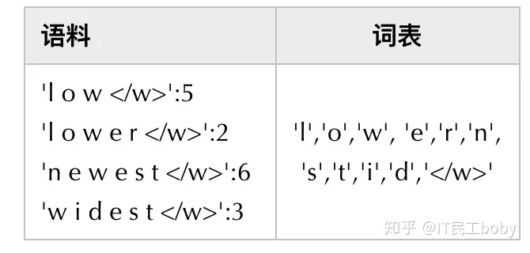
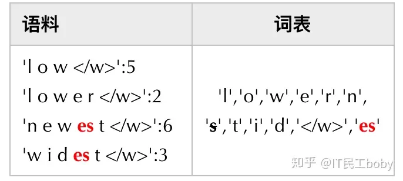

# 引言

**为什么分词？**

句子不能直接处理，句子要离散化处理。

**基于统计的分词**

先对各个句子进行分词，然后再统计并选出频数最高的前N个词组成词表。

缺点：

1、词的数量很多，词表不全，容易出现(Out Of Vocabulary, OOV)，模型无法处理；

2、低频词模型无法得到充分训练。

**字符粒度的分词**

如，英文单词最终是26个英文字母，虽然能够解决OOV问题，但单词被拆分成字符后，一方面丢失了词的语义信息，另一方面，模型输入会变得很长，这使得模型的训练更加复杂难以收敛。

**Subword(子词)分词**

它的划分粒度介于词与字符之间，比如可以将”looking”划分为”look”和”ing”两个子词，而划分出来的"look"，”ing”又能够用来构造其它词。

目前有三种主流的Subword算法，它们分别是：Byte Pair Encoding (BPE), WordPiece和Unigram Language Model。

# BPE

BPE最早是一种数据压缩算法，由Sennrich等人于2015年引入到NLP领域并很快得到推广。该算法简单有效，因而目前它是最流行的方法。

## 词表构建

BPE分词/词表构建步骤：

1. 准备足够大的训练语料，并确定期望的Subword词表大小；
2. 将单词拆分为成最小单元。比如英文中26个字母加上各种符号，这些作为初始词表；
3. 在语料上统计单词内相邻单元对的频数，选取频数最高的单元对合并成新的Subword单元；
4. 重复第3步直到达到第1步设定的Subword词表大小或下一个最高频数为1.

示例：

准备预料，初始词表。注意这里一定加终止符`</w>`，中止符可以区分单词边界。



不断合并高频词，一直重复这个过程，直至达到词表大小。



## 语料编码

BPE分词后，编码步骤：

1. 词表从大到小排序；
2. 遍历排序好的词表，寻找词表中的子词是否是该单词的子字符串。如果正好**「匹配」**，则输出当前子词，并对单词剩下的字符串继续匹配；
3. 如果遍历完词表，单词中仍然有子字符串没有被匹配，那我们将其替换为一个特殊的子词，比如`unk`。

示例：

 假设有词表

```
(“errrr</w>”, 
“tain</w>”, 
“moun”, 
“est</w>”, 
“high”, 
“the</w>”, 
“a</w>”)
```

对于给定的单词`mountain`，其分词结果为：[`moun`, `tain`]

## 语料解码

语料解码就是将所有的输出子词拼在一起，直到碰到结尾为`<\w>`。

假设模型输出为

```
["moun", "tain</w>", "high", "the</w>"]
```

解码的结果

```
["mountain</w>", "highthe</w>"]
```

## 代码实现BPE

```
import re


# 语料库
def get_vocab(in_data_list):
    vocab = {}
    for line in in_data_list:
        words = line.strip().split()
        for word in words:
            vocab[' '.join(list(word)) + ' </w>'] = vocab.get(' '.join(list(word)) + ' </w>', 0) + 1
    return vocab


# 统计当前语料库所有tokens以及其对应的数量
def get_tokens(vocab):
    tokens = {}
    for word, freq in vocab.items():
        cur_chars = word.split()
        for cur_char in cur_chars:
            tokens[cur_char] = tokens.get(cur_char, 0) + freq

    return tokens


# 获取所有可能组成pair的token合体之后的频率
def get_stats(vocab):
    pairs = {}
    for word, freq in vocab.items():
        cur_tokens = word.split()
        for i in range(len(cur_tokens) - 1):
            pairs[(cur_tokens[i], cur_tokens[i + 1])] = pairs.get((cur_tokens[i], cur_tokens[i + 1]), 0) + freq
    return pairs


# 给定特定的pair 比如(e, s) 将vocab中所有(e,s)合并
def merge_vocab(pair, in_vocab):
    out_vocab = {}
    bigram = re.escape(' '.join(pair))
    p = re.compile(r'(?<!\S)' + bigram + r'(?!\S)')
    for word in in_vocab:
        w_out = p.sub(''.join(pair), word)
        out_vocab[w_out] = in_vocab[word]
    return out_vocab


data_list = ['i love dogs', 'i loved you']

cur_vocab = get_vocab(data_list)
print(f'Begining vocab: {cur_vocab}')

cur_tokens = get_tokens(cur_vocab)
print(cur_tokens)
print(f'Begining tokens: {cur_tokens}')
print(f'Begining len tokens: {len(cur_tokens)}')
print('~~~~~~~~~~~~~~~~~~~~~~~~~')


# 合并到词表达到指定大小 size大于等于原vocab的大小
to_merged_vocab_size = 7
epoch = 0
while len(cur_tokens) > to_merged_vocab_size:
    pairs = get_stats(cur_vocab)
    if not pairs:
        break
    max_freq_pair = max(pairs, key=pairs.get)
    cur_vocab = merge_vocab(max_freq_pair, cur_vocab)
    print(f'Iter: {epoch}')
    print(f'max_freq_pair: {max_freq_pair}')
    print(f'cur vocab: {cur_vocab}')
    cur_tokens = get_tokens(cur_vocab)
    print('Tokens: {}'.format(cur_tokens))
    print(f'len tokens:{len(cur_tokens)} ')
    epoch += 1
```

# Byte-level BPE

BPE的算法最开始的基础词表也可能会很大，比如如果将所有的unicode 字符都放入基础词表，一开始的词表大小就有十几万了。一种处理方法是我们**以一个字节为一种“字符”**，基础字符集的大小就锁定在了**2^8=256**。

例如，GPT-2的词汇表大小为50257 = 256 + `<EOS>` + 50000 mergers，`<EOS>`是句子结尾的特殊标记。

# WordPiece

Google的Bert模型在分词的时候使用的是WordPiece算法。

与BPE算法类似，WordPiece算法也是每次从词表中选出两个子词合并成新的子词。与BPE的最大区别在于，如何选择两个子词进行合并：BPE选择**频数**最高的相邻子词合并，而WordPiece选择能够提升语言模型在训练数据上的**似然概率**的最大的相邻子词加入词表。即它每次合并的两个字符串A和B，应该具有最大的$\frac{P(AB)}{P(A)P(B)}$

