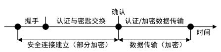

# 综述

>  网络加密流量识别研究进展及发展趋势 陈良臣, 高曙, 刘宝旭, 卢志刚

## 加密协议

加密协议的交互过程主要分为2个阶段：安全连接的建立和加密数据的传输。安全连接的建立包括初始握手、认证和密匙共享,在这个过程中通信双方会交换支持的加密算法、互相进行身份验证并建立密匙。这些密钥用于第二阶段加密数据的传输。

按照加密机制所在网络协议层：

## 加密流量识别对象

包级：单个数据包

流级：

分组级：

主机级：

会话极：

TCP连接：基于观察TCP标志，识别连接的开始和结束。

服务：一个IP端口对产生的所有流量

主机：一个主机对产生的所有流量

## 加密流量识别类型

## 加密流量识别方法

## 评估标准

