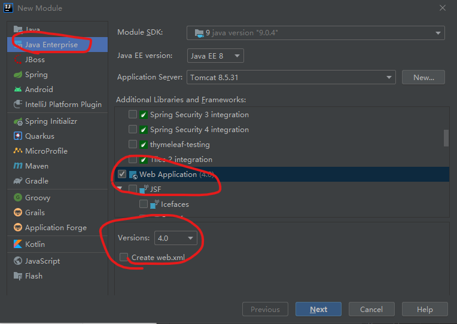
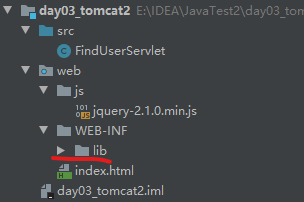

# HTML

因为早期HTML在各个浏览器之间不互相兼容，导致HTML编码规则混乱，违背了HTML发明的初衷，因此需要一个中立的组织来制定和维护统一的国际化Web开发标准，确保多个浏览器都兼容，由此**万维网联盟（World wide Web Consortium）**诞生了。

W3C不是某一个标准，而是一系列标准集合。
一个网页主要分为三部分组成，即结构（Structure）、表现（Presentation）和行为（Behavior）。它们对应三种技术，即HTML、CSS、JavaScript。 

## 基本文档

```
<!DOCTYPE html>  <!--这里其实是HTML5的声明-->
<html>
<head>
	<title></title>
</head>
<body>
</body>
</html>
```

## 文本格式化

1. 注释 `<!--  注释 -->`
2. 换行`<br>`
3. 标题`<h1></h1>` 
4. 段落 `<p></p>` 
5. 分割线`<hr>` ，属性：color width size align 
6. 加粗`<b></b>` 
7. 斜体`<i></i>` 
8. 字体`<font></font>` ，属性：color size face
9. 居中`<center></center>` 

注意，HTML5不建议使用标签属性，建议使用css设置。属性值单双引号都可以。

属性color的表示：

1. 英文：red green blue
2. `rgb(0, 0, 255)`
3. 十六进制`#0000FF` 

## 图片

标签：`` 

属性：

1. align width height 
2. alt="xxx", 提示信息，如图片加载失败

## 列表

标签：

1. 有序`<ol> <li></li> </ol>`
2. 无序`<ul> <li></li> </ul>`

列表属性：

1. 有序type（序号）：1 A a I i
2. 无序type（形状）: disc square circle

## 超链接

```
普通的链接：<a href="http://www.example.com/" target="_blank">链接文本</a>
图像链接： <a href="http://www.example.com/"></a>
邮件链接： <a href="mailto:webmaster@example.com">发送e-mail</a>
书签：<a id="tips">提示部分</a>
	 <a href="#tips">跳到提示部分</a>
```

属性：

1. target打开位置：_self当前标签打开  _blank空白标签打开

## 表格

```
<table border="1" cellspacing="0">
	<caption>信息表</caption>
    <tr>
        <th>ID</th>
        <th>姓名</th>
        <th>年龄</th>
    </tr>
    <tr>
        <td>1</td>
        <td>张三</td>
        <td>28</td>
    </tr>
</table>
```

表格属性：width border cellpadding cellspacing bgcolor align

HTML5新增（没有格式）：

- `<thead>` 表格头
- `<tbody>` 表格体
- `<tfoot>` 表格尾

行属性：bgcolor align

单元格属性：colspan合并列 rowspan合并行

## 表单

method有get和post两种

* get显示密码，参数长度受限，封装在请求行中。
* post不会显示，参数长度不限制，会封装在请求体内。

标签：

- input：通过type属性改变样式（text，password，radio，checkbox，file，date）
- select: 下拉列表
- textarea: 文本域

`<label for="name"></label>`标签中的for属性需要后面的有一个id属性，说明标签对应的选项。

```
<form action="#" method="get">
<label for="username">昵称：</label>
    <input type="text" name="username" placeholder="请输入用户名" id="username">  <br>
<label for="password">密码：</label>
    <input type="password" name="password" id="password">  <br>
性别：<input type="radio" name="gender" value="male" checked> 男
     <input type="radio" name="gender" value="female"> 女 <br>
爱好：<input type="checkbox" name="hobby" value="read"> 读书
     <input type="checkbox" name="hobby" value="java" checked> Java <br>
图片：<input type="file" name="file"> <br>
生日：<input type="date" name="birth"> <br>
<!--下拉列表-->
地区：
<select name="city">
    <option selected> --请选择--</option>
    <option value="1">北京</option>
    <option value="2">南京</option>
</select> <br>
备注：<br>
<textarea cols="20" rows="3"> </textarea> <br>
<!--隐藏域--> <input type="hidden" name="id" value="aaa">

<!--一般提交按钮--> <input type="submit" value="提交"> <br>
<!--图片提交按钮--> <input type="image" src="image/icon_1.jpg"> <br>
</form>
```

## 块

标签：

1. `<dev></dev>`占一行，块级别
2. `<span></span>`  行内标签

## 字符实体

比如大于号，小于号，在HTML中不能用，必须将这些字符转换为字符实体

```
<		&lt;
>		&gt;
&		&amp;
"		&quot;
```

## js脚本

一般方法body最后，先显示界面，最后再加载脚本。

```
<!DOCTYPE html>
<html>
<body>
<script>
document.write("Hello World!")
</script> 
</body>
</html>
```

# XHTML

* XHTML 是以 XML 格式编写的 HTML；
* XHTML 与 HTML 4.01 几乎是相同的；
* XHTML 是更严格更纯净的 HTML 版本；
* XHTML 是2001年1月发布的 W3C 推荐标准。

XHTML与HTML区别：

* 必须声明`<!DOCTYPE...>`
*  必须有标签`<html>、<head>、<title>、<body>`  
* 标签必须闭合`<p>段落</p>`，`分行 <br />`
* 元素必须小写，属性必须引号包围

# HTML5

WHATWG 致力于 web 表单和应用程序，而 W3C 专注于 XHTML 2.0。在 2006 年，双方决定进行合作，来创建一个新版本的 HTML。

HTML5规范于2014年10月29日由万维网联盟正式宣布。

HTML5 中的一些有趣的新特性：

- 用于绘画的 canvas 元素
- 用于媒介回放的 video 和 audio 元素
- 对本地离线存储的更好的支持
- 新的特殊内容元素，比如 article、footer、header、nav、section
- 新的表单控件，比如 calendar、date、time、email、url、search

# CSS

## CSS使用方式

Cascading style sheets层叠样式表

使用方式：

1. 内联样式：定义在标签内`<div style="color:red;"></div>`
2. 内部样式：定义在head内，在`<style> div{...} </style>`定义
3. 外部样式：
    * 外部定义一个`.css`文件，里面是`div{...}`等内容；
    * 页面用`<link rel="stylesheet" href="css/xx.css">`引用

## CSS定义

语法：

1. css定义格式：`选择器{属性名:属性值;...}`
2. 选择器：基本选择器，扩展选择器
3. 属性：有许多，下一章讲

基本选择器：

- 元素选择器：等级最低
- 类选择器`class="xxx"`：等级中间，设置具有同样属性的内容，可以共用。
- id选择器`id="xxx"`：等级最高，设置特定标签的内容，单独使用。

```
<!DOCTYPE html>
<head>
    <title>Test</title>
    <style>
        #div1{color: red;}
        div{color: green;}
        .cls1{color: blue;}
    </style>
</head>
<body>
    <div id="div1">Hello</div>
    <div>Word</div>
    <div class="cls1">haha</div>
</body>
</html>
```

扩展选择器：

1. 选择所有元素：`*{}`；
2. 并集选择器：`选择器1,选择器2{}`；
3. 子选择器：`选择器1 选择器2{}`；
4. 父选择器：`选择器1>选择器2{}` ；
5. 属性选择器：`元素名称[属性名="属性值"]{}`；
6. 伪类选择器：`元素:状态{}`， 比如`a:link{color:red;}`；

## CSS属性

文本

1. `font-size: 20px;`
2. `color: red;`
3. `text-align: left;`
4. `line-height: 15px;`

背景: `background: url("image/logo.jpg") no-repeat center;`

边框:  `border: 1px solid green;`

尺寸:  `width: 200px; height: 100px;`

盒子模型

1. 外边距`margin: 50px 50px;`
2. 内边距`padding: 50px 50px;`默认情况下，内边距会影响盒子大小
3. float：`float:left;`


# 1  JavaScript

JavaScript由于历史的演变，其内容包括：

- ECMAScript：所有客户端语言的标准（比如SQL）
- JavaScript：自己特有的东西，包括：
    - BOM浏览器对象模型，如弹窗、窗口缩放等
    - DOM文档对象模型，控制页面显示的内容

JavaScript是弱类型语言，定义变量不需要指定类型，如`var a = "123";`

## 1.1  ECMAScript

基本语法：基本类型、运算、流程控制语句。（和java很像）

基本对象：除了基本类型，其余都是对象，如：

- 函数对象：`var fun1 = function(){...}`
- 数组对象：`var arr = [1, 2, "hello"];`
- 正则化
- 其他常用：`int a = parseInt(str);`字符串转数字

### 基本语法

1. 与html结合方式

    - 内部结合：任意位置`<script>alert("hello world");</script>` 
    - 外部结合：`<script src="js/a.js"></script>`

2. 注释

    - 单行 //
    - 多行  /* */

3. 数据类型

    - 原始数据类型（基本数据类型）
        - number：数字（整数、小时、NaN）
        - string：字符串，单引号双引号都可以
        - boolean：true和false
        - null：一个对象为空的占位符
        - undefined：如果一个变量未初始化，默认为undefined类型
    - 引用数据类型（对象）

4. 变量

    - js是如类型型语言，定义为：`var a = 12; alert(a);`

5. 运算符

    - 一元运算符：++，--，+(正号，数据类型转换string转int)，-(负号)
    - 算数运算符：+ - * / %
    - 复制运算符：=, +=, -=
    - 比较运算符：>, <, >=, <=, ==（先转化成相同类型）, ===(全等于，先比较类型，再比较值)
    - 逻辑运算符：&&, ||, !
    - 三元运算符：？:

6. 流程控制语句

    ```
    <script>
    var a = 1;
    switch(a){
        case 1: alert("number"); break;
        case "abc": alert("string"); break;
        case undefines: alert("undefined"); break;
    }
    
    var b = 1;
    while(b<=100){b++;}
    document.write(b + "<br>");
    
    for(var i=1; i<=100; i++){b++;}
    document.write(b);
    </script>
    ```

### 基本对象

在js里面方法（函数）也是对象。

Function对象：

```
// 方法1
function add(a, b) {
    return a+b;
}
var a = add(1, 2);
document.write(a);

// 方法2
function addAll(){
    var sum = 0;
    for (var i=0; i< arguments.length; i++){
        sum += arguments[i];
    }
    return sum;
}
document.write(addAll(1, 2, 3, 4));
```

Array：（数组中类型可变，数组长度可变）

```
var arr = [1, 2, 3];
var arr2 = new Array([1, "abc", true]);
var arr3 = new Array(10); // 长度
document.write(arr3.length + "<br>");
document.write(arr3.join() + "<br>"); // 拼接成字符串
```

Date：

```
var date = new Date();
document.write(date.toLocaleString()); // 和当前电脑格式一致
```

RegExp正则表达式:

1. 单个字符
    - `[ab]`	a或者b
    - `[a-zA-Z]`     a-Z其中一个字符
    - `\d`	单个数字
    - `\w`	单个字母
2. 量词
    - `?`     0次或1次
    - `*`    0次或多次
    - `+`    1次或多次
    - `{m,n}`    m,n次
3. 开始结束：`^$`

```
// var reg = new RegExp("^\\w{6,12}$");
var reg = /^\w{6,12}$/;
var username = "zhangsan";
var flag = reg.test(username);
document.write(flag);
```

Global：全局对象，Global封装的方法不需要创建就可以直接调用

```
// encodeURI编码：将字符编码成16进制
var str = "百度知道";
var url = encodeURI(str);
document.write(url + "<br>");
var s = decodeURI(url) + "<br>";
document.write(s);

// encodeURIComponent：可以编码更多的字符，比如（/ ?等）
var str = "百度知道";
var url = encodeURIComponent(str);
document.write(url + "<br>");
var s = decodeURIComponent(url) + "<br>";
document.write(s);

// parseInt(): 字符串转数字
var str = "123sa456";
document.write(parseInt(str) + "<br>");  // 输出123 

// eval(): 将js字符串转成脚本执行
var jscode = "alert(123)";
eval(jscode);
```

其他：Math/Boolean/Number/String等等

## 1.2  BOM

浏览器对象模型，包括：

1. Window窗口对象
2. Location地址栏对象：`window.location`
3. History历史记录对象：`window.history`
4. Navigator浏览器对象（浏览器版本等，不学）
5. Screen显示器屏幕对象（显示器大小型号等，不学）

###  Window

不用创建，省略window，直接使用，如：`window.alert("hello");` 

常用方法有3类：

与弹出框有关的方法：alert()警告 confirm()确认 prompt()输入

```
var flag = confirm("确认删除？");
if (!flag) {
    alert("已删除");
}

var str = prompt("请输入字符串");
alert(str);
```

与打开关闭有关的方法：open() close()

```
var newWin = open("http://www.baidu.com");
newWin.close();
```

与定时器有关的方法：setTimeout() clearTimeout() setInterval() clearInterval

```
function fun1() {
    alert("倒计时结束");
}
// 一次性定时器
var id1 = setTimeout(fun1, 2000);
clearTimeout(id1);
// 循环定时器
setInterval(fun1, 2000);
```

### Location

地址栏对象：

1. 常用方法有：重新加载页面`location.reload();`
2. 常用属性有：网站地址：`location.href("http://www.baidu.com");` 

## 1.3  DOM

文档对象模型：将标记语言各个部分封装成对象，使用这些对象，对文档进行增删改查。

W3C DOM标准被分成三个不同的部分：

1. 核心 DOM：针对标记语言的标准模型
    - Document文档对象
    - Element元素对象
    - Attribute属性对象
    - Text文本对象
    - Comment注释对象
    - Node节点对象（上面几个的父对象）

2. XML DOM：针对XML文档的标准模型

3. HTML DOM：针对HTML文档的标准模型

### 核心DOM

**Document**

* 获取元素：`var btn = document.getElementById("btn");`
* 获取元素的值：`var age = document.getElementById("age").value;`
* 创建元素：`var table = document.createElement("table");`

**Node**：节点对象可以是元素、属性、文本等。

* 常用增删改查方法：(获取父元素，对子元素增删改查)
    * appendChild()
    * removeChild()
    * replaceChild()
* 常用属性：
    * parentNode：获取父节点

### HTML DOM

HTML DOM：针对HTML文档的标准模型，主要有：

- 标签体的设置和获取：`div1.innerHTML("Hello <br>")`
- 使用html元素对象的属性：`img.src="aaa.jpg";`
- 控制样式：
    - `div1.style.border = "1px solid red;"`
    - `div1.className = 'd1';` 赋值一个定义好的CSS样式

### Event 事件

Event属于HTML DOM。

概念：某些组件的执行，触发了某些代码的执行。

简单使用：（赋值一个方法）

```
// 执行代码没有参数
document.getElementById("btn").onclick = function () {
    alert("hello");
}
// 执行代码有事件参数
document.getElementById("name").onkeydown = function (event) {
    alert(event.keyCode);
}
```

常见事件：

1. 点击：
    - onclick
    - ondbclick
2. 焦点：
    - onblur失去焦点：常用于表单校验
    - onfocus获得焦点
3. 加载：onload `window.onload = function(){...}`
4. 鼠标事件
    - onmousedown鼠标按下
    - onmouseup松开
    - onmousemove移动
    - onmouseover覆盖
    - onmouseout移开
5. 键盘事件
    - onkeydown键盘按下
    - onkeyup松开
    - onkeypress按下并松开
6. 选中和改变
    - onchange域的内容发生改变
    - onselect文本被选中
7. 表单事件
    - onsubmit提交表单（可以阻止表单提交）
    - onreset重置

## 1.4  案例

### 轮播

知识点：

- BOM中setInterval()设置倒计时。
- DOM中getElementById()获取元素，并修改属性。

```
var i = 0;
var imgs = ["img/banner_1.jpg", "img/banner_2.jpg"];
function fun1() {
	var cur = document.getElementById("banner");
	if(i==1){ i=0; }else{ i=1; }
	cur.src = imgs[i];
}
setInterval(fun1, 3000);
```

### 跳转到首页

知识点：

- BOM中setInterval()设置倒计时
- BOM中location地址栏
- BOM中getElementById()获取元素，并修改内容。

```
<span id="time" style="color: red;">5</span>秒后，自动跳转...
<script>
    var i = 5;
    function fun1() {
        i -= 1;
        var cur = document.getElementById("time");
        cur.innerText = i;
        if (i==0){
            location.href = "http://www.baidu.com";
        }
    }
    window.setInterval(fun1, 1000);
</script>
```

### 动态表格

- HTML DOM中的事件
- HTML DOM控制样式

```
<div align="center"><table border="1">
    <caption>学生信息</caption>
    <tr>
        <th><input type="checkbox" name="cbox" id="firstCbox"></th>
        <th>ID</th>
        <th>Name</th>
        <th>Age</th>
        <th>Option</th>
    </tr>
    <tr>
        <td><input type="checkbox" name="cbox"></td>
        <td>1</td>
        <td>张三</td>
        <td>18</td>
        <td><a href="javascript:void(0);">删除</a></td>
    </tr>
    <tr>
        <td><input type="checkbox" name="cbox"></td>
        <td>2</td>
        <td>李四</td>
        <td>20</td>
        <td><a href="javascript:void(0);">删除</a></td>
    </tr>
</table></div>
<script>
    document.getElementById("firstCbox").onclick = function () {
        var cboxs = document.getElementsByName("cbox");
        for (var i=0; i<cboxs.length; i++){
            cboxs[i].checked = this.checked;
        }
    }
    var trs = document.getElementsByTagName("tr");
    for (var i=0; i<trs.length; i++){
        trs[i].onmouseover = function () {
            this.style.backgroundColor = "pink";
        }
        trs[i].onmouseout = function () {
            this.style.backgroundColor = "white";
        }
    }
</script>
```

# 2  JQuery

JQuery是JavaScript框架，简化js开发。使用JQuery需要引入JQuery文件:

```
<head>
<script src="jquery-1.10.2.min.js"></script>
</head>
```

也可以使用CDN引用：

> 许多用户在访问其他站点时，已经从百度、又拍云、新浪、谷歌或微软加载过 jQuery。所以结果是，当他们访问您的站点时，会从缓存中加载 jQuery，这样可以减少加载时间。

```
百度：https://apps.bdimg.com/libs/jquery/2.1.4/jquery.min.js
新浪：https://lib.sinaapp.com/js/jquery/2.0.2/jquery-2.0.2.min.js
微软：https://ajax.aspnetcdn.com/ajax/jquery/jquery-1.9.0.min.js
```

## 2.1  JQuery与JS区别

**jquery和js区别与联系**

```
// js获取元素
var divs1 = document.getElementsByTagName("div");
// 修改元素内容
for (var i=0; i<divs.length; i++){
    divs1[i].innerHTML = "xxx";
}

// jquery获取元素
var $divs2 = $("div");
// jquery修改元素内容
$divs2.html("xxx");

// js对象转化为jquery对象
div3 = $(divs1[0])
// jquery对象转化为js对象
$div2[0].innerHTML("xxx");
```

**入口函数**

```
<script>
// jquery入口函数：DOM文档加载完成之后执行该函数
$(function () {

});
// js写法
// window.onload = function(){}
</script>

```

jquery入口函数和js区别：

* jquery可以定义多次，js的window.onload只能写一次；

**事件**

```
<input type="button" value="单击我" id="b1">
<script>
// jquery单击事件
$("#b1").click(function(){
    alert("abc");
});
// js单击事件
document.getElementById("#b1").onclick = function () {
    alert("hello");
}
</script>

```

**样式控制**

```
$("div1").css("backgroundColor", "red");
document.getElementById("div1").style.backgroundColor = "red";

```

## 2.2  JQuery选择器

选择器：筛选具有相似特征的元素（标签）

### 基本选择器

标签选择器：$("html标签")

id选择器：$("#id的值")

类选择器：$(".class的值")

多个选择器：$("选择器1,选择器2,,,")

### 层级选择器

后代选择器：$("标签1 标签2")    标签1的所有后代所有标签2都会被选中

子选择器：$("标签1 > 标签2")    标签1的子元素标签2才会被选中

### 属性选择器

属性名称选择器：$("标签[属性名]")

属性选择器：$("标签[属性名='值']")

多个属性选择器：$("标签[属性名='值'] [属性名='值'] ...")

不等于：$("标签[属性名!='值']")

```
<div id="one" title="test">
  这是一个div，我是内容。
</div>
<script>
	$("div[title='test']").css("backgroundColor", "red");
</script>

```

### 过滤选择器

首元素选择器：$("标签:first") 选择第一个标签

尾元素选择器：$("标签:last") 

非元素选择器：$("标签:not(内容)")  选择指定标签，并且不是指定内容的元素

偶数选择器：$("标签:event")  选择指定，并且索引为偶数的标签

奇数选择器：$("标签:odd")

等于索引选择器：$("标签:eq(index)")

大于索引选择器：$("标签:gt(index)")

小于索引选择器：$("标签:lt(index)")

标题选择器：$(":header")  选择所有标题h1-h6

### 表单过滤选择器

可用元素选择器：$("标签:enabled") 

不可用元素选择器：$("标签:disabled")

选中选择器：$("标签:checked")	获得单选/复选框中选中的元素

选中选择器：$("标签:selected")	获得下拉列表中选中的元素

```
// 可用元素选择器
$("input[type='text']:enabled").val("aaa");
// 选中元素选择器(复选框)
alert($("input[type='checkbox']:checked").length);

```

## 2.3  JQuery的DOM操作

### 内容操作

都是方法，有三个：

1. html()	获取、设置元素内容
2. text()     获取、设置元素的纯文本内容
3. val()      获取、设置元素的value属性值

```
// 获取内容
alert($("#test").html());
// 设置内容
$("#btn1").click(function(){
    $("#test").html("Hello world!");
});

```

### 属性操作

通用属性操作：

* attr()：获取、设置元素的属性
* removeAttr()
* prop()：获取、设置元素的属性
* removeProp()

attr和prop区别：

* 如果操作的元素的固有属性，用prop；自定义的，建议使用attr

```
var name = $("#bj").attr("name");
$("#bj").attr("name", "北京");

```

对class属性操作：

* addClass()：添加class
* removeClass()：删除class
* toggleClass("one")：如果存在class="one"就删除，如果不存在就添加

```
$("#bg").addClass("mycolor");

```

### CRUD操作

（这里的对象就是标签(元素)/内容）

添加

* 对象1.append(对象2)：将对象2添加到对象1末尾；
* 对象1.appendTo(对象2)：将对象1添加到对象2末尾；
* 对象1.prepend(对象2)：将对象2添加到对象1开头；
* 对象1.prependTo对象2)：将对象1添加到对象2开头；
* 对象1.after(对象2)：将对象2添加到对象1后面，是兄弟；
* 对象1.before(对象2)：将对象2添加到对象1前面，是兄弟；
* 对象1.insertAfter(对象2)：将对象2添加到对象1后面，是兄弟；
* 对象1.insertBefore(对象2)：将对象2添加到对象1前面，是兄弟；

删除

* 对象.remove()：将对象删除；
* 对象.empty()：将对象后代清空，但保留当前元素；

```
$("#city1").after("在后面添加文本");
$("#city1").remove();

```

## 2.4  动画

三种方式显示/隐藏/切换元素：（切换：如果实现，则变为隐藏；如果隐藏，则显示）

1. 默认方式
    * show([speed], [easing], [fn])
    * hide([speed], [easing], [fn])
    * toggle([speed], [easing], [fn])
2. 滑动方式
    * slideDown([speed], [easing], [fn])
    * slideUp([speed], [easing], [fn])
    * slideToggle([speed], [easing], [fn])
3. 淡入淡出方式
    * fadeIn([speed], [easing], [fn])
    * fadeOut([speed], [easing], [fn])
    * fadeToggle([speed], [easing], [fn])

参数说明：

* speed: 速度，有三个预定义值（slow, normal, fast）；还可以设置为毫秒值。
* easing: 切换效果，默认swing(先慢中间快最后慢)，可用参数linear(匀速)
* fn: 动画完成后的执行函数

```
function showClick(){
	$("#test").show("slow", "swing", function(){
		alert("显示动画");
	});
}
function hideClick(){
	$("#test").hide("slow", "swing");
}

```

## 2.5  遍历

既可以使用js的方式（类似于Java），也有自己特有的方式：

1. 对象.each(callback)
2. $.each(object, [callback])
3. for..of    （jquery3.0版本才支持）

```
// id=city下面的li列表---------------------------------------
var citys = $("#city li");
// js方式
for (var i=0;i<citys.length; i++){ 
	alter(citys[i].innerHTML); 
}
// 对象.each------------------------------------------------
citys.each(fucntion(){
	alert(this.innerHTML);
});
citys.each(fucntion(index, element){
	alert(index+": "+element.innerHTML);
});
// $.each--------------------------------------------------
$.each(citys, function(){
	alert(this.innerHTML);
});
// for..of-------------------------------------------------
for(city of citys){
	alter(city.innerHTML);
}

```

## 2.6  事件绑定

三种方式：

1. jquery标准的绑定方式：
    * jq对象.事件方法(回调函数)；
2. on绑定方式/off接触绑定
    * jq对象.on("事件名称", 回调函数);
    * jq对象.off("事件名称");
3. 事件切换：toggle  (1.8之后的高版本不能使用，如果要用，需要使用jquery-migrate-1.0.0.js)
    * jq对象.toggle(fn1, fn2);

```
// 第一种-----------------------------------------
$("#btn").click(function () {
    alert("我被点击了...");
});
// 第二种-----------------------------------------
$("#btn").on("click", function () {
    alert("我被点击了...");
});
// 第三种-----------------------------------------
$("#btn").toggle(function () {
    $("#div1").css("backgourdColor", "red");
}, function () {
    $("#div1").css("backgourdColor", "blue");
});

```

## 2.7  插件

插件：增强jquery的功能

实现方式：

1. `$.fn.extend(object)`    增强通过jquery获取的对象的功能，如 `$("#div1")`
2. `$.extend(object)`    增强jquery对象本身的功能，jquery本身就是`$`符号

```
<script>
    // 定义插件
    $.fn.extend({
        // 定义了一个check方法，所有的jq对象都可以调用
        check: function () {
            alert("执行check方法");
        },
        test: function () {
            alert("执行uncheck方法");
        }
    });
    $.extend({
       test2: function () {
           alert("执行test2方法");
       }
    });
    // 使用插件中的方法
    $("#btn1").check();
    $("#btn2").test();
    $.test2();
</script>

```

# 3  AJAX

## 3.1  原理

概念：A Synchronous JavaScript And XML，异步的JavaScirpt和XML

* 同步：客服端发送请求后，必须等待服务器的响应，再做其他事情；

* 异步：客服端发送请求后，不用等待服务器的响应，可以去做别的事情。

AJAX 

* 不是新的编程语言，而是一种使用现有标准的新方法。

* 不用重新加载整个html页面，就可以与服务器交换数据，并更新部分网页的技术。

原理/流程：

* 编写ajax代码（js代码：创建XMLHttpRequest对象；发送XHR；处理接受响应数据；）
* 浏览器发送请求（转给上面的js代码），服务器处理并响应（js接收响应）
* 使用js处理被返回的数据，更新部分网页。

实现方式：

1. 原生js方式（不推荐，需要的时候自己百度吧）
2. jquery方式（推荐，有三种）
    * `$.ajax()`
    * `$.get()`
    * `$.post()`

## 3.2  代码实现ajax

**$.ajax()实现**

html代码

```
<input type="button" id="btn" value="hahasfasdf" onclick="fun();">

<script>
    function fun() {
        // 发送异步请求
        $.ajax({
            url: "ajaxServlet", // 请求路径
            type: "POST", // 请求方式，默认GET
            data: {"username":"jack", "age":23},
            success: function (data) { // 响应成功后的回调函数
                alert(data);
            },
            error: function () {
                alert("出错啦")
            },
            dataType: "text", // 设置响应数据格式，建议用json
        });
    }
</script>

```

ajaxServlet代码

```
String username = req.getParameter("username");
System.out.println(username);
resp.getWriter().write("hello: " + username);

```

## 3.3  代码实现get

`$.get和$.post`参数形式一样

```
$.get("ajaxServlet", {username: "tom"}, function(data){alert(data);}, "text");

```

# 4  JSON

## 4.1  json语法

概念：JavaScript Object Notation，JavaScript对象表示法，是一门语法。

用处：json多用于存储和交换文本信息，比xml更小，更快，更易解析。

语法规则：

* json由键值对构成，键用引号引起来（单双都可以），也可以不用；

* json值的类型：数字，字符串，布尔值，数组，对象（花括号嵌套）

    ```
    <script>
        var person = {"name":"张三","age":18,"gender":true}
        var persons = [{"name":"aaa","age":18}, {"name":"bbb","age":20}]
        var arr = {"arr":[11,22,33,44,55]}
        alert(person.name);
        alert(person["name"]);
        alert(persons[0].name);
        alert(arr.arr[2]);
        // 遍历
        for (var key in person){
            alert(key + ": " + person[key]);
        }
        // js原生形式
        for (var i=0; i<persons.length;  i++){
        	var person = persons[i];
        	alert(person);
        }
    </script>
    
    ```

## 4.2  json解析器

常见的json解析器有：

* jsonlib：官方提供
* Gson：谷歌提供
* fastjson：阿里巴巴提供
* jackson：springMVC框架内置

**java对象转json**

1. 导入jackson的jar包（3个）
2. 创建Jackson核心对象ObjectMapper
3. 调用ObjectMapper的方法进行转换

```
Person person = new Person("张三", 23, "男");
ObjectMapper mapper = new ObjectMapper();
// 第一种方法, 将Json格式保存到流/文件中
mapper.writeValue(new File("f://a.txt"), person);
mapper.writeValue(new Writer("f://a.txt"), person);
mapper.writeValue(new OutputStream("f://a.txt"), person);
// 第二种方法，转化为Json字符串
String json = mapper.writeValueAsString(person);
System.out.println(json);

```

其他：

1. 注解

    * `@JsonIgnore` 排除属性（在java类定义的地方、需要排除属性的上面）

    * `@JsonFormat(pattern="")` 属性格式化，

        例如日期格式`@JsonFormat(pattern="yyyy-MM-dd")`

2. 复杂格式：可以转`List<Object>` ,`Map<String, String>`，代码和上面一样

**json转java对象**

用的比较少，了解即可。代码和上面一样，但是用到的方法是：

* `readValue(json数据, Class)`

# 5 案例：检验用户名是否存在

用户注册案例：当输入用户名后立刻检验用户名是否存在（不和数据库连）

技术：AJAX+Json+Servlet

代码：(Tomcat已集成在IDEA中)

1. 创建JavaEE的Web项目/模块

    

2. 导json的jar包（3个，在web/WEB-INF/lib中，记得右键lib->Add as Libraray）

3. 导入jqery.js

    

4. 编写index.html，里面用ajax技术向servlet异步传json数据

    ```
    <!DOCTYPE html>
    <html lang="en">
    <head>
        <meta charset="UTF-8">
        <title>注册</title>
        <script src="js/jquery-2.1.0.min.js"></script>
        <script>
            // ajax
            $(function () {
                $("#username").blur(function () {
                    var username = $(this).val();
                    $.get("findUserServlet", {username: username}, function (data) {
                        // 期望服务器回应数据格式 {"userExist": true}
                        var span = $("#s_username");
                        if (data.userExist) {
                            span.css("color", "red");
                            span.html("用户名存在");
                        } else {
                            span.css("color", "green");
                            span.html("用户名正确");
                        }
                    }, "json");
                });
            });
        </script>
    </head>
    <body>
    <form>
        注册页面：<br>
        用户名：<input type="text" name="username" id="username"> <span id="s_username"></span><br>
        密码：<input type="password" name="password"><br>
        <input type="submit" name="注册">
    </form>
    </body>
    </html>
    
    ```

5. 写FindUserServlet

    ```
    @WebServlet("/findUserServlet")
    public class FindUserServlet extends HttpServlet {
    
        @Override
        protected void doGet(HttpServletRequest req, HttpServletResponse resp) throws ServletException, IOException {
            this.doPost(req, resp);
        }
    
        @Override
        protected void doPost(HttpServletRequest req, HttpServletResponse resp) throws ServletException, IOException {
            resp.setContentType("text/html;charset=utf-8");
            String username = req.getParameter("username");
            HashMap<String, Object> map = new HashMap<>();
            if ("tom".equals(username)) {
                map.put("userExist", true);
            } else {
                map.put("userExist", false);
            }
            // map转json
            new ObjectMapper().writeValue(resp.getWriter(), map);
        }
    }
    
    ```

6. 启动，在网页中输入tom，将光标移开，就会有效果。

# XML

Extensible Markup Language可扩展标记语言，标签都是自定义的。早在1998年，W3C就发布了XML1.0规范，使用它来简化Internet的文档信息传输。 

properties可以存储配置文件，但是里面内容不能重复；

xml可以存储数据，做配置文件，也可以在网络中传输。

xml和HTML区别：

1. xml标签自定义，且语法严格；
2. xml存储数据 ；html传输数据。

## 语法

1. xml第一行必须定义文档声明
2. xml文档有且仅有一个根标签
3. 属性值必须使用引号，单双都可以
4. 标签必须正确关闭，要么一对`<user></user>`，要么自闭和`<user/>`
5. 区分大小写
6. 标签：自定义，且不能以xml开头。
7. 属性：如果属性为id，那么属性值唯一；尽量避免属性；
8. 文本，两种方式
    - 特殊字符需要转义，如`<`必须用`&lt;`表示；
    - 文本原样展示：`<![CDATA[   数据  ]]>`

```xml
<?xml version="1.0" encoding="UTF-8" ?>
<!DOCTYPE students SYSTEM "student.dtd">
<students>
	<student number="id_01">
		<name>tom</name>
		<age>18</age>
		<sex>male</sex>
	</student>
</students>
```

文档结构：

```
1. 首行必须是文档声明，有三个属性
   version='1.0'：版本号，主流1.0版本，必须写，
   encoding='utf-8'：编码方式，默认ISO-8859-1`
   standalone=yes/no：是否是独立文件，一般不用。
2. 第二行<!DOCTYPE books SYSTEM "book.dtd">声明的是文档定义类型（DTD约束），是可选的。 
3. 可以添加指令，为了结合css（了解即可，一般不用）
   <?xml-stylesheet type='text/css' href='a.css'>
4. xml标签和内容
```

XML是一个技术体系，除了我们经常用到的XML文档本身外，XML还支持：

- DTD和XSD：验证XML结构和数据是否有效；
- Namespace：XML节点和属性的名字空间；
- XSLT：把XML转化为另一种文本；
- XPath：一种XML节点查询语言；
- 等等

##  DTD约束

框架解析xml文件；程序员编写xml文件，但是不能随意编写，否则框架不能解析。

因此，框架提供了xml文档的书写规则，叫xml约束文档。约束规则是人写的，程序员需要读懂xml约束文档，才能编写相应XML文档。

约束文档有两种类型：

1. DTD：一种简单的约束文档
2. Schema：一种复杂的约束文档

DTD约束文档定义的方式：

1. 定义在XML文档内部，将约束规则定义在xml文档中（一般不用，导致xml文档累赘，且不通用）

    ```xml
    <?xml version="1.0" encoding="UTF-8" ?>
    <!DOCTYPE students [
    		<!ELEMENT students (student*) >
    		<!ELEMENT student (name,age,sex)>
    		<!ELEMENT name (#PCDATA)>
    		<!ELEMENT age (#PCDATA)>
    		<!ELEMENT sex (#PCDATA)>
    		<!ATTLIST student number ID #REQUIRED>
    		]>
    <students>
    	<student number="s001">
    		<name>tom</name>
    		<age>18</age>
    		<sex>male</sex>
    	</student>
    </students>
    ```

2. 外部重新建立一个dtd文件，将约束规则定义在外部dtd文件中（如下面`student.dtd`）

    ```xml-dtd
    <!ELEMENT students (student*) >
    <!ELEMENT student (name,age,sex)>
    <!ELEMENT name (#PCDATA)>
    <!ELEMENT age (#PCDATA)>
    <!ELEMENT sex (#PCDATA)>
    <!ATTLIST student number ID #REQUIRED>
    ```

外部定义的DTD文件，如何在XML文档中使用呢？需要在xml文档中声明（一般是第二行）：

* 如果是本地dtd文档，xml中声明：`<!DOCTYPE 根标签名 SYSTEM "xxx.dtd文件位置">`
* 如果是网络dtd文档，xml中声明：`<!DOCTYPE 根标签名 PUBLIC "dtd文件名" "dtd文件URL">`

## Schema约束

Schema约束（`xxx.xsd`）：

1. 约束可以自定义
2. 约束引入内容较多，复制即可。

如`student.xsd`（能看懂就行）

```xml
<?xml version="1.0"?>
<xsd:schema xmlns="http://www.itcast.cn/xml"
        xmlns:xsd="http://www.w3.org/2001/XMLSchema"
        targetNamespace="http://www.itcast.cn/xml" elementFormDefault="qualified">
    <xsd:element name="students" type="studentsType"/>
    <xsd:complexType name="studentsType">
        <xsd:sequence>
            <xsd:element name="student" type="studentType" minOccurs="0" maxOccurs="unbounded"/>
        </xsd:sequence>
    </xsd:complexType>
    <xsd:complexType name="studentType">
        <xsd:sequence>
            <xsd:element name="name" type="xsd:string"/>
            <xsd:element name="age" type="ageType" />
            <xsd:element name="sex" type="sexType" />
        </xsd:sequence>
        <xsd:attribute name="number" type="numberType" use="required"/>
    </xsd:complexType>
    <xsd:simpleType name="sexType">
        <xsd:restriction base="xsd:string">
            <xsd:enumeration value="male"/>
            <xsd:enumeration value="female"/>
        </xsd:restriction>
    </xsd:simpleType>
    <xsd:simpleType name="ageType">
        <xsd:restriction base="xsd:integer">
            <xsd:minInclusive value="0"/>
            <xsd:maxInclusive value="256"/>
        </xsd:restriction>
    </xsd:simpleType>
    <xsd:simpleType name="numberType">
        <xsd:restriction base="xsd:string">
            <xsd:pattern value="heima_\d{4}"/>
        </xsd:restriction>
    </xsd:simpleType>
</xsd:schema> 

```

相应的`student.xml`如下：

```xml
<?xml version="1.0" encoding="UTF-8" ?>
<!--
在XML中引入Schema约束如下：
	1.填写xml文档的根元素
	2.引入xsi前缀.  xmlns:xsi="http://www.w3.org/2001/XMLSchema-instance"
	3.引入xsd文件命名空间.  xsi:schemaLocation="http://www.itcast.cn/xml  student.xsd"
	4.为每一个xsd约束声明一个前缀,作为标识  xmlns="http://www.itcast.cn/xml"
 -->
 <students	xmlns:xsi="http://www.w3.org/2001/XMLSchema-instance"
			xsi:schemaLocation="http://www.itcast.cn/xml  student.xsd"
            xmlns="http://www.itcast.cn/xml">
 	<student number="heima_0001">
 		<name>tom</name>
 		<age>18</age>
 		<sex>male</sex>
 	</student>
 </students>
```

文档中的约束，如：`xmlns:aaa="xxxxxxx"`，

* `xmlns`表示**定义前缀**
* `xsi`是前缀，它可以引入命名空间`schemaLocation`，用来添加外部`Schema`约束文档
* `aaa`表示是前缀，用来代替`xxxxxx`。

如下面`application_mvc.xml`文档：

* 命名空间`schemaLocation`引入三个约束文档
* `xmlns`又定义了四个前缀
    * `xmlns:xsixsi`是为了引入命名空间`schemaLocation`
    * `xmlns`是空前缀，如标签`bean`
    * `xmlns:context`前缀，其定义标签如`context:annotation-config`
    * `xmlns:mvc`前缀，其定义标签如`mvc:annotation-driven`

```xml
<?xml version="1.0" encoding="UTF-8"?>
<beans
    xmlns:xsi="http://www.w3.org/2001/XMLSchema-instance"
    xsi:schemaLocation="
        http://www.springframework.org/schema/beans
        http://www.springframework.org/schema/beans/spring-beans.xsd
        http://www.springframework.org/schema/context 
        http://www.springframework.org/schema/context/spring-context.xsd
        http://www.springframework.org/schema/mvc
        http://www.springframework.org/schema/mvc/spring-mvc.xsd"
    xmlns="http://www.springframework.org/schema/beans"
    xmlns:context="http://www.springframework.org/schema/context"
    xmlns:mvc="http://www.springframework.org/schema/mvc">

    <context:annotation-config />
    <mvc:annotation-driven />
    <bean id="multipartResolver"
        class="org.springframework.web.multipart.commons.CommonsMultipartResolver">
        <property name="maxUploadSize" value="209715200" />
        <property name="defaultEncoding" value="UTF-8" />
    </bean>
</beans>
```

# XML解析

操作xml文档：

1. 解析（读取）
2. 写入：将内存中的数据保存到xml文档中。（持久化存储，用的不多，略）

解析xml的两种方式：

1. DOM：将xml一次性加载到内存，形成DOM树（多应用于服务器端）
    - 优点：操作方便、可以增删改查
    - 缺点：占内存
2. SAX：逐行读取，基于事件驱动。（多应用于移动端）
    - 优点：不占内存
    - 缺点：只能读取，不能增删改

xml常见的解析器：

1. JAXP: sun公司提供的解析器，支持DOM和SAX两种思想。（不好用）
2. DOM4J: 一款优秀的解析器。
3. Jsoup: 基于Java的HTML解析器，DOM方式。
4. PULL: 安卓内置解析器，SAX方式

## Jsoup解析器

Jsoup使用：

1. 导入jar包`jsoup-1.11.2.jar`，并且有一个`student.xml`文档
2. 获取 Document对象（表示整个文档）
3. 获取对应的标签
4. 获取数据

```java
public class JsoupDemo {
    public static void main(String[] args) throws IOException {
        String path = JsoupDemo.class.getClassLoader().getResource("student.xml").getPath();
        // 获取DOM树
        Document doc1 = Jsoup.parse(new File(path), "utf-8");
        // 获取元素
        Elements elements = doc1.getElementsByTag("name");
        Element element = elements.get(0);
        // 获取数据
        String name = element.text();
        System.out.println(name);
    }
}
```

Jsoup工具类，返回Document对象

- `Jsoup.parse(new File(path), "utf-8")` 解析xml或html
- `Jsoup.parse(String html);` 解析字符串，字符串html内容
- `Jsoup.parse(new URL(".."), 10000);` 在时间内解析网络中的html的内容。

Document文档对象

- `getElemeentsByTag(TagName);` 根据标签名获取元素集合
- `getElementsByAttribute(key);`根据属性名获取元素集合
- `getElementByAttributeValue(key, value);`根据属性名和值获取元素

Elements继承于ArrayList，里面存储的都是Element。

Element对象

1. 获取子元素对象，和上面Document中的方法一样
2. 获取属性值：`String attr(key);` 根据属性名称获取属性值
3. 获取文本内容：`String text();` 获取文本内容
4. 获取文本内容：`String html();` 获取标签体所有内容

Node对象，是Document和Element的父类

## XPath解析器

上面Jsoup查询较慢，还有快速查询方式：

1. selector: 选择器，参数有多种形式：
    - `Elements e1 = select("name");`
    - `Elements e2 = select("student[number=\'2020_01\']");` 
    - `Elements e3 = select("student[number=\'2020_01\'] > name"); `
2. XPath：专门用来查xml中的位置的语言
    - 先导入jar包`JsoupXpath-0.3.2.jar`
    - 从Jsoup.parse(path)获取Document对象
    - 将Document转为xpath的xDocument对象`new JXDocument(doc1);`
    - 结合xpath语法查询
        - `jxDoc.selN("//student");` 查询所有student标签
        - `jxDoc.selN("//student/name");` 查询所有student标签下name标签
        - `jxDoc.selN("//student/name[@id]");` 查询所有student标签下带有id属性的name标签
        - `jxDoc.selN("//student/name[@id='qq']");` 查询所有student标签下带有id属性的name标签，并且id属性值为qq