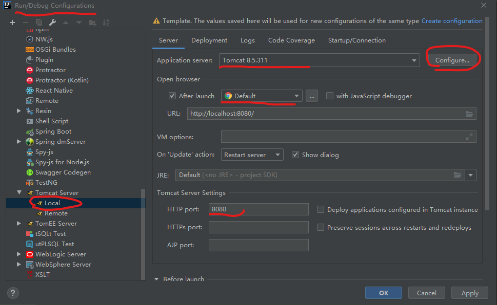
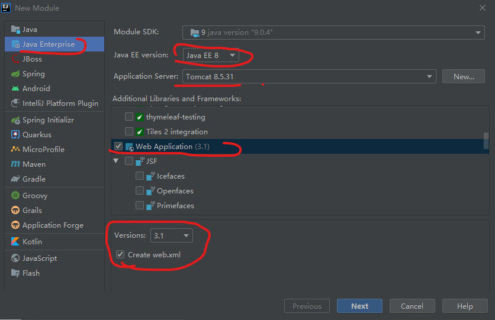
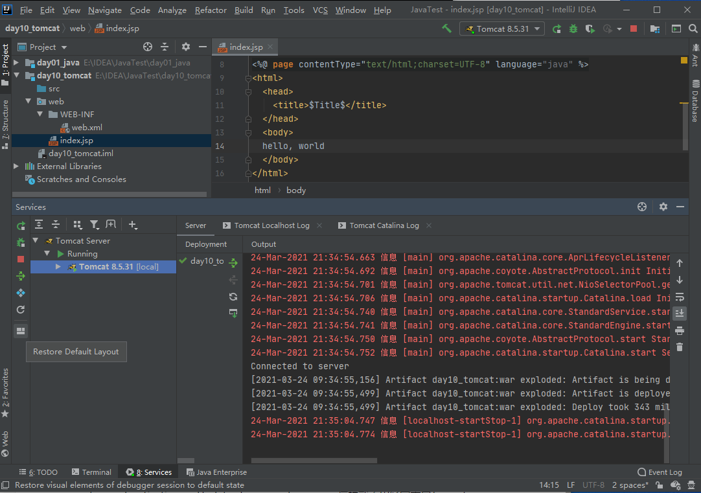
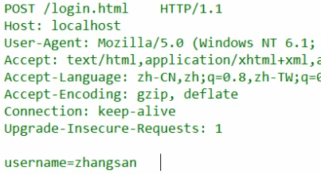
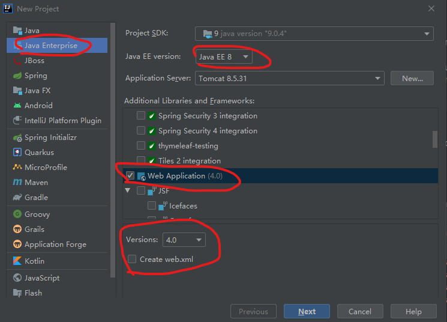
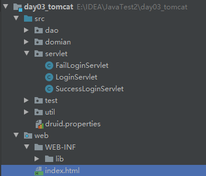
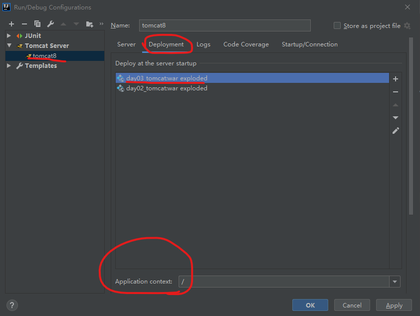
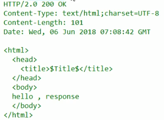

# 1  Tomcat

## 1.1  安装和启动

常见的Java相关的web服务器：

- webLogic：oracle公司，大型JavaEE服务器，收费，性能好。
- webSphere：IBM公司，大型JavaEE服务器，收费，性能好。
- JBOSS：JBOSS公司，大型JavaEE服务器，收费。
- Tomcat：Apache基金组织的，中小型的JavaEE服务器，仅仅支持少量的Java规范，开源免费。

Tomcat：

1. 下载：进入官网，选择版本，从Core中选择`64-bit-windows.zip`
2. 安装：解压即可。
3. 卸载：删除目录即可。

Tomcat目录结构：

1. bin：可执行文件
2. conf：配置文件
3. lib：依赖的jar包（不管）
4. temp：临时文件
5. webapps：存放web项目（html静态动态资源）
6. work：存放运行时的数据

Tomcat启动、关闭：

- 启动：双击`bin/startup.bat`；浏览器访问`127.0.0.1:8080`
- 关闭：双击`bin/shutdown.bat` ；（直接关闭窗口表示强制关闭）

Tomcat启动可能遇到的问题：

1. 启动时DOS窗口一闪而过：Java环境变量配置问题。

2. 启动报错：端口号占用、已经启动

3. 修改端口号：从文间`conf/server.xml`中修改端口号`<Connector port="80"`

    一般修改为80，80是http默认端口，因此在访问时 不用写端口号。

## 1.2  Tomcat部署项目

一共三种，推荐第三种：

1. 直接将项目放在webapps目录下；浏览器访问`localhost:8080/test/index.html`

    - 简化部署：项目打包成war包，复制war包到webapps目录即可。

2. 项目不放webapps下，需要配置`conf/server.xml`文件，里面添加一段内容：

    ```
    // 文件最后面，<Host></Host>之间
    // docBase项目目录
    // path浏览器访问的虚拟目录
    <!--项目部署-->
    <Context docBase="F:\test" path="/test" />
    ```

3. 在目录`conf/Catalina/localhost`目录下面创建文件`bbb.xml`（名字随意）；

    文件中编辑内容：`<Context docBase="F:\test" />` ；

    浏览器访问地址为：`localhost:8080/bbb/index.html` 

## 1.3  IDEA集成Tomcat

**将Tomcat集成到IDEA中，方便启动**

1. 打开`Run->Edit Configures->Templates->Tomcat Server->Local`面板
2. Server选项卡下面的Configures配置 安装目录，确定即可。



## 1.4  IDEA创建web项目

创建web项目或者模块：

- 在项目中创建一个module
  
    - Java Enterprise
    - Java EE version=Java  EE 7  （JavaEE8也行）
    - addition libraries：选择Web Application
    - versions==3.1 （选择Create web.xml，学会servlet就可以不选)
    
    
    
- 在web文件夹下面的index.jsp文件内写`Hello world`

- 启动，自动打开浏览器显示。

**修改tomcat配置**

- 打开run->edit conf->tomcat server->Server面板
    - on Update action == Update classes and resources
    - on frame deactivation == Update classes and resource 这样就不用经常重启Tomcat
- ->Deployment面板，可以配置虚拟目录
    - Application context == "/虚拟目录"

**java动态项目的目录结构**

```
--项目名称(根目录)
	--WEB-INF目录(有WEB-INF目录，才是动态Web项目)
		--web.xml：web项目的核心配置文件
		--classes目录：放置字节码文件的目录
		--lib目录：放置依赖的jar包
```

# 2  Servlet

Servlet Filter Listener是JavaWeb的三大组件。

服务器中的动态资源就是Java类，这个Java类并不普通，它依赖服务器，由服务器执行该类，并且遵循一定规则（接口），该规则/接口就是Servlet。

Servlet接口定义了Java类被浏览器/Tomcat识别的规则。

## 2.1  Servlet原理

概念：是一个Java类，没有主方法，运行在服务器端的小程序，由Tomcat执行。

本质：是一个接口，定义了Java类被服务器识别的规则。我们需要自定义类，实现Servlet接口，重写方法。

快速实现一个Servlet类：

1. 创建JavaEE模块（见1.4）；

2. 定义一个类`xx.xx.ServletDemo.java`，实现Servlet接口，重写方法（5个方法）

3. 在`service()`方法中输入`System.out.println("hello world");` 

4. 配置Servlet，在WEB-INF中的web.xml文件中

    注意，放在`<web-app>`标签内

    ```
    <!--配置servlet-->
    <!--给servlet起一个名-->
    <servlet>
        <servlet-name>demo1</servlet-name>
        <servlet-class>xx.xx.ServletDemo</servlet-class>
    </servlet>
    <!--servlet的映射路径-->
    <servlet-mapping>
        <servlet-name>demo1</servlet-name>
        <url-pattern>/demo1</url-pattern>
    </servlet-mapping>
    ```
    
5. 运行，浏览器访问`localhost:8080/demo1`（也有可能是`localhost:8080/xxx项目名/demo1`）

Tomcat执行原理（Tomcat要访问Servlet的实现类，用到反射机制）：

1. 服务器收到客户端的请求，解析URL，获取访问Servlet的资源路径；
2. 查找web.xml文件，找到对应的全类名；
3. 将全类名对应的字节码文件加载进内存，并创建其对象；
4. 调用其中的方法。

## 2.2  Servlet中的方法

查看API，发现servlet有五个抽象方法：

1. `void init()` 初始化方法，服务器开启时执行，加载资源
2. `void destroy()` 销毁方法，服务器正常关闭时执行，释放资源
3. `void service()` 提供服务方法，每次都执行
4. `ServletConfig getServletConfig()` 获取ServletConfig对象
5. `String getServletInfo()` 获取Servlet信息，如版本、作者等，一般不用。

Servlet生命周期

1. 被创建：执行init方法，只执行一次
2. 被销毁：执行destroy方法，只执行一次
3. 提供服务：执行service方法，执行多次

**init()方法**：默认情况下，第一次被访问时，Servlet被创建，执行init方法；也可以配置Servlet创建时刻。

1. 定义init执行时刻/Servlet被创建时刻：（在web.xml的`<servlet>`标签中配置）

    - 启动服务器时创建：

        `<load-on-startup>0或正数<load-on-startup>`

    - 第一次访问时创建（默认）：

        `<load-on-startup>负数<load-on-startup>`

2. 多个用户访问Servlet时，可能存在线程安全问题：

    - 解决方法：尽量不要定义成员变量，可以定义局部变量。

## 2.3  Servlet3.0

好处：

1. 支持注解配置，可以不用web.xml

步骤：

1. 创建JavaEE项目/模块（见1.4节），选择Servlet的版本在3.0以上，不用选web.xml文件。

2. 定义一个类，实现servlet接口，重写方法

3. 在类上使用`@WebServlet("/demo")`注解，其中/demo表示资源路径名

    ```
    @WebServlet("/demo")
    public class ServletDemo implements Servlet {
    	...
    }
    ```

访问Servlet路径：

1. 一个servlet可以定义多个访问路径：`@WebServlet({"/demo1", "/demo2"})`；
2. 两层路径：`@WebServlet("/demo/xxx")`；
3. 通配符：`@WebServlet("/demo/*")` 其中星号表示所有字符串都可以；
4. 还可以这样写：`@WebServlet("*.do")` 这里不要写`/`； 

## 2.4  IDEA与Tomcat的相关配置

IDEA会为每一个web项目单独建立一份配置文件：
- 运行项目，控制台有一行输出是：`Using CATALINA_BASE: "C:\Users\..."`，这里就是配置文件路径

- 这个配置文件类似于Tomcat第三种部署项目的方式（见1.2节）：

    - `config->Catalina->localhost->xxx.xml`文件里面定义了项目实际地址，文件内容：

        ```
        <?xml version="1.0"?>
        <Context docBase="E:\IDEA\JavaTest\out\artifacts\day10_tomcat2_war_exploded" path="/day10_tomcat2_war_exploded"/>
        ```

    - `config->server.xml`里面可以配置端口等；

## 2.5  Servlet体系结构

servlet接口的实现类：

1. GenericServlet：只需要重写service方法，其他方法已经默认空实现。
2. HttpServlet：对http协议的封装，简化操作：（推荐使用）
    - 定义类继承HttpServlet
    - 重写doGet/doPost方法

原因：

servlet中的service方法是为了处理http请求，第一步就要判断http请求是那种协议：

get/post等一共7中，get/post最常用，所以我们要在HttpServlet继承类中重写常用的doGet/doPost方法。

# 3  Http

HTTP超文本传输协议：定义客户端和服务器之间传输数据的格式

特点：

- 基于TCP/IP的高级协议
- 默认端口号：80
- 基于请求/响应模型：一次请求对应一次响应 (request/response)
- 无状态的：每次请求之间相互独立

历史版本：

- 1.0：每次请求响应都会建立新的连接（一个网页需要多个请求，如传文本、传图片等）
- 1.1：复用连接

传输过程：

1. tomcat根据请求url中的资源路径，根据配置文件找到Servlet实现类，并创建对象；
2. tomcat创建request和response对象，requeset对象中封装http的请求消息；
3. tomcat调用service方法；
4. 程序员在service中，根据请求消息，设置相应数据；
5. tomcat将response返给浏览器。

## 3.1  Request



如上图，请求消息数据格式为以下四部分：

1. 请求行 `请求方式 请求url 请求协议/版本`  

2. 请求头 `请求头名称：请求头值` （多个请求头）

    - User-Agent：浏览器版本等信息，解决兼容等问题
    - Referer：请求来自哪个网站
3. 请求空行：就是一个空行 
4. 请求体：
* GET没有请求体，Get请求参数在url后面，且长度有限制；
    * POST有请求体，请求的url长度不限，相对安全；

**request接口/类：**

* ServletRequest		接口

* HttpServletrequest		接口，继承上面的接口
* org.apache.catalina.connector.RequestFacade	类，由Tomcat实现，继承上面接口
* 所以，Tomcat自己可以实现request类，然后传给Java程序，让程序员处理。

## 3.1  Request对象的方法

**重要、常用、必须记住的方法已经加粗显示**

1. 获取请求行数据（如请求地址是`http://localhost/day04/demo?name=tom&age=2`）
    * 获取请求方式：`String getMethod()` 得到`GET`
    * **获取程序虚拟目录：**`String getContextPath()` 得到`/day04`
    * 获取Servlet路径：`String getServletPath()`  得到`/demo`
    * 获取get方式请求参数：`String getQueryString()` 得到`name=Tom&age=2`
    * **获取统一资源定位符URI：**`String getRequestURI()`  如`/day04/demo` 得到`/day04/demo`
    * 获取统一资源标识符URL：`StringBuffer getRequestURL()` 得到 `http://localhost/day04/demo` 
    * 获取协议和版本：`String getProtocol()` 得到`HTTP/1.1` 
    * 获取客户机IP地址：`String getRemoteAddr()` 
2. 获取请求头数据 
    * **根据请求头名称获得值：**`String getHeader(String name)`  
    * 获取所有请求头名称：`Enumeration<String> getHeaderNames()` 
3. 获取请求体数据 （POST请求方式）
    * 字符流 `BufferedReader getReader()`  字节流`ServletInputstream getInputStream()`

**其他方法：（都很重要）**

> GET方式在Tomcat8中中文乱码已经解决；
>
> POST方式会遇到中文乱码，需要先设置`req.setCharacterEncoding("utf-8")`

* **获取请求参数的通用方法** （GET和POST都可以，所以代码可以重用`this.doPost(req, resp)`）

    * `String getParameter(String name)` 更根据参数名称获取参数值
    * `String[] getParameterValues(String name)` 更根据参数名称获取参数值数组（复选框中的值）
    * `Enumeration<String> getParameterNames()` 获取所有请求的参数名称，可以遍历
    * `Map<String String[]> getParameterNames()` 获取所有请求的参数map集合
* **请求转发：**服务器内部的资源跳转方式（如Demo1转到Demo2）

    * `req.getRequestDispatcher("/demo2").forward(req, resp);`
    * 特点：浏览器地址栏不会变化,相当于只请求一次；只能转发到当前服务器内部资源。
* **共享数据：** （主要用于请求转发中，第一个Servlet给第二个Servlet传数据）

    * 域对象：一个有作用范围的对象，可以在范围内共享数据

    * request域：代表一次请求的范围，一般用于**请求转发**的多个资源中共享数据
        1. `setAttribute(String name, Object obj)` 存储数据
        2. `Object getAttrbute(String name)` 通过键获取值
        3. `removeAttribute(String name)` 通过键移除键值对

        ```
        例如：两个servlet,分别是/demo1 和 /demo2
        step1 在/demo1中        req.setAttribute("msg", "hello");
        step2 在/demo1中请求转发	req.getRequestDispatcher("/demo2").forward(req, resp);
        step3 在/demo2中接收	 String s = req.getAttribute("msg");
        ```
* 获取ServletContext

    * `ServletContext req.getServletContext()`  后面再讲

## 3.1  Request案例：用户登录

用户登录案例需求：

1. 编写login.html登录页面
2. 使用Druid数据库连接池技术，操作mysql数据库中user表
3. 使用JdbcTemplate技术封装JDBC
4. 登录成功跳转到SuccessServlet；登录失败跳转到FailServlet

实现代码：

1. 创建JavaEE项目/模块

    

2. 导入Jar包，以及`druid.properties`

    * `druid.properties`放在src目录下面；
    * 在web目录中创建WEB-INF目录，再创建lib目录，放入msql驱动；druid连接池；jdbc Tempalte；
    * 右键lib目录`Add as Library`

    

3. 创建数据库db1中的user表

    ```
    CREATE DATABASE IF NOT EXISTS db1;
    USE db1;
    DROP TABLE IF EXISTS USER;
    CREATE TABLE USER
    (
       id INT PRIMARY KEY AUTO_INCREMENT,
       username VARCHAR(20) UNIQUE NOT NULL,
       password  VARCHAR(20) NOT NULL
    );
    INSERT INTO USER VALUES
    (NULL, 'tom', 'tom'),
    (NULL, 'jack', 'jack');
    ```

4. 创建JDBCUtils工具类（获取连接池，获取链接对象）

    ```
    public class JDBCUtils {
        private static DataSource ds;
    
        static {
            Properties pro = new Properties();
            try {
                pro.load(JDBCUtils.class.getClassLoader().getResourceAsStream("druid.properties"));
                ds = DruidDataSourceFactory.createDataSource(pro);
            } catch (IOException e) {
                e.printStackTrace();
            } catch (Exception e) {
                e.printStackTrace();
            }
        }
    
        public static DataSource getDataSource() {
            return ds;
        }
    
        public static Connection getConnection() throws SQLException {
            return ds.getConnection();
        }
    }
    ```

5. 在domain包中创建User类

6. 在dao包中创建UserDao类，实现login方法（使用JDBCTemplate执行sql查询）

    ```
    public class UserDao {
        private JdbcTemplate template = new JdbcTemplate(JDBCUtils.getDataSource());
    
        public User login(User loginUser) {
            try {
                String sql = "select * from user where username = ? and password = ?";
                User user = template.queryForObject(sql,
                        new BeanPropertyRowMapper<User>(User.class),
                        loginUser.getUsername(), loginUser.getPassword());
                return user;
            } catch (DataAccessException e) {
                e.printStackTrace();
                return null;
            }
        }
    }
    ```

7. 创建`LoginServlet`类：
    ```
    @WebServlet("/loginServlet")
    public class LoginServlet extends HttpServlet {
        @Override
        protected void doGet(HttpServletRequest req, HttpServletResponse resp) throws ServletException, IOException {
            this.doPost(req, resp);
        }
    
        @Override
        protected void doPost(HttpServletRequest req, HttpServletResponse resp) throws ServletException, IOException {
            req.setCharacterEncoding("utf-8");
            String username = req.getParameter("username");
            String password = req.getParameter("password");
            User loginUser = new User();
            loginUser.setUsername(username);
            loginUser.setPassword(password);
            UserDao dao = new UserDao();
            User user = dao.login(loginUser);
            if (user == null) {
                // 登录失败
                req.getRequestDispatcher("/failLoginServlet").forward(req, resp);
            } else {
                req.setAttribute("user", user);
                req.getRequestDispatcher("/successLoginServlet").forward(req, resp);
            }
        }
    }
    ```

8. 创建`SuccessLoginServlet`类

    ```
    User user = (User) req.getAttribute("user");
    if (user != null) {
    	resp.setContentType("text/html;charset=utf-8");
    	resp.getWriter().write("登录成功");
    }
    ```

9. 创建`FailLoginServlet`类

    ```
    resp.setContentType("text/html;charset=utf-8");
    resp.getWriter().write("登录失败!");
    ```

10. 创建index.html

    ```
    <form action="/loginServlet" method="post">
        用户名：<input type="text" name="username"><br>
        密码：<input type="password" name="password"><br>
        <input type="submit" value="登录">
    ```

11. 运行tomcat前，查看`Edit Configurations` （这里IDEA会自动识别，一般不用改，如果报错，请查看）

     

12. 如果出现错误`Artifact xxx:war exploded: Error during artifact deployment. `

     * jar包位置，或者add as libraray；
     * servlet编写错误；servlet注解`@WebServlet("/xxx")` ；或者自己百度去吧。

     

BeanUtils工具类：简化 请求参数 的封装

1. 导入jar包`commons-beanutils-1.8.0.jar`
2. User类必须符合JavaBean标准（私有成员变量，空参构造，Getter Setter）

BeanUtils代码：(LoginServlet中)

```
// 设置请求数据编码
req.setCharacterEncoding("UTF-8");
// 获取提交数据
Map<String, String[]> map = req.getParameterMap();
// 创建对象
User loginUser = new User();
// 封装对象
BeanUtils.populate(loginUser, map);  // try-catch捕获
// 登录判断
UserDao dao = new UserDao();
User user = dao.login(loginUser);
if (user == null) {
	req.getRequestDispatcher("/failLoginServlet").forward(req, resp);
} else {
	req.setAttribute("user", user);
    req.getRequestDispatcher("/successLoginServlet").forward(req, resp);
}
```

## 3.2  Response



响应消息格式：

1. 响应行：`协议/版本 响应状态码 状态码描述` （`HTTP/1.1 200 OK`）
    *  响应状态码：都是3位数，分为5类
        * 1xx	服务器收到消息，但没有接收完成，告诉浏览器；
        * 2xx    成功200
        * 3xx    重定向 （302重定向  304不用再传，访问缓存吧）
        * 4xx    客户端错误 （404请求路径错误  405请求方法没有对应的doXx方法）
        * 5xx    服务器错误 （500服务内部出现异常）
2. 响应头 `头名称：值`
    * Content-type：响应数据格式(html)，以及编码格式
    * Content-disposition：以什么格式打开响应数据
        * in-line，默认值，在当前页面打开；
        * attachment，以附件的形式打开；
3. 响应空行：空行
4. 响应体：HTML代码/图片的编码

## 3.2  Response对象的方法

**常用方法**

1. 设置响应行：`resp.setStatus(int sc)`
2. 设置响应头：`setHeader(String name, String value)`
3. 设置响应体：字符输出流`getWriter()`、字节输出流`getOutputStream()`

**其他方法**

1. 重定向：`resp.sendRedirect("/day04/ServletDemo2")`

    * 重定向特点：地址栏发生变化，属于两次请求，可以访问其他站点资源，不能共享数据
    * 转发特点：地址栏不变，是一次请求，只能访问当前站点资源，能共享数据

    ```
    String contextPath = req.getContextPath();	// 虚拟目录
    req.getRequestDispatcher("/demo2").forward(req, resp); // 方法可能自己找到的虚拟目录
    resp.sendRedirect(contextPath + "/demo2");   // 这样需要自己加虚拟目录
    ```

2. 告诉浏览器编码方式两种方式，一般用第二种

    * `resp.setHeader("content-type", "text/html;charset=utf-8");`
    * `resp.setContentType("text/html;charset=utf-8");` 

3. 字符流

    ```
    resp.setContentType("text/html;charset=utf-8");
    PrintWriter pw = resp.getWriter();
    pw.write("你好 hello");
    ```

4. 字节流（注意，文本一般用字符流，图片才是字节流，这里只是示例用法）

    ```
    resp.setContentType("text/html;charset=utf-8");
    ServletOutputStream os = resp.getOutputStream();
    os.write("你好".getBytes("utf-8"));
    ```

## 3.3  ServletContext

概念：代表整个web应用，可以和程序的服务器交互

获取ServletContext对象：

1. `ServletContext servletContext = req.getServletContext();`
2. `ServletContext servletContext = this.getServletContext();` （建议使用）

功能：

1. 获取MIME类型

    * MIME类型：互联网通信定义的一种文件数据类型
    * MIME格式：`大类型/小类型`， 如 `text/html`

    * ```
        ServletContext servletContext = req.getServletContext();
        String filename = "a.jpg";
        System.out.println(servletContext.getMimeType(filename)); // 输出image/jpeg
        ```

2. 域对象：共享数据：所有用户，所有数据

    * `servletContext.setAttribute(String, Object);` （可以在另一个servlet中获取）
    * `servletContext.getAttribute(String);` 
    * `servletContext.removeAttribute(String)`

3. 获取文件真实的路径 （注意和request区分）

    * 真实路径是指：tomcat配置文件中指向程序真实存放的地址
    * a.txt在src目录下；b.txt在web目录下；c.txt在web/WEB-INF目录下；
    
    ```
    ServletContext c = this.getServletContext();
    String path = c.getRealPath("/b.txt");  
    // E:\IDEA\JavaTest2\out\artifacts\day03_tomcat2_war_exploded\b.txt
    String path2 = c.getRealPath("/web/c.txt");
    // E:\IDEA\JavaTest2\out\artifacts\day03_tomcat2_war_exploded\WEB-INF\c.txt
    String path2 = c.getContextPath("/WEB-INF/classes/a.class");
    // 和上面一样
    ```

## 3.3  ServletContext案例：文件下载

现在浏览器比较高级，一些文件可以自动转到下载功能。

对于任何格式文件，如何实现下载功能（让浏览器下载）：

* 使用响应头设置资源的打开方式：`content-disposition:attachment;filename=xxx`（以附件形式打开）

实现：

1. 超链接指向servlet （传递文件名）；
2. servlet获取文件名；加载文件进内存；指定response响应头；将文件写到response输出流中。

代码：

1. html页面：

    * 图片放在`web/img/687.png`
    * servlet是虚拟目录，demo是servlet资源路径

    ```
     <a href="/servlet/demo?filename=1.png">图片下载</a>
    ```

2. servlet编程：

    ```
    // 获取参数
    String filename = req.getParameter("filename");
    // 找到资源路径
    ServletContext c = this.getServletContext();
    String realPath = c.getRealPath("/img/" + filename); // E:\xx\xx_war\img\1.png
    // 设置响应头（文件类型）
    String mimeType = c.getMimeType(filename);
    resp.setHeader("content-type", mimeType);
    // 设置响应头（浏览器打开方式）
    resp.setHeader("content-disposition", "attachment;filename="+filename);
    // 字节流加载
    FileInputStream is = new FileInputStream(realPath);
    // 字节流输出
    ServletOutputStream os = resp.getOutputStream();
    byte[] buff = new byte[2014 * 8];
    int len = 0;
    while ((len = is.read(buff)) != -1) {
        os.write(buff, 0, len);
    }
    is.close();
    ```

中文乱码：刚才下载的文件，如果是中文名，不同浏览器显示不一样的编码。

解决思路：

1. 获取客户端使用的浏览器版本信息
2. 根据不同的版本，设置不同的编码方式

代码：

1. 将DownLoadUtils.java文件（工具类）放在utils工具包
2. servlet中编码
       String agent = req.getHeader("user-agent");
       filename = DownLoadUtils.getFileName(agent, filename);

# 4  会话

会话：一个会话中包含多次请求和响应。

一次会话：浏览器第一次给服务器资源发送请求、会话建立，直到一方断开为止。

功能：在一次会话的范围内的多次请求间，共享数据

方式：

- 客户端会话技术：Cookie，数据保存在客户端
- 服务器端会话技术：Session，数据保存在服务器

## 4.1  Cookie

实现步骤：

1. 服务器(Servlet)创建cookie对象，绑定数据

    `new Cookie(String name, String value)`；

2. 服务器发送cookie对象（浏览器自动存储）

    `resp.addCookie(cookie)` 

3. 浏览器第二次访问服务器时，服务器会获取cookie对象，拿到数据

    `Cookie[] req.getCookies()`。

cookie原理：

* cookie是存在请求头和响应头传递

cookie细节：

1. 一次 可不可以发送多个cookie？
    - 可以，多创建几个cookie对象，添加就可以了。
2. cookie在浏览器保存多长时间？
    - 默认情况下，浏览器关闭，cookie被销毁。
    - 持久化存储：
        - `cookie.setMaxAge(正数)` 存到硬盘xx秒；
        - `cookie.setMaxAge(负数)` 默认值；
        - `cookie.setMaxAge(0)` 删除cookie信息。
3. cookie能不能存中文？
    - 在tomcat 8之前，不可以存储中文。
    - 在tomcat 8之后，可以存储中文，但是不支持特殊字符，需要URL编码：
        - 编码 `str = URLEncoder.encode(str, "utf-8");`
        - 解码 `str  = URLDecoder.decode(str, "utf-8");`
4. cookie数据共享范围？
    - 一个服务器，部署多个web项目之间，默认不能共享
    - 默认是设置 `cookie.setPath("/当前虚拟路径")`
    - 如果整个服务器 共享，可以设置为 ：`cookie.setPath("/")` 

cookie特点：

1. cookie存储在客户端
2. 单个cookie的大小限制在4kb，并且同一个域名下的总的cookie数量也有限制。
3. cookie一般存储少量的不太敏感的数据
4. 在不登录的情况下，完成服务器对客户端的身份识别。

## 4.1  Cookie案例

需求：访问Servlet，如果是第一次访问，提示"欢迎您首次访问"；否则，显示上次访问时间。

创建一个servlet，在doPost()方法中即可完成：

```
		resp.setContentType("text/html;charset=utf-8");
        Cookie[] cookies = req.getCookies();
        boolean flag = false;
        String date = new Date().toString();
        date = URLEncoder.encode(date, "utf-8");
        if (cookies != null && cookies.length > 0) {
            for (Cookie c : cookies) {
                String name = c.getName();
                if (name.equals("lastTime")) {
                    flag = true;
                    String value = URLDecoder.decode(c.getValue(), "utf-8");
                    resp.getWriter().write("<h1>上次访问时间：" + value + "</h1>");
                    // 重设时间
                    c.setValue(date);
                    c.setMaxAge(60 * 60); // 1小时
                    resp.addCookie(c);
                    break;
                }
            }
        }
        if (flag == false) {
            Cookie c = new Cookie("lastTime", date);
            c.setMaxAge(60 * 60);
            resp.addCookie(c);
            resp.getWriter().write("欢迎首次访问");
        }
```


## 4.2  Session

实现步骤：

1. 存储session

    ```
    HttpSession session = req.getSession();
    session.setAttribute("msg", "hello");
    ```

2. 获取session (另一个servlet文件)

    ```
    HttpSession session = req.getSession();
    Object msg = session.getAttribute("msg");
    System.out.println(msg);
    ```

session原理：（session依赖cookie）

1. 第一次创建session对象时；
2. 服务器会创建一个cookie，cookie指向session；（`JSESSIONID: xxx`）
3. 第二次访问时，服务器会根据cookie信息，查找到session对象。

session细节：

1. 当客户端关闭后，服务器不关闭，两次获取session是同一个吗？

    - 默认不是，如果需要，创建cookie，设置最大存储时间：

        ```
        HttpSession session = req.getSession();
        Cookie c = new Cookie("JSESSIONID", session.getId());
        c.setMaxAge(60*60); // 1小时
        resp.addCookie(c);
        ```

2. 当客户端不关闭，服务器关闭后，两次获取session是同一个吗？

    - 不是，因为创建了两次对象，地址不一样，但是tomcat自动完成以下工作：
        - session的钝化：在服务器关闭前，将session对象存储在硬盘上
        - session的活化：在服务器启动后，将session文件转化为对象

3. session什么时候被销毁？

    - 服务器关闭
    - session对象调用invalidate()
    - session默认失效时间 30分钟
        - 修改tomcat配置文件`tomcat/conf/web.xml` （这是所有项目的父配置文件）
        - 修改`<session-timout>30</session-timeout>` 
        - 也可以在项目的`web/WEB-INF/web.xml`修改

session特点：

1. 用于存储一次会话、多次请求的数据，存储在服务器
2. 可以存储任意大小的数据

session与cookie区别：

- session存储服务器端，cookie存储客户端
- session数据安全，cookie相对不安全
- session没有数据大小限制，cookie有数据大小限制

# 5  JSP

（学会就好，现在都快淘汰了吧）

概念：Java Server Pages，Java服务器端页面。

服务器解析jsp过程：

1. 服务器解析浏览器请求，找到`xx.jsp`页面
2. 将`xx.jsp`转换成`xx.java`文件
3. 生成`xx.class`字节码文件
4. 由字节码文件响应。（只有servlet才可以被外界访问）
    * **因此jsp本质上是一个servlet**
    * 该字节码文件(servlet)将页面内容响应给浏览器

## 5.1  JSP语法

jsp的脚本：jsp定义Java代码的方式：

1. `<% 代码 %>` 定义的Java代码，在jsp转换后的servlet类的service方法中的语句；
2. `<%! 代码 %> ` 定义的Java代码，在jsp转换后的servlet类的成员位置；
3. `<%= 代码 %>`  定义的Java代码，会输出到页面。

jsp指令

* 作用：用于配置jsp页面，导入资源文件
* 格式：`<%@ 指令名称 属性名1=属性值1 属性名2=属性值2 ... %>`

jsp的三种指令：

1. page：配置jsp页面 `<%@ page contentType="text/html;charset=UTF-8" language="java">`

    * `contentType="text/html;charset=UTF-8"`:设置响应体的mime类型;设置当前页面的编码
    * `language="java"` 语言，虽然只能使用java语言
    * `buffer="16kb"` 字符输出流缓冲区，默认8kb
    * `import="java.util.ArrayList"`  导包
    * `errorPage=`"xxx.jsp" 当前页面发生异常后，会自动跳转到指定的错误页面
    * `iserrorPage=`"true" 默认是false，在错误页面设置为true，可以使用exception对象
2. include：页面包含，如一样的页面头，页面尾
* `<%@ include file="top.jsp" %>`
3. taglib 导入标签库
    * 格式 `<%@ taglib prefix="前缀" uri="标签库地址" %>`
    * 如JSTL标签库 `<%@ taglib prefix="c" uri="http://java.sun.com/jsp/jstl/core" %>`

jsp注释：

1. html注释：`<!--注释-->` ，只能注释html代码
2. jsp注释：`<%--注释--%>`， 可以注释所有

## 5.2  JSP内置对象

jsp本质是一个servlet，因此许多对象如 requst, response不需要定义，可以直接使用。如

```
String contextPath = request.getContextPath();
out.print(contextPath);
```

jsp一共有9个内置对象：

1. request：（和在servlet使用一样）

2. response：（和在servlet使用一样）

3. pageContext：

    * 当前页面共享数据，`pageContext.setAttribute("msg", "hello");` （类似于servlet中，request.setAttribute, request.getAttribute）

    * 获取其他8个对象：`pageContext.getOut()`

4. session：HttpServletRequest类型

5. application：和ServletContext一样，所有用户共享数据

6. page：Object类型，当前页面(Servlet)的对象  this

7. out：JspWriter类型，字符输出流对象，可以将数据输出到页面上，和`resp.getWriter()`类似

    * `resp.getWriter().write(String)`不管定义在什么位置，都会优先于out输出。
    * `out.write()`定义在什么位置输出在什么位置；

8. config：ServletConfig类型，Servlet的配置对象

9. exception：Throwable类型，异常对象

## 5.3  EL表达式

概念：expression language表达式语言

作用：替换和简化jsp页面中java代码的编写

用途：取值、运算

语法：`${ 表达式 }` 

注意：jsp默认支持EL表达式。如果需要忽略:

* 忽略所有：加入指令`<%@ page isELIgnored="true" %>`
* 忽略一个：加一个转义字符，`\${ ... }`

EL运算符：（比Java多几个，可以几个字母表示）

1. 算数运算符：`+ - * / % div mod`
2. 比较运算符：`> < >= <= == !=`
3. 逻辑运算符：`&& || ! and or not`
4. 空运算符：`empty`  （用于判断字符串、集合、数组是否为null，长度是否为0）

**EL表达式只能从域对象中获取值**，语法如下：

1. `${域名.键名}`：从指定域中获取指定键的值
2. 简化写法`${键名}`：表示依次从最小的域中找键名
3. list集合写法：`${域名.集合名[索引]}`
4. map集合写法：`${域名.集合名.key名}`

域对象一个四个：

1. pageScope	对应pageContent类型
2. requestScope  对应request类型
3. sessionScope  对应session类型
4. applicationScope  对应application(Servletcontext)类型

示例：

```
<%
  request.setAttribute("name", "Tom");
%>
${requestScope.name}


<%
  User user = new User("张三", 18, new Date());
  request.setAttribute("u", user);
%>
${requestScope.u.name} <br>
${u.name} <br>
${u.birthday} <br>


<%
  List list = new ArrayList();
  list.add("aaa");
  list.add("bbb");
  request.setAttribute("list", list);
%>
${requestScope.list} <br>
${requestScope.list[0]}
```

EL表达式中有11个隐式对象（上面介绍了四个）

* pageContext可以获取其它8个隐式对象，如`${pageContext.request.contextPath}` （动态获取虚拟目录）

## 5.4  JSTL标签库

概念：JavaServer Pages Tag Library, JSP标准标签库，是Apache组织提供的开源的免费的jsp标签

作用：用于简化和替换jsp页面上的java代码

使用步骤：

1. 导入jstl相关的jar包
2. 引入标签库`<%@ taglib prefix="c" uri="http://java.sun.com/jsp/jstl/core" %>` 
3. 使用标签

常用的JSTL标签（只看三个）：

1. if	相当于java中的if语句
2. choose	相当于java中的switch语句
3. foreach	相当于java中的for语句

if

```
<c:if test="${s == 'haha'}">
 <h1> 如果是真，显示当前内容 </h1>
</c:if>
```

choose

```
<%
  request.setAttribute("number", 13);
%>
<c:choose>
  <c:when test="${number == 6}">周六</c:when>
  <c:when test="${number == 7}">周日</c:when>
  <c:otherwise>不是星期天</c:otherwise>}
</c:choose>
```

foreach 第一种用法

```
<c:forEach begin="1" end="10" var="i" step="1" varStatus="s">
  ${i} ${s.index} ${s.count} <br>
</c:forEach>
```

其中 varStatus可以不用，varStatus表示循环状态

s.index表示容器中元素的索引，从0开始

s.count表示循环次数

foreach  第二种用法 遍历容器

```
<%
  List list = new ArrayList();
  list.add("aaa");
  list.add("bbb");
  request.setAttribute("list", list);
%>
<c:forEach items="${list}" var="str">
  ${str} <br>
</c:forEach>
```


# 6  Filter

Servlet Filter Listener是JavaWeb的三大组件。

过滤器一般用于完成通用的操作，如：登录验证、统一编码、敏感字符过滤等

过滤器执行流程：

* 客户端请求资源-》对request过滤-》访问资源-》对response过滤-》返给客户端。

## 6.1  定义过滤器

定义一个过滤器的步骤：（和定义servlet相似）

1. 定义一个类，实现接口Filter
2. 重写其中方法 （init(), doFilter(),  destroy()）
3. 配置拦截路径 `@WebFilter("/*")` （对所有路径过滤）
4. 在`doFilter(servletRequest, servletResponse, filterChain)`方法中过滤内容

## 6.2  过滤器配置

拦截路径配置：

* 具体资源路径：`@WebFilter(/index.jsp)`
* 目录拦截：`@WebFilter(/user/*)`
* 后缀名拦截：`@WebFilter(*.jsp)` 
* 拦截所有资源：`@WebFilter(/*)`

拦截方式配置：（设置dispatcherTypes属性）

* REQUEST: 默认值，浏览器直接请求资源时，拦截过滤
* FORWARD: 转发访问资源时，拦截过滤
* INCLUDE: 包含访问资源（不讲）
* ERROR: 错误跳转资源（不讲）
* ASYNC: 异步访问资源 （先不讲，涉及到Ajax）

还可以拦截多个请求方式：

```
@WebFilter(value="/*",dispatcherTypes={DispatcherTypes.REQUEST, DispatcherTypes.FORWARD})
```

## 6.3  过滤器链

如果有多个过滤器，访问资源前，按顺序过滤；访问资源后，按相反顺序过滤。

过滤顺序可以进行配置：

1. 注解配置方式：按照类名的字符串比较，值小的先执行
2. web.xml配置方式
    * `<filter-mapping></filter-mapping>` 谁定义在上面，谁先执行

## 6.4  案例：用户登录

如果用户登录，直接放行；如果没有，跳转到登录页面。

```
@Override
public void doFilter(ServletRequest servletRequest, ServletResponse servletResponse, FilterChain filterChain) throws IOException, ServletException {
    // 转成HttpServlet
    HttpServletRequest req = (HttpServletRequest) servletRequest;
    // 获取资源请求路径
    String uri = req.getRequestURI();
    // 判断是否包含登陆相关资源：js,css,图片等
    if (uri.contains("/login.jsp") || uri.contains("/loginServlet") || uri.contains("/css/")
    || uri.contains("/js/") || uri.contains("/fonts/")) {
        // 如果正在登陆，直接放行
        filterChain.doFilter(servletRequest, servletResponse);
    } else {
        // 访问的是非登陆资源，判断是否已经登陆
        Object user = req.getSession().getAttribute("user");
        if (user != null) {
            // 已经登陆， 直接放行
            filterChain.doFilter(servletRequest, servletResponse);
        } else {
            req.setAttribute("login_msg", "请先登陆");
            req.getRequestDispatcher("/login.jsp").forward(servletRequest, servletResponse);
        }
    }
}
```

# 7  Listener

（理论了解即可，后续用的少）

Servlet Filter Listener是JavaWeb的三大组件。

事件监听机制：

* 事件：一件事情（如：单击、双击）
* 事件源：事件发生的地方（如：按钮、鼠标、键盘）
* 监听器：一个对象
* 注册监听：将事件、事件源、监听器绑定在一起。

JavaWeb中有很多监听器对象，先只学习其中一个：ServletContextListener

ServletContextListener：监听ServletContext对象的创建和销毁

* void contextDestroyed: ServletContextListener对象被销毁前调用该方法
* void contextInitialized: ServletContextListener对象被创建后调用该方法

实现步骤：

1. 定义一个类，继承ServletContextListener类；
2. 重写上面的两个方法；（如，创建对象后，加载项目全局的配置文件）
3. 添加注解 `@WebListener`


