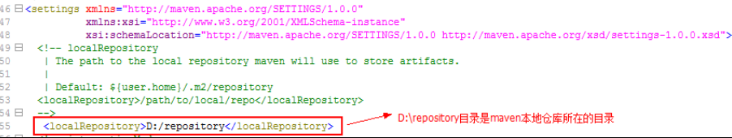
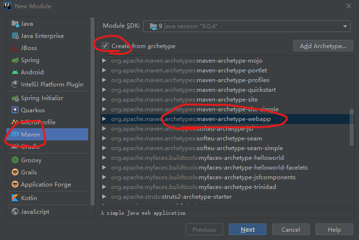
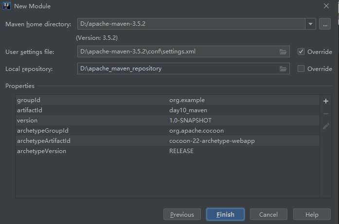
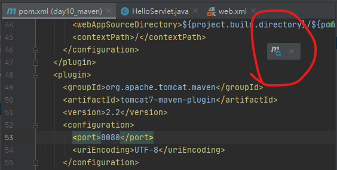
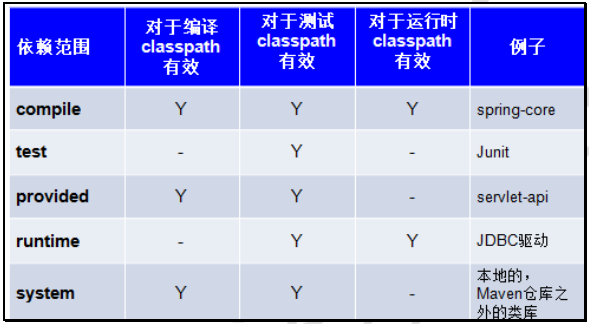
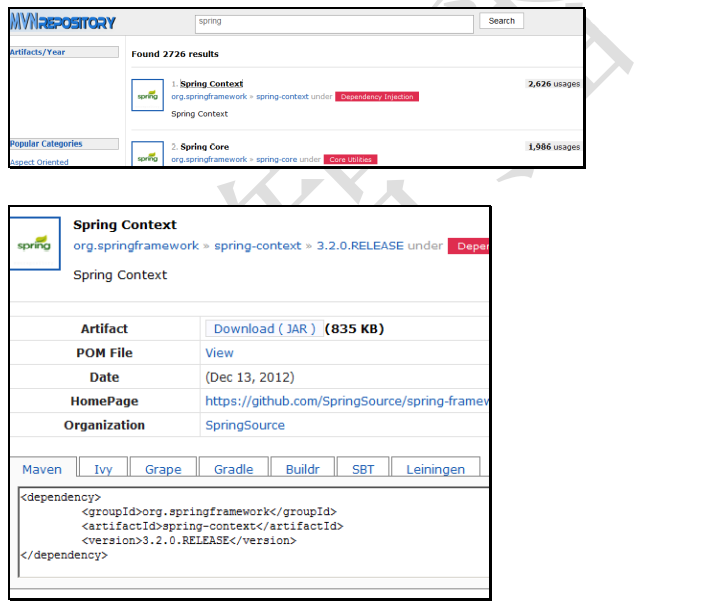
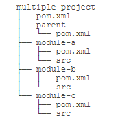

# Maven简介和安装

## 简介

maven是apach开源的一个项目管理工具，maven在美国口语中表示专家、内行的意思，因此它可以做很多事情。

maven可以解决的问题：

* 自动引用各种jar包，不用自己搜索下载导入
* 编译Java文件（IDEA也可以即时编译）
* 自动运行单元测试，不用自己做
* 项目打包并部署项目

maven的两个经典应用：

* Maven的依赖管理：普通项目的jar直接放在项目里，项目之间不可重用；而maven工程的jar包存放在jar的仓库中，使用jar的坐标找到jar包（索引/指针，在pom.xml文件内）。
* 项目的一键构建：一个命令完成项目清理、编译、测试、报告、打包、部署（不使用本地tomcat，使用自己的tomcat插件等）。

## 安装

1. 从官网下载
2. 解压即可
3. 配置环境变量
    * 系统变量设置`MAVEN_HOME`等于`D:\apache-maven-3.5.2-bin`
    * 在系统变量Path中添加`%MAVEN_HOME%\bin`。
4. 注意：maven运行依赖jdk，并且有系统变量`JAVA_HOME`
5. cmd窗口运行`mvn -v`检测

## 配置本地仓库

**仓库**

* 本地仓库：maven会自动将需要的jar包从中央仓库下载到c盘，这里叫本地仓库，默认本地仓库位置`C:\Users\Administrator\.m2\repository`。

* 远程仓库：公司一般建立一个自己的仓库，叫远程仓库（私服）。远程仓库可以从中央仓库下载，也可以自己上传。
* 中央仓库：官方建立的仓库`http://repo1.maven.org/maven2 `。

**因此**，maven工程先从本地找，再从远程找，再从中央找。

* 设置本地仓库位置：找到conf目录下面的settings.xml文件，在注释下面添加`<localRepository>D:\maven_repository</localRepository>`



**全局setting与用户setting**

* maven配置信息都在`\conf\setting.xml`中，此为全局配置；此外还会创建`C:\Users\Administrator\.m2\setting.xml`，此为用户配置；maven会先找用户配置，再找全局配置。

# IDEA创建Maven项目

## 配置

在intelliJ IDEA中构建maven项目：

1. settings->Build Tools->maven设置
    * Maven home directory: 自己安装位置
    * User setting file: 配置文件位置（全局配置吧，感觉用户配置也可以）
    * Local repository: 本地仓库位置
2. settings->Build Tools->maven->runner设置本地仓库优先
    * VM Options： `-DarchetypeCatalog=internal`

## 创建项目

创建JavaWeb工程：

1. new project->maven->使用maven工程提供的模板

    
    
2. 设置项目名、maven安装位置、配置文件、本地仓库（检查是否和上面一致）。

    

3. 创建完等会，等着编译器加载完；

4. 在src/main下面创建两个文件夹`java`和`resources`

    * 右键java->mark directory as->sources root
    * 右键resources->mark directory as->resources root

    ```
    --.settings // 工具生成的文件
    --src  // 源代码
    	--main //
    		--java		 // 项目源码
    		--resources	 // 配置文件
    		--webapp	 // web页面
    	--test
    		--java		// 测试源码
    		--resources	// 测试的配置文件
    --target // 编译生成的文件
    pom.xml // maven配置文件
    ```

5. 打开pom.xml文件，添加项目所依赖的jar包（在标签`<dependencies>`内）

    ```
    <!--  servlet  -->
    <dependency>
          <groupId>javax.servlet</groupId>
          <artifactId>servlet-api</artifactId>
          <version>2.5</version>
          <scope>provided<jsp/scope>
    </dependency>
    <!--  jsp本项目用不到  -->
    <dependency>
          <groupId>javax.servlet.jsp</groupId>
          <artifactId>jsp-api</artifactId>
          <version>2.0</version>
          <scope>provided</scope>
    </dependency>
    <!-- mysql本项目用不到 -->
    <dependency>
      	<groupId>mysql</groupId>
      	<artifactId>mysql-connector-java</artifactId>
     	<version>5.1.6</version>
     	<scope>runtime</scope>
    </dependency>
    ```

6. 设置maven的插件（tomcat和jdk）（在标签`<plugins>`内）

    ```
    <plugin>
      <groupId>org.apache.maven.plugins</groupId>
      <artifactId>maven-compiler-plugin</artifactId>
      <configuration>
        <source>1.8</source>
        <target>1.8</target>
        <encoding>UTF-8</encoding>
      </configuration>
    </plugin>
    <plugin>
      <groupId>org.apache.tomcat.maven</groupId>
      <artifactId>tomcat7-maven-plugin</artifactId>
      <version>2.2</version>
      <configuration>
          <port>8080</port>
          <uriEncoding>UTF-8</uriEncoding>
      </configuration>
    </plugin>
    ```

7. Maven的pom.xml配置文件改了，需要加载：

    

8. 编写`HelloServlet extends HttpServlet`，在`doGet() doPost()`方法中输出hello；

9. 编写web.xml：

    ```
    <!DOCTYPE web-app PUBLIC
            "-//Sun Microsystems, Inc.//DTD Web Application 2.3//EN"
            "http://java.sun.com/dtd/web-app_2_3.dtd" >
    
    <web-app>
        <display-name>Archetype Created Web Application</display-name>
        <servlet>
            <servlet-name>helloServlet</servlet-name>
            <servlet-class>HelloServlet</servlet-class>
        </servlet>
        <servlet-mapping>
            <servlet-name>helloServlet</servlet-name>
            <url-pattern>/demo</url-pattern>
        </servlet-mapping>
    </web-app>
    ```

10. IDEA右侧有一个maven面板，里面有许多命令，如果没有找到`execute maven goal`，并执行命令`tomcan7:run`， 注意：命令不能有空格

    

11. 点击链接即可访问

# 常用命令

执行maven命令，需要进入项目的根目录

1. 清楚：`mvn clean` （新环境，都需要先清楚，主要是删除target中的编译文件）
2. 编译：`mvn compile` 将`src/main/java/`编译生成targe文件夹，里面都是编译文件
3. 测试：`mvn test` 执行`src/test/java`下的所有单元测试
4. 打包：`mvn package` 将java工程打包成jar包，将web工程打包成war包（到target文件夹）
5. 安装：`mvn install` 打包并发布到本地仓库（本地仓库中会有 自己定义的包的路径）
6. 发布：`mvn deploy` 部署之前需要设置配置文件（先跳过这里）

声明周期：（了解）

* 清理生命周期clean lifecycle：上面第一个命令，构建项目之前进行清理工作
* 默认声明周期default lifecycle：上面2-6个命令，也是核心部分
* site声明周期：生成项目报告、站点，发布站点。

# 配置文件

pom.xml是Maven项目的核心配置文件，主要内容有

```
<project>
    <groupId>项目名称/域名 com.baidu</groupId>
    <artifactId>模块名称</artifactId>
    <version>项目版本号</version>
    <packaging >项目打包类型</packaging>
    <name>项目文档的名字</name>。
    <properties>可能是JDK版本</properties>
    <dependencies>项目依赖的包</dependencies>
	<build><plugins>项目依赖的插件</plugins></build>
</project>
```

依赖的包（Maven叫坐标，个人理解成指针）：

```
<dependency>
  <groupId>来源</groupId>
  <artifactId>包名</artifactId>
  <version>版本</version>
  <scope>作用范围</scope>
</dependency>
```

作用范围有五个，默认compile



坐标怎么引用可以从网上找`https://mvnrepository.com/`，如：




# 依赖冲突

maven中经常出现：spring-webmvc-4依赖spring-beans-4，而spring-aop-5依赖spring-beans-5。这样就出现了依赖冲突。

maven会自动选择4版本，而我们希望用5版本。

maven解决依赖冲突的原则：

* 第一声明者优先原则：以坐标导入顺序为准。
* 路径近者优先原则：如果直接导入spring-beans坐标，那就以导入坐标为准。

**排除依赖**

使用exclusions标签将传递过来的依赖排除出去。

```
	<dependency>
      <groupId>org.springframework</groupId>
      <artifactId>spring-webmvc</artifactId>
      <version>4.2.4.RELEASE</version>
      <!--指定不需要的依赖-->
      <exclusions>
        <exclusion>
          <groupId>org.springframework</groupId>
          <artifactId>spring-beans</artifactId>
        </exclusion>
      </exclusions>
    </dependency>
    <dependency>
      <groupId>org.springframework</groupId>
      <artifactId>spring-aop</artifactId>
      <version>5.0.2.RELEASE</version>
    </dependency>
```

**版本锁定**：建议使用该方法

第一步：在dependencyManagement标签中锁定依赖的版本

第二步：在dependencies标签中声明需要导入的maven坐标

```
<!--  锁定版本-->
  <dependencyManagement>
    <dependencies>
      <dependency>
        <groupId>org.springframework</groupId>
        <artifactId>spring-beans</artifactId>
        <version>4.2.8.RELEASE</version>
      </dependency>
    </dependencies>
  </dependencyManagement>
  <dependencies>
    <dependency>
      <groupId>org.springframework</groupId>
      <artifactId>spring-aop</artifactId>
      <version>5.0.2.RELEASE</version>
    </dependency>
  </dependencies>
```

# 模块管理

一个项目有多个模块，那么应该组织结构如下：



> IDEA中创建模块时，可以选择parent

其中parent的pom文件是ABC都依赖的，内容如下：

* 注意到`parent`的是`pom`而不是`jar`，因为`parent`本身不含任何Java代码。编写`parent`的`pom.xml`只是为了在各个模块中减少重复的配置。 

```
<project ...>
	<groupId>com.xxx</groupId>
    <artifactId>parent</artifactId>
    <version>1.0</version>
    <packaging>pom</packaging>

    <name>parent</name>

    <properties>
        ...
    </properties>

    <dependencies>
        ...
    </dependencies>
</project>
```

模块A/B/C的pom文件应该有包含`<parent>`：

```
<project ...>
	<parent>
        <groupId>com.xxx</groupId>
        <artifactId>parent</artifactId>
        <version>1.0</version>
        <relativePath>../parent/pom.xml</relativePath>
    </parent>
    <artifactId>module-a</artifactId>
    <packaging>jar</packaging>
    <name>module-a</name>
    <dependencies>
        ...
    </dependencies>
</project>
```

如果模块A还依赖模块B，那么还可以在`<dependencies>`中这样写：

```
<dependencies>
	<dependency>
		<groupId>com.xxx</groupId>
		<artifactId>module-b</artifactId>
		<version>1.0</version>
	</dependency>
</dependencies>
```

最后，在编译的时候，需要在根目录创建一个`pom.xml`统一编译： 

```
<project ...>
    <modelVersion>4.0.0</modelVersion>
    <groupId>com.xxx</groupId>
    <artifactId>build</artifactId>
    <version>1.0</version>
    <packaging>pom</packaging>
    <name>build</name>

    <modules>
        <module>parent</module>
        <module>module-a</module>
        <module>module-b</module>
        <module>module-c</module>
    </modules>
</project>
```

