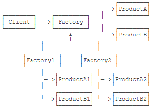
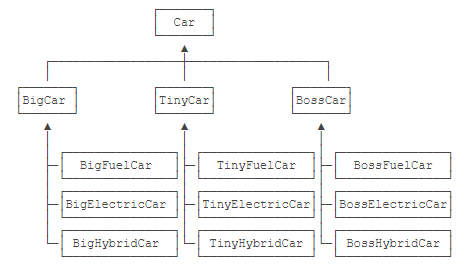
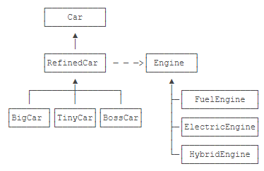
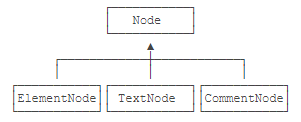
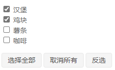
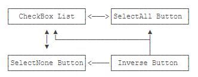
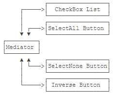

# 简介

设计模式，即Design Patterns，是指在软件设计中，被反复使用的一种代码设计经验。使用设计模式的目的是为了可重用代码，提高代码的可扩展性和可维护性。

设计模式这个术语是上个世纪90年代由Erich Gamma、Richard Helm、Raplh Johnson和Jonhn Vlissides四个人总结提炼出来的，并且写了一本[Design Patterns](https://en.wikipedia.org/wiki/Design_Patterns)的书。这四人也被称为四人帮（GoF）。

为什么要使用设计模式？根本原因还为了提高代码的可重用性、代码的可读性和代码的可靠性。设计模式主要是基于OOP编程提炼的，它基于以下几个原则：

* 开闭原则：由Bertrand Meyer提出的开闭原则（Open Closed Principle）是指，软件应该对扩展开放，而对修改关闭。这里的意思是在增加新功能的时候，能不改代码就尽量不要改，如果只增加代码就完成了新功能，那是最好的。
* 里氏替换原则：里氏替换原则是Barbara Liskov提出的，这是一种面向对象的设计原则，即如果我们调用一个父类的方法可以成功，那么替换成子类调用也应该完全可以运行。

设计模式把一些常用的设计思想提炼出一个个模式，然后给每个模式命名，这样在使用的时候更方便交流。GoF把23个常用模式分为三类。

根据目的来分：

* 创建型模式：把对象的创建和使用相分离，这样使得两者能相对独立地变换。
* 结构型模式：如何组合各种对象以便获得更好、更灵活的结构。虽然面向对象的继承机制提供了最基本的子类扩展父类的功能，但结构型模式不仅仅简单地使用继承，而更多地通过组合与运行期的动态组合来实现更灵活的功能。 
* 行为型模式：用于描述类或对象之间怎样相互协作共同完成单个对象都无法单独完成的任务，以及怎样分配职责。 

# UML

UML（Unified Modeling Language，统一建模语言）是用来设计软件蓝图的可视化建模语言，是一种为面向对象系统的产品进行说明、可视化和编制文档的标准语言，独立于任何一种具体的程序设计语言。 它的特点是简单、统一、图形化、能表达软件设计中的动态与静态信息。

UML 建模的核心是模型，模型是现实的简化、真实系统的抽象。UML 提供了系统的设计蓝图。当给软件系统建模时，需要采用通用的符号语言，这种描述模型所使用的语言被称为建模语言。在 UML 中，所有的描述由事物、关系和图这些构件组成。下图完整地描述了所有构件的关系。 

 

事物：本文主要用到类、接口

图：本文只讲类图

关系：类图中用到依赖关系、关联关系、聚合关系、组合关系、泛化关系和实现关系

# UML类图和类图之间的关系
类图中，四种作用域（元素可见性）public private protected friendly分别用符号`+-#~`表示。

如下图Graph是一个接口，用圆圈来表示，有两个实现类，以及一个访问类。
* 类中的字段和方法返回值的类型非必须；
* 抽象类或抽象方法要用斜体；
* 静态类或静态方法要有下划线；

 


先介绍这一种吧：依赖关系是一种使用关系，从使用类指向被依赖类：

  


# 创建型-工厂方法Factory

目的：使创建对象和使用对象分离；

实现步骤：

1. 创建工厂接口；

    ```
    public interface NumberFactory {
        Number parse(String s);
    }
    ```

2. 编写工厂实现类；

    ```
    public class NumberFactoryImpl implements NumberFactory {
        public Number parse(String s) {
            return new BigDecimal(s);
        }
    }
    ```

3. 在工厂接口中定义创建对象的静态方法

    ```
    public interface NumberFactory {
        // 创建方法:
        Number parse(String s);
    
        // 获取工厂实例:
        static NumberFactory getFactory() {
            return impl;
        }
    
        static NumberFactory impl = new NumberFactoryImpl();
    }
    ```

4. 客户可以这么来用：

    ```
    NumberFactory factory = NumberFactory.getFactory();
    Number result = factory.parse("123.456");
    ```

# 创建型-静态工厂方法

工厂方法麻烦，可以直接在类中定义一个静态方法，来返回对象，如

`Integer n = Integer.valueOf(100);`，这说明Integer既是工厂，也是产品（对象）；它的源代码如下：

```
public final class Integer {
    public static Integer valueOf(int i) {
        if (i >= IntegerCache.low && i <= IntegerCache.high)
            return IntegerCache.cache[i + (-IntegerCache.low)];
        return new Integer(i);
    }
    ...
}
```

有时候返回新的实例，有时候返回缓存中的实例。这里利用缓存是结构型-享元的思想，如果不利用缓存，可以这样写：

```
public final class Integer {
    public static Integer valueOf(int i) {
        return new Integer(i);
    }
    ...
}
```

# 创建型-抽象工厂

抽象工厂相比工厂方法解决的问题更复杂，不但工厂要抽象，产品也是抽象的，因此，这个抽象工厂对应多个实际工厂，每个实际工厂负责创建多个实际产品。



假设我们为用户提供一个Markdown文本转换为HTML和Word的服务。

1. 定义工厂接口

    ```
    public interface AbstractFactory {
        // 创建Html文档:
        HtmlDocument createHtml(String md);
        // 创建Word文档:
        WordDocument createWord(String md);
    }
    ```

2. 两个产品我们不知道如何实现的，所以定义接口：

    ```
    // Html文档接口:
    public interface HtmlDocument {
        String toHtml();
        ...
    }
    
    // Word文档接口:
    public interface WordDocument {
        String toWord();
        ...
    }
    ```

3. 现有一家供应商FastDoc，他是如何实现产品的呢？

    ```
    public class FastHtmlDocument implements HtmlDocument {
        ...
    }
    
    public class FastWordDocument implements WordDocument {
        ...
    }
    public class FastFactory implements AbstractFactory {
        public HtmlDocument createHtml(String md) {
            return new FastHtmlDocument(md);
        }
        public WordDocument createWord(String md) {
            return new FastWordDocument(md);
        }
    }
    ```

4. 客户端，我们可以这么来用：

    ```
    AbstractFactory factory = new FastFactory();
    HtmlDocument html = factory.createHtml("# Hello\nHello, world!");
    html.toHtml();
    WordDocument word = factory.createWord("#Hello\nHello, world!");
    word.toWord();
    ```

5. 注意到，客户端只使用了`new FastFactory()`，并没有`new HtmlDocment()`；如果我们将`new FastFactory()`放在抽象工厂里，那么实际工厂也就屏蔽了：

    ```
    public interface AbstractFactory {
        public static AbstractFactory createFactory(String name) {
            if (name.equalsIgnoreCase("fast")) {
                return new FastFactory();
            }
        }
    }
    ```

# 创建型-生成器Builder

有时候创建一个对象比较复杂，可以分步创建，就像机器上的零件，比如Markdown转HTML:

```
public class HtmlBuilder {
    private HeadingBuilder headingBuilder = new HeadingBuilder();
    private HrBuilder hrBuilder = new HrBuilder();
    private ParagraphBuilder paragraphBuilder = new ParagraphBuilder();
    private QuoteBuilder quoteBuilder = new QuoteBuilder();

    public String toHtml(String markdown) {
        StringBuilder buffer = new StringBuilder();
        markdown.lines().forEach(line -> {
            if (line.startsWith("#")) {
                buffer.append(headingBuilder.buildHeading(line)).append('\n');
            } else if (line.startsWith(">")) {
                buffer.append(quoteBuilder.buildQuote(line)).append('\n');
            } else if (line.startsWith("---")) {
                buffer.append(hrBuilder.buildHr(line)).append('\n');
            } else {
                buffer.append(paragraphBuilder.buildParagraph(line)).append('\n');
            }
        });
        return buffer.toString();
    }
}
```

很多时候，我们可以简化Builder模式，以链式调用的方式来创建对象。例如：

```
String url = URLBuilder.builder() // 创建Builder
        .setDomain("www.liaoxuefeng.com") // 设置domain
        .setScheme("https") // 设置scheme
        .setPath("/") // 设置路径
        .setQuery(Map.of("a", "123", "q", "K&R")) // 设置query
        .build(); // 完成build
```

# 创建型-原型模式Prototype

原型模式是根据一个现有对象实例复制出一个新的实例，复制出的类型和属性与原实例相同。实现如下：

> Java的`Object`提供了一个`clone()`方法，需要重写，并且返回值是`Object`，还需要转型，用起来不方便。

```
public class Student {
    private int id;
    private String name;
    private int score;

    public Student copy() {
        Student std = new Student();
        std.id = this.id;
        std.name = this.name;
        std.score = this.score;
        return std;
    }
}
```

但是原型模式应用不是很广泛，因为很多实例会持有类似文件、Socket这样的资源，而这些资源是无法复制给另一个对象共享的，只有存储简单类型的“值”对象可以复制。

# 创建型-单例模式Singleton

Singleton为了保证在一个进程中，某个类有且仅有一个实例。

首先保证用户不能调用`new Xxx()`，所以要自己创建；保证只有一个实例，所以用静态字段。

饿汉式：（多线程安全）

```
public class Singleton {
    // 静态字段引用唯一实例:
    private static final Singleton INSTANCE = new Singleton();

    // private构造方法保证外部无法实例化:
    private Singleton() {
    }
    public static Singleton getInstance() {
    	return INSTANCE;
    }
}
Singleton s = Singleton.getInstance();
```

懒汉式：（多线程安全，加锁才可以保证单例）

```
public class Singleton {  
    private static Singleton instance;  
    private Singleton (){}  
    public static synchronized Singleton getInstance() {  
    if (instance == null) {  
        instance = new Singleton();  
    }  
    return instance;  
    }  
}
```

懒汉式：（多线程不安全）

```
public class Singleton {  
    private static Singleton instance;  
    private Singleton (){}  
    public static Singleton getInstance() {  
    if (instance == null) {  
        instance = new Singleton();  
    }  
    return instance;  
    }  
}
```

# 结构型-适配器Adapter

也称Wrapper，指如果一个接口需要B接口，但是待传入的对象却是A接口，怎么办？Adapter将A接口转换为B接口。

实现：编写Adapter实际上就是编写一个实现了B接口，并且内部持有A接口的类：

```
public BAdapter implements B {
    private A a;
    public BAdapter(A a) {
        this.a = a;
    }
    public void b() {
        a.a();
    }
}
```

# 结构型-桥接

假设有三个品牌的汽车BigCar、TinyCar、BossCar，每个品牌有可以选择燃油 、纯电和混合动力。传统继承方法一共3个抽象类和9个实现类。如果再新增一个核动力引擎，那么还需要新增3个实现类。



桥接模式则将车和引擎都抽象，并将两者再结合起来，如下图：



代码：

1. 抽象汽车、接口引擎：

    ```
    public abstract class Car {
        // 引用Engine:
        protected Engine engine;
    
        public Car(Engine engine) {
            this.engine = engine;
        }
    
        public abstract void drive();
    }
    
    public interface Engine {
        void start();
    }
    ```

2. 两者结合

    ```
    public abstract class RefinedCar extends Car {
        public RefinedCar(Engine engine) {
            super(engine);
        }
    
        public void drive() {
            this.engine.start();
            System.out.println("Drive " + getBrand() + " car...");
        }
    
        public abstract String getBrand();
    }
    ```

3. 品牌车、引擎

    ```
    public class BossCar extends RefinedCar {
        public BossCar(Engine engine) {
            super(engine);
        }
    
        public String getBrand() {
            return "Boss";
        }
    }
    
    public class HybridEngine implements Engine {
        public void start() {
            System.out.println("Start Hybrid Engine...");
        }
    }
    ```

4. 客户

    ```
    RefinedCar car = new BossCar(new HybridEngine());
    car.drive();
    ```

# 结构型-组合Composite

组合模式（Composite）经常用于树形结构，为了简化代码，使用Composite可以把一个叶子节点与一个父节点统一起来处理。



例如，我们定义一个XML文档：

1. 抽象出具有统一性质的Node接口：

    ```
    public interface Node {
        // 添加一个节点为子节点:
        Node add(Node node);
        // 获取子节点:
        List<Node> children();
        // 输出为XML:
        String toXml();
    }
    ```

2. 实现元素节点ElementNode，可以包含多个子节点：

    ```
    public class ElementNode implements Node {
        private String name;
        private List<Node> list = new ArrayList<>();
    
        public ElementNode(String name) {
            this.name = name;
        }
    
        public Node add(Node node) {
            list.add(node);
            return this;
        }
    
        public List<Node> children() {
            return list;
        }
    
        public String toXml() {
            String start = "<" + name + ">\n";
            String end = "</" + name + ">\n";
            StringJoiner sj = new StringJoiner("", start, end);
            list.forEach(node -> {
                sj.add(node.toXml() + "\n");
            });
            return sj.toString();
        }
    }
    ```

3. 实现文本节点，不能包含子节点：

    ```
    public class TextNode implements Node {
    	private String text;
    
    	public TextNode(String text) {
    		this.text = text;
    	}
    
    	public Node add(Node node) {
    		throw new UnsupportedOperationException();
    	}
    
    	public List<Node> children() {
    		return List.of();
    	}
    
    	public String toXml() {
    		return text;
    	}
    }
    ```

4. 使用：

    ```
    Node root = new ElementNode("school");
    root.add(new ElementNode("classA")
            .add(new TextNode("Tom"))
            .add(new TextNode("Alice")));
    root.add(new ElementNode("classB")
            .add(new TextNode("Bob"))
            .add(new TextNode("Grace")));
    System.out.println(root.toXml());
    ```

# 结构型-装饰器Decorator

装饰器（Decorator）模式，是一种在运行期动态给某个对象的实例增加功能的方法。

在Java的IO系统中，就利用了装饰器，`InputStream`是抽象类，`FileInputStream`是实现类，如果在`FileInputStream`上增加功能，不必重新编写，可以利用装饰器模式：

```
// 创建原始的数据源:
InputStream fis = new FileInputStream("test.gz");
// 增加缓冲功能:
InputStream bis = new BufferedInputStream(fis);
// 增加解压缩功能:
InputStream gis = new GZIPInputStream(bis);

// 或者一次性写：
InputStream input = new GZIPInputStream(new BufferedInputStream(new FileInputStream("test.gz")));
```

实际上，装饰器是为了把核心功能和附加功能分开。

假设我们要渲染HTML文本，如加粗、斜体等，可以利用装饰器：

1. 定义顶层接口：

    ```
    public interface TextNode {
        void setText(String text);
        String getText();
    }
    ```

2. 实现核心节点：

    ```
    public class SpanNode implements TextNode {
        private String text;
        public void setText(String text) {
            this.text = text;
        }
        public String getText() {
            return "<span>" + text + "</span>";
        }
    }
    ```

3. 添加渲染效果：（抽象类+继承）

    ```
    public abstract class NodeDecorator implements TextNode {
        protected final TextNode target;
    
        protected NodeDecorator(TextNode target) {
            this.target = target;
        }
    
        public void setText(String text) {
            this.target.setText(text);
        }
    }
    
    public class BoldDecorator extends NodeDecorator {
        public BoldDecorator(TextNode target) {
            super(target);
        }
    
        public String getText() {
            return "<b>" + target.getText() + "</b>";
        }
    }
    ```

4. 客户端使用

    ```
    TextNode nood = new BoldDecorator(new SpanNode());
    System.out.println(nood.getText());
    ```

# 结构型-外观Facade

> 为子系统中的一组接口提供一个一致的界面。Facade模式定义了一个高层接口，这个接口使得这一子系统更加容易使用。

我们以注册公司为例，假设注册公司需要三步：

1. 向工商局申请公司营业执照；接口`AdminOfIndustry `
2. 在银行开设账户；接口`Bank`
3. 在税务局开设纳税号。接口`Taxation`

上面比较复杂，可以定义一个中间商，我们找中间商一次完成：

```
public class Facade {
    public Company openCompany(String name) {
        Company c = this.admin.register(name);
        String bankAccount = this.bank.openAccount(c.getId());
        c.setBankAccount(bankAccount);
        String taxCode = this.taxation.applyTaxCode(c.getId());
        c.setTaxCode(taxCode);
        return c;
    }
}
```

# 结构型-享元Flyweight

享元（Flyweight）的核心思想很简单：如果一个对象实例一经创建就不可变，那么反复创建相同的实例就没有必要，直接向调用方返回一个共享的实例就行，这样即节省内存，又可以减少创建对象的过程，提高运行速度。

享元模式在Java标准库中有很多应用。我们知道，包装类型如`Byte`、`Integer`都是不变类，因此，反复创建同一个值相同的包装类型是没有必要的。以`Integer`为例，如果我们通过`Integer.valueOf()`这个静态工厂方法创建`Integer`实例，当传入的`int`范围在`-128`~`+127`之间时，会直接返回缓存的`Integer`实例：

```
public final class Integer {
    public static Integer valueOf(int i) {
        if (i >= IntegerCache.low && i <= IntegerCache.high)
            return IntegerCache.cache[i + (-IntegerCache.low)];
        return new Integer(i);
    }
    ...
}
```

# 结构型-代理Proxy

代理模式，即Proxy，它和Adapter模式很类似。Adapter用于把A接口转换为B接口，Proxy就是为了给A接口再包一层 ，最后还是A接口。

根据代理的创建时期，代理模式分为静态代理和动态代理。

- 静态：由程序员创建代理类或特定工具自动生成源代码再对其编译，在程序运行前代理类的 .class 文件就已经存在了。
- 动态：在程序运行时，运用反射机制动态创建而成

模式结构：

1. 抽象主题（Subject）类：通过接口或抽象类声明真实主题和代理对象实现的业务方法。
2. 真实主题（Real Subject）类：实现了抽象主题中的具体业务，是代理对象所代表的真实对象，是最终要引用的对象。
3. 代理（Proxy）类：提供了与真实主题相同的接口，其内部含有对真实主题的引用，它可以访问、控制或扩展真实主题的功能。

 

 静态代理模式代码：

```
package proxy;
public class ProxyTest {
    public static void main(String[] args) {
        Proxy proxy = new Proxy();
        proxy.Request();
    }
}
//抽象主题
interface Subject {
    void Request();
}
//真实主题
class RealSubject implements Subject {
    public void Request() {
        System.out.println("访问真实主题方法...");
    }
}
//代理
class Proxy implements Subject {
    private RealSubject realSubject;
    public void Request() {
        if (realSubject == null) {
            realSubject = new RealSubject();
        }
        preRequest();
        realSubject.Request();
        postRequest();
    }
    public void preRequest() {
        System.out.println("访问真实主题之前的预处理。");
    }
    public void postRequest() {
        System.out.println("访问真实主题之后的后续处理。");
    }
}
```

当无法或不想直接引用某个对象或访问某个对象存在困难时，可以通过代理对象来间接访问。使用代理模式主要有两个目的：一是保护目标对象，二是增强目标对象。
前面分析了代理模式的结构与特点，现在来分析以下的应用场景。

- 远程代理，这种方式通常是为了隐藏目标对象存在于不同地址空间的事实，方便客户端访问。例如，用户申请某些网盘空间时，会在用户的文件系统中建立一个虚拟的硬盘，用户访问虚拟硬盘时实际访问的是网盘空间。
- 虚拟代理，这种方式通常用于要创建的目标对象开销很大时。例如，下载一幅很大的图像需要很长时间，因某种计算比较复杂而短时间无法完成，这时可以先用小比例的虚拟代理替换真实的对象，消除用户对服务器慢的感觉。
- 安全代理，这种方式通常用于控制不同种类客户对真实对象的访问权限。
- 智能指引，主要用于调用目标对象时，代理附加一些额外的处理功能。例如，增加计算真实对象的引用次数的功能，这样当该对象没有被引用时，就可以自动释放它。
- 延迟加载，指为了提高系统的性能，延迟对目标的加载。例如，Hibernate中就存在属性的延迟加载和关联表的延时加载。

静态代理存在两个缺点。

1. 真实主题与代理主题一一对应，增加真实主题也要增加代理。
2. 设计代理以前真实主题必须事先存在，不太灵活。采用动态代理模式可以解决以上问题，如SpringAOP，其结构图如图所示。

  

# 行为型-责任链

例如，JavaEE的Servlet规范定义的`Filter`就是一种责任链模式，它不但允许每个`Filter`都有机会处理请求，还允许每个`Filter`决定是否将请求“放行”给下一个`Filter`：

```
public class AuditFilter implements Filter {
    public void doFilter(ServletRequest req, ServletResponse resp, FilterChain chain) throws IOException, ServletException {
        log(req);
        if (check(req)) {
            // 放行:
            chain.doFilter(req, resp);
        } else {
            // 拒绝:
            sendError(resp);
        }
    }
}
```

# 行为型-命令

假设，有一个编辑器`TextEditor`，里面有许多方法，直接调用方法：

```
TextEditor editor = new TextEditor();
editor.add("Command pattern in text editor.\n");
editor.copy();
editor.paste();
System.out.println(editor.getState());
```

1. 现在改用命令模式，首先定义`Command`接口:

    ```
    public interface Command {
        void execute();
    }
    ```

2. 接着定义一个`CopyCommand`类（还有`PasteCommand`等类）：

    ```
    public class CopyCommand implements Command {
        // 持有执行者对象:
        private TextEditor receiver;
    
        public CopyCommand(TextEditor receiver) {
            this.receiver = receiver;
        }
    
        public void execute() {
            receiver.copy();
        }
    }
    ```

3. 客户端使用

    ```
    TextEditor editor = new TextEditor();
    editor.add("Command pattern in text editor.\n");
    // 执行一个CopyCommand:
    Command copy = new CopyCommand(editor);
    copy.execute();
    editor.add("----\n");
    // 执行一个PasteCommand:
    Command paste = new PasteCommand(editor);
    paste.execute();
    System.out.println(editor.getState());
    ```

实际上，使用命令模式，增加了系统的复杂度。如果需求很简单，那么直接调用显然更直观而且更简单。如果`TextEditor`复杂到一定程度，并且需要支持Undo、Redo的功能时，就需要使用命令模式，因为我们可以给每个命令增加`undo()`。

```
public interface Command {
    void execute();
    void undo();
}
```

# 行为型-解释器

解释器模式（Interpreter）是一种针对特定问题设计的一种解决方案。例如，匹配字符串的时候，由于匹配条件非常灵活，使得通过代码来实现非常不灵活。因此，需要一种通用的表示方法——正则表达式来进行匹配。正则表达式就是一个字符串，但要把正则表达式解析为**语法树**，然后再匹配指定的字符串，就需要一个**解释器**。

（实现起来略微复杂，略）

# 行为型-迭代器

> *提供一种方法顺序访问一个聚合对象中的各个元素，而又不需要暴露该对象的内部表示。* 

如，定义一个逆序的迭代器

```
public class ReverseArrayCollection<T> implements Iterable<T> {
    // 以数组形式持有集合:
    private T[] array;

    public ReverseArrayCollection(T... objs) {
        this.array = Arrays.copyOfRange(objs, 0, objs.length);
    }

    public Iterator<T> iterator() {
        return ???;
    }
}
```

# 行为型-中介

中介模式（Mediator）又称调停者模式，它的目的是把多方会谈变成双方会谈，从而实现多方的松耦合。

例如，一个点餐系统：



当点击某个按钮，会影响别的按钮的点击状态，所以逻辑很复杂：



如果引入一个中介，对象之间的关系就变得简单：



# 行为型-备忘录

备忘录（Memento）模式的定义：在不破坏封装性的前提下，捕获一个对象的内部状态，并在该对象之外保存这个状态，以便以后当需要时能将该对象恢复到原先保存的状态。该模式又叫快照模式。

模式的结构：

1. 发起人（Originator）角色：记录当前时刻的内部状态信息，提供创建备忘录和恢复备忘录数据的功能，实现其他业务功能，它可以访问备忘录里的所有信息。
2. 备忘录（Memento）角色：负责存储发起人的内部状态，在需要的时候提供这些内部状态给发起人。
3. 管理者（Caretaker）角色：对备忘录进行管理，提供保存与获取备忘录的功能，但其不能对备忘录的内容进行访问与修改。

 

模式的实现：

```
public class MementoPattern {
    public static void main(String[] args) {
        Originator or = new Originator();
        Caretaker cr = new Caretaker();
        or.setState("S0");
        System.out.println("初始状态:" + or.getState());
        cr.setMemento(or.createMemento()); //保存状态
        or.setState("S1");
        System.out.println("新的状态:" + or.getState());
        or.restoreMemento(cr.getMemento()); //恢复状态
        System.out.println("恢复状态:" + or.getState());
    }
}
//备忘录
class Memento {
    private String state;
    public Memento(String state) {
        this.state = state;
    }
    public void setState(String state) {
        this.state = state;
    }
    public String getState() {
        return state;
    }
}
//发起人
class Originator {
    private String state;
    public void setState(String state) {
        this.state = state;
    }
    public String getState() {
        return state;
    }
    public Memento createMemento() {
        return new Memento(state);
    }
    public void restoreMemento(Memento m) {
        this.setState(m.getState());
    }
}
//管理者
class Caretaker {
    private Memento memento;
    public void setMemento(Memento m) {
        memento = m;
    }
    public Memento getMemento() {
        return memento;
    }
}
```

# 行为型-状态

> 允许一个对象在其内部状态改变时改变它的行为。对象看起来似乎修改了它的类。

状态模式的关键设计思想在于状态切换，我们引入一个`BotContext`完成状态切换：

```
public class BotContext {
	private State state = new DisconnectedState();

	public String chat(String input) {
		if ("hello".equalsIgnoreCase(input)) {
            // 收到hello切换到在线状态:
			state = new ConnectedState();
			return state.init();
		} else if ("bye".equalsIgnoreCase(input)) {
            /  收到bye切换到离线状态:
			state = new DisconnectedState();
			return state.init();
		}
		return state.reply(input);
	}
}
```

客户端：

```
Scanner scanner = new Scanner(System.in);
BotContext bot = new BotContext();
for (;;) {
    System.out.print("> ");
    String input = scanner.nextLine();
    String output = bot.chat(input);
    System.out.println(output.isEmpty() ? "(no reply)" : "< " + output);
}
```

# 行为型-观察者

观察者模式（Observer）又称发布-订阅模式（Publish-Subscribe：Pub/Sub）。它是一种通知机制，让发送通知的一方（被观察方）和接收通知的一方（观察者）能彼此分离，互不影响。

例如，定义一个`Store`，可以上架`Product`，然后通知`Customer`:

```
public class Store {
    private List<ProductObserver> observers = new ArrayList<>();
    private Map<String, Product> products = new HashMap<>();

    // 注册观察者:
    public void addObserver(ProductObserver observer) {
        this.observers.add(observer);
    }

    public void addNewProduct(String name, double price) {
        Product p = new Product(name, price);
        products.put(p.getName(), p);
        // 通知观察者:
        observers.forEach(o -> o.onPublished(p));
    }
}
```

# 行为型-策略

策略模式：Strategy，是指，定义一组算法，并把其封装到一个对象中。然后在运行时，可以灵活的使用其中的一个算法。

例如，排序算法：

```
public class Main {
    public static void main(String[] args) throws InterruptedException {
        String[] array = { "apple", "Pear", "Banana", "orange" };
        Arrays.sort(array, String::compareToIgnoreCase);  // 忽略大小写
        System.out.println(Arrays.toString(array));
        Arrays.sort(array, (s1, s2) -> -s1.compareTo(s2)); // 倒序
        System.out.println(Arrays.toString(array));
    }
}
```

# 行为型-模板

模板方法（Template Method）是一个比较简单的模式。它的主要思想是，定义一个操作的一系列步骤，对于某些暂时确定不下来的步骤，就留给子类去实现好了，这样不同的子类就可以定义出不同的步骤。

模板代码：

```java
public class TemplateMethodPattern {
    public static void main(String[] args) {
        AbstractClass tm = new ConcreteClass();
        tm.TemplateMethod();
    }
}
//抽象类
abstract class AbstractClass {
    //模板方法
    public void TemplateMethod() {
        SpecificMethod();
        abstractMethod1();
        abstractMethod2();
    }
    //具体方法
    public void SpecificMethod() {
        System.out.println("抽象类中的具体方法被调用...");
    }
    //抽象方法1
    public abstract void abstractMethod1();
    //抽象方法2
    public abstract void abstractMethod2();
}
//具体子类
class ConcreteClass extends AbstractClass {
    public void abstractMethod1() {
        System.out.println("抽象方法1的实现被调用...");
    }
    public void abstractMethod2() {
        System.out.println("抽象方法2的实现被调用...");
    }
}
```

# 行为型-访问者

在现实生活中，有些集合对象存在多种不同的元素，且每种元素也存在多种不同的访问者和处理方式。例如，公园中存在多个景点，也存在多个游客，不同的游客对同一个景点的评价可能不同； 电影或电视剧中的人物角色，不同的观众对他们的评价也不同。

这些被处理的数据元素相对稳定而访问方式多种多样的数据结构，如果用“访问者模式”来处理比较方便。访问者模式能把处理方法从数据结构中分离出来，并可以根据需要增加新的处理方法，且不用修改原来的程序代码与数据结构，这提高了程序的扩展性和灵活性。

模型的结构：

1. 抽象访问者（Visitor）角色：定义一个访问具体元素的接口，为每个具体元素类对应一个访问操作 visit() ，该操作中的参数类型标识了被访问的具体元素。
2. 具体访问者（ConcreteVisitor）角色：实现抽象访问者角色中声明的各个访问操作，确定访问者访问一个元素时该做什么。
3. 抽象元素（Element）角色：声明一个包含接受操作 accept() 的接口，被接受的访问者对象作为 accept() 方法的参数。
4. 具体元素（ConcreteElement）角色：实现抽象元素角色提供的 accept() 操作，其方法体通常都是 visitor.visit(this) ，另外具体元素中可能还包含本身业务逻辑的相关操作。
5. 对象结构（Object Structure）角色：是一个包含元素角色的容器，提供让访问者对象遍历容器中的所有元素的方法，通常由 List、Set、Map 等聚合类实现。

  

模式的实现

```java
import java.util.*;
public class VisitorPattern {
    public static void main(String[] args) {
        ObjectStructure os = new ObjectStructure();
        os.add(new ConcreteElementA());
        os.add(new ConcreteElementB());
        Visitor visitor = new ConcreteVisitorA();
        os.accept(visitor);
        System.out.println("------------------------");
        visitor = new ConcreteVisitorB();
        os.accept(visitor);
    }
}
//抽象访问者
interface Visitor {
    void visit(ConcreteElementA element);
    void visit(ConcreteElementB element);
}
//具体访问者A类
class ConcreteVisitorA implements Visitor {
    public void visit(ConcreteElementA element) {
        System.out.println("具体访问者A访问-->" + element.operationA());
    }
    public void visit(ConcreteElementB element) {
        System.out.println("具体访问者A访问-->" + element.operationB());
    }
}
//具体访问者B类
class ConcreteVisitorB implements Visitor {
    public void visit(ConcreteElementA element) {
        System.out.println("具体访问者B访问-->" + element.operationA());
    }
    public void visit(ConcreteElementB element) {
        System.out.println("具体访问者B访问-->" + element.operationB());
    }
}
//抽象元素类
interface Element {
    void accept(Visitor visitor);
}
//具体元素A类
class ConcreteElementA implements Element {
    public void accept(Visitor visitor) {
        visitor.visit(this);
    }
    public String operationA() {
        return "具体元素A的操作。";
    }
}
//具体元素B类
class ConcreteElementB implements Element {
    public void accept(Visitor visitor) {
        visitor.visit(this);
    }
    public String operationB() {
        return "具体元素B的操作。";
    }
}
//对象结构角色
class ObjectStructure {
    private List<Element> list = new ArrayList<Element>();
    public void accept(Visitor visitor) {
        Iterator<Element> i = list.iterator();
        while (i.hasNext()) {
            ((Element) i.next()).accept(visitor);
        }
    }
    public void add(Element element) {
        list.add(element);
    }
    public void remove(Element element) {
        list.remove(element);
    }
}
```

