# SpringCloud

# 1  概念

分布式架构会遇到的四个核心问题：

1. 这么多服务，客户端如何去访问
2. 这么多服务，服务之间如何通信
3. 这么多服务，如何治理
4. 服务挂了，怎么办

SpringCloud是一套生态，就是解决分布式遇到的问题。

```
1、Spring Cloud NetFlix，出了一套解决方案，但是2018年底，NetFlix宣布无限期停止维护。
	1. Api网关，zuul组件，解决访问。微服务网关、提供动态路由、访问过滤等服务。
	2. 基于Http的Feign组件，解决通信，同步并阻塞
	3. Eureka，服务注册发现，解决治理
	4. Hystrix，熔断机制，解决故障

2、Apache Dubbo Zookeeper，第二套解决方案
	* API 没有，自己实现，或者找第三方组件
	* Dubbo，RPC通信框架，解决通信
	* Zookeeper，服务注册与发现，解决治理
	* 熔断，没有，借助了Hystrix

3、SpringCloud Alibaba一站式解决方案
	* Dubbo: RPC框架，以及客户端访问等，负载均衡等。
	* Nacos: 类似注册中心。
	* Sentinal: 流量控制，服务熔断等
	* RocketMQ: 分布式消息系统
	* Seata: 分布式事务

4、Server Mesh 下一代微服务标准
	代表方案istio
```


SpringCloud和SpringBoot关系

* SpringBoot专注于快速开发单个微服务，就是jar包
* SpringCloud关注全局的微服务协调治理框架，将SpringBoot开发的一个个微服务整合并管理起来，为微服务之间提供：管理配置，服务发现，断路器，路由，微代理，事件总线，全局锁，决策竞选，分布式会话等集成服务。

# 2  Eureka服务注册中心

### 2.1  原理

认识：

- Netflix在涉及Eureka时，遵循的就是API原则.
- Eureka是Netflix的有个子模块，也是核心模块之一。Eureka是基于REST的服务，用于定位服务，以实现云端中间件层服务发现和故障转移，服务注册与发现对于微服务来说是非常重要的，有了服务注册与发现，只需要使用服务的标识符，就可以访问到服务，而不需要修改服务调用的配置文件了，功能类似于Dubbo的注册中心，比如Zookeeper.

- Springcloud 封装了Netflix公司开发的Eureka模块来实现服务注册与发现 (对比Zookeeper).
- Eureka采用了C-S的架构设计，EurekaServer作为服务注册功能的服务器，他是服务注册中心.
- 而系统中的其他微服务，使用Eureka的客户端连接到EurekaServer并维持心跳连接。这样系统的维护人员就可以通过EurekaServer来监控系统中各个微服务是否正常运行，Springcloud 的一些其他模块 (比如Zuul) 就可以通过EurekaServer来发现系统中的其他微服务，并执行相关的逻辑.


- Eureka 包含两个组件：**Eureka Server** 和 **Eureka Client**.
- Eureka Server 提供服务注册，各个节点启动后，回在EurekaServer中进行注册，这样Eureka Server中的服务注册表中将会储存所有课用服务节点的信息，服务节点的信息可以在界面中直观的看到.
- Eureka Client 是一个Java客户端，用于简化EurekaServer的交互，客户端同时也具备一个内置的，使用轮询负载算法的负载均衡器。在应用启动后，将会向EurekaServer发送心跳 (默认周期为30秒) 。如果Eureka Server在多个心跳周期内没有接收到某个节点的心跳，EurekaServer将会从服务注册表中把这个服务节点移除掉 (默认周期为90s).
- 上图中，Eureka Server就是注册中心；服务提供者和服务消费者就是Eureka Client；提供者将自己ip和端口注册到注册中心；消费者就可以从注册中心获取并调用。

三大角色：

* Eureka Server：提供服务的注册与发现。和Zookeeper一样
* Server Provider：将自身服务注册到Eureka
* Server Consumer：从Eureka中获取注册服务列表，找到服务提供者。


### 2.2  代码

#### Eureka Server代码

创建一个空的Maven项目, 引入依赖

```
	<parent>
        <artifactId>spring-boot-starter-parent</artifactId>
        <groupId>org.springframework.boot</groupId>
        <version>2.3.12.RELEASE</version>
    </parent>

    <!-- 打包方式 pom -->
    <packaging>pom</packaging>

    <properties>
        <maven.compiler.source>11</maven.compiler.source>
        <maven.compiler.target>11</maven.compiler.target>

        <spring-cloud.version>Hoxton.SR12</spring-cloud.version>
    </properties>

    <dependencyManagement>
        <dependencies>
            <!--SpringCloud-->
            <dependency>
                <groupId>org.springframework.cloud</groupId>
                <artifactId>spring-cloud-dependencies</artifactId>
                <version>${spring-cloud.version}</version>
                <type>pom</type>
                <scope>import</scope>
            </dependency>
            <!--数据库-->
            <dependency>
                <groupId>mysql</groupId>
                <artifactId>mysql-connector-java</artifactId>
                <version>5.1.28</version>
            </dependency>
            <dependency>
                <groupId>com.alibaba</groupId>
                <artifactId>druid-spring-boot-starter</artifactId>
                <version>1.1.1</version>
            </dependency>
            <dependency>
                <groupId>org.mybatis.spring.boot</groupId>
                <artifactId>mybatis-spring-boot-starter</artifactId>
                <version>2.0.0</version>
            </dependency>
        </dependencies>
    </dependencyManagement>
```


创建一个子模块`springcloud-eureka-server` 引入依赖

```
<dependencies>
    <dependency>
        <groupId>org.springframework.cloud</groupId>
        <artifactId>spring-cloud-starter-netflix-eureka-server</artifactId>
    </dependency>
    <dependency>
        <groupId>org.springframework.boot</groupId>
        <artifactId>spring-boot-starter-web</artifactId>
    </dependency>
    <dependency>
        <groupId>org.springframework.boot</groupId>
        <artifactId>spring-boot-starter-test</artifactId>
        <scope>test</scope>
        <exclusions>
            <exclusion>
                <groupId>org.junit.vintage</groupId>
                <artifactId>junit-vintage-engine</artifactId>
            </exclusion>
        </exclusions>
    </dependency>
</dependencies>
```

写配置（单节点）

```
server:
  port: 8761
spring:
  application:
    name: eureka-server
eureka:
  instance:
    hostname: localhost
  client:
    registerWithEureka: false   # 是否将自己注册到注册中心，false, 我自己就是注册中心
    fetchRegistry: false        # 是否从注册中心获取服务注册信息，client才用
    serviceUrl:
      defaultZone: http://localhost:8761/eureka/
```

配置（两个节点）

```
server:
  port: 8761
spring:
  application:
    name: eureka-server
eureka:
  instance:
    hostname: eureka01
    prefer-ip-address: true
    instance-id: ${spring.cloud.client.ip-address}:${server.port}
  client:
    serviceUrl:
      defaultZone: http://localhost:8762/eureka/     # 写另一个节点的地址
```


写启动类

```
@SpringBootApplication
@EnableEurekaServer
public class EurekaServerApp {
    public static void main(String[] args) {
        SpringApplication.run(EurekaServerApp.class, args);
    }
}
```

启动，并访问`localhost:8761`就能看到注册中心

#### Provider代码

创建两个模块，分别是生产者和消费者

依赖

```
<dependencies>
    <dependency>
        <groupId>org.springframework.cloud</groupId>
        <artifactId>spring-cloud-starter-netflix-eureka-client</artifactId>
    </dependency>
    <dependency>
        <groupId>org.springframework.boot</groupId>
        <artifactId>spring-boot-starter-web</artifactId>
    </dependency>
    <dependency>
        <groupId>org.projectlombok</groupId>
        <artifactId>lombok</artifactId>
        <scope>provided</scope>
    </dependency>
</dependencies>
```

配置文件

```
server:
  port: 8001

spring:
  application:
    name: service-provider

eureka:
  instance:
    prefer-ip-address: true
    instance-id: ${spring.cloud.client.ip-address}:${server.port}
  client:
    serviceUrl:
      defaultZone: http://localhost:8761/eureka/,http://localhost:8762/eureka/
```


其实就是一个Spring Boot工程，提供了对外的接口

```
@RestController
@RequestMapping("/product")
public class ProductController {

    @Autowired
    private ProductService productService;

    @GetMapping("/list")
    public List<Product> selectProductList() {
        return productService.selectProductList();
    }
}
```


启动类，启动类还默认开启了Eureka

```
@SpringBootApplication
//@EnableEurekaClient  默认开启
public class ProviderApp {
    public static void main(String[] args) {
        SpringApplication.run(ProviderApp.class, args);
    }
}
```

#### Consumer代码

依赖和Provider一样

配置如下

```
server:
  port: 9001

spring:
  application:
    name: service-consumer

eureka:
  instance:
    prefer-ip-address: true
    instance-id: ${spring.cloud.client.ip-address}:${server.port}
  client:
    serviceUrl:
      defaultZone: http://localhost:8761/eureka/,http://localhost:8762/eureka/
    registry-fetch-interval-seconds: 10
```

启动类如下

```
@SpringBootApplication
public class ConsumerApp {
    public static void main(String[] args) {
        SpringApplication.run(ConsumerApp.class, args);
    }

	// RestTemplate是Restful风格http传输模板
	// @LoadBalanced是一个注解，这样就可以用生产者接口
    @Bean
    @LoadBalanced
    public RestTemplate restTemplate() {
        return new RestTemplate();
    }
}
```


消费者核心代码如下:

消费着调用生产者接口有三种方式（分别对应代码中的三个方法）：

* `EurekaClient`类
* `LoadBalancerClient`类
* `@LoadBalanced`注解

```
@Service
public class OrderService {
    // Restful风格的http模板
    @Autowired
    private RestTemplate restTemplate;

    // 发现服务列表
    @Autowired
    private EurekaClient discoveryClient;

    // 通过Ribbon负载均衡，调用服务
    @Autowired
    private LoadBalancerClient loadBalancerClient;

    Order selectOrderById(Integer id) {
        return new Order(id, "order-001", "南京江宁", 1020D, selectProductListByLoadBalancerAnnotation());
    }

    private List<Product> selectProductListByDiscoveryClient() {
        InstanceInfo nextServerFromEureka = discoveryClient.getNextServerFromEureka("service-provider", false);
        StringBuffer sb = new StringBuffer();
        sb.append("http://" + nextServerFromEureka.getHostName() + ":" + nextServerFromEureka.getPort() + "/product/list");
        ResponseEntity<List<Product>> response = restTemplate.exchange(
                sb.toString(),
                HttpMethod.GET,
                null,
                new ParameterizedTypeReference<List<Product>>() {
                });
        return response.getBody();
    }

    private List<Product> selectProductListByLoadBalancerClient() {
        ServiceInstance choose = loadBalancerClient.choose("service-provider");
        StringBuffer sb = new StringBuffer();
        sb.append("http://" + choose.getHost() + ":" + choose.getPort() + "/product/list");
        ResponseEntity<List<Product>> response = restTemplate.exchange(
                sb.toString(),
                HttpMethod.GET,
                null,
                new ParameterizedTypeReference<List<Product>>() {
                });
        return response.getBody();
    }

    private List<Product> selectProductListByLoadBalancerAnnotation() {
        ServiceInstance choose = loadBalancerClient.choose("service-provider");
        StringBuffer sb = new StringBuffer();
        sb.append("http://" + choose.getHost() + ":" + choose.getPort() + "/product/list");
        ResponseEntity<List<Product>> response = restTemplate.exchange(
                "http://service-provider/product/list",
                HttpMethod.GET,
                null,
                new ParameterizedTypeReference<List<Product>>() {
                });
        return response.getBody();
    }

}
```


### 2.3 CAP原则

CAP是指分布式系统的三个性质：

C表示一致性：数据一致。

A表示可用性：在集群中一部分节点故障后，集群整体是否还能响应客户端的读写请求。

P表示分区容错性：数据分区。

三者只能满足其二：

CA：数据一致，且快速响应，但是不能分区，一般大型系统不用（不符合分布式）。

CP：数据一直，且分区。对应银行等对数据严格要求的系统。

AP：快速响应，且分区。电商平台，前端显示有货，在订单提交后 再校验是否还有货。

# 3 Ribbon负载均衡

### 3.1  概念

Ribbon提供了一套微服务的负载均衡方案。

Ribbon是一个基于HTTP和TCP的客户端负载均衡工具。

Ribbon不像服务注册中心、配置中心、网关那样独立部署，但是它几乎存在每个Spring Cloud微服务中。

Ribbon提供了多种负载均衡算法，如轮询、随机，甚至自定义。

两大类负载均衡方案：

* 集中式：由硬件或软件将访问通过某种策略转发至provider，如Nginx
* 进程内/客户端：将负载均衡逻辑集成到consumer，从服务注册中心获知可用地址，然后选择出一个合适的provider，如Ribbon，Ribbon是一个类库，从注册中心获取provider。

Ribbon负载均衡策略：

* 默认的轮询：`RibbonRobinRule`
* 权重轮询：`WeightedResponseTimeRule` ，最开始是轮询，然后响应时间作为权重。
* 随机：`RandomRule`。
* 最少并发策略：`BestAvailableRule`，选择访问并发数量最少的。


### 3.2 策略设置

1、全局

在启动类或者配置类中注册负载均衡对象，所有服务均使用该策略

```
@Bean
public RandomRule randomRule() {
    return new RandomRule();
}
```

2、局部

修改配置文件指定服务的负载均衡策略。

注意：'service-provider'是服务的名称。

```
service-provier:  // 注意：'service-provider'是provider的spring.application.name
  ribbon:
    NFLoadBalancerRuleClassName: com.netflix.loadbalancer.RandomRule
```

### 3.3 点对点直连

点对点直连：consumer跳过注册中心直接请求provider。（一般用于测试阶段）

consumer依赖：去掉eureka 添加ribbon

```
<!--<dependency>-->
<!--    <groupId>org.springframework.cloud</groupId>-->
<!--    <artifactId>spring-cloud-starter-netflix-eureka-client</artifactId>-->
<!--</dependency>-->
<dependency>
    <groupId>org.springframework.cloud</groupId>
    <artifactId>spring-cloud-starter-netflix-ribbon</artifactId>
</dependency>
```

consumer配置

```
service-provider:
  ribbon:
    # ribbon负载均衡策略
    NFLoadBalancerRuleClassName: com.netflix.loadbalancer.RandomRule
    # 服务地址
    listOfServers: http://localhost:8001,http://localhost:8002

ribbon:
  eureka:
    enabled: false # 关闭eureka 实现点对点直连
```

随后，关闭注册中心，只打开provider，然后打开consumer测试，可直接连接。

# 4 Consul服务注册中心

### 4.1 常见注册中心

虽然eureka2.0停止开发，但是目前国内大部分都是eureka1.x，并且官方也在积极维护。

学习多个注册中心，避免技术局限。

常见注册中心：

* Netflix Eureka
* Alibaba Nacos
* HashiCorp Consul
* Apache ZooKeeper

### 4.2 Consul介绍

consul是开源的，consul一站式，内置了许多方案，并且使用方便，不依赖其他工具。

consul用Go语言编写，具有天然可移植性，安装包仅包含一个可执行文件，方便部署。

（Go语言写并发优于Java）

### 4.3  概念和原理

consul工作原理：（和Eureka类似）

* health是检查健康状态（是否可用）

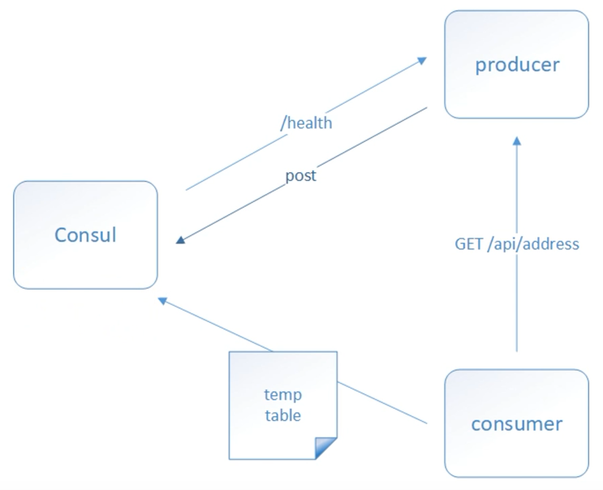


### 4.4 安装单节点

**单节点**

直接从官网下载win版。解压压缩包，只有一个consul.exe文件。到当前目录，打开cmd命令窗口启动。启动命令：

```
consul agent -dev -client=0.0.0.0

# -dev 表示开发者模式运行，还有-server表示服务模式运行
# -client=0.0.0.0表示可以使用该注册中心的ip，现在0.0.0.0表示放弃其他ip
```

此外还可以写一个bat脚本，方便运行：

```
consul agent -dev -client=0.0.0.0
pause
```

启动后访问`localhost:8500` 就可以看到注册中心

### 4.4 代码案例

1、新建一个空的maven项目，引入spring cloud依赖

```
<parent>
    <artifactId>spring-boot-starter-parent</artifactId>
    <groupId>org.springframework.boot</groupId>
    <version>2.3.12.RELEASE</version>
</parent>

<!-- 打包方式 pom -->
<packaging>pom</packaging>

<properties>
    <maven.compiler.source>11</maven.compiler.source>
    <maven.compiler.target>11</maven.compiler.target>
</properties>

<dependencyManagement>
    <dependencies>
        <dependency>
            <groupId>org.springframework.cloud</groupId>
            <artifactId>spring-cloud-dependencies</artifactId>
            <version>Hoxton.SR12</version>
            <type>pom</type>
            <scope>import</scope>
        </dependency>
    </dependencies>
</dependencyManagement>
```

2、创建子模块provider，

依赖

```
<dependencies>
    <dependency>
        <groupId>org.springframework.cloud</groupId>
        <artifactId>spring-cloud-starter-consul-discovery</artifactId>
    </dependency>
    <dependency>
        <groupId>org.springframework.boot</groupId>
        <artifactId>spring-boot-starter-actuator</artifactId>
    </dependency>
    <dependency>
        <groupId>org.springframework.boot</groupId>
        <artifactId>spring-boot-starter-web</artifactId>
    </dependency>
    <dependency>
        <groupId>org.projectlombok</groupId>
        <artifactId>lombok</artifactId>
        <scope>provided</scope>
    </dependency>
    <dependency>
        <groupId>org.springframework.boot</groupId>
        <artifactId>spring-boot-starter-test</artifactId>
        <scope>test</scope>
        <exclusions>
            <exclusion>
                <groupId>org.junit.vintage</groupId>
                <artifactId>junit-vintage-engine</artifactId>
            </exclusion>
        </exclusions>
    </dependency>
</dependencies>
```

子模块provider 配置

```
server:
  port: 8003 # 端口

spring:
  application:
    name: service-consumer # 应用名称
  cloud:
    consul:
      host: localhost   # 注册中心地址
      port: 8500
      discovery:
        register: false                                # 是否注册自己
        instance-id: ${spring.application.name}-01    # 注册实例id（必须唯一）
        service-name: ${spring.application.name}      # 服务名称
        port: ${server.port}                          # 服务端口
        prefer-ip-address: true                       # 是否使用ip注册
        ip-address: ${spring.cloud.client.ip-address} # 服务请求ip
```

子模块provider  启动类

```
@SpringBootApplication
public class AppProvider01 {
    public static void main(String[] args) {
        SpringApplication.run(AppProvider01.class, args);
    }
}
```

子模块provider的contoller

```
@RestController
@RequestMapping("/product")
public class ProductController {

    @Autowired
    private ProductService productService;

    @GetMapping("/list")
    public List<Product> selectProductList() {
    	// 造一些假的数据
        return productService.selectProductList();
    }
}
```

注意：provider和consumer都有实体类Product自己定义

3、创建消费者consumer

依赖和provider一样

配置

```
server:
  port: 8003 # 端口

spring:
  application:
    name: service-consumer # 应用名称
  cloud:
    consul:
      host: localhost   # 注册中心地址
      port: 8500
      discovery:
        register: false                                # 是否注册自己
        instance-id: ${spring.application.name}-01    # 注册实例id（必须唯一）
        service-name: ${spring.application.name}      # 服务名称
        port: ${server.port}                          # 服务端口
        prefer-ip-address: true                       # 是否使用ip注册
        ip-address: ${spring.cloud.client.ip-address} # 服务请求ip
```

启动类

```
@SpringBootApplication
public class AppConsumer01 {
    public static void main(String[] args) {
        SpringApplication.run(AppConsumer01.class, args);
    }

    // RestTemplate可以使用该模板访问Restful风格接口
    // @LoadBalanced是Ribbon的负载均衡注解
    @Bean
    @LoadBalanced
    public RestTemplate restTemplate() {
        return new RestTemplate();
    }
}
```

编写一个controller供前端访问

service这么写：（controller略）

注意：service用到了一个Order实体类，自己定义，或者直接返回Product

```
@Service
public class OrderService {

    @Autowired
    private RestTemplate restTemplate;

    Order selectOrderById(Integer id) {
        return new Order(id, "order-001", "南京江宁", 1020D, selectProductListByLoadBalancerAnnotation());
    }

    // 最主要的是这段代码
    // 使用restTemplate从provider取数据
    private List<Product> selectProductListByLoadBalancerAnnotation() {
        ResponseEntity<List<Product>> response = restTemplate.exchange(
                "http://service-provider/product/list",
                HttpMethod.GET,
                null,
                new ParameterizedTypeReference<List<Product>>() {
                });
        return response.getBody();
    }

}
```


### 4.5 集群

上面都是用`-dev`开发模式启动的consul。

consul还有server和client模式。

server模式就是集群环境，集群推荐3-5个server，更多server之间通信开销更大。

client模式是无状态的代理功能，将请求转发给server处理。一个client一般对应一个微服务节点。


##### 集群环境准备

三台Linux服务器建立三个Server；本机win10作为client端。


```
Linux安装consol并启动：

# 将zip包放到linux
mkdir /usr/local/consul
unzip xxx.zip -d /usr/local/consul/			# 解压
mkdir /usr/local/consul/data     			# 存放consul数据

# 进入目录consul，启动三个节点consul
./consul agent -server -bind=192.168.10.101 -client=0.0.0.0 -ui -bootstrap-expect=3 -data-dir=/usr/local/consul/data/ -node=server-01
./consul agent -server -bind=192.168.10.102 -client=0.0.0.0 -ui -bootstrap-expect=3 -data-dir=/usr/local/consul/data/ -node=server-02
./consul agent -server -bind=192.168.10.103 -client=0.0.0.0 -ui -bootstrap-expect=3 -data-dir=/usr/local/consul/data/ -node=server-03

# 虽然开启了，但是没有关联，现在将101当主节点，其他两台机器、以及客户端通过命令加入101
./consul join 192.168.10.101


win10客户端启动命令：(cmd窗口)
consul agent -client=0.0.0.0 -bind=192.168.10.1 -data-dir=D:\consul\data -node=client-01
consul join 192.168.10.101  (另外打开一个cmd窗口并输入加入101节点命令)
```

通过前端`l92.168.10.101:8500`可以查看各节点


##### 测试代码

创建两个provider，和前面代码都一样，配置也不用变（端口要变）！因为本机有client模式启动的consul。

创建一个consumer，和前面代码一样。

启动并访问consumer接口。

# 5 Feign

### 5.1  概念

Feign是Spring Cloud Netflix组件中的一个轻量级的Restful的HTTP服务客户端。封装了Ribbon和RestTemplate，实现了WebService的面向接口编程，进一步降低了代码的耦合度。

Feign本身并不支持Spring MVC注解，它有一套自己的注解，为了方便使用，Spring Cloud孵化了OpenFeign。

Feign是一种声明式的、模板化的HTTP客户端（仅在Consumer中使用）

Feign的使用：使用Feign的注解定义接口，调用这个接口，就可以调用服务注册中心的服务。

### 5.2 入门案例

首先，创建一个Spring Cloud工程，里面几个模块：eureka-server; provider; consumer，和Eureka服务注册中心代码一样。消费者模块可以用Feign简化代码（消费者模块仍然是Eureka的消费者）。


1、给消费者添加Feign依赖

```
<dependency>
    <groupId>org.springframework.cloud</groupId>
    <artifactId>spring-cloud-starter-openfeign</artifactId>
</dependency>
```


2、创建service接口，添加`@FeignClient`注解声明需要调用的服务（关键代码！！注意是一个接口）

```
// 声明微服务名称
@FeignClient("service-provider")
public interface ProductService {
	// 远程接口
    @GetMapping("/product/list")
    List<Product> selectProductList();
}
```


3、通过`@Autowird`就可以使用消费者接口了 （调用接口）

```
@Service
public class OrderService {

    @Autowired
    private ProductService productService;

    Order selectOrderById(Integer id) {
        return new Order(id, "order-001", "南京江宁", 1020D, productService.selectProductList());
    }
}
```


4、定义消费者controller（略，代码不变）

5、启动类添加`@EnableFeignClients`注解激活Feign组件。

```
@SpringBootApplication
@EnableFeignClients
public class ConsumerApp02 {
    public static void main(String[] args) {
        SpringApplication.run(ConsumerApp02.class, args);
    }
}
```


### 5.3  Feign负载均衡

Feign封装了Ribbon，所以负载均衡配置和Ribbon一样。

**全局负载均衡策略**

在启动类或者配置类中注入负载均衡对象，所有请求均使用该策略。

```
@Bean
public RandomRule randomRule() {
    return new RandomRule();
}
```

**局部负载均衡策略**

修改配置文件，指定服务的负载均衡策略。`服务名称.ribbon.NFLoadBalancerRuleClassName: com.xxx`

```
service-provider:
  ribbon:
    NFLoadBalancerRuleClassName: com.netflix.loadbalancer.RandomRule
```

### 5.4 Feign性能调优

#### 1. Gzip压缩

gzip: 是一种压缩的数据格式。网络数据经过压缩可以降低网络传输的字节数，加快网页加载速度。

>  客户端请求头带有`Accept-Encoding:gzip`，服务器就会将响应报文压缩，并在响应头携带`Content-Encoding:gzip`消息头，表示响应报文是根据该格式进行压缩的，客户端接受后就会按格式解压。

**局部设置**

局部表示在Consumer和Provider之间进行压缩。全局表示浏览器、Consumer和Provider三者之间均压缩。

在消费者中配置：

```
feign:
  compression:
    request:
      mime-types: text/xml,application/xml,application/json  # 配置压缩支持的 MIME TYPE
      min-request-size: 512   # 配置压缩数据的最小阈值，默认2048
      enabled: true           # 请求是否开启压缩
    response:
      enabled: true           # 响应是否开启压缩
```

**全局设置**

在消费者中配置：

```
server:
  port: 9002
  compression:
    enabled: true   # 开启全局
```


#### 2. HTTP连接池

采用http连接池，可以节约大量的3次握手4此挥手，这样能大大提升吞吐量。

Feign的HTTP客户端支持3中框架：

* HttpURLConnection是JDK自带的（默认），并不支持连接池
* HttpClient封装了HTTP请求头，参数，内容体，响应等等；不仅客户端发送HTTP请求变得容易，另外也支持连接池。
* OkHttp

1、在consumer中添加两个依赖，因为Spring Cloud版本默认集成了apache httpclient依赖，所以只需要添加一个依赖：

```
<dependency>
<groupId>io.github.openfeign</groupId>
<artifactId>feign-httpclient</artifactId>
<version>10.7.4</version>
</dependency>
<!--下面这个依赖项目中已经有了-->
<dependency>
<groupId>org.apache.httpcomponents</groupId>
<artifactId>httpclient</artifactId>
<version>4.5.11</version>
</dependency>
```

2、在consumer中配置

```
feign:
  httpclient:
    enabled: true   # 开启httpclient
```

3、在Consumer中，此时已经使用了连接池

Post请求不用变（一般用`@RequestBody() Xxx xx`接受参数）；

GET请求也可以向Post一样接受参数。

#### 3. 状态查看

浏览器发起请求，可以通过F12查看请求和响应信息。微服务之间的调用链路、状态和耗时等信息，我们需要配置日志的方式进行查看。

1、在Consumer配置日志logback.xml（和平常日志配置一样）

2、全局配置：在Consumer启动类中注入Feign的Logger对象

```
/*
    NONE: 默认，不记录
    BASIC: 记录请求方法、请求URL、状态码和用时
    HEADERS: 在BASIC基础上再记录一些常用信息
    FULL: 记录请求和响应的所有信息
 */
@Bean
public Logger.Level getLog() {
    return Logger.Level.FULL;
}
```

3、局部配置：配置Consumer的配置文件

```
feign:
  client:
    config:
      service-provider:  # "service-provider"是调用的服务的名称
        loggerLevel: FULL
```

#### 4. 请求超时

Feign负载均衡底层是Ribbon，所以请求超时配置的是Ribbon。默认情况下是1s。

全局配置：在consumer中配置

```
ribbon:
  ConnectTimeout: 5000	# 请求连接的超时时间 默认是1s
  ReadTimeout: 5000		# 请求处理的超时时间
```

局部配置：根据服务的压力大小配置不同的时间

```
service-provider:	# 服务名称
  ribbon:
    OkToRetryOnAllOperations: true  # 对所有请求进行重试
    MaxAutoRetries: 2               # 对当前实例的重试次数
    MaxAutoRetriesNextServer: 0     # 对切换实例的重试次数
    ConnectTimeout: 3000            # 请求连接超时时间
    ReadTimeout: 3000               # 请求处理超时时间
```

# 6 Hystrix服务容错

### 6.1 概念

**什么是Hystrix**

Hystrix源于Netflix团队。在分布式环境中，服务请求失败会导致雪崩效应。Hystrix是一个库，可以添加等待时间容限和容错逻辑来帮助您控制这些服务之间的交互。Hystrix通过隔离服务之间的访问点，停止服务之间的级联故障并提供后被选项来实现此目的，从而提高系统稳定性。

**雪崩效应**

服务和服务之间的依赖性，故障会传播，造成连锁反应。一个服务不可用，导致一系列服务不可用，这就是雪崩效应。造成雪崩原因有三点：

* 服务提供者不可用（硬件故障、程序Bug、缓存击穿、用户大量请求等）
* 重试加大流量（用户重试，阻塞）
* 服务消费者不可用（同步等待造成的资源耗尽）。

**解决方案**

* 请求缓存：支持一个请求与返回结果做缓存处理；
* 请求合并：将相同的请求进行合并，然后调用批处理接口；
* 服务隔离：限制调用分布式服务的资源，某一个服务不可用，不影响其他服务；
* 服务熔断：牺牲局部服务，保全整体系统稳定性；（停止使用该接口）
* 服务降级：服务熔断后，客户端调用本地方法返回缺省值。（通常配合服务熔断、服务隔离等一起使用）

### 6.2 环境

和Eureka环境一样。两个Eureka Server, 一个生产者，一个消费者。

### 6.3 模拟高并发环境

从官网下载apache jmeter

修改bin/jmeter.properties

```
# 教程使用版本5.2.1
# 语言
language=zh_CN
# 编码
sampleresult.default.encoding=UTF-8
```

点击 jmeter.bat启动，是一个窗口。可以添加多个线程、多个请求、同时访问某个端口。

### 6.4 请求缓存

Hystrix自带缓存的缺点：

* 本地缓存，集群不能同步
* 不支持第三方缓存容器，如Redis

本文使用Spring的缓存集成Redis的方案。

在消费者客户端添加依赖

```
<dependency>
    <groupId>org.springframework.boot</groupId>
    <artifactId>spring-boot-starter-data-redis</artifactId>
</dependency>
<dependency>
    <groupId>org.apache.commons</groupId>
    <artifactId>commons-pool2</artifactId>
</dependency>
```

application.properties配置

```
spring:
  application:
    name: service-consumer
  redis:
    timeout: 10000 # 连接超时时间
    host: 192.168.0.111 # 本地的redis要启动
    port: 6379
    database: 0
    lettuce:
      pool:
        max-active: 1024 # 
        max-wait: 10000 # 最大连接阻塞等待时间
        max-idle: 200 # 最大空闲连接
        min-idle: 5
```

启动类添加注解

```
// 开启缓存
@EnableCaching
@SpringBootApplication
@EnableFeignClients
public class ConsumerApp1 {
    public static void main(String[] args) {
        SpringApplication.run(ConsumerApp1.class, args);
    }
}
```

ProductService接口中添加缓存注解

```
@FeignClient("service-provider")
public interface ProductService {

    @Cacheable(cacheNames = "orderService:product:list")
    @GetMapping("/product/list")
    List<Product> selectProductList();

    @Cacheable(cacheNames = "orderService:product:single", key = "#id")
    @GetMapping("/product/{id}")
    List<Product> selectProduct(@PathVariable("id") Integer id);
}
```

启动各个项目，方可实现缓存。此时再打开Jmeter，高并发测试。

### 6.5 请求合并

线程池的资源也是有限的。在高并发情况下，通信次数增加，大量的线程处于等待状态，进而响应延迟。为了解决该问题，Hystrix将请求合并。

请求合并的缺点：

本来一个请求5ms搞定，如果此时使用了请求合并，还要等待10ms等待其他请求。但是，这点时间还是微不足道的。


导入依赖

```
<dependency>
    <groupId>org.springframework.cloud</groupId>
    <artifactId>spring-cloud-starter-netflix-hystrix</artifactId>
</dependency>
```

在消费者的业务逻辑OrderService中添加

```
// 支持请求合并的注解
@HystrixCommand
List<Order> selectOrderByIdList(List<Integer> ids) {
    System.out.println("---------orderService: selectOrderByIdList----------------");
    List<Order> orders = new ArrayList<>();
    for (Integer id : ids) {
        Order order = selectOrderById(id);
        orders.add(order);
    }
    return orders;
}

@HystrixCollapser(batchMethod = "selectOrderByIdList",     // 合并请求去调用该方法
        scope = com.netflix.hystrix.HystrixCollapser.Scope.GLOBAL,
        collapserProperties = {
        		// 合并最大时间5000ms，（为了让效果明显）
                @HystrixProperty(name = "timerDelayInMilliseconds", value = "5000"),
                // 合并最大数量
                @HystrixProperty(name = "maxRequestsInBatch", value = "200")
        })
// 调用这个方法，这个方法不执行。实际去执行selectOrderByIdList。
public Order selectOrderListByMergeRequest(Integer id) {
    System.out.println("---------orderService: selectOrderListByMergeRequest----------");
    return null;
}
```

在Controller层调用

```
@GetMapping("/{id}")
public Order selectOrderById(@PathVariable("id") Integer id) {
    return orderService.selectOrderListByMergeRequest(id);
}
```

在启动类添加注解

```
@EnableHystrix
```

启动，在前端打开两个页面，同时刷新。在5s过后返回结果。并且后端显示，只走selectOrderByIdList方法。

```
http://localhost:9001/order/2
http://localhost:9001/order/1
```

### 6.6 服务隔离

线程都运行在`ThreadPool`中，当资源被耗尽时，可能会引发雪崩。

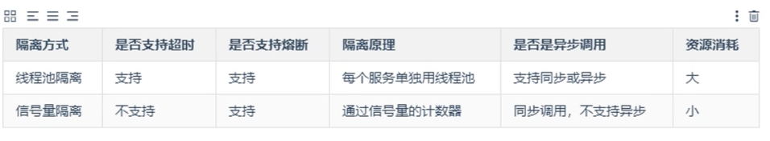

#### 1. 线程池隔离

线程不多时，可以使用线程池隔离；多时，用信号量隔离。

请求并发大，耗时长，用线程池隔离；请求并发大，耗时短，响应快，用信号量隔离。


代码：就是在Service方法上面添加注解。

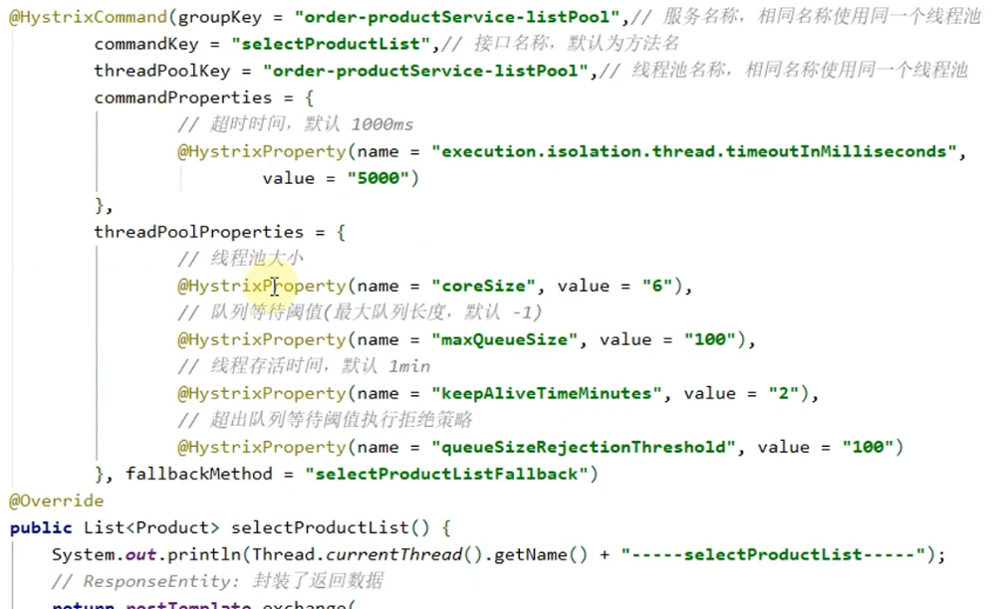


#### 2. 信号量隔离

信号量数量有限，每个请求都需要拿到一个信号量，如果拿不到，请求阻塞。所以，该方法无法对访问做超时，即不支持异步。信号量隔离不用于网络请求（易阻塞），通常用于本地资源处理。（线程池隔离，是异步处理。）


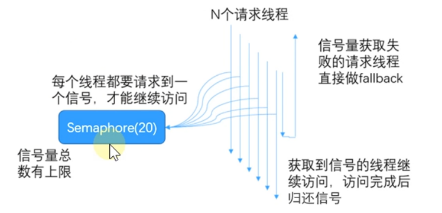


代码：在方法上加注解


### 6.7 服务熔断

服务熔断，也称过载保护，是为了防止整个系统故障。

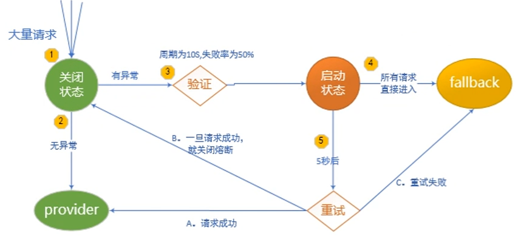

代码：也是在业务层添加注解

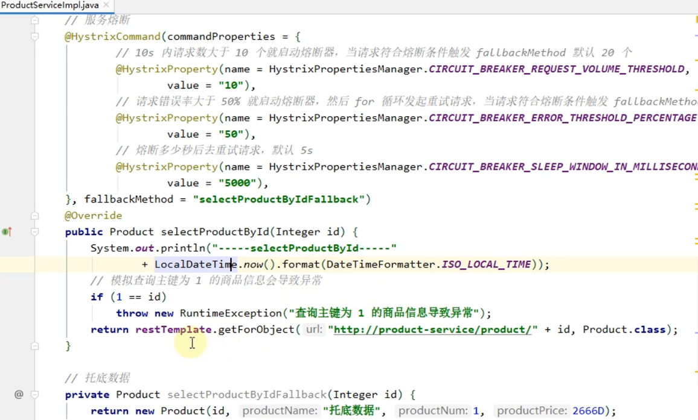


### 6.8 服务降级

服务降级：返回缺省值

触发条件：

* 方法抛出非`HystrixBadRequestException`异常；
* 方法调用超时；
* 熔断器开启拦截调用；
* 线程池/队列/信号量跑满。

代码：

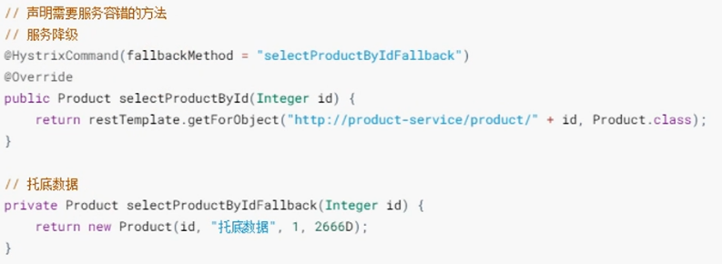


### 6.9 Feign雪崩处理

创建一个OpenFeign的消费者客户端（已经包含了Hystrix依赖）。

需要在application.properties配置文件中开启Hystrix

```
feign:
  hystrix:
    enabled: true
```

在业务层，添加服务降级类

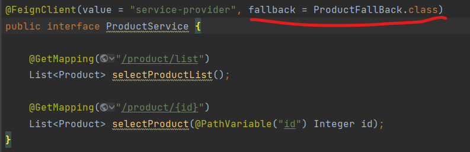

编写服务降级类（实现ProductService接口）

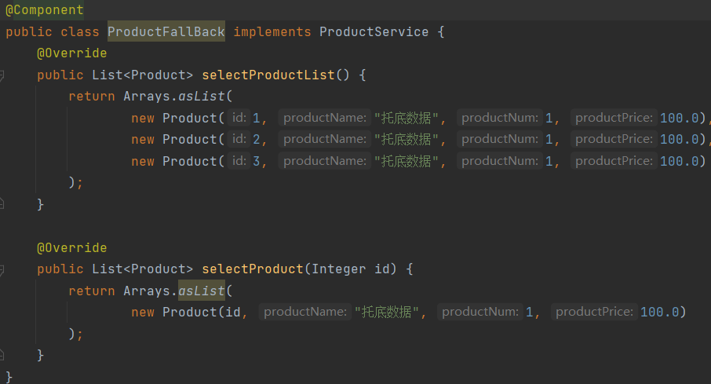

关闭生产者，前端访问。


### 6.9 Feign服务异常信息捕获

将上面的ProductServiceFallBack类替换成以下代码

```
@Component
public class ProductServiceFallBackFactory implements FallbackFactory<ProductService> {

    Logger logger = LoggerFactory.getLogger(ProductServiceFallBackFactory.class);

    @Override
    public ProductService create(Throwable throwable) {
        return new ProductService() {
            @Override
            public List<Product> selectProductList() {
                logger.error("xxx");
                return Arrays.asList(
                        new Product(1, "托底数据", 1, 100.0),
                        new Product(2, "托底数据", 1, 100.0),
                        new Product(3, "托底数据", 1, 100.0)
                );
            }

            @Override
            public List<Product> selectProduct(Integer id) {
                logger.error("xxx");
                return Arrays.asList(
                        new Product(id, "托底数据", 1, 100.0)
                );
            }
        };
    }
}
```

将注解改成：

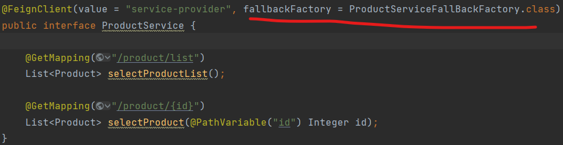

 

# 7. Hystrix服务监控

actuator是spring boot监控平台，但是全是数据，不方便看。

dashboard有图表，但是只是一个链接、节点的数据，只能打开一张表。

turbine可以同时查看多个图表。

### 7.1 Actuator

（本文测试不能用）

在需要开启数据监控的项目中添加Actuator依赖（本项目在消费者中添加）

```
<dependency>
    <groupId>org.springframework.boot</groupId>
    <artifactId>spring-boot-starter-actuator</artifactId>
</dependency>
```

在配置文件中开启hystrix.stream端点。如果希望所有端点暴露，配置为

```
# 度量指标监控与健康姜茶
management:
  endpoints:
    web:
      exposure:
        include: hystrix.stream
```

前端访问（实际测试不能用，还有其他问题）

```
http://localhost:9001/actuator
http://localhost:9001/actuator/hystrix.stream
```


### 7.2 监控中心DashBoard

Hystrix提供了一套可视化系统Hystrix-DashBoard。

(本文测试不能用)

添加依赖

```
<dependency>
    <groupId>org.springframework.boot</groupId>
    <artifactId>spring-boot-starter-actuator</artifactId>
</dependency>
<dependency>
    <groupId>org.springframework.boot</groupId>
    <artifactId>spring-cloud-starter-netflix-hystrix</artifactId>
</dependency>
<dependency>
    <groupId>org.springframework.boot</groupId>
    <artifactId>spring-cloud-starter-netflix-hystrix-dashboard</artifactId>
</dependency>
```

启动类添加注解

```
@EnableHystrixDashBoard
```

前端访问（或者点击控制台链接）

```
localhost:9001/hystrix
```

### 7.3 聚合监控 Turbine

（因为前面两个没成功，这里具体操作略）

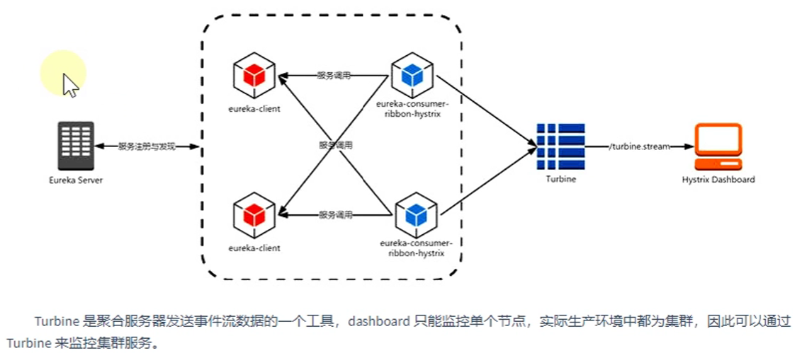


# 8. Sentinel服务哨兵

Netflix许多产品（Hystrix）不再更新，我们要考虑可替代产品。Alibaba Sentinel是一款高性能、轻量级的流量控制、熔断降级产品。

Sentinel分为两部分：

* 核心库（Java客户端）不依赖任何框架，能使运行于Java7及以上的所有运行时环境，同时对Dubbo / Spring Cloud等框架也有较好的支持。
* 控制台（Dashboard）基于Spring Boot开发，打包后可以执行运行。主要负责管理推送规则、监控、集群限流分配管理、机器发现等。

Hystrix和Sentinel:

Hystrix的关注点在于隔离和熔断为主的容错机制，并可提供fallback机制。

Sentinel：多样化的流量控制、熔断降级、系统负载保护、实时监控和控制台。


### 8.1 Sentinel控制台

从官网下载sentinel控制台

```
https://github.com/alibaba/Sentinel/wiki/%E6%8E%A7%E5%88%B6%E5%8F%B0
```

启动命令

```
java -Dserver.port=8080 -Dcsp.sentinel.dashboard.server=localhost:8080 -Dproject.name=sentinel-dashboard -jar sentinel-dashboard.jar
```

从 Sentinel 1.6.0 起，Sentinel 控制台引入基本的**登录**功能，默认用户名和密码都是 `sentinel`。

为了方便启动，编写一个启动脚本：`run.bat`

```
java -Dserver.port=8080 -Dcsp.sentinel.dashboard.server=localhost:8080 -Dproject.name=sentinel-dashboard -jar sentinel-dashboard-1.8.4.jar
pause
```

### 8.2 环境准备

eureka注册中心2个（集群）

provider生产者一个

consumer消费者一个（基于Feign）

### 8.3 客户端接入控制台

控制台启动，客户端需要按照以下步骤接入到控制台：

1. 添加依赖和配置
2. 定义资源。资源是指java服务、java接口、java方法等
3. 定义规则

#### 添加依赖和配置

父工程添加依赖

```
<dependency>
    <groupId>com.alibaba.cloud</groupId>
    <artifactId>spring-cloud-alibaba-dependencies</artifactId>
    <version>2021.0.1.0</version>
    <type>pom</type>
    <scope>import</scope>
</dependency>
```

子工程（Consumer）添加依赖

```
<dependency>
    <groupId>com.alibaba.cloud</groupId>
    <artifactId>spring-cloud-starter-alibaba-sentinel</artifactId>
</dependency>
```

子工程添加配置application.yaml

```
spring:
  application:
    name: service-consumer
  cloud:
    sentinel:
      transport:
        port: 8719
        dashboard: localhost:8080
```

启动项目，启动sentinel，多发送几次请求，刷新sentinel，可以看到许多信息。

#### 定义资源

Sentinel提供了`@SentinelResource`注解用于定义资源。

在接口上定义资源

```
@GetMapping("/{id}")
@SentinelResource(value = "getOrderById",                   // 资源名称
                blockHandler = "getOrderByIdBlockHandler",  // 流量控制
                fallback = "getOrderByIdFallback")          // 熔断降级
public Order selectOrderById(@PathVariable("id") Integer id) {
    return orderService.selectOrderById(id);
}

// 服务流量控制处理
public Order getOrderByIdBlockHandler(Integer id, BlockException e) {
    e.printStackTrace();
    return new Order();
}

// 服务熔断降级处理
public Order getOrderByIdFallback(Integer id, Throwable throwable) {
    System.out.println("order/{id}方法异常：" + throwable);
    return new Order();
}
```

#### 定义规则

sentinel的所有规则都可以在内容态中动态地查询及修改，修改之后立即生效。同时，Sentinel也支持自定义规则。

sentinel支持以下几种规则：**流量控制规则**、**熔断降级规则**、**系统保护规则**、**来源访问控制规则** 和 **热点参数规则**。

**流量控制规则：**


**熔断降级规则：**

在代码里面写一个错误的代码，然后配置熔断降级规则，就可以了。

#### 文件配置规则

动态规则扩展：以上规则存在内存中，重启会失效。SentinelProperties内部提供了TreeMap类型的datasource属性用于配置数据源信息，支持：文件配置规则、Nacos配置规则、Zookeeper配置规则、Apollo配置规则、Redis配置规则。

文件配置规则：

在application.yaml中配置如下

```
spring:
  application:
    name: service-consumer
  cloud:
    sentinel:
      transport:
        port: 8719
        dashboard: localhost:8080
      datasource:
        ds1:
          file:
            file: classpath:flowRule.json
            data-type: json
            rule-type: flow
```

在resource下新建flowRule.json

```
[
  {
    "resource": "getOrderById",
    "count": 1,
    "grade": 1,
    "limitApp": "default",
    "strategy": 0,
    "controlBehavior": 0
  }
]
```

重启项目，快速发几次请求，发现有流量控制，并且在sentinel控制台有流量控制规则。

### 8.4 对OpenFeign的支持

> 这一节代码没有调试通，但不影响学习

在调用其他服务/接口时，常用到RestTemplate或者OpenFeign，Sentinel对这两者均支持。

不管是Hystrix还是Sentinel，代码都差不多，只要修改依赖和配置即可。

依赖、配置略（和上面代码一样）

新配置

```
feign:
  sentinel:
    enabled: true
```

添加类ProductServiceFallbackFactory

```
public class ProductServiceFallbackFactory implements FallbackFactory<ProductService> {
    Logger logger = LoggerFactory.getLogger(ProductServiceFallbackFactory.class);
    @Override
    public ProductService create(Throwable throwable) {
        return new ProductService() {
            @Override
            public List<Product> selectProductList() {
                logger.error("服务异常");
                return Arrays.asList(new Product());
            }

            @Override
            public List<Product> selectProduct(Integer id) {
                logger.error("服务异常");
                return Arrays.asList(new Product());
            }
        };
    }
}
```

在ProductService上添加注解

```
@FeignClient(value = "service-provider", fallbackFactory = ProductServiceFallbackFactory.class)
```

启动项目，当发生熔断时，会进入自定义的方法中。

# 9. Zuul网关


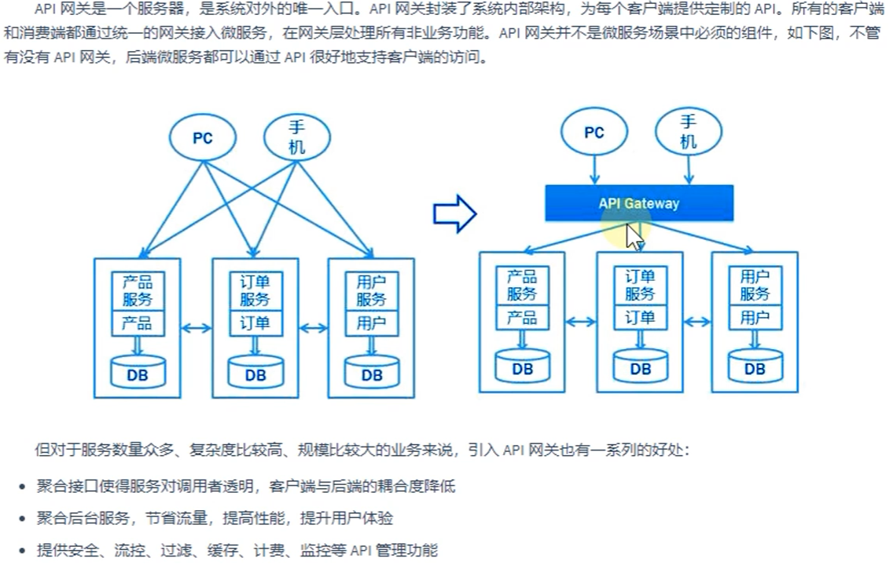


网关应当具备以下功能：

性能：API高可用，负载均衡，容错机制。

安全：权限身份认证、后端签名、黑名单。

日志：日志记录，保证全链路追踪。

缓存：数据缓存。

监控：性能监控。

限流：流量控制，错峰流控。

灰度：线上灰度部署，减小风险。

路由：动态路由规则。


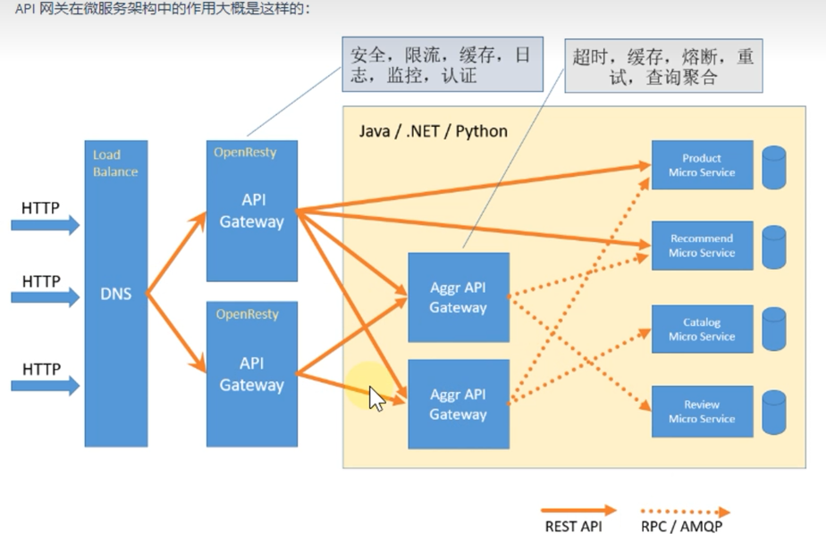

### 9.1 常用网关解决方案

**Nginx+Lua**

Nginx一方面可以做反向代理，另外一方面可以做静态资源服务器。

Nginx是C语言开发。Zuul是Java语言开发。

Nginx服务器端实现负载均衡。Zuul是靠Ribbon+Eureka本地负载均衡。

Nginx可以整合一些脚本语言（Nginx+Lua）。Zuul不可以。

Nginx是一个高性能的HTTP和反向代理服务器，也是一个IMAP/POP3/SMIP服务器。Zuul是Spring Cloud Netflix中的开源的一个应用，相当于所有应用程序后端的所有请求的前门。

>Nginx适合做门户网关，整个全局的网关，处于最外层。
>
>Zuul属于业务网关，主要来应对不同的客户端提供服务，聚合业务。
>
>Zuul可以实现熔断、重试等功能，Nginx不具备。

**Kong**

本身基于Nginx+lua的。

优点：提供了大量插件来扩展应用。

缺点：商业付费；没办法整合Spring Could。

**Traefik**

HTTP反向代理、负载均衡工具。支持多种后台来自动化、动态的应用它的配置文件设置。

相对Spring Cloud，更适合Kubernetes.

**Spring Cloud Netflix Zuul**

结合Spring Cloud提供的服务治理体系，可以做到请求转发、根据配置后者默认路由规则进行路由和负载均衡，无缝集成Hystrix。

缺点：Zuul1.0版本是基于单线程的接受请求和转发处理，是阻塞IO，不支持长连接。（2.0支持异步）

目前来看用的比较少，因为Spring Cloud推出了自己的Spring Cloud Gateway。

**Spring Cloud Gateway**

目标是替代Zuul，支持异步。

### 9.2 环境准备

两个eureka注册中心

一个producer-service

一个consumer-service

### 9.3 Zuul实现API网关

#### 创建子模块

创建一个子模块`Gateway-zuul-9100`

添加依赖

```
<dependency>
    <groupId>org.springframework.cloud</groupId>
    <artifactId>spring-cloud-starter-netflix-zuul</artifactId>
</dependency>
```

添加配置application.properties

```
server.port=9100
spring.application.name=gateway-zuul-9100
```

添加启动类

```
@SpringBootApplication
@EnableZuulProxy
public class GatewayZuul1 {
    public static void main(String[] args) {
        SpringApplication.run(GatewayZuul1.class, args);
    }
}
```

#### 配置路由规则

配置路由规则（application.properties）

**1. URL路由**

* `?` 表示任意单个字符
* `*` 表示任意字符，不包括子路径
* `**` 表示任务字符，包括所有子路径

```
# service-consumer是实际微服务名称
zuul.routes.service-consumer.path=/consumer/**          # 请求映射路径
zuul.routes.service-consumer.url=http://localhost:9001  # 实际微服务地址
```

在浏览器中访问`localhost:9100/consumer/order/1`，可以访问到微服务。

**2  服务名称路由**

如果项目中有许多微服务，url路由不方便（需要记录每个微服务ip和port）

Zuul支持与Eureka整合，根据serviceId自动从注册中心获取服务地址并转发请求。

添加Eureka Client依赖

```
<dependency>
	<groupId>org.springframework.cloud</groupId>
	<artifactId>spring-cloud-starter-netflix-eureka-client</artifactId>
</dependency>
```

添加配置：eureka地址、服务名称路由

```
zuul:
  routes:
    service-consumer:
      path: /consumer/**          # 请求映射路径
      serviceId: service-consumer  # 服务名称路由
eureka:
  instance:
    prefer-ip-address: true   # 使用ip地址注册
    instance-id: ${spring.cloud.client.ip-address}:${server.port}
  client:
    serviceUrl:              # 注册中心集群地址
      defaultZone: http://localhost:8761/eureka/,http://localhost:8762/eureka/
```

**3  简化路由规则（默认）**

只需要配置path对应微服务名称即可。会自动从eureka中注册的服务映射。

```
zuul:
  routes:
    service-consumer:
      path: /service-consumer/**          # 请求映射路径
```

浏览器访问`localhost:/9100/service-consumer/order/1`

#### 路由排除

URL路由排除

```
zuul:
  routes:
    ignored-patterns: /**/order/**        # 排除所有包含order的请求
    service-consumer:
      path: /service-consumer/**          # 请求映射路径
```

服务名称排除

```
zuul:
  routes:
    ignored-services: service-provider        # 多个用，号
```

#### 路由前缀

在所有访问前加上前缀`localhost:/9100/api/service-consumer/order/1`

```
zuul:
  prefix: /api
```

### 9.4 网关过滤器

Zuul包含路由和过滤两个核心功能。实际上路由也是通过过滤完成。

过滤器类型：pre、routing、post、error 共四个类型。

pre: 身份认证、选路由、请求日志；

routing: 转发

post: 对响应添加HTTP头、收集统计和度量指标、将响应以流的方式返回。

error：上述阶段出错。


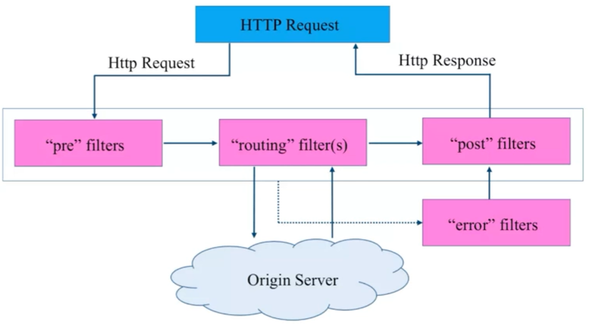

实现过滤器必须实现四个方法：过滤器类型、执行顺序、判断条件、动作。

实现一个简单的输出：

```
@Component
public class CustomFilter extends ZuulFilter {

    @Override
    public String filterType() {
        return "pre";
    }

    @Override
    public int filterOrder() {
        return 0;
    }

    @Override
    public boolean shouldFilter() {
        return true;
    }

    @Override
    public Object run() throws ZuulException {
        RequestContext rc = RequestContext.getCurrentContext();
        HttpServletRequest request = rc.getRequest();
        System.out.println(request.getMethod());
        System.out.println(request.getRequestURL().toString());
        return null;
    }
}
```

### 9.5 Zuul和Hystrix无缝整合

Zuul的依赖包含Hystrix依赖，但是没有提供监控面板的界面提示，需要添加dashboard依赖。

这一章依赖有问题，没成功。和Hystrix服务监控那一章估计是同样的问题。

**zuul可以做什么：**

* 网关监控
* 网关熔断：发生错误时，返回特定内容。（定义一个FallBack类，返回指定的错误内容）
* 网关限流：如微博热点等，防止突然请求过过。
* 网关调优：

**限流算法：**

计数器算法：如果counter在1分钟内限制100次访问。

漏桶算法：桶里水的流出速度是不变的，桶大小是不变的，流入速度不管，流入过多，则丢弃；

令牌桶算法：对漏桶算法的改进。漏桶是保护他人，令牌桶是保护自己。

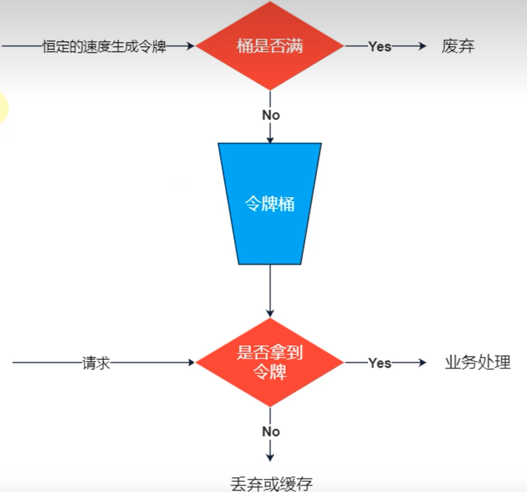


### 9.6 Zuul和Sentinel整合

具体操作去看Sentinel官网吧，实际实现时，代码也有点问题。

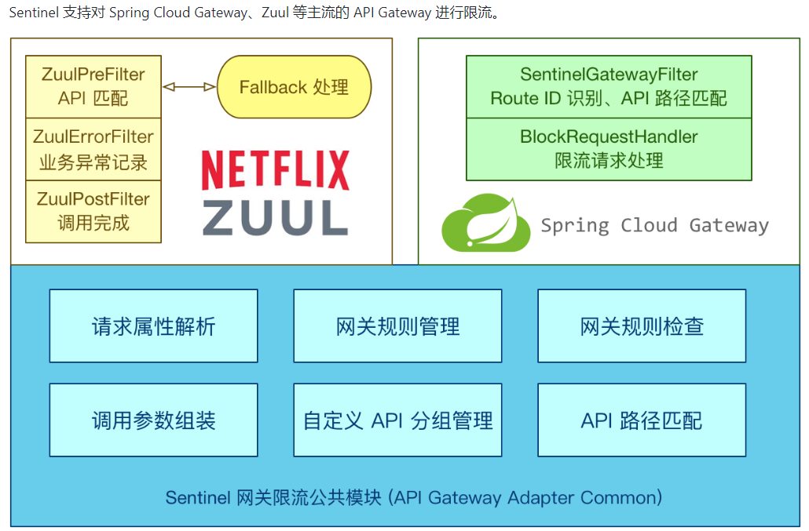


### 9.7 高可用网关

业内通常用多少个9来衡量网站的可用性，例如qq是4个9，表示一年99.99%的时间是可用的，一年最多53分钟不可用。

2个9表示基本可用，3个9表示高可用，4个9是拥有自动恢复能力的高可用。

实现高可用的手段是**数据的冗余备份**和**服务的失效转移**，具体怎么做？在网关里主要有以下几个方面：

* 集群部署
* 负载均衡
* 健康检查
* 节点自动重启
* 熔断
* 服务降级
* 接口重试

Nginx+网关实现高可用网关：

一个请求过来，先经过Nginx负载，到达网关（网关集群）。网关再负载到后端，如果有问题，网关会进行重试；如果重试多次仍失败，可以熔断、服务降级。

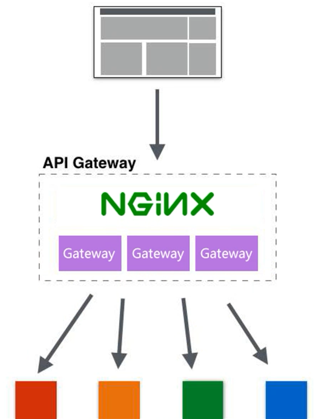

# 10. Gateway网关

Spring Cloud Netflix Zuul1.0版本是阻塞的，不支持长连接。虽然2.0支持了。但是Spring Cloud已经集成了Spring Cloud Gateway。

### 10.1 Gateway核心概念

路由：包括ID URI predicates filters

Predicates断言：如果请求路径能够配置得上，那么断言为真，然后开始路由，路由到URI。

### 10.2 创建网关服务

创建子模块并引入依赖

 创建启动类

添加配置