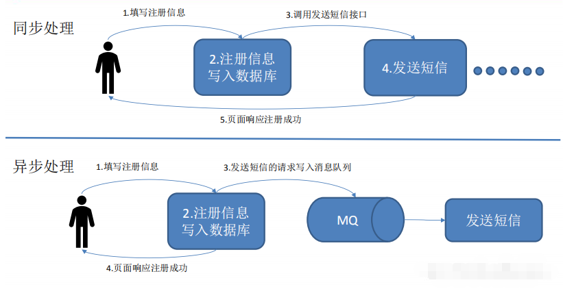
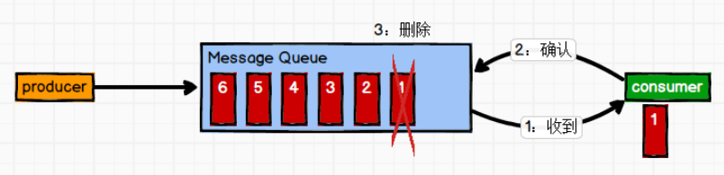
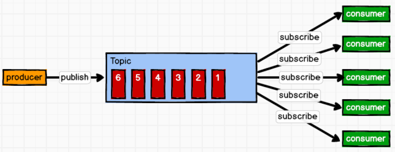
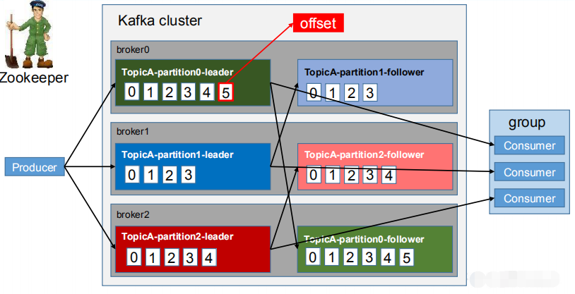
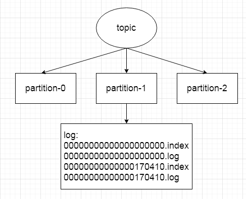
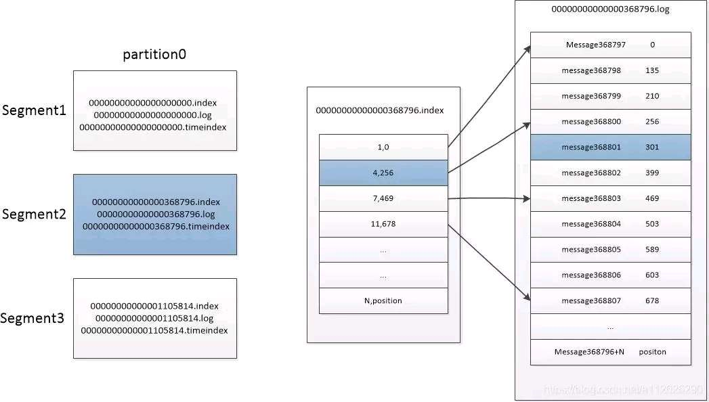
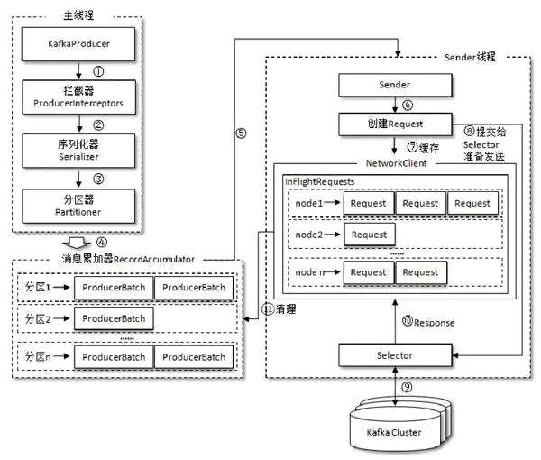
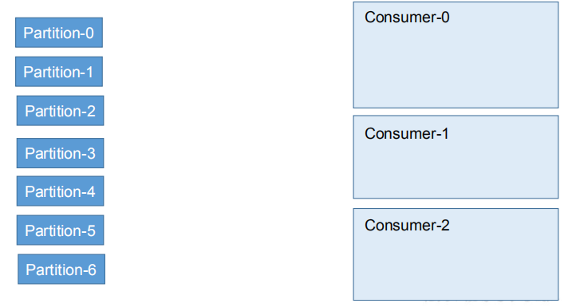
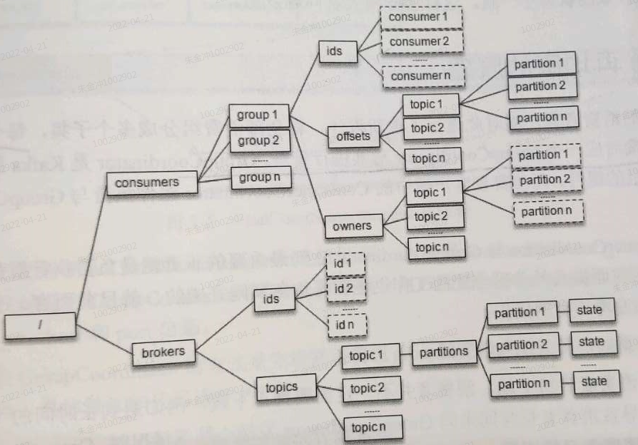
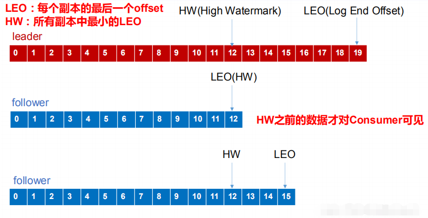

# 第一章 概述

## 定义

Kafka 是一个分布式的基于 **发布/订阅模式** 的 **消息队列**（Message Queue），主要应用于大数据实时处理领域。

## 消息队列



消息队列的有点：

1）解耦

允许你独立的扩展或修改两边的处理过程，只要确保它们遵守同样的接口约束。

2）可恢复性

系统的一部分组件失效时，不会影响到整个系统。消息队列降低了进程间的耦合度，所以即使一个处理消息的进程挂掉，加入队列中的消息仍然可以在系统恢复后被处理。

3）缓冲

有助于控制和优化数据流经过系统的速度，解决生产消息和消费消息的处理速度不一致的情况。

4）灵活性 & 峰值处理能力

在访问量剧增的情况下，应用仍然需要继续发挥作用，但是这样的突发流量并不常见。如果为以能处理这类峰值访问为标准来投入资源随时待命无疑是巨大的浪费。使用消息队列能够使关键组件顶住突发的访问压力，而不会因为突发的超负荷的请求而完全崩溃。

5）异步通信

很多时候，用户不想也不需要立即处理消息。消息队列提供了异步处理机制，允许用户把一个消息放入队列，但并不立即处理它。想向列中放入多少消息就放多少，然后在需要的时候再去处理它们。

## 消息队列的两种模式

**点对点模式**（一对一，消费者主动拉取数据，消息收到后消息清除）



**发布/订阅模式**（一对多，消费者消费数据之后不会清除消息）



## 基本概念

**kafka简单示意图**



**Broker**

一个kafka节点就是一个broker，一个或多个broker就是一个kafka集群

**Producer / Consumer**

Producer向Broker发送消息，数据会被不断追加到log 文件末端，且每条数据都有自己的 offset。
Consumer从Broker读取消息，并记录自己的offset+1，以方便下次从offset+1继续读取消息。

**Consumer Group**

每个Consuemr属于一个特定的Group，一条消息可以被不同的Group消费，但是一个Group中只能有一个Consumer消费该消息。

消费者组是逻辑上的概念，默认空字符串，需要consumer自己指定。

**Topic主题**

逻辑上的概念，发布到kafka的消息都需要指定一个topic；topic存放在一个或多个broker上。

**Partition分区**

逻辑/物理上的概念，一个Topic中的数据分割成一个或多个Partition，每个Partition内部消息都是有序的。

* 每个partition对应一个log文件，生产者不断追加数据，每条数据都有自己的offset。
* 如果一个topic有多个partition，那么消费topic，不能保证数据的顺序。

为什么要分区？

* 方便在集群中扩展：每个 Partition 可以通过调整以适应它所在的机器，而一个 topic又可以有多个 Partition 组成，因此整个集群就可以适应任意大小的数据了；
* 可以提高并发：因为可以以 Partition 为单位读写了。





**log日志文件**

数据实际存储的文件，log和partition一一对应，为了防止log过大，log建成了一个文件夹，里面是有序的logSegment文件。

log日志什么时候分割：

* .log文件达到1G（可以配置参数log.segment.bytes，默认1G）
* .log过期，默认7天（log.roll.ms或者log.roll.hours，默认7天）
* .index偏移量索引文件达到10M （index稀疏索引，log.index.size.max.bytes，默认10M）
* .index偏移量索引文件里面存储的相对索引达到最大值Integer.MAX_VALUE

topic数据如何存到partition（多个partition）：

* 如果指定了partition，直接存；
* 如果未指定，但是指定了key，通过对key进行hash，选出一个partittion；
* 如果都未指定，轮询选择partition；

Borker和Partition关系：

* 如果有N个borker，某个topic有N个partition，那么broker和partition一对一。
* 如果有N+M个borker，某个topic有N个partition，那么多余的broker不存数据。
* 应该避免partition>borker情况，否则一个borker存多个partition。

**replication / Leader / Follower**

每个partition有多个副本（replicatioin），其中一个是Leader，其他是Follower。生产者和消费者只与leader交互，而follower只负责消息同步。

* 所有请求通过leader，leader广播给follower。
* 如果leader挂掉，从follower中选一个新的leader。
* 如果follower挂掉，leader把这个follower从ISR列表中删除，重新创建一个。

**AR / ISR / OSR**

所有副本统称为AR Assigned Replicas

与leader副本保持同步的副本统称为ISR In-Sync Replicas

和leader副本的不同步的副本统称为OSR Out-of-Sync Replicas

## kafka安装和运行

### 下载

下载Linux版本，解压即可（依赖JDK1.8以上，所以需要安装好JDK1.8）

kafka用到了zookeeper，先启动Zookeeper，再启动kafka。

kafka2.8版本不再使用zookeeper，内嵌了一个算法/协议，实现zookeeper类似功能。

### 启动Zookeeper

**单机：**

1、复制配置`cp conf/zoo_sample.cfg conf/zoo.cfg`

2、修改配置

```
# 数据目录
dataDir=/tmp/zookeeper/data
# 日志目录
dataLogDir=/tmp/zookeeper/log
# 对外端口
clientPort=2181
```

3、在数据目录下创建一个myid文件，并写入服务器的编号0。（myid文件里面只写一个0）

4、启动`sh bin/zkServer.sh start`

5、查看启动状态`sh bin/zkServer.sh status`

**集群：**

1、每个机器安装zookeeper，并修改myid编号、clientPort端口号、目录地址

2、在zoo.cfg中添加集群的编号、IP、端口

* 第一个端口表示服务器与leader服务器交换信息的端口（和`clientPort`端口不是一个）
* 第二个端口表示选举leader时服务器互相通信的端口

```# 
# 单机模拟集群如下
server.0=192.168.0.11:2887:3887
server.1=192.168.0.11:2888:3888
server.2=192.168.0.11:2889:3889
# 正常的多机集群如下
server.0=192.168.0.11:2888:3888
server.1=192.168.0.12:2888:3888
server.2=192.168.0.13:2888:3888
```

### Zookeeper启动错误

启动成功了，但是查看状态是`Error contacting service. It is probably not running.`

```
- 查看bin下有没有zookeeper.out文件，里面有错误日志。
- 用命令启动（显示报错信息）sh zkServer.sh start-foreground
```

报错：`AdminServerException: 8080端口占用`

```
原因：zookeeper新版本内嵌了netty做控制台服务。
三种解决方法：
	1. 在配置中修改端口admin.serverPort=xxxx
	2. 删除jetty
	3. 在启动脚本中停用该服务。添加'-Dzookeeper.admin.enableServer=false'
```

### 启动Kafka

修改配置`vim conf/server.properties`

```
# broker编号
broker.id=0
# 对外端口
# advertised.listeners=PLAINTEXT://xxx.xxx.xxx.xxx:9092
# 当使用同一局域网时，用ip
listeners=PLAINTEST://192.168.41.213:9092
# 存放日志文件地址
log.dirs=/tmp/kafka-logs
# zookeeper集群地址，逗号分割
zookeeper.connect=localhost:2181
```

启动

```
 sh bin/kafka-server-start.sh config/server.properties
```

查看是否启动成功

```
# 是否有kafka.Kafka
jps -l
```

kafka集群只需要修改配置 id、对外端口、日志地址，其他不用变。


## 发送和读取消息

创建一个叫`test`的topic

```
sh bin/kafka-topics.sh --create --zookeeper localhost:2181 --replication-factor 1 --partitions 1 --topic test
```

查看创建的topic列表

```
sh kafka-topics.sh --zookeeper localhost:21811 --list				# 旧版
sh kafka-topics.sh --bootstrap-server 192.168.41.213:9000 --list	# 新版
```

查看topic更多信息

```
sh bin/kafka-topics.sh --zookeeper localhost:2181 --describe --topic test
```

启动produces控制台，在控制台发送消息

```
# 启动produces控制台
# sh bin/kafka-console-producer.sh --broker-list localhost:9092 --topic test
sh bin/kafka-console-producer.sh --broker-list 192.168.41.213:9092 --topic test
# 发送消息
This is a messageThis is another message
```

关闭发送控制台（`ctrl+c`），启动consumer控制台，读取消息

```
sh bin/kafka-console-consumer.sh --zookeeper localhost:2181 --topic test --from-beginning
# 版本不一样，下面命令也是
# sh bin/kafka-console-consumer.sh --bootstrap-server localhost:9092 --topic test --from-beginning
sh bin/kafka-console-consumer.sh --bootstrap-server 192.168.41.213:9092 --topic test
```

## 参数总结

server.properties中的参数

```
# zookeeper集群地址
zookeeper.connect=localhost:2181,localhost:2182

# kafka集群内的broker的唯一标识，从0开始设置
broker.id=0

# 本机ip和端口，用于客户端连接（局域网内）
listeners=PLAINTEXT://192.168.41.213:9092

# 供外网客户端使用，即公网IP
# advertised.listeners=PLAINTEXT://xxx.xxx.xxx.xxx:9092

# 日志存放地址，优先级高于配置log.dir
log.dirs=/home/data/kafka-logs

# broker所能接受的最大参数
message.max.bytes=1000012 # 默认越976.6KB
```

# 第二章 生产者

消息发送需要按顺序经过：拦截器、序列化器、分区器。

topic数据如何存到partition（多个partition），默认分区器这么做的：

* 如果指定了partition，直接存；
* 如果未指定，但是指定了key，通过对key进行hash，选出一个partittion；
* 如果都未指定，轮询选择partition；

生产者客户端有两个线程：主线程和Sender线程。

* 主线程：由KafkaProducer创建消息，通过拦截器、序列化器、分区器后缓存到消息累加器RecordAccumulator中。
    * 消息累加器为每个分区提供了一个双端队列`Deuqe<ProducerBatch>`。
    * ProducerBatch包含一个或多个ProducerRecord。
* Sender线程：从RecordAccumulator中获取消息并发送到Kafka。
    * 该线程将消息处理为`<Node, List<ProducerBatch>>`的形式，Node表示集群节点。
    * 进一步转化为`<Node, Request>`形式，向服务器发送。
    * 消息以`Map<NodeId, Deque<Request>>`形式保存在InFlightRequests中缓存，防止消息发送失败。



生产者端参数

```
# 副本同步
acks	# "-1";"0";"1"。 默认1，保证leader写入消息

# 重试次数
retries  # 默认0

# 重试之间的间隔时间
retry.backoff.ms	# 默认100

# 消息压缩格式，默认不会被压缩
compression.type

# 闲置时关闭连接，默认540000ms，9分钟
connections.max.idle.ms

# 消息延迟，默认0，增大可以提高吞吐量。
linger.ms

# 等待请求响应的最长时间，默认30000ms
request.timeout.ms

# 客户端消息最大值
max.request.size	# 默认1MB，和broker端参数message.max.bytes相关

# RecordAccumulator消息累加器大小
buffer.memory=33554432B # 默认32MB

# ProducerBatch的大小
batch.size
```

# 第三章 消费者

## 分区分配策略

一个 consumer group 中有多个 consumer，一个 topic 有多个 partition，所以必然会涉及到 partition 的分配问题，即确定那个 partition 由哪个 consumer 来消费。

客户端参数partition.assignment.startegy

* RangeAssignor：先计算每个消费者被分到的分区个数，然后连续分配。
* RoundRobinAssignor：轮询方式将分区依次分配给每个消费者。
* StickyAssignor：第一，尽可能均匀；第二，分配分配要与上次分配保持相同；第三，第一条优先于第二条。



## 再均衡过程

旧版Kafka 集群中有一个 broker 会被选举为 Controller （/controller节点），负责broker上下线、分区分配、leader选举等。消费者客户端、消费位移等信息存储在ZooKeeper，都依赖Watcher监听器。

每个消费者通过ZooKeeper监听器监听消费者组、kafka集群的状态，当发生再均衡时，该组内所有消费者都会同时进行再均衡，容易发生故障。



新版每个消费组的子集在服务端有一个GroupCoordinator管理消费者组，消费者客户端的ConsumerCoordinator负责与GroupCorrdinator交互。

新消费者加入，再均衡过程：

```
1. 消费者发送请求寻找GroupCoordinator，服务端找到该分区leader节点，leader节点扮演GroupCoordinator
2. 消费者向GroupCoordinator发送加入消费者组请求，GroupCoordinator选出消费者可用的分配策略，并返回给‘leader消费者’。（leader消费者按顺序选出的。）
3. leader消费者实施具体的分区分配方案，再发送请求给GroupCoordinator，GroupCoordinator发送给每个消费者
4. 消费者向GroupCoordinator定时发送心跳。
```

参数

```
# 心跳间隔
heartbeat.interval.ms=3000  # 默认3000， 这个值必须比session.timeout.ms小，一般是1/3

# 消费者死亡时间
session.timeout.ms=xx   # 这个参数必须介于下面两个参数之间
group.min.session.timeout.ms=6000
group.max.session.timeout.ms=300000


```


## __consumer_offsets

由于 consumer 在消费过程中可能会出现断电宕机等故障，consumer 恢复后，需要从故障前的位置的继续消费，所以 consumer 需要实时记录自己消费到了哪个 offset，以便故障恢复后继续消费。

* Kafka 0.9 版本之前，consumer 默认将 offset 保存在 Zookeeper 中
* 从 0.9 版本开始，consumer 默认将 offset 保存在 Kafka 一个内置的 topic 中，该 topic 为__consumer_offsets。

```
# __consumer_offsets主题分区数量
offsets.topic.replication.factor=50 # 默认50个
# 消费偏移量保留时间
offsets.retention.minutes=10080  # 默认7天， 2.0.0版本之后是1天
```

## 

## 消费者组

```
# 查看消费者组
sh kafka-consumer-groups.sh --bootstrap-server 192.168.41.213:9000 --list
# 查看某个消费者组详细信息
sh kafka-consumer-groups.sh --bootstrap-server 192.168.41.213:9000 --describe --group console-consumer-90717
# 查看某个消费者组状态
sh kafka-consumer-groups.sh --bootstrap-server 192.168.41.213:9000 --describe --group console-consumer-90717 --state
# 查看某个消费者组内的所有消费者
sh kafka-consumer-groups.sh --bootstrap-server 192.168.41.213:9000 --describe --group console-consumer-90717 --members
# 删除消费者组
sh kafka-consumer-groups.sh --bootstrap-server 192.168.41.213:9000 --delete --group console-consumer-90717
```

消费者位移管理

```
# 消费者组内的所有topic移到0
sh kafka-consumer-groups.sh --bootstrap-server 192.168.41.213:9000 --group console-consumer-90717 --all-topics --reset-offsets --to-earliest --execute
# 指定分区移到最后
sh kafka-consumer-groups.sh --bootstrap-server 192.168.41.213:9000 --group console-consumer-90717 --topic test:2 --reset-offsets --to-latest --execute
# 往前移动10个偏移量
sh kafka-consumer-groups.sh --bootstrap-server 192.168.41.213:9000 --group console-consumer-90717 --topic test --reset-offsets --shift-by -10 --execute
```


# 第四章 主题和分区

如果默认配置不变，那么当客户端第一次发送或订阅消息时，会自动创建，这样就不利于管理主题。

所以，可以设置`auto.create.topics.enale=false`

```
# 是否自动创建topic，默认为true
auto.create.topics.enable=true
# 默认分区数
num.partitions=1
# 默认副本数
default.replication.factor=1
```

创建主题

```
# 命令
sh bin/kafka-topics.sh --zookeeper localhost:2181 --create --topic topic-1 --partitions 3 --replication-factor 2
# 命令replica-assignment也可以，定义分区和副本位置，注意副本不能在同一个节点上，如2:2
sh bin/kafka-topics.sh --zookeeper localhost:2181 --create --topic topics-1 --replica-assignment 2:0,0:1,1:2
```

查看主题

```
# 查看所有
sh bin/kafka-topics.sh --zookeeper localhost:2181 -list
# 查看指定
sh bin/kafka-topics.sh --zookeeper localhost:21810 --describe --topic topic-1
```

删除主题

```
sh bin/kafka-topics.sh --zookeeper localhost:2181 --delete --topic topic-1
```

# 第五章 日志

查看index内容

```
sh bin/kafka-dump-log.sh --files kafka-logs/test1-0/00000000000000000000.index
```

日志清理方式：

* 日志压缩：将重复的key删除，只保留最后一次的值。
* 日志删除

```
# 日志清理方式，默认delete
log.cleanup.policy='delete,compact'
# 基于时间清理，默认7天
log.retention.hours
log.retention.minutes
log.retention.ms
# 基于日志大小清理，默认-1表示无穷大
log.retention.bytes

#单个日志分段大小, 默认1GB
log.segment.bytes

# 日志都是稀疏的，可以通过参数配置
log.index.interval.bytes=4096 # 默认4kb
```


# 第七章 可靠性

## 探究可靠性

如何保证数据不丢失、数据不重复、数据一致。

kafka提供的三种可靠性级别：

|         | 延迟                                        | 丢失数据                                    | 重复数据                                  |
| ------- | ------------------------------------------- | ------------------------------------------- | ----------------------------------------- |
| acks=0  | leader一接收到还没有写入磁盘就返回ack       | 返回ack，当 leader故障时                    | No                                        |
| acks=1  | leader 落盘成功后返回 ack                   | 返回ack，当follower还未同步，leader发生故障 | No                                        |
| acks=-1 | leader 和 follower 全部落盘成功后才返回 ack | No                                          | follower同步，还未返回ack，leader发生故障 |

如果保证数据一致：

```
0.11.0.0版本之前，均认为HW和LEO可以保证数据一致性:
follower发生故障：被临时踢出ISR，待该follower恢复后，follower会将高于HW的部分截取掉，从HW开始向leader进行同步。
leader发生故障：会从ISR中选出一个新的leader。其余的follower会先将各自高于HW的部分截掉，然后从新的leader同步数据。
```




数据一致：

```
特殊情况：
	A是Leader，B是follower。
        A有数据：m1,m2。	HW=2
        B有数据：m1。	HW=1
	AB同时挂掉，B先恢复成Leader。
		B有数据：m1。	HW=1
		B有数据：m1,m3。 HW=2
	A恢复成Follower。
		A有数据：m1,m2。	HW=2
		数据不一致！！！

0.11.0.0版本之后加入了Leader Epoch，表示Leader的纪元，即第几代Leader。
特殊情况分析：
	A是Leader，B是follower。此时Epoch=0。
        A有数据：m1,m2。	HW=2
        B有数据：m1。	HW=1
	AB同时挂掉。记录Epoch=0，HW=1。
	B先恢复成Leader，此时Epoch=1。
		B有数据：m1,m3。 HW=2
	A恢复成Follower。
		A有数据：m1,m2。	HW=2，A向B拉取消息epoch=0时HW=1，所以删除m2，拉取m3。
		A有数据：m1,m3。
		数据一致！！！
```

数据不重复

```
在 0.11 版本以前的 Kafka，对此是无能为力的，只能保证数据不丢失，再在下游消费者对数据做全局去重。对于多个下游应用的情况，每个都需要单独做全局去重，这就对性能造成了很大影响。

0.11 版本的 Kafka，引入了一项重大特性：幂等性。

开启幂等性的 Producer 在初始化的时候会被分配一个 PID，发往同一 Partition 的消息会附带 Sequence Number。而Broker 端会对<PID, Partition, SeqNumber>做缓存，当具有相同主键的消息提交时，Broker 只会持久化一条。

开启幂等性：将 producer.properties 的参数中 enable.idompotence 设置为 true

但是 PID 重启就会变化，同时不同的 Partition 也具有不同主键，所以幂等性无法保证跨分区跨会话的 Exactly Once。

怎么办？事务弥补跨分区问题。
```

## 事务

消息中间件的消息传输保障有三个层级（分布式消息传递一致性语义的三种情况）

```
at most once: 最多一次，可能丢失，不会重复
at least once: 最少一次，不会丢失，可能重复
exactly once: 仅有一次，不会丢失，不会重复
```

从0.11.0.0版本还引入事务，保证exactly once。

```
开启事务：将 Producer 的参数中 transactional.id 设置一个唯一的ID 

Kafka 引入了一个新的组件 Transaction Coordinator，它管理全局唯一的 Transaction ID，并将 Producer获得的PID 和Transaction ID 绑定。Producer 就是通过和 Transaction Coordinator 交互获得 Transaction ID 对应的任务状态。Transaction Coordinator 还负责将事务所有写入 Kafka 的一个内部 Topic，这样即使整个服务重启，由于事务状态得到保存，进行中的事务状态可以得到恢复，从而继续进行。
```

## 失效副本

查看失效的副本

```
sh bin/kafka-topics.sh --zookeeper localhost:21811 --describe --topic test1 --under-replicated-partitions
```

0.9.x版本之前，follower副本失效的参数是

```
replica.lag.max.messages=4000   # 默认值4000，即follower副本滞后leader副本的消息数量
```

0.9.x版本之后，follower副本失效的参数是

```
replica.lag.time.max.ms=10000 # 默认值10000，即follower副本滞后leader副本的时间
```

>follower副本追上leader副本，会更新该副本的lastCaughtUpTimeMs标识。kafka的副本管理器会启动一个定时任务，定时检查当前时间和lastCaughtUpTimeMs的差值。如果差值超过replica.lag.time.max.ms，则表示副本失效。
>
>ISR-EXPIRATION定时任务会检查失效的副本，周期为replica.lag.time.max.ms的一半。将失效的副本记录到ZooKeeper。
>
>然后由ZooKeeper的Watcher将新的元数据发送到broker。

## 消息可靠性-参数

服务器端

```
acks=-1		# 表示所有副本要同步
min.insync.replicas=2	# 表示ISR中至少要有2个副本，如果只有leader一个副本，那么就不可用
unclean.leader.election.enable=false  # 默认为false，表示只能从ISR中选取leader
```

客户端

```
retries=0  # 默认为0，表示不重试
retry.backoff.ms   # 重试时间间隔
```

消费者端

```
enable.auto.commit=true	# 默认true，自动提交偏移量。对于可靠性高的应用，宁可手动提交偏移量
```


# 第八章 kafka应用

## Kafka Connect

kafka connet是一个工具，可以将数据导入或导出，数据范围涵盖各种sql、nosql、文件、日志等。

kafka connet有两部分组成：Source和Sink。Source用于导入数据，Sink用于导出数据。

两个概念：Task和Worker

特性：

* 通用
* 支持独立模式connect-standalone.sh和分布式模式connect-distributed.sh
* REST接口
* 流式计算/批处理的集成

示例：

```
修改配置config/connect-standalone.properties
	* kafka集群地址
	* 消息存储格式等
修改配置config/connect-file-source.properties
	* 数据源：文件路径、数据库路径
	* 文件\数据库连接器(可以理解为第三方jar)，为了能读到数据
	* topic：数据存到topic
导入数据执行：
sh bin/connect-standalone.sh config/connect-standlone.properties config/connect-file-source.properties

修改配置config/connect-file-sink.properties
	* 数据导出地址：文件路径、数据库路径
	* 文件\数据库连接器(可以理解为第三方jar)，为了能导出数据
	* topic：取数据topic
导出数据执行：
sh bin/connect-standalone.sh config/connect-standlone.properties config/connect-file-sink.properties
```

## Kafka Mirror Maker

Kafka Mirror Maker用于将一个Kafka集群迁移/复制到另一个Kafka集群。

示例：将cluster1中的主题topic-mirror数据同步到cluster2

```
创建两个配置文件
	# consumer.properties
	bootstrap.servers=cluster1:9092
	group.id=groupIdMirror
	client.id=sourceMirror
	# producer.properties
	bootstrap.servers=cluster2:9092
	client.id=sinkMirror
执行命令
sh kafka-mirror-maker.sh --consumer.config consumer.properties --producer.config producer.properties --whitelist 'topic-mirror'
```

注意事项：

* 不能在一个集群中操作，否则会陷入无限循环
* 源集群的topic和目标集群的topic不可能完全相同，如分区、偏移量。最好重置源topic的消费偏移量为0。

## Kafka Streams

在0.10.x版本之前，kafka不具备数据处理的能力。在这之后，kafka streams是一个用于处理和分析数据的客户端库。它将存储在kafka中的数据进行处理和分析，然后将结果写回kafka或发送到外部系统。

示例：单词统计。kafka的代码中包含一个单词统计的示例程序：WordCountDemo

```
创建两个主题
	* streams-plaintext-input 用于接受单词
	* streams-wordcount-output 用于统计单词
启动主题streams-plaintext-input的生产者
启动主题streams-wordcount-output的消费者
启动程序sh kafka-run-class.sh org.apache.kafka.streams.examples.wordcount.WordCountDemo
往生产者输入单词，消费者就会显示单词统计信息
```

kafka streams的开发方式：引入依赖，然后编写一个程序（略）。

```
<dependency>
	<groupId>org.apache.kafka</groupId>
	<artifactId>kafka-streams</artifactId>
	<version>2.0.0</version>
</dependency>
```

# 第九章 API

## Producer API

### 简单发送数据

* KafkaProducer：需要创建一个生产者对象，用来发送数据
* ProducerConfig：获取所需的一系列配置参数
* ProducerRecord：每条数据都要封装成一个 ProducerRecord 对象

```
public class ProducerFastStart {
    public static final String brokerList = "192.168.41.213:9000";
    public static final String topic = "mytopic";

    public static Properties initConfig() {
        // 必要参数
        Properties properties = new Properties();
        properties.put(ProducerConfig.BOOTSTRAP_SERVERS_CONFIG, brokerList);
        properties.put(ProducerConfig.KEY_SERIALIZER_CLASS_CONFIG, StringSerializer.class.getName());
        properties.put(ProducerConfig.VALUE_SERIALIZER_CLASS_CONFIG, StringSerializer.class.getName());
        properties.put(ProducerConfig.CLIENT_ID_CONFIG, "producer.client.id.demo");

        // 非必要参数
        properties.put(ProducerConfig.ACKS_CONFIG, "-1");
        properties.put(ProducerConfig.BATCH_SIZE_CONFIG, 16384);
        properties.put(ProducerConfig.LINGER_MS_CONFIG, 1);
        properties.put(ProducerConfig.BUFFER_MEMORY_CONFIG, 33554432);
        return properties;
    }

    public static void main(String[] args) throws ExecutionException, InterruptedException {
        Properties properties = initConfig();
        KafkaProducer<String, String> producer = new KafkaProducer<>(properties);
        // new ProducerRecord是一个可以重载的方法，可以指定key，指定分区等
        ProducerRecord<String, String> record = new ProducerRecord<>(topic, "haha kafka");
        producer.send(record);
        producer.close();;
    }
}
```

### 回调函数

上面的就是异步发送，只需要在 send 方法中加一个回调函数

```
public static void test2() {
    Properties properties = initConfig();
    KafkaProducer<String, String> producer = new KafkaProducer<>(properties);
    ProducerRecord<String, String> record = new ProducerRecord<>(topic, "hello, kafka");
    producer.send(record, new Callback() {
        // 回调函数 接受参数：RecordMetadata、Exception
        @Override
        public void onCompletion(RecordMetadata recordMetadata, Exception e) {
            if (e != null) { // null表示没有异常，发送成功
                e.printStackTrace();
            }
        }
    });
    producer.close();
}
```

### 同步发送

由于 send 方法返回的是一个 Future 对象，根据 Futrue 对象的特点，我们也可以实现同步发送的效果，只需在调用 Future 对象的 get 方发即可。

```
public static void test1() throws ExecutionException, InterruptedException {
    Properties properties = initConfig();
    KafkaProducer<String, String> producer = new KafkaProducer<>(properties);
    ProducerRecord<String, String> record = new ProducerRecord<>(topic, "hello, kafka");
    // 同步发送：
    // send()方法本身是异步的
    Future<RecordMetadata> future = producer.send(record);
    // 通过future.get()方法来阻塞等待kafka的响应，要么成功，要么异常。并且RecordMetadata对象包含了一些元数据信息。
    RecordMetadata recordMetadata = future.get();
    producer.close();
}
```

## Consumer API

### 订阅主题-消费消息

* KafkaConsumer：需要创建一个消费者对象，用来消费数据
* ConsumerConfig：获取所需的一系列配置参数
* ConsuemrRecord：每条数据都要封装成一个 ConsumerRecord 
* `public Iterable<ConsumerRecord<K, V>> ConsumerRecords.records(String topic)`可以按照主题进行消费消息

```
public class ConsumerFastStart {
    public static final String brokerList = "192.168.41.213:9000";
    public static final String topic = "mytopic";
    public static final String groupId = "group.demo";

    public static Properties initConfig() {
        // 必要参数
        Properties properties = new Properties();
        properties.put(ConsumerConfig.KEY_DESERIALIZER_CLASS_CONFIG, StringDeserializer.class.getName());
        properties.put(ConsumerConfig.VALUE_DESERIALIZER_CLASS_CONFIG, StringDeserializer.class.getName());
        properties.put(ConsumerConfig.BOOTSTRAP_SERVERS_CONFIG, brokerList);
        properties.put(ConsumerConfig.GROUP_ID_CONFIG, groupId);
        properties.put(ConsumerConfig.CLIENT_ID_CONFIG, "consumer.clent.id.demo");
        
        // 非必要参数
        properties.put(ConsumerConfig.ENABLE_AUTO_COMMIT_CONFIG, "true");
        properties.put(ConsumerConfig.AUTO_COMMIT_INTERVAL_MS_CONFIG, "1000");
        return properties;
    }

    public static void main(String[] args) {
        Properties properties = initConfig();
        KafkaConsumer<String, String> consumer = new KafkaConsumer<>(properties);
        // 只订阅主题:可以是List，也可以是正则化
        // consumer.subscribe(Pattern.compile("mytopic-.*"));
        List<String> topicList = Arrays.asList("mytopic", "test1");
        consumer.subscribe(topicList);
        while (true) {
            ConsumerRecords<String, String> records = consumer.poll(Duration.ofMillis(1000));
            for (String topic : topicList) {
                for (ConsumerRecord<String, String> record : records.records(topic)) {
                    System.out.printf("offset = %d, key = %s, value = %s%n", record.offset(), record.key(), record.key());
                }
            }
        }
    }
}
```

### 订阅分区-消费消息

* `public List<ConsumerRecord<K, V>> ConsumerRecords.records(TopicPartition partition)`可以按照分区进行消费消息

> consumer.subscribe(Collection)   consumer.subscribe(Patter) 订阅主题，并且具有自动再均衡功能
>
> consumer.assign(Partitions) 订阅分区，不具备再均衡功能。
>
> 原因：再均衡需要实现ConsumerRebalanceListener方法，只有subscribe()有该参数类型，而assing()没有该参数类型。

```
public static void test2() {
    Properties properties = initConfig();
    KafkaConsumer<String, String> consumer = new KafkaConsumer<>(properties);

    List<TopicPartition> partitions = new ArrayList<>();
    // 先查询partitions
    List<PartitionInfo> partitionInfos = consumer.partitionsFor(topic);
    if (partitionInfos != null) {
        for (PartitionInfo info : partitionInfos) {
            partitions.add(new TopicPartition(info.topic(), info.partition()));
        }
    }
    // 订阅分区
    consumer.assign(partitions);

    while (true) {
        ConsumerRecords<String, String> records = consumer.poll(Duration.ofMillis(1000));
        for (TopicPartition tp : records.partitions()) {
            for (ConsumerRecord<String, String> record : records.records(tp)) {
                System.out.printf("offset = %d, key = %s, value = %s%n", record.offset(), record.key(), record.key());
            }
        }
    }
}
```

### 手动提交消费位移

手动提交 offset 的方法有两种：分别是 commitSync（同步提交）和 commitAsync（异步提交）。两者的相同点是，都会将**本次 poll 的一批数据最高的偏移量**提交；不同点是，commitSync 阻塞当前线程，一直到提交成功，并且会自动失败重试（由不可控因素导致，也会出现提交失败）；而 commitAsync 则没有失败重试机制，故有可能提交失败。

先要设置参数

```
properties.put(ConsumerConfig.ENABLE_AUTO_COMMIT_CONFIG, "false");
```

同步提交，代码如下

```
// 手动提交offset
public static void test3() {
    Properties properties = initConfig();
    KafkaConsumer<String, String> consumer = new KafkaConsumer<>(properties);
    // 只订阅主题
    consumer.subscribe(Collections.singletonList(topic));
    while (true) {
        ConsumerRecords<String, String> records = consumer.poll(Duration.ofMillis(1000));
        for (ConsumerRecord<String, String> record : records) {
            System.out.printf("offset = %d, key = %s, value = %s%n", record.offset(), record.key(), record.key());
        }
        //同步提交，当前线程会阻塞直到 offset 提交成功
        // consumer.commitSync();

        //异步提交
        consumer.commitAsync(new OffsetCommitCallback() {
            @Override
            public void onComplete(Map<TopicPartition, OffsetAndMetadata> offsets, Exception exception) {
                if (exception != null) {
                    System.err.println("Commit failed for" + offsets);
                }
            }
        });
    }
}
```

还可以指定offset：（重点：offset+1）

```
consumer.commitSync(Collections.singletonMap(topicPartition, new OffsetAndMetadata(record.offset() + 1)));
```

### 指定消费位移

消费者端有参数`auto.offset.reset`，默认是“latest”表示从分区末尾开始消费，还可以配置成`earliest`表示从头消费。

我们还可以通过`public void seek(TopicPartition partition, long offset)`方法指定消费位移。

```
public static void test5() {
    Properties properties = initConfig();
    KafkaConsumer<String, String> consumer = new KafkaConsumer<>(properties);
    consumer.subscribe(Arrays.asList(topic));
    Set<TopicPartition> partitionsSet = new HashSet<>();
    // 该循环可以保证，consumer分配到分区
    while (partitionsSet.size() == 0) {
        consumer.poll(Duration.ofMillis(100));
        partitionsSet = consumer.assignment();
    }
    // 示例1. 从10开始消费
    for (TopicPartition tp : partitionsSet) {
        consumer.seek(tp, 10);
    }
    while (true) {
        ConsumerRecords<String, String> records = consumer.poll(Duration.ofMillis(100));
        // consume
    }
}
```

还可以时间戳索引到消费位移

```
// 示例2. 从昨天开始消费（时间戳）
Map<TopicPartition, Long> timestampToSearch = new HashMap<>();
for (TopicPartition tp : partitionsSet) {
    timestampToSearch.put(tp, System.currentTimeMillis() - 24 * 3600000);
}
Map<TopicPartition, OffsetAndTimestamp> offsets = consumer.offsetsForTimes(timestampToSearch);
for (TopicPartition tp : partitionsSet) {
    OffsetAndTimestamp offsetAndTimestamp = offsets.get(tp);
    consumer.seek(tp, offsetAndTimestamp.offset());
}
```

### 再均衡

为了防止在均衡过程，打断消费者消费，导致不能提交消费位移。等等原因。需要在subscribe()写一个再均衡监听器。

```
public static void test4() {
    Map<TopicPartition, Long> myOffset = new HashMap<>();

    Properties properties = initConfig();
    KafkaConsumer<String, String> consumer = new KafkaConsumer<>(properties);
    consumer.subscribe(Arrays.asList(topic), new ConsumerRebalanceListener() {
        // 该方法会在 Rebalance 之前， 消费者停止读消息之后被调用。
        @Override
        public void onPartitionsRevoked(Collection<TopicPartition> collection) {
            // commitOffset是自定义方法
            commitOffset(myOffset);
        }
        // 该方法会在 Rebalance 之后，消费者开始读消息之前被调用。
        @Override
        public void onPartitionsAssigned(Collection<TopicPartition> partitions) {
            myOffset.clear();
            for (TopicPartition partition : partitions) {
                // 定位到最近提交的 offset 位置继续消费
                // getOffset是自定义方法
                consumer.seek(partition, getOffset(partition));
            }
        }
    });

    while (true) {
        ConsumerRecords<String, String> records = consumer.poll(Duration.ofMillis(1000));
        for (ConsumerRecord<String, String> record : records) {
            System.out.printf("offset = %d, key = %s, value = %s%n", record.offset(), record.key(), record.key());
        }
        // commitOffset是自定义方法
        commitOffset(myOffset);//异步提交
    }
}
```


