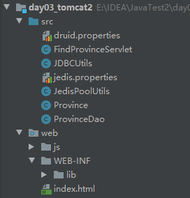

# 1  redis概述

redis是NOSQL系列的非关系型数据库；NOSQL表示not only sql，就是非关系型数据库。

非关系型数据库：

* 存储的是key和value形式(redis)，还有文档形式(MongoDB)，等等。数据之间没有关系。
* 数据存储在内存中，提高检索效率（redis做缓存）

redis应用场景：

* 缓存（商品、新闻）
* 任务队列（车票、抢购）
* 排行榜
* 等等

redis的数据结构：redis存储的是键值对，其中key都是字符串，value有5中不同的数据结构

* 字符串类型 string
* 哈希类型 hash：
* 列表类型 list
* 集合类型 set
* 有序集合类型 sortedset

# 2  redis安装

下载从redis官方，或者redis中文网；解压后可以直接使用，其中的文件有：

* redis.windows.conf	配置文件
* redis-server.exe    服务器端
* redis-cli.exe    客户端（先打开服务器端，再打开客户端 自动连接）

# 3  redis命令

1. 字符串

    * 存储`set key value`
    * 获取`get key`
    * 删除`del key`

    ```
    set username zhangsan
    get username
    del username
    ```

2. 哈希类型 (field和value相当于哈希的键值对，可以存储多个)

    * 存储`hset key field value`
    * 获取`hget key field`
    * 获取所有`hgetall key`
    * 删除`hdel key field`

    ```
    hset id1 username zhangsan
    hset id1 age 23
    hget id1 username
    hdel id1 age
    hdel id1
    ```

3. 列表类型（可以从左边或右边添加）

    * 添加`lpush key value` 或者`rpush key value`
    * 获取`lrange key start end` ，如`lrange mylist 0 -1`表示获取所有元素
    * 删除`lpop key`或者`rpop key`

4. 集合类型

    * 存储`sadd key vlaue`
    * 获取`smembers key`
    * 删除`srem key value`

5. 有序集合

    * 存储`zadd key score value` 按照score排序
    * 获取`zrange key start end`
    * 删除`zrem key value`

通用命令

1. `keys *` 查询所有键
2. `type key`获取键的类型
3. `del key`删除键值对

# 4  redis持久化

redis是一个内存数据库，当redis服务重启，数据会丢失，因此可以将数据保存到硬盘，叫持久化。但是不能保证绝对安全，因为持久化是按时间等设置的。

持久化机制：

1. RDB：默认方式，不需要进行配置，默认就使用这种机制（产生一个rdb文件）
    * 使用方式：在一定的间隔时间内，检测key的变化情况，然后持久化数据
        * 打开redis.windows.conf文件，
        * 修改/添加 save 900 1（表示如果1个key发生改变，900秒持久一次）
        * 用命令启动redis：`redis-server.exe redis.windows.conf`
2. AOF：日志记录的方式，可以记录每一条命令的操作，可以每次命令操作后，持久化数据，产生一个aof文件。对性能有影响，使用方式：
    * 修改配置文件`redis.windows.conf`，将`appendonly no`改成`appendonly yes`
    * 修改`appendfsync` 
        * `appendfsync everysec` 默认，每秒持久化一次
        * `appendfsync always` 每一次操作都进行持久化
        * `appendfsync no`  不持久化  
    * 用命令启动redis：`redis-server.exe redis.windows.conf`

# 5  Java的Jedis工具

Jedis：一款java操作redis数据库的工具。

使用步骤：

1. 启动redis
2. 导入jedis的jar包（2个）
3. 获取连接 `Jedis jedis = new Jedis("localhost", 6379);`  （指定IP和端口）
4. 操作 `jedis.set("username", "zhangsan");`  （和命令操作差不多）
5. 关闭连接 `jedis.close();`

**jdis操作**

* 字符串：`jedis.set("x", "xx")` 和 `jedis.get("x")`
* 哈希：`jedis.hset("user", "name", "tom")`和`Map<,> jedis.hgetAll("user")`
* 列表：`jedis.lpush("mylist", "b", "b", "b")` 和 `List<> jedis.lrange("mylist", 0, -1)`
* 集合：`jedis.sadd("myset", "java", "php", "c")`和`Set<> jedis.smembers("myset")`
* 有序集合：`jedis.zadd("myset", 3, "java", 2, "php", 5, "c")` 和 `jedis.zrange(myset, 0, -1)`
* 特殊操作：存储过期时间，存储一段时间自己消失，如手机验证码：
    * `jedis.setex("activecode", 20, "asdf")` （存储20秒，键值对为activecode:asdf）

**jedis连接池**

jedis自带连接池，作用和jdcb连接池一样，使用：

1. 创建连接池对象`JedisPool jdisPool = new JedisPool("localhost", 6379);`

    ```
    // 连接池创建时，可以指定配置参数
    JedisPoolConfig config = new JedisPoolConfig();
    config.setMaxTotal(50); // 最大连接
    config.setMaxIdle(10); // 最大空闲连接
    JedisPool jedisPool = new JedisPool(config, "localhost", 6379);
    ```

2. 调用方法，获取jedis连接`Jedis jedis = jedisPool.getResource();`

3. 操作

4. 关闭连接`jedis.close();` （归还到连接池中）

5. 关闭连接池

**jedis工具类**

把配置存在一个配置文件，然后把连接池、创建连接对象等操作放在工具类里面。步骤如下：

1. 将配置文件`jedis.properties`放在src目录下，修改配置文件。

2. 创建JedisPoolUtils工具类，代码如下

    ```
    public class JedisPoolUtils {
        private static JedisPool jedisPool;
    
        static {
            // 读取配置文件
            InputStream is = JedisPoolUtils.class.getClassLoader().getResourceAsStream("jedis.properties");
            Properties pro = new Properties();
            try {
                pro.load(is);
            } catch (IOException e) {
                e.printStackTrace();
            }
            // 创建配置对象
            JedisPoolConfig config = new JedisPoolConfig();
            config.setMaxTotal(Integer.parseInt(pro.getProperty("maxTotal")));
            config.setMaxIdle(Integer.parseInt(pro.getProperty("maxIdle")));
            // 初始化连接池
            jedisPool = new JedisPool(config, pro.getProperty("host"), Integer.parseInt(pro.getProperty("port")));
        }
    
        public static Jedis getJedis() {
            return jedisPool.getResource();
        }
    
        public static void close(Jedis jedis) {
            jedis.close();
        }
    }
    ```

# 6  案例：下拉框省份

技术ajax+redis+servlet+mysql+druid

1. 创建Java EE web项目/模块

2. 创建province表

    ```
    CREATE DATABASE IF NOT EXISTS db1;
    USE db1;
    DROP TABLE IF EXISTS province;
    CREATE TABLE province(
    	id INT PRIMARY KEY AUTO_INCREMENT,
    	NAME VARCHAR(30) NOT NULL
    );
    INSERT INTO province VALUES(NULL,'北京'),
    (NULL,'上海'),
    (NULL,'广州'),
    (NULL,'陕西');
    ```

3. 导入jar包：mysql包，druid包，jdbcTempalte包，jedis包，jackson包

4. 导入jquery.js，导入druid.properties，导入jedis.propertis

5. 导入JDBCUtils工具类，导入JedisPollUtils工具类

6. 编写Province类（JavaBean）

    

7. 编写ProvinceDao类

    * 从数据库中得到Province，并返回

    ```
    public class ProvinceDao {
        private JdbcTemplate jdbcTemplate = new JdbcTemplate(JDBCUtils.getDataSource());
    
        public List<Province> findAll() {
            String sql = "select * from province";
            List<Province> list = jdbcTemplate.query(sql, new BeanPropertyRowMapper<Province>(Province.class));
            return list;
        }
    }
    
    ```

8. 编写FindProvinceServlet：（主要是doPost/doGet方法中的内容）

    * 将json格式的province返回浏览器

    ```
    ProvinceDao provinceDao = new ProvinceDao();
    List<Province> list = provinceDao.findAll();
    String json = new ObjectMapper().writeValueAsString(list);
    //  String json = provinceDao.findAll2();
    System.out.println(json);
    resp.setContentType("text/html;charset=utf-8");
    ```

9. html代码：

    - 下拉框使用ajax技术(js代码)：当单击下拉框时，从findProvinceServlet中查找所有省份

    ```
    <!DOCTYPE html>
    <html lang="en">
    <head>
        <meta charset="UTF-8">
        <title>注册</title>
        <script src="js/jquery-2.1.0.min.js"></script>
        <script>
            // ajax
            $(function () {
                $("#province").click(function () {
                    var username = $(this).val();
                    $.get("findProvinceServlet", {}, function (data) {
                        // 期望服务器回应数据格式 [{"id": 1, "name": "北京"},,,]
                        var province = $("#province");
                        $(data).each(function () {
                            var option = "<option name='" + this.id + "'>" + this.name + "</option>>";
                            province.append(option);
                        });
                    }, "json");
                });
            });
        </script>
    </head>
    <body>
    <form>
        <select id="province">
            <option>--请选择省份--</option>
        </select>
    </form>
    </body>
    </html>
    ```

上面已经完成了ajax技术和mysql数据库之间的操作，现在可以加入redis数据库优化：

1. 启动redis

2. 在ProvinceDao类中在添加一种方法：

    ```
    public String findAll2() {
        Jedis jedis = JedisPoolUtils.getJedis();
        String province = jedis.get("province");
        // redis没有数据, 找数据 并存起来
        if (province == null || province.length() == 0) {
            List<Province> all = findAll();
            System.out.println("查数据库..............");
            ObjectMapper mapper = new ObjectMapper();
            try {
                province = mapper.writeValueAsString(all);
            } catch (JsonProcessingException e) {
                e.printStackTrace();
            }
            jedis.set("province", province);
            jedis.close();
        }
        System.out.println("查缓存。。。。。。。。。。。。。");
        return province;
    }
    ```

3. 在FindProvinceServlet类中，list从findAll2()方法中获取：

    ```
    // List<Province> list = provinceDao.findAll();
    // String json = new ObjectMapper().writeValueAsString(list);
    String json = provinceDao.findAll2();
    ```


