# Jenkins

Jenkins，原名 Hudson，2011 年改为现在的名字。它是一个开源的实现持续集成的软件工具。

官方网站 https://www.jenkins.io/

## 一、Linux环境安装

### 安装JDK

略。

### 安装Jenkens

官方文档介绍非常详细 https://www.jenkins.io

下载war包，直接启动：（初始化时间需要几分钟）

```
java -jar jenkens.war
```

启动时，会将初始化的密码输出：（直接复制，或者去配置文件复制）

```
Jenkins initial setup is required. An admin user has been created and a password generated.
Please use the following password to proceed to installation:

4e67bbe261da476abdc63c5b51311646

This may also be found at: /root/.jenkins/secrets/initialAdminPassword
```

访问IP:8080登录jenkens，并修改admin密码

**注意：jenkins默认端口是8080，所以后面项目端口不要和它重复了**


### 安装Maven

官网 https://maven.apache.org/

下载后复制到Jenkins所在服务器解压缩即可，进入bin目录，查看版本号

```
./mvn -v
```

配置maven环境变量

```
vim /etc/profile

export MAVEN_HOME=/usr/local/maven/apache-maven-3.3.9
export PATH=${PATH}:${MAVEN_HOME}/bin
```

刷新配置文件

```
source /etc/profile
```

创建maven本地仓库

```
mkdir maven_repository
```

在setting.xml配置本地仓库，和国内镜像源

```
vi apache-maven-3.8.6/conf/settings.xml

<!--本地仓库目录-->
<localRepository>/opt/software/maven/maven_repository</localRepository>

<!--阿里云镜像（先注释中央仓库地址）-->
<mirror>
  <id>alimaven</id>
  <name>aliyun maven</name>
  <url>http://maven.aliyun.com/nexus/content/groups/public/</url>
  <mirrorOf>central</mirrorOf>        
</mirror>
```

测试

```
mvn -v
```


### 安装git

```
yum install git
git --version
```


## 二、Jenkins+Maven+Gitee持续集成

### 安装Maven插件

1、登录Jenkins，进入插件管理

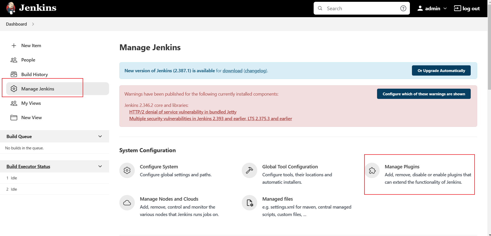


搜索maven

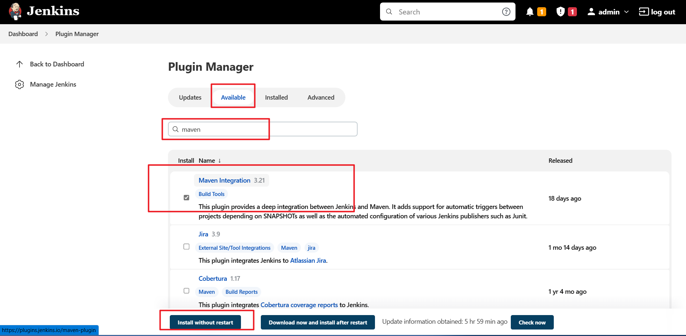


等安装好，返回首页

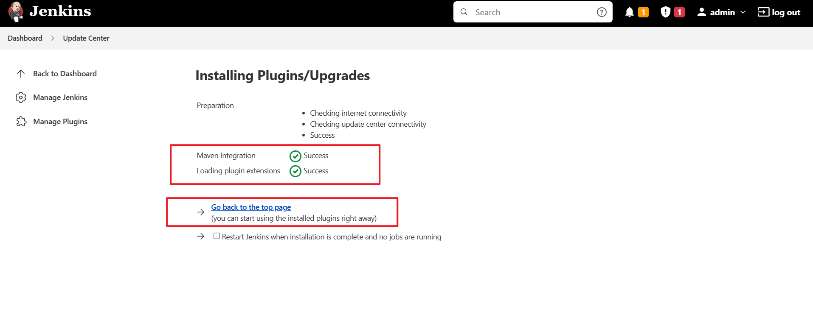

### 构建项目

点击New Item

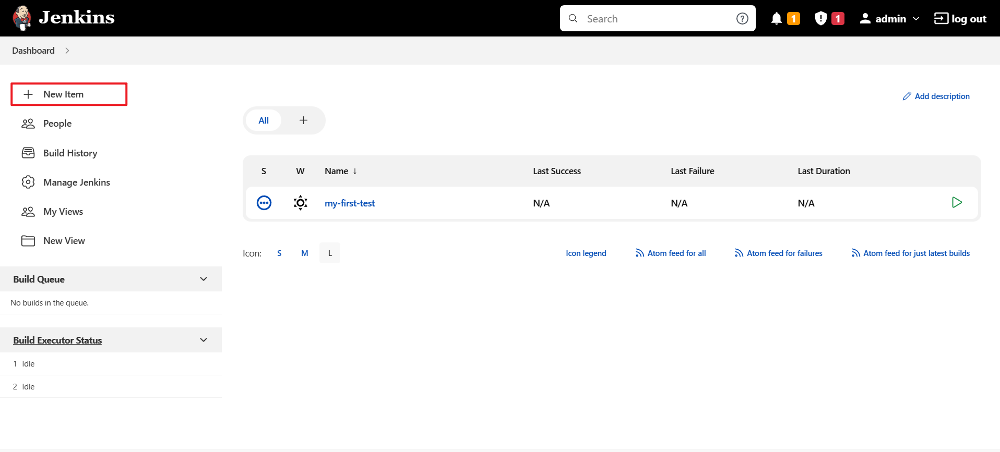


创建名称，选择maven项目，并保存

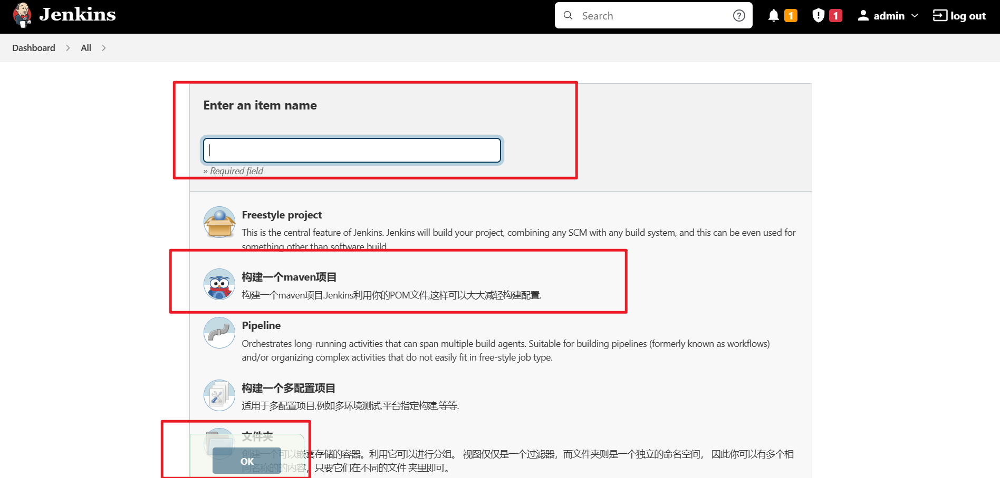


### 配置gitee

1、Jenkins安装git插件，和maven插件类似，略。

2、重新配置项目的git

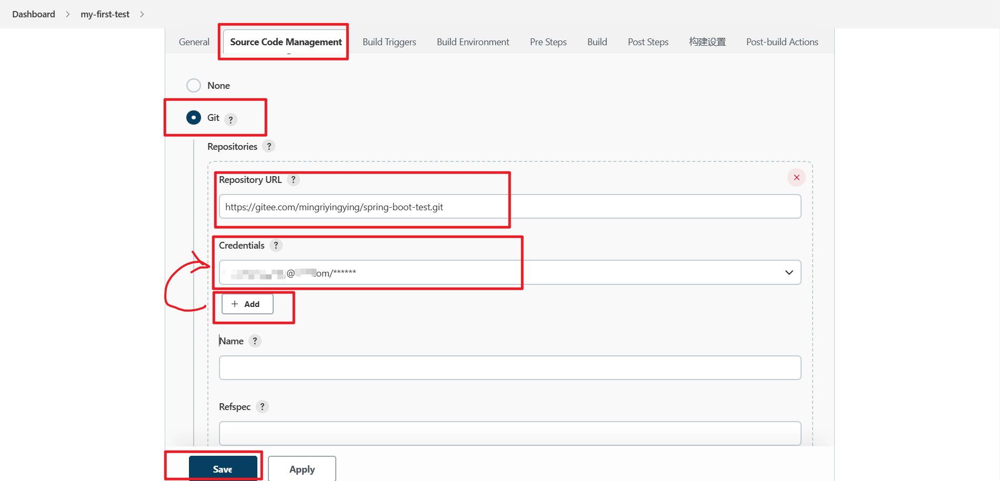


### 配置maven

构建项目里面可以跳转，也可以直接进入配置

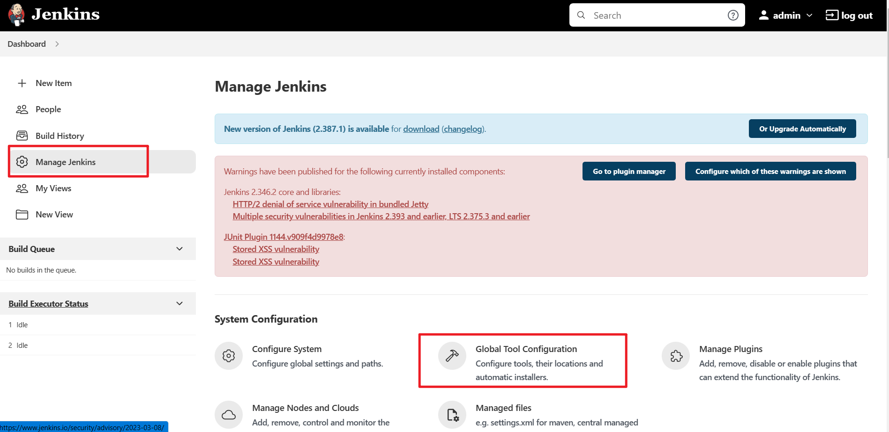


输入Linux上maven安装地址（不要自动安装）

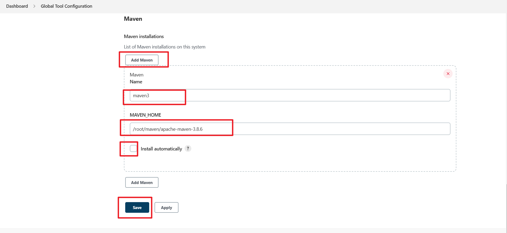


### 配置项目pom地址

从gitee找到pom地址，在item中配置pom地址

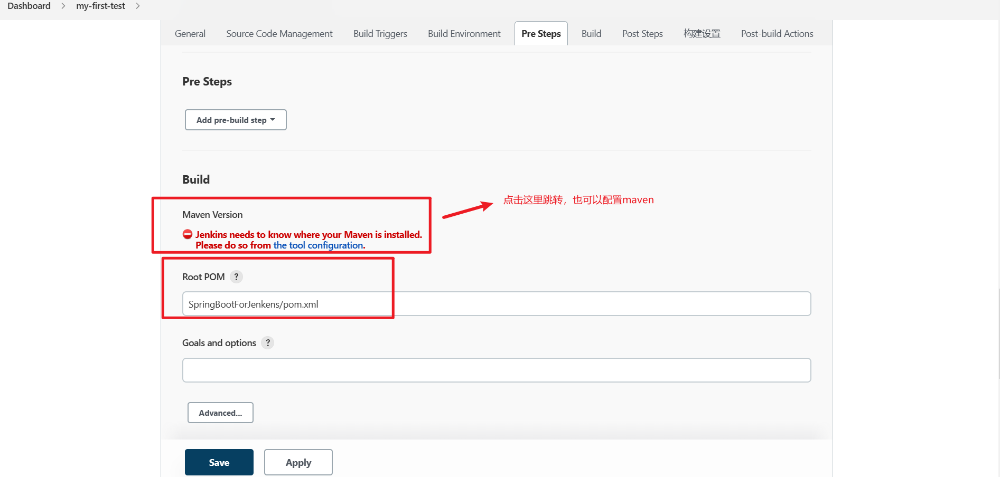

启动项目，此时会把项目放到jenkins默认地址`/root/.jenkins/workspace/my-first-test`

### 配置项目部署地址

1、Jenkins安装publish over ssh插件，略。

2、进入配置

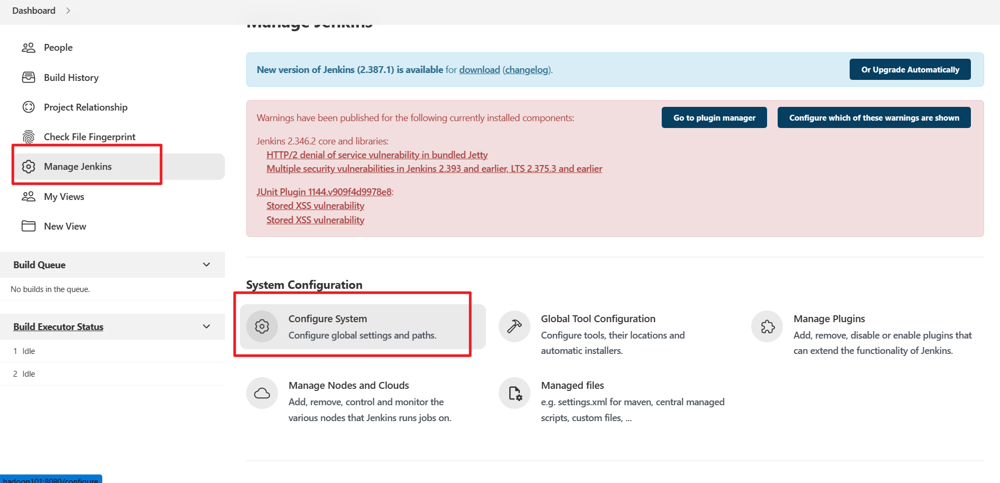


输入IP地址和密码

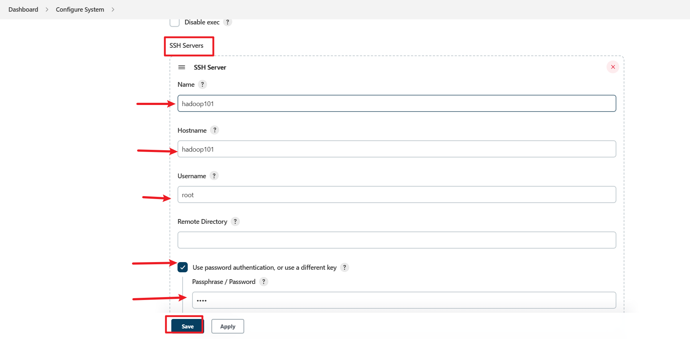

3、在构建项目中添加

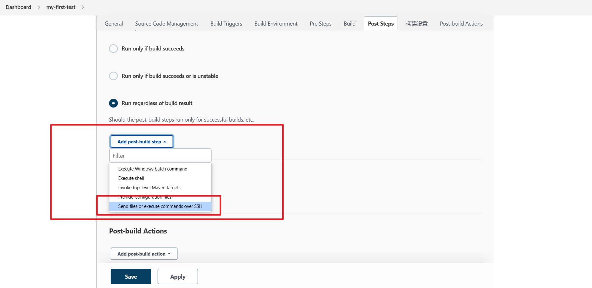

配置jar和启动命令。图中启动命令是错的，应该是

```
nohup java -jar /xxx/xxx.jar > mylog.log 2>&1 &
```

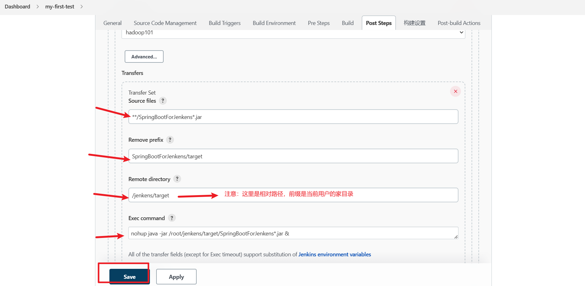

启动项目

## 三、构建-其他配置

### 配置项目前启动脚本

每次构建项目前，先kill项目、删除服务器项目文件。

在Linux服务器，编写删除脚本

```
#! /bin/bash

#删除历史数据
rm -rf target

appname=$1
#获取传入的参数
echo "arg:$1"

#获取正在运行的jar包pid
pid=`ps -ef | grep $1 | grep 'java -jar' | awk '{printf $2}'`

echo $pid

#如果pid为空，提示一下，否则，执行kill命令
if [ -z $pid ];
#使用-z 做空值判断
        then
                echo "$appname not started"
        else
				kill -9 $pid
                echo "$appname stoping...."

check=`ps -ef | grep -w $pid | grep java`
if [ -z $check ];

        then
                echo "$appname pid:$pid is stop"
        else
                echo "$appname stop failed"

fi


fi
```

在Jenkins配置

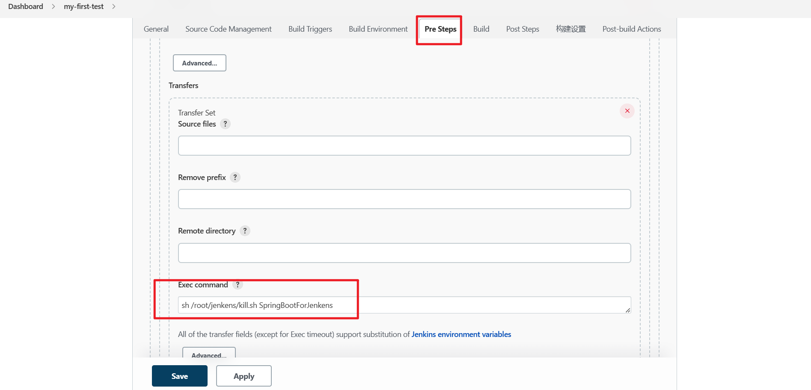

### 自动构建方式

- 快照依赖构建/Build whenever a SNAPSHOT dependency is built
    - 当依赖的快照被构建时执行本job
- 触发远程构建 (例如,使用脚本)
    - 远程调用本job的restapi时执行本job
- job依赖构建/Build after other projects are built
    - 当依赖的job被构建时执行本job
- 定时构建/Build periodically
    - 使用cron表达式定时构建本job
- 向GitHub提交代码时触发Jenkins自动构建/GitHub hook trigger for GITScm polling
    - Github-WebHook出发时构建本job
- 定期检查代码变更/Poll SCM
    - 使用cron表达式定时检查代码变更，变更后构建本job

### 自动构建-提交代码时触发

1、先安装Jenkins免密登录插件 Build Authorization Token Root

2、配置构建

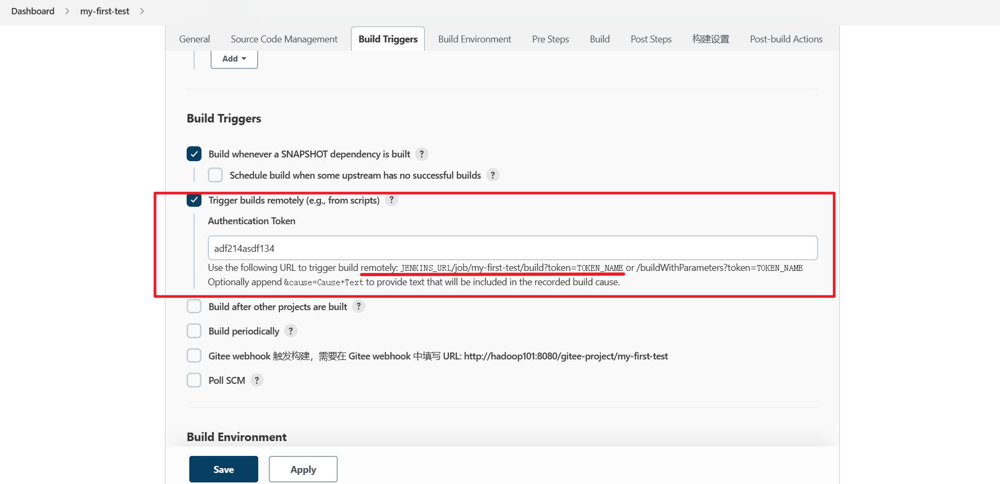


3、 在gitee中配置，这里不行，因为是内网URL，如果是公网IP就可以了

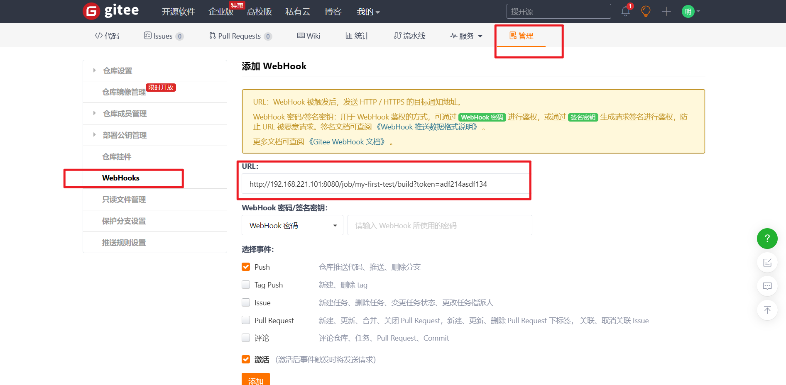

## 四、部署到Docker

### 三种部署方式

* Jenkens：jar包放到Linux目录；Docker：外挂Linux目录&运行镜像。
* Jenkens：用Dockerfile构建镜像；Docker：直接运行镜像。
* Jenkens：用Dockerfile构建镜像；上传到Harbor私服；k8s集群拉取镜像并运行。


### 方式1：Docker外挂目录

1、初始化容器

```
docker run -d -p 8888:8888 --name SpringBootTest -v /root/jenkins/target/SpringBootTest-1-0.0.1-SNAPSHOT.jar:/app.jar openjdk:11 java -jar app.jar
```

2、Jenkins构建前，停止容器

```
docker stop SpringBootTest
```

3、Jenkins构建后，启动容器

```
docker start SpringBootTest
```


### 方式2：构建Docker镜像

1、制作DockerFile，可以放项目内一起打包，也可以放Linux服务器

```dockerfile
FROM openjdk:11
EXPOSE 8888

WORKDIR /root

ADD target/SpringBootTest*.jar /root/app.jar
ENTRYPOINT ["java","-jar","/root/app.jar"]
```

2、构建前，删除容器和镜像

```
docker stop SpringBootTest
docker rm SpringBootTest
docker rmi SpringBootTestImage:1
```

3、构建后，打包镜像并运行

```
docker build -f ./xx_dockerfile -t SpringBootTestImage:1 .
docker run -d -p 8888:8888 --name SpringBootTest SpringBootTestImage:1
```


## 五、创建流水线

### 简介

使用流水线可以让我们的任务从ui手动操作，转换为代码化，像docker的dockerfile一样，从shell命令到配置文件，更适合大型项目，可以让团队其他开发者同时参与进来，同时也可以编辑开发Jenkinswebui不能完成的更复杂的构建逻辑，作为开发者可读性也更好。

Jenkinsfile 支持两种语法形式：

* Declarative pipeline – 在pipeline v2.5 之后引入，结构化方式，比较简单，容易上手。这种类似于我们在做自动化测试时所接触的关键字驱动模式，只要理解其定义好的关键词，按要求填充数据即可。入门容易，但是灵活性欠缺。
* Scripted pipeline – 基于grjoovy的语法，相较于Declarative，扩展性比较高，好封装，但是有些难度，需要一定的编程工具。

Declarative语法的5个必备的组成部分：

* pipeline：整条流水线
* agent：指定执行器
* stages：所有阶段
* stage：某一阶段，可有多个
* steps：阶段内的每一步，可执行命令

Pipeline定义有两种方式：

* 一种是Pipeline Script ，是直接把脚本内容写到脚本对话框中；
* 一种是 Pipeline script from SCM （Source Control Management–源代码控制管理，即从gitlab/github/git上获得pipeline脚本–JenkisFile）


### pipeline script

1、先下载pipeline和pipeline stage view插件，略。

2、创建pipeline构建任务

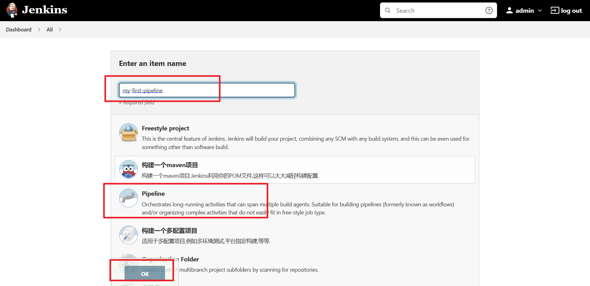


3、写脚本


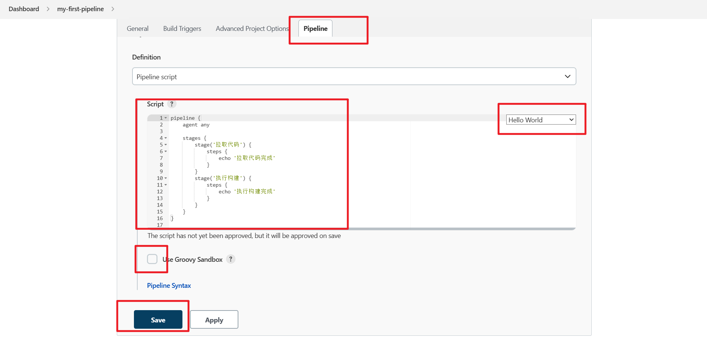

4、执行

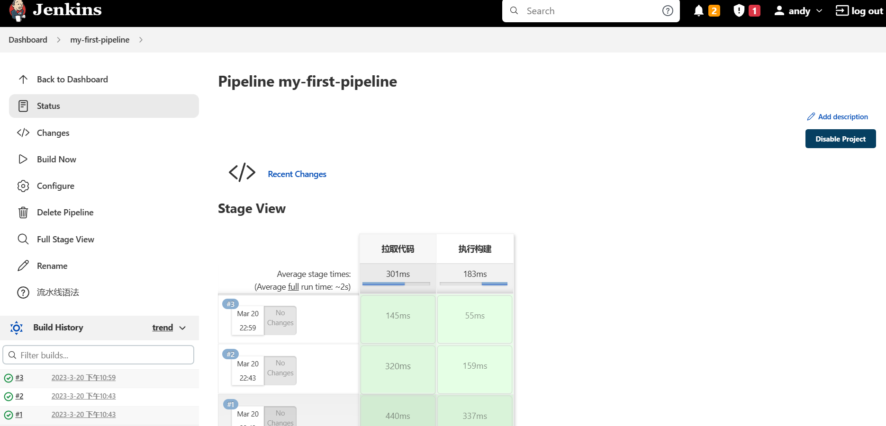


### pipeline script from SCM

1、项目里面写好jenkinsfile，pull到仓库

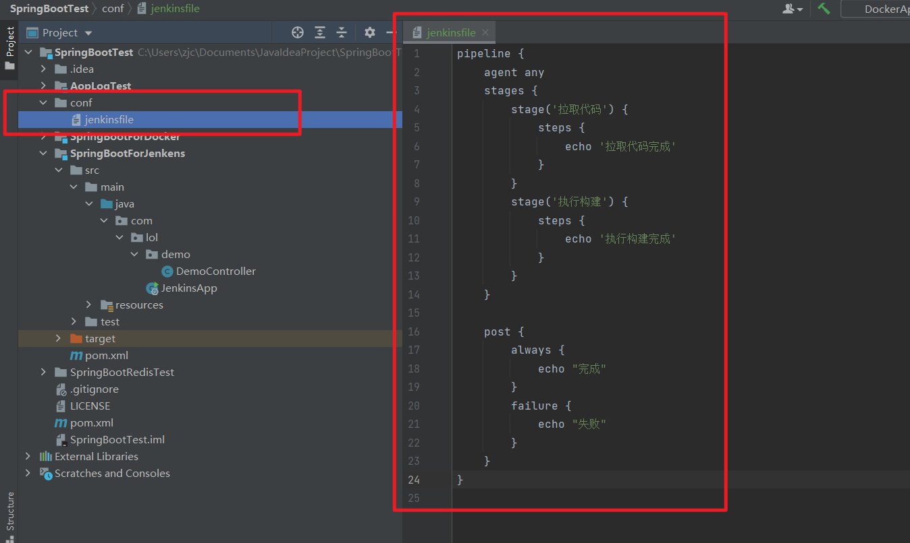


2、配置Git仓库地址和jenkinsfile位置

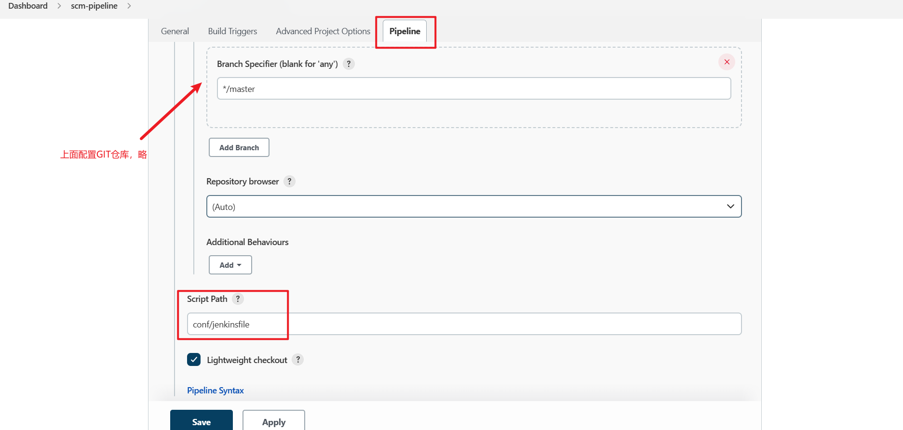

3、执行

### 插件生成Jenkinsfile语法

图中有Pipeline语法，在这里可以选择插件生成命令

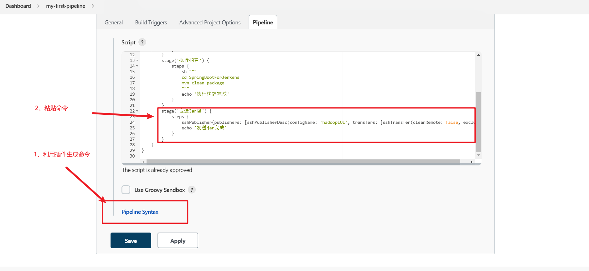

在这里配置好，然后生成命令

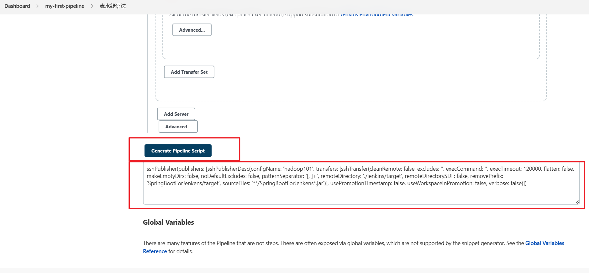

## 总结

### 声明式流水线

好处

- 在Jweb ui中的操作
- 可读性比较高
- 支持语法检查

坏处

- 代码逻辑能力比脚本式弱，不能完成特别复杂的任务	

### 脚本式流水线

好处

- 更少的代码和弱规范要求
- 更灵活的自定义代码操作
- 不受约束，可以构建特别复杂的工作流和流水线

坏处

- 读写对编程要求比较高
- 比声明式流水线代码更复杂


