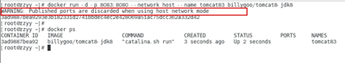

# 1  简介安装

## 1.1  简介

* Docker是一个开源应用容器引擎
* Docker诞生于2013年，基于Go语言实验
* Docker可以打包应用，然后发布到任何流行的Linux机器上
* 容器是完全使用沙箱机制，相互隔离
* 容器性能开销极低
* Docker从17.03版本以后分为Community Edition社区版，和Enterprise Edition企业版


## 1.2  基本概念

Docker包括三个基本概念：

* 镜像Image：相当于是一个root文件系统，和操作系统镜像概念差不多；
* 容器Container：镜像和容器的关系，相当于类和实例对象，容器可以被创建、启动、停止、删除等；
* 仓库：仓库是用来保存镜像的，相当于一个代码控制中心，类似于Maven仓库。


## 1.3  安装

参考官网：https://docs.docker.com/engine/install/centos/


```shell
# 1、安装yum-utils，是为了使用yum-config-manager命令
yum install yum-utils
# 2、通过 yum-config-manager 设置镜像仓库地址阿里云 
yum-config-manager --add-repo https://mirrors.aliyun.com/docker-ce/linux/centos/docker-ce.repo

# 3、安装
# docker-ce : docker 引擎，社区版
# docker-ce-cli : docker 引擎的命令行界面，社区版
# containerd.io : 守护进程 containerd。 它在 docker 包上独立工作，并且是 docker 包所必需的。
# docker-compose-plugin： docker编排插件，后面用
yum install docker-ce docker-ce-cli containerd.io docker-compose-plugin

# 4、查看docker版本，验证是否验证成功
docker -v
# 如果失败，看是否关闭了防火墙
# 关闭
systemctl stop firewalld
# 禁止开机启动防火墙
systemctl disable firewalld

# 5、根据需要，设置开机自动启动
systemctl enable docker
# 6、启动 关闭 重启docker
systemctl start docker
systemctl stop docker
systemctl restart docker

# 7、配置镜像加速，因为国内从docker hub官方仓库下载较慢
* 镜像从Docker Hub下载。
* 国内从Docker Hub获取镜像时会遇到困难，所以必须配置加速器。
* 阿里镜像加速器、免费、参考官方：https://cr.console.aliyun.com/cn-hangzhou/instances/mirrors
```


阿里云镜像获取地址：https://cr.console.aliyun.com/cn-hangzhou/instances/mirrors，登陆后，左侧菜单选中镜像加速器就可以看到你的专属地址了：


## 附加：离线安装docker

离线包下载地址：https://download.docker.com/linux/static/stable/x86_64/

安装步骤：

```
tar -zxvf docker-20.10.9.tgz 
cp docker/* /usr/bin
# rm -rf docker docker-20.10.9.tgz
```

配置docker服务

```
# vim /etc/systemd/system/docker.service
# 添加
[Unit]

Description=Docker Application Container Engine

Documentation=https://docs.docker.com

After=network-online.target firewalld.service

Wants=network-online.target


[Service]

Type=notify

ExecStart=/usr/bin/dockerd

ExecReload=/bin/kill -s HUP $MAINPID

LimitNOFILE=infinity

LimitNPROC=infinity

TimeoutStartSec=0

Delegate=yes

KillMode=process

Restart=on-failure

StartLimitBurst=3

StartLimitInterval=60s


[Install]

WantedBy=multi-user.target
```

赋执行权限

```
chmod +x /etc/systemd/system/docker.service
systemctl daemon-reload

# 开机启动
systemctl enable docker.service
# 启动docker
systemctl start docker
# docker状态
systemctl status docker
# 重启docker服务
systemctl restart docker
```

## 附加：离线安装nvidia-docker-runtime

通过nvidia-docker-runtime，可以实现在docker容器内部使用nvidia的gpu 进行相关的模型训练和推理。

如命令

```
docker run --gpus "device=1,2"
docker run --gpus all
```

官方没有直接提供安装包，需要自己从linux仓库下载，或找别人下载好的安装包。

```
#解压nvidia-container-runtime.tar.gz
tar -zxvf nvidia-container-runtime.tar.gz
#离线安装所有rpm包
cd nvidia-container-runtime
rpm -Uvh --force --nodeps *.rpm
#安装完后需要重启容器，未设置为系统启动服务，也可以通过kill docker进程再启动方式重启
systemctl restart docker
#查看安装结果
whereis  nvidia-container-runtime 
```


# 2  Docker命令

## 2.1  Docker服务命令

```
# 开启
systemctl start docker
# 关闭
systemctl stop docker
# 重启
systemctl restart docker
# 查看状态
systemctl status docker
# 开启自动启动
systemctl enable docker		
```


## 2.2  Docker镜像命令

```
# 查看本地主机上的镜像
docker images

* REPOSITORY：表示镜像的仓库源
* TAG：镜像的标签版本号
* IMAGE ID：镜像ID
* CREATED：镜像创建时间
* SIZE：镜像大小

# 搜索镜像
docker search redis
# 安装指定版本镜像，从网站hub.docker.com查找版本 （不写版本号，默认最新版）
docker pull redis:5.0
docker pull centos:7
# 安装最新版本镜像
docker pull redis
# 删除镜像
docker rmi redis:5.0
# 删除镜像
docker rmi 镜像id
# 强制删除
docker rmi -f 镜像id
# 查看镜像/容器/数据卷所占的空间
docker system df
```


虚悬镜像：

```
repository和tag都是none的镜像称之为虚悬镜像，没有任何作用。
删除命令：
docker image prune
```


## 2.3  Docker容器命令

```
# 创建容器，并进入容器终端	 -i表示保持运行 -t表示给容器分配终端
docker run -it --name c1 centos:7 /bin/bash
# 退出容器（容器也停止工作了）
exit
# 查看正在运行的容器
docker ps
# 查看所有容器
docker ps -a
# 创建容器，并运行在后台。可以随意进退
docker run -id --name c2 centos:7 
# 进入容器终端
docker exec -it c2 /bin/bash
# 停止容器
docker stop c2
# 强制停止
docker kill 容器ID或容器名
# 启动容器
docker start c2
# 删除容器 （容器id或容器名）
docker rm c2
# 查看容器信息
docker inspect c2
# 查看容器日志
docker logs 容器ID
# 查看容器内运行的进程
docker top 容器ID

# 拷贝文件到主机
docker cp 容器ID:容器内路径 目的主机路径
# 导入导出容器（注意：不是镜像）
docker export 容器ID > xxx.tar
cat xxx.tar | docker import -镜像用户/镜像名:版本号
```


# 3  Docker容器的数据卷


>坑：Docker挂载主机目录访问如果出现cannot open directory .: Permission denied
>
>解决办法：在挂载目录后多加一个--privileged=true参数即可
>
>原因：如果是CentOS7安全模块会比之前系统版本加强，不安全的会先禁止，所以目录挂载的情况被默认为不安全的行为。在SELinux里面挂载目录被禁止掉了额，如果要开启，我们一般使用--privileged=true命令，扩大容器的权限解决挂载目录没有权限的问题，也即使用该参数，container内的root拥有真正的root权限，否则，container内的root只是外部的一个普通用户权限。


## 3.1  数据卷概念及作用

容器的思考：

* Docker容器删除后，数据也被删除了吗？是的，这样很危险！
* Docker容器和外部机器能直接交换文件？不能，需要通过宿主机！
* 容器之间想要进行数据交互？不能！

数据卷概念的提出：

* 数据卷是宿主机中的一个目录或文件；
* 当容器目录和数据卷目录绑定后，对方的修改会立即同步；
* 一个数据卷可以被多个容器同时挂载；
* 一个容器也可以挂载多个数据卷。
* 容器重启后，仍然可用。


## 3.2  配置数据卷

```
# 创建启动容器时，使用-v参数设置数据卷
docker run -v 宿主机目录:容器目录
# -d后台运行 -p端口 
docker run -d -p 5000:5000 --name c1 -v /宿主机目录:/容器目录 --privileged=true centos:7

// 案例
docker run -it --name c1 -v /tmp/host_data:/tmp/docker_data centos
cd /tmp/docker_data
touche dockerin.txt
exit
cd /tmp/host_data 发现文件存在，说明数据卷设置成功

# 两个容器使用一个数据卷
docker run -it --name c2 -v ~/data:/root/data centos:7
docker run -it --name c3 -v ~/data:/root/data centos:7
```


## 3.3  数据卷容器

多个容器绑定一个数据卷，可以实现数据交换和共享。

同时，Docker也提供了数据卷容器（数据卷继承）来实现多个容器数据交换和共享。

```
# 1. 创建启动c3数据卷容器，使用-v参数设置数据卷
# docker会自动分配一个容器目录
docker run -it --name c3 -v /volume centos:7
# 2. 创建启动c1c2容器，使用--volumes-from参数设置数据卷
docker run -it --name c1 --volumes-from c3 centos:7 /bin/bash
docker run -it --name c2 --volumes-from c3 centos:7 /bin/bash
```


# 4  Docker应用部署

## 4.1  MySQL

登录docker hub，搜索mysql，找到版本，查看安装和使用镜像教程


### 简单版

```
# 搜索MySQL镜像
docker search mysql
# 拉取MySQL镜像
docker pull mysql:5.7
# 启动
# -p主机和容器端口绑定
# -e设置root密码
docker run --name mysql -p 3306:3306 -e MYSQL_ROOT_PASSWORD=123456 -d mysql:5.7
# 查看容器
docker ps
# 进入容器
docker exec -it mysql /bin/bash
mysql -uroot -p
show databases;
create database db01;
use db01;
create table t1(id int, name varchar(20));
insert into t1 values(1, 'tom');
quit;
# 用客户端连接数据库
select * from t1;
insert into t1 values(2, '张三');  # 发现报错，因为字符编码不是utf8
# 退出容器
exit
docker ps
docker stop mysql # 停止容器
docker ps		# 查看运行中的容器
docker ps -a	# 查看所有容器
docker rm mysql # 删除容器
```

### 常见问题

* 中文乱码
* 备份数据库

```
# 创建容器,设置端口映射、目录映射
mkdir ~/docker/mysql
cd ~/docker/mysql
# 为了方式容器被删除，实际开发必须配置以下：
# conf.d配置utf-8编码；
# logs日志
# data数据
# -e 指定密码（并且是必须）
docker run -d -p 3306:3306 --name mysql --privileged=true -v ~/docker/mysql/conf:/etc/mysql/conf.d -v ~/docker/mysql/logs:/logs -v ~/docker/mysql/data:/var/lib/mysql -e MYSQL_ROOT_PASSWORD=123456 mysql:5.7

# 修改utf-8编码
cd conf
vim my.cnf
###################以下内容不要修改，复制到文件
[client]
default_character_set=utf8
[mysqld]
collation_server = utf8_general_ci
character_set_server = utf8
##########################################
# 重启mysql
docker restart mysql
# 4. 操作容器中的MySQL
docker exec -it mysql /bin/bash
mysql -uroot -p
show variables like 'character%'; 查看是否是utf-8编码
show databases;
create database db01;
show databases;
use db01;
create table t1(id int, name varchar(20));
# 用客户端连接数据库, 验证是否有乱码
select * from t1;
insert into t1 values(1, '张三');
# 此时再删除容器，新建容器数据仍然存在
```


## 4.2 Redis

### 简单版

```
# 获取镜像
docker pull redis:6.0.8
# 启动容器
docker run -d -p 6379:6379 --name redis  redis:6.0.8
# 进入容器，并使用redis
docker exec -it redis /bin/bash
redis-cli
set k1 v1
quit
# 退出容器，并删除容器
exit
docker stop redis
docker rm redis
docker ps -a
```

###  常见问题

* 数据备份

```
# 先从redis安装包 copy一份redis.conf
mkdir ~/redis
cp redis.conf ~/redis/
# 修改下面几个配置
############################
# 1.redis设置密码 可选
requirepass 123
# 2.注释bind。允许redi外地连接
#bind 127.0.0.1
# 3.daemonize设置为no。因为该配置和docker参数冲突，会导致容器一直启动失败
daemonize no
# 4.开启redis数据持久化 可选
#appendonly yes
############################

# 启动（启动不成功，就是本地redis.conf有问题，可能和docker版本不匹配等）
docker run -d -p 6379:6379 --privileged=true --name redis -v ~/redis/redis.conf:/etc/redis/redis.conf -v ~/redis/data:/data redis:6.0.8 redis-server /etc/redis/redis.conf
# 进入容器，并使用redis
docker exec -it redis /bin/bash
redis-cli
quit
# 退出
exit
docker stop redis
```


# 5  镜像高级


## 1  镜像原理

思考：

* Docker镜像本质是什么？
* Docker中CentOS镜像为什么只有200M，而CentOS安装包就要几个G？
* Docker中Tomcat镜像为什么有500M，而Tomcat安装包只有70M?

预备知识：

* Linux文件系统由bootfs和rootfs两部分组成，bootfs基本一样，rootfs不同厂商定制不同。

镜像原理：

* Docker镜像由特殊的文件系统叠加而成；
* 最低层是bootfs，并使用宿主机的bootfs；
* 第二层是rootfs，称为base image；
* 然后再往上可以叠加其他的镜像文件；
* 镜像是只读的，镜像之上是容器，容器才是可写的。

## 2  镜像制作

容器可以转为镜像，镜像可以打包成压缩文件，这样就方便了部署。

```
# 运行容器
docker run -it centos:7 /bin/bash
# 编辑一个文件，并保存
vi a.txt
# 退出
exit

# 首先：转成镜像
# docker commit 【-m="commit信息"】 【-a="作者"】 容器id 镜像名称:版本号
docker commit -m="edit file" -a="tom" 85f068a8e090 zjc/mycentos:1
# 然后：压缩
# docker save -o 压缩文件名称 镜像名称:版本号
docker save -o ./mycentos.tar zjc/mycentos:1

# 删除容器
docker rm 85f068a8e090
# 删除镜像
docker rmi zjc/mycentos:1
# 从文件加载镜像
docker load -i mycentos.tar

# 除了save和load，还有export和import
# 容器直接导出
docker export 容器ID > xxx.tar
或者
docker export xxx.tar 容器名
# 导入
docker import xxx.tar zjc/mycentos:1
或
cat mycentos.tar | docker import - zjc/mycentos:1
```

> 注意：制作镜像时，容器内挂载的目录不能复制。

## 3 上传到阿里云仓库

```
登录阿里云->
控制台->
容器镜像服务->
创建个人实例->
创建命名空间->
创建镜像仓库（选本地仓库，通过命令上传）->
按照阿里云提供的操作文档即可
docker login --username=ai0425 registry.cn-hangzhou.aliyuncs.com
docker tag [ImageId] registry.cn-hangzhou.aliyuncs.com/zhujinchong/mycentos:[镜像版本号]
docker push registry.cn-hangzhou.aliyuncs.com/zhujinchong/mycentos:[镜像版本号]

# 拉取镜像验证是否已经上传
docker pull registry.cn-hangzhou.aliyuncs.com/zhujinchong/mycentos:[镜像版本号]
```

## 4 上传到私有仓库

像DockerHub、阿里云等公有仓库不太安全，可以使用官方提供的工具Docker Registry搭建私有仓库。

**搭建私有仓库**

```
# 1、拉取私有仓库镜像 Docker Registry
docker pull registry
# 2、启动私有仓库容器，相当于本地有个DockerHub
docker run -id --name=registry -p 5000:5000 registry
# 3、打开浏览器 输入地址http://私有仓库服务器ip:5000/v2/_catalog，看到{"repositories":[]} 表示私有仓库 搭建成功
# 4、修改daemon.json   
vim /etc/docker/daemon.json    
# 在上述文件中添加一个key，保存退出。此步用于让 docker 信任私有仓库地址；注意将私有仓库服务器ip修改为自己私有仓库服务器真实ip 
{"insecure-registries":["私有仓库服务器ip:5000"]} 
# 5、重启docker 服务 
systemctl restart docker
docker start registry
```

**上传镜像到私有仓库**

```
# 1、标记镜像为私有仓库的镜像     
docker tag centos:7 私有仓库服务器IP:5000/centos:7

# 2、上传标记的镜像     
docker push 私有仓库服务器IP:5000/centos:7
```

**从私有仓库拉取镜像**

```
#拉取镜像 
docker pull 私有仓库服务器ip:5000/centos:7
```


# 6 Dockerfile

## 1 概念

Dockerfile是用来构建Docker镜像的文本文件，是由一条条构建镜像所需的指令和参数构成的脚本。

Dockerfile内容基础知识

* 每条保留字指令都必须为大写字母且后面要跟随至少一个参数
* 指令按照从上到下，顺序执行

* #表示注释
* 每条指令都会创建一个新的镜像层并对镜像进行提交

Docker执行Dockerfile的大致流程

1. docker从基础镜像运行一个容器
2. 执行一条指令并对容器作出修改
3. 执行类似docker commit的操作提交一个新的镜像层
4. docker再基于刚提交的镜像运行一个新容器
5. 执行dockerfile中的下一条指令直到所有指令都执行完成


## 2 Dockerfile常用关键字

从零开始来创建一个新的镜像。为此，我们需要创建一个Dockerfile文件，其中包含一组指令来告诉 Docker 如何构建我们的镜像。 

示例1：

```
FROM    centos:6.7
MAINTAINER      Fisher "fisher@sudops.com"
EXPOSE  80
CMD     /usr/sbin/sshd -D
```

示例2：

```
FROM centos:7
MAINTAINER zzyy<zzyybs@126.com>
 
ENV MYPATH /usr/local
WORKDIR $MYPATH

RUN yum -y install vim
RUN yum -y install net-tools
RUN yum -y install glibc.i686
RUN mkdir /usr/local/java
ADD jdk-8u202-linux-x64.tar.gz /usr/local/java/    #安装包必须要和Dockerfile文件在同一位置
ENV JAVA_HOME /usr/local/java/jdk1.8.0_202A
ENV JRE_HOME $JAVA_HOME/jre
ENV CLASSPATH $JAVA_HOME/lib/dt.jar:$JAVA_HOME/lib/tools.jar:$JRE_HOME/lib:$CLASSPATH
ENV PATH $JAVA_HOME/bin:$PATH

EXPOSE 80
 
CMD echo $MYPATH
CMD echo "success--------------ok"
CMD /bin/bash
```

Dockerfile关键字

| 关键字     | 作用                                   | 备注                                            |
| ---------- | -------------------------------------- | ----------------------------------------------- |
| FROM       | 指定父镜像                             | FROM    centos:6.7                              |
| MAINTAINER | 作者姓名和邮箱                         | MAINTAINER      Fisher "fisher@sudops.com"      |
| RUN        | 执行命令                               | RUN yum -y install vim                          |
| ENV        | 环境变量                               | ENV JAVA_HOME /usr/local/java/jdk1.8.0_171      |
| WORKDIR    | 工作目录，指定容器内部的工作目录       | WORKDIR /usr/local                              |
| COPY       | 复制文件                               |                                                 |
| ADD        | 添加文件,会自动解压                    | ADD jdk-8u171-linux-x64.tar.gz /usr/local/java/ |
| EXPOSE     | 暴露端口，定义容器运行的时候监听的端口 | EXPOSE 80                                       |
| CMD        | 容器启动命令                           | CMD /bin/bash                                   |


## 3 案例

需求：自定义centos7镜像

* 要求默认登陆路径为/usr
* 可以使用vim
* 安装jdk8 （准备好jdk包）

步骤：

1、编辑文件： `vim centos_dockerfile`

```
FROM centos:7
MAINTAINER xxx<xxx@qq.com>

WORKDIR /usr/local

# 安装vim
RUN yum install -y vim
#安装ifconfig命令查看网络IP
RUN yum -y install net-tools
#安装java8及lib库
RUN yum -y install glibc.i686
RUN mkdir /usr/local/java
#ADD是相对路径jar,把jdk-8u171-linux-x64.tar.gz添加到容器中,安装包必须要和Dockerfile文件在同一位置，ADD会自动解压
ADD jdk-8u171-linux-x64.tar.gz /usr/local/java/
#配置java环境变量
ENV JAVA_HOME /usr/local/java/jdk1.8.0_171
ENV JRE_HOME $JAVA_HOME/jre
ENV CLASSPATH $JAVA_HOME/lib/dt.jar:$JAVA_HOME/lib/tools.jar:$JRE_HOME/lib:$CLASSPATH
ENV PATH $JAVA_HOME/bin:$PATH

CMD echo "success--------------ok"
CMD /bin/bash
```

2、使用dockerfile文件创建镜像：

```
# 注意：最后有一个点
docker build -f ./centos_dockerfile -t my_centos:1 .
```


3、查看刚才的镜像：`docker images`


# 7 Docker网络

## 1 概念

> 容器每次启动时，网络地址会变，所以要分配好网络。

docker网络能干吗？

* 容器间的互联和通信以及端口映射
* 容器IP变动时候可以通过服务名直接网络通信而不受到影响

```
# 查看docker网络模式的命令
docker network ls
```

网络模式简介


* bridge模式：为每一个容器分配、设置IP等，并将容器连接到docker0虚拟网桥，默认该模式。使用--network bridge指定，默认使用docker0
* host模式：使用主机IP和端口。使用--network host指定
* none模式：不进行任务网络设置。使用--network none指定
* container模式：绑定别的容器，共享IP和端口。使用--network container:NAME或者容器ID指定

## 2 bridge模式

Docker 服务默认会创建一个 docker0 网桥（其上有一个 docker0 内部接口），该桥接网络的名称为docker0，它在内核层连通了其他的物理或虚拟网卡，这就将所有容器和本地主机都放到同一个物理网络。Docker 默认指定了 docker0 接口 的 IP 地址和子网掩码，让主机和容器之间可以通过网桥相互通信。

1 Docker使用Linux桥接，在宿主机虚拟一个Docker容器网桥(docker0)，Docker启动一个容器时会根据Docker网桥的网段分配给容器一个IP地址，称为Container-IP，同时Docker网桥是每个容器的默认网关。因为在同一宿主机内的容器都接入同一个网桥，这样容器之间就能够通过容器的Container-IP直接通信。

2 docker run 的时候，没有指定network的话默认使用的网桥模式就是bridge，使用的就是docker0。在宿主机ifconfig,就可以看到docker0和自己create的network(后面讲)eth0，eth1，eth2……代表网卡一，网卡二，网卡三……，lo代表127.0.0.1，即localhost，inet addr用来表示网卡的IP地址

3 网桥docker0创建一对对等虚拟设备接口一个叫veth，另一个叫eth0，成对匹配。

  3.1 整个宿主机的网桥模式都是docker0，类似一个交换机有一堆接口，每个接口叫veth，在本地主机和容器内分别创建一个虚拟接口，并让他们彼此联通（这样一对接口叫veth pair）；

  3.2 每个容器实例内部也有一块网卡，每个接口叫eth0；

  3.3 docker0上面的每个veth匹配某个容器实例内部的eth0，两两配对，一一匹配。

通过上述，将宿主机上的所有容器都连接到这个内部网络上，两个容器在同一个网络下,会从这个网关下各自拿到分配的ip，此时两个容器的网络是互通的。


## 3 host模式

直接使用宿主机的 IP 地址与外界进行通信，不再需要额外进行NAT 转换。

容器将不会获得一个独立的Network Namespace， 而是和宿主机共用一个Network Namespace。容器将不会虚拟出自己的网卡而是使用宿主机的IP和端口。


案例

```
docker run -d -p 8083:8080 --network host --name c_mytomcat tomcat
```



问题：docke启动时总是遇见标题中的警告

原因：docker启动时指定--network=host或-net=host，如果还指定了-p映射端口，那这个时候就会有此警告，

并且通过-p设置的参数将不会起到任何作用，端口号会以主机端口号为主，重复时则递增。

解决：使用docker的其他网络模式，例如--network=bridge，这样就可以解决问题，或者直接无视。。。。O(∩_∩)O哈哈~

好处：外部可以访问宿主机IP，从而访问容器。

## 4 none模式

在none模式下，并不为Docker容器进行任何网络配置。 也就是说，这个Docker容器没有网卡、IP、路由等信息，只有一个lo。需要我们自己为Docker容器添加网卡、配置IP等，否则没有网络。

## 5 container模式

新建的容器和已经存在的一个容器共享一个网络ip配置而不是和宿主机共享。新创建的容器不会创建自己的网卡，配置自己的IP，而是和一个指定的容器共享IP、端口范围等。同样，两个容器除了网络方面，其他的如文件系统、进程列表等还是隔离的。


案例

```
# Alpine Linux 是一款独立的、非商业的通用 Linux 发行版，专为追求安全性、简单性和资源效率的用户而设计。
# 镜像非常小巧，不到6M的大小，但是简单而安全，所以特别适合容器打包。
docker run -it --name alpine1  alpine /bin/sh
docker run -it --network container:alpine1 --name alpine2  alpine /bin/sh
```

## 6 自定义网络

案例

```
# 打开两个终端，启动容器，互相ping
docker run -it -p 8083:8080 --name c_tomcat1 tomcat
docker run -it -p 8083:8080 --name c_tomcat2 tomcat
ping 172.17.0.2
ping 172.17.0.3
# 互相ping可以，但是ip是动态的。应该互相ping服务名，但是此时ping不通
ping c_tomcat1
ping c_tomcat2
```

解决方法：

```
# 先创建一个bridge模式的网络（自定义网络）
docker network create zzyy_network
# 查看
docker network ls
# 打开两个终端，互相ping服务名
docker run -it -p 8083:8080 --network zzyy_network --name c_tomcat1 tomcat
docker run -it -p 8083:8080 --network zzyy_network --name c_tomcat2 tomcat
ping c_tomcat1
ping c_tomcat2
```

问题结论

* 自定义网络本身就维护好了主机名和ip的对应关系（ip和域名都能通）

## 7 Docker架构总结

从其架构和运行流程来看，Docker 是一个 C/S 模式的架构，后端是一个松耦合架构，众多模块各司其职。 

Docker 运行的基本流程为：

1 用户是使用 Docker Client 与 Docker Daemon 建立通信，并发送请求给后者。

2 Docker Daemon 作为 Docker 架构中的主体部分，首先提供 Docker Server 的功能使其可以接受 Docker Client 的请求。

3 Docker Engine 执行 Docker 内部的一系列工作，每一项工作都是以一个 Job 的形式的存在。

4 Job 的运行过程中，当需要容器镜像时，则从 Docker Registry 中下载镜像，并通过镜像管理驱动 Graph driver将下载镜像以Graph的形式存储。

5 当需要为 Docker 创建网络环境时，通过网络管理驱动 Network driver 创建并配置 Docker 容器网络环境。

6 当需要限制 Docker 容器运行资源或执行用户指令等操作时，则通过 Execdriver 来完成。

7 Libcontainer是一项独立的容器管理包，Network driver以及Exec driver都是通过Libcontainer来实现具体对容器进行的操作。


# 8  Docker服务编排

## 1  服务编排概念

Docker建议我们每一个容器中只运行一个服务,因为docker容器本身占用资源极少,所以最好是将每个服务单独的分割开来但是这样我们又面临了一个问题？

微服务架构的应用系统中一般包含若干个微服务，每个微服务一般都会部署多个实例，如果每个微服务都要手动启停，维护的工作量会很大。

* 要从Dockerfile build image或者去dockerhub拉取image
* 要创建多个container
* 要管理这些container（启动停止删除）

服务编排：按照一定的业务规则批量管理容器

Compose 是 Docker 公司推出的一个工具软件，可以管理多个 Docker 容器组成一个应用。你需要定义一个YAML 格式的配置文件docker-compose.yml，写好多个容器之间的调用关系。然后，只要一个命令，就能同时启动/关闭这些容器。

Docker Compose是一个编排多容器分布式部署的工具，提供命令集管理容器化应用的完整开发周期，包括服务构建、启动和停止。使用步骤：

1. 利用Dockerfile定义运行环境镜像；
2. 使用docker-compose.yml定义组成应用的各服务；
3. 运行docker-compose up启动应用。

一个文件，两个要素：

* 一个docker-compose.yml文件
* 服务（service）：一个个应用容器实例，比如订单微服务、库存微服务、mysql容器、nginx容器或者redis容器
* 工程（project）：由一组关联的应用容器组成的一个完整业务单元，在 docker-compose.yml 文件中定义。

## 2  Docker Compose安装

> 建议从官网看安装教程 https://docs.docker.com/compose/install/

安装Docker Compose

```shell
# Compose目前已经完全支持Linux、Mac OS和Windows，在我们安装Compose之前，需要先安装Docker。下面我 们以编译好的二进制包方式安装在Linux系统中。 
curl -L https://github.com/docker/compose/releases/download/1.22.0/docker-compose-`uname -s`-`uname -m` -o /usr/local/bin/docker-compose
# 设置文件可执行权限 
chmod +x /usr/local/bin/docker-compose
# 查看版本信息 
docker compose version
```

卸载Docker Compose

```shell
# 二进制包方式安装的，删除二进制文件即可
rm /usr/local/bin/docker-compose
```

## 3  案例

### 不编排部署

1、前面章节有mysql镜像的使用方式，启动mysql。

2、创建spring-boot项目，能连接mysql数据库。

3、将spring-boot项目上传到服务器，编写docker file

```
# 基础镜像使用java
FROM java:8

#类似于执行 linux指令
RUN mkdir /opt/app
#类似于linux copy指令
COPY SpringBootForDocker-1.0-SNAPSHOT.jar /opt/app/
#对外端口
EXPOSE 8080
#执行命令 java -jar /opt/app/demo-docker.jar
CMD ["java", "-jar", "/opt/app/SpringBootForDocker-1.0-SNAPSHOT.jar"]
```

4、springboot项目制成镜像并启动

```
# 制成镜像
docker build -f spring_dockerfile -t springdemo:1 .
# 启动
docker run -d -p 8080:8080 --name springdemo springdemo:1
```


### 编排部署

1、创建docker-compose目录

```shell
mkdir ~/docker-compose
cd ~/docker-compose
```

2、编写 docker-compose.yml 文件

```shell
version: "3"

services:
  myapp:
    image: springdemo:1
    container_name: springdemo
    ports:
      - "8080:8080"
    networks:
      - demo_network
    depends_on:
      - mysql
  mysql:
    image: mysql:5.7
    container_name: mysql
    environment:
      MYSQL_ROOT_PASSWORD: '123456'
      MYSQL_ALLOW_EMPTY_PASSWORD: 'no'
      MYSQL_DATABASE: 'test'
      MYSQL_USER: 'daedb'
      MYSQL_PASSWORD: 'daedb'
    ports:
      - "3306:3306"
    volumes:
      - /root/docker/mysql/db:/var/lib/mysql
      - /root/docker/mysql/conf/my.cnf:/etc/my.cnf
      - /root/docker/mysql/init:/docker-entrypoint-initdb.d
    networks:
      - demo_network
    command: --default-authentication-plugin=mysql_native_password

# 自定义网路名称
networks:
  demo_network:
```

3、springboot项目的mysql配置更换成容器示例的名称

```shell
#    url: jdbc:mysql://192.168.221.101:3306/db01?useUnicode=true&characterEncoding=utf-8&useSSL=true&serverTimezone=UTC
    url: jdbc:mysql://mysql:3306/db01?useUnicode=true&characterEncoding=utf-8&useSSL=true&serverTimezone=UTC
```

4、打包项目，重新制成镜像springdemo:1

```
docker build -f spring_dockerfile -t springdemo:1 .
```

5、启动

```shell
# 启动前先检查下是否有问题
docker compose config -q
# 启动服务
docker compose up
# 启动服务，并后台运行
docker compose up -d
```

6、登录mysql容器，建表

```
docker exec -it mysql /bin/bash
mysql -uroot -p
create database db01;
use db01;
create table demo(id int, name varchar(20));
insret into demo values(1, 'tom');

```

7、在浏览器中测试，服务关闭

```shell
docker compose down
```


## 4. 常用命令

以前的docker compose命令是 docker-compose xxx

现在的docker compose是docker的插件，所以命令是docker compose xxx

```
docker-compose -h                           # 查看帮助
docker-compose up                           # 启动所有docker-compose服务
docker-compose up -d                        # 启动所有docker-compose服务并后台运行
docker-compose down                         # 停止并删除容器、网络、卷、镜像。
docker-compose exec  yml里面的服务id          # 进入容器实例内部  docker-compose exec docker-compose.yml文件中写的服务id /bin/bash
docker-compose ps                      # 展示当前docker-compose编排过的运行的所有容器
docker-compose top                     # 展示当前docker-compose编排过的容器进程
 
docker-compose logs  yml里面的服务id     # 查看容器输出日志
dokcer-compose config     # 检查配置
dokcer-compose config -q  # 检查配置，有问题才有输出
docker-compose restart   # 重启服务
docker-compose start     # 启动服务
docker-compose stop      # 停止服务
```

# 9 可视化工具

介绍两个：

* 轻量级：Portainer
* 重量级：CAdvisor监控收集数据+InfluxDB存储数据+Granfana展示图标
  * CAdvisor：容器资源监控工具，包括CUP、磁盘、网络、内存等。默认存储2分钟。
  * InfluxDB：开源分布式时序、事件和指标数据库，无需外部依赖。
  * Granfana：开源可视化平台，支持多种数据源：InfluxDB, MySQL, ES等。

其中CIG三剑客可以直接docker编排安装。略。


