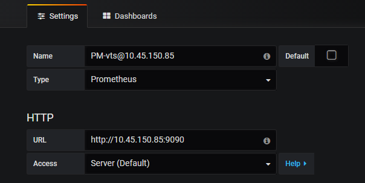

# Nginx

## Linux安装

1、从官网下载源码

`http://nginx.org/en/download.html`


2、安装依赖包

```
yum install gcc-c++				# c++编译器				
yum install -y pcre pcre-devel	# nginx的http模块需要用pcre解析
yum install -y zlib zlib-devel	# 多种压缩和解压方式
yum install -y openssl openssl-devel # https是基于SSL协议
```


3、解压到 `/usr/local/nginx-1.14.0`

因为nginx默认安装到 `/usr/local/nginx` 目录下，所以建议源码安装包放在  `/usr/local/nginx-1.14.0` 

```
tar -xvf nginx-1.14.0.tar.gz -C /usr/local/
```

4、编译和安装（如果有问题，可能是：缺少依赖包、安装目录找不到）

```
cd /usr/local/nginx/nginx-1.14.0
./configure
make
make install
```

5、nginx常用命令

```
./sbin/nginx			# 启动
./sbin/nginx -s stop	# 关闭
./sbin/nginx -s quit	# 关闭
./sbin/nginx -s reload  # 刷新配置
```


## 配置文件结构

配置文件位置 `conf/nginx.conf` 

参考：`https://www.runoob.com/w3cnote/nginx-setup-intro.html`


## 代理第一个服务（http服务）

1、编辑配置文件 `vim conf/nginx.conf` 

2、重载配置文件 `./sbin/nginx -s reload` 


## 配置支持websocket


# 监控Nginx中的服务

## 原理

如果你希望你的NGINX监控工具开始消耗指标，你首先需要启用NGINX stub_status模块。一旦你这样做了，NGINX就会暴露出一个指标的URL，然后可以被不同的监控方案所消耗。

nginx-module-vts：Nginx的监控模块，能够提供JSON格式的数据产出。

nginx-vts-exporter：依赖于nginx-module-vts，主要用于收集Nginx的监控数据，并给Prometheus提供监控接口，默认端口号9913。

注：nginx-module-vts 模块从0.1.17+版本之后原生支持 prometheus 数据格式，可跳过 nginx-vts-exporter 的安装。

prometheus：获取数据；序列化存储；消息告警等等。

Grafana：展示数据、数据可视化。


## nginx-module-vts

下载nginx-module-vts-master.zip

```
unzip nginx-module-vts-master.zip
mv nginx-module-vts-master /usr/local/
```

带着nginx-module-vts模块，重新安装一遍nginx

```
./configure --add-module=/usr/local/nginx-module-vts-master
```

编译

```
make && make install
```

查看配置

```
./sbin/nginx -V
```

添加nginx-module-vts模块的配置

```
http {
    vhost_traffic_status_zone;	# 流量监控模块
    vhost_traffic_status_filter_by_host on;   #开启此功能，会根据不同的server_name进行流量的统计，否则默认会把流量全部计算到第一个上。
    vhost_traffic_status_filter_by_uri 

    ...

    server {
    	listen  80;
        ...

        location /status {
            vhost_traffic_status_display;
            vhost_traffic_status_display_format html;
        }
    }
}
```

重启

```
./sbin/nginx -s stop
./sbin/nginx
```

前端访问

```
localhost/status
localhost/status/format/json		# 这个需要nginx-vts-exporter暴露给prometheus
localhost/status/format/prometheus  # 这个可以直接给prometheus
```

问：既然可以直接给prometheus数据，为什么还要装nginx-vts-exporter

答：因为Grafana面板需要json配置，开源的配置的数据源是nginx-vts-exporter的比较多

# 监听-docker安装

## nginx+vts

没有用。服务器直接安装的nginx和vts。

## nginx-vts-exporter

下载镜像

```yaml
sophos/nginx-vts-exporter:0.10.3
```

启动

```yaml
docker run  -tid -p 9913:9913 --rm --env NGINX_STATUS="http://xxxxx/status/format/json" sophos/nginx-vts-exporter
```

访问`http://localhost:9913/metrics`进行确认


## Prometheus

下载镜像

```
docker pull prome/prometheus
```

启动

```bash
docker run -d --name zjcprom prom/prometheus
```

复制路径

```
docker cp zjcprom:/etc/prometheus/prometheus.yml /usr/local/etc/prometheus/prometheus.yml
```

修改配置

```
global:
  # 拉去间隔，默认1分钟  # 数据存储，默认15天
  scrape_intervel: 30s
  evalution_intervel: 30s

scrape_configs:
  # 直接取vts数据 （对应Grafana模板 9785）
  - job_name: "PM-vts@nginx"
    metrics_path: /status/format/prometheus
    static_configs:
      - targets: ["10.45.150.85:80"]

  # 通过nginx-vts-exporter取数据 （对应Grafana模板 2949）
  - job_name: "PM-vts-exporter@nginx"
    static_configs:
      - targets: ["10.45.150.85:9913"]

```

删除上一个容器，创建新容器

```
docker stop zjcprom
docker rm zjcprom

docker run -d --name zjcprom -p 9090:9090 -v /usr/local/etc/prometheus/prometheus.yml:/etc/prometheus/prometheus.yml prome/prometheus
```

测试地址：`http://localhost:9090/`


## Grafana

下载镜像

```
docker pull grafana/grafana:8.3.3
```

启动

```
docker run -d --name=grafana -p 3000:3000 grafana/grafana
```

访问`http://localhost:3000`，默认用户名和密码为admin/admin


配置：configuration -> Add Data Sources -> prometheus -> 配置prometheus的URL -> 保存



使用模板，配置一个好看的面板。搜grafana dashboard，进入官网找模板。

我用的是9785 2949这两个 Dashboard。从官网下载一个json配置，在Grafana中导入即可。


# 指标与计算方式

```
https://blog.csdn.net/chuanxincui/article/details/89361689

```


