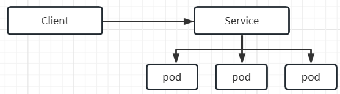
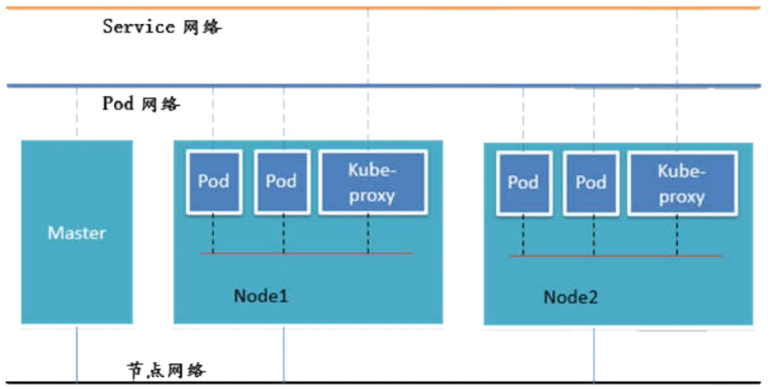
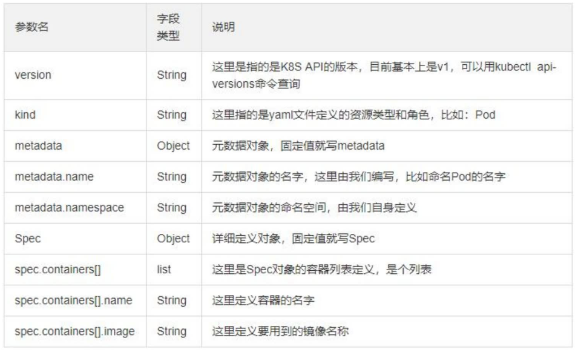
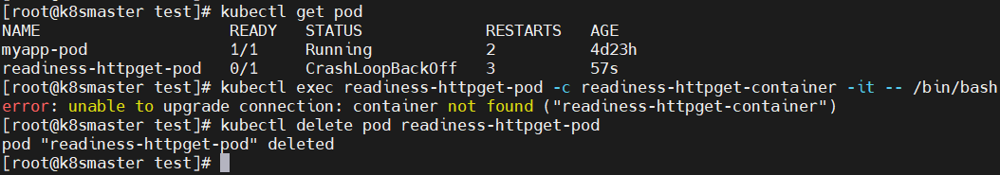
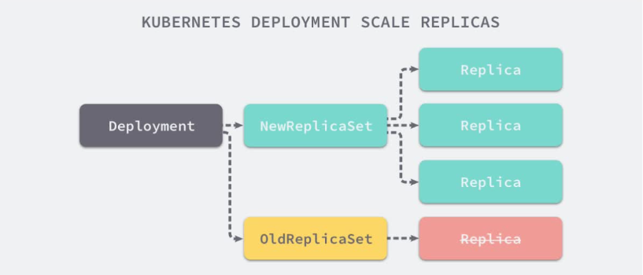
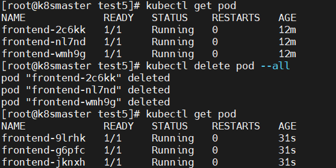
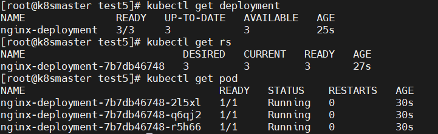

# 1  组件说明


APISERVER: 所有服务访问的统一入口

ControllerManager: 维护副本期望数目

Secheduller: 调度任务，选择合适的节点进行分配

ETCD: 键值对数据库，存储k8s集群所有重要信息，可持久化

Kubelet: 直接和容器引擎交互，实现容器的生命周期的管理

Kube-proxy: 负责写入规则至IPTables、IPVS实现服务映射访问

pod: 管理容器的最小部署单元。


其他重要组件：

CoreDNS: 可以为集群中的SVC（service）创建一个域名IP的对应关系解析

Dashboard: 给k8s集群提供一个B/S结构的访问体系

INGRESS Controller: 官方只能实现四层代理，Ingress可以实现七层代理

Federation: 提供一个可以跨集群中心多k8s统一管理功能

 Prometheus: 提供k8s集群的监控能力

ELK: 提供k8s集群日志统一分析接入平台。


# 2 基本概念

> 这章对概念有个基本认识，不要求完全理解。后面慢慢理解。


## pod

概念：

* pod是最小部署单元，是一组容器的集合，这些容器共享资源，同生共死。

分类：

* 自主式Pod：灭亡后不会重启，没人管。
* 控制管理器的Pod：可以通过controller（控制器/管理器）来管理。


## controller

概念：

* controller是在集群上管理和运行应用的。
* Pod是通过Controller实现应用的运维，比如伸缩、滚动升级等


> 个人理解：我一开始不理解controller和pod关系，可以简单认为controller是一个更高级的pod。controller相较于pod有更多的功能。


controller分类：

* ReplicationController & ReplicaSet & Deployment
* StatefullSet
* DaemonSet
* Job，Corn job


ReplicationController 用来确保容器应用的副本数始终保持在用户定义的副本数，即如果有容器异常退出，会自动创建新的 Pod 来替代；而如果异常多出来的容器也会自动回收。在新版本的 Kubernetes 中建议使用 ReplicaSet 来取代 ReplicationController

ReplicaSet 跟 ReplicationController 没有本质的不同，只是名字不一样，并且ReplicaSet 支持集合式的 selector。虽然 ReplicaSet 可以独立使用，但一般还是建议使用 Deployment 来自动管理ReplicaSet ，这样就无需担心跟其他机制的不兼容问题（比如 ReplicaSet 不支持rolling-update 但 Deployment 支持）

Deployment 为 Pod 和 ReplicaSet 提供了一个声明式定义 (declarative) 方法，用来替代以前的 ReplicationController 来方便的管理应用。Deployment不创建pod，而是通过RS管理pod。典型的应用场景包括：

* 定义 Deployment 来创建 Pod 和 ReplicaSet
* 滚动升级和回滚应用
* 扩容和缩容
* 暂停和继续 Deployment


> Horizontal Pod Autoscaling （水平自动扩展pod）仅适用于 Deployment 和 ReplicaSet ，在 V1 版本中仅支持根据 Pod的 CPU 利用率扩缩容，在 v1alpha 版本中，支持根据内存和用户自定义的 metric 扩缩容。


StatefulSet 是为了解决有状态服务的问题（对应 Deployments 和 ReplicaSets 是为无状态服务而设计），其应用场景包括：

* 稳定的持久化存储，即 Pod 重新调度后还是能访问到相同的持久化数据，基于 PVC 来实现
* 稳定的网络标志，即 Pod 重新调度后其 PodName 和 HostName 不变，基于 Headless Service（即没有 Cluster IP 的 Service ）来实现
* 有序部署，有序扩展，即 Pod 是有顺序的，在部署或者扩展的时候要依据定义的顺序依次依次进行（即从 0 到 N-1，在下一个 Pod 运行之前所有之前的 Pod 必须都是 Running 和 Ready 状态），基于 init containers 来实现
* 有序收缩，有序删除（即从 N-1 到 0）

DaemonSet 确保全部（或者一些）Node 上运行一个 Pod 的副本。当有 Node 加入集群时，也会为他们新增一个 Pod 。当有 Node 从集群移除时，这些 Pod 也会被回收。删除 DaemonSet 将会删除它创建的所有 Pod。使用 DaemonSet 的一些典型用法：

* 运行集群存储 daemon，例如在每个 Node 上运行 glusterd、ceph。
* 在每个 Node 上运行日志收集 daemon，例如fluentd、logstash。
* 在每个 Node 上运行监控 daemon，例如 Prometheus Node Exporter

Job 负责批处理任务，即仅执行一次的任务，它保证批处理任务的一个或多个 Pod 成功结束。

Cron Job 管理基于时间的 Job，即：

* 在给定时间点只运行一次
* 周期性地在给定时间点运行


## service

通过创建 Service,可以为一组具有相同功能的容器应用提供一个统一的入口地址，并且将请求负载分发到后端的各个容器应用上。




## 网络通信方式

常见通信：

* 一个Pod中的各个容器通信：共享一个网络空间，共享一个Linux协议栈
* Pod1至Pod2在同一台机器：通过Docker网桥通信
* Pod1至Pod2不在一台机器：Overlay Network（覆盖网络，下面将）
* Pod和Service之间的通信：负载均衡实现




为什么需要覆盖网络？

Kubernetes 的网络模型假定了所有 Pod 都在一个可以直接连通的扁平的网络空间中，这在GCE（Google Compute Engine）里面是现成的网络模型，Kubernetes 假定这个网络已经存在。而在私有云里搭建 Kubernetes 集群，就不能假定这个网络已经存在了。我们需要自己实现这个网络假设，将不同节点上的 Docker 容器之间的互相访问先打通，然后运行 Kubernetes。

Flannel:

Flannel 是 CoreOS 团队针对 Kubernetes 设计的一个网络规划服务，简单来说，它的功能是让集群中的不同节点主机创建的 Docker 容器都具有全集群唯一的虚拟IP地址。而且它还能在这些 IP 地址之间建立一个覆盖网络（Overlay Network），通过这个覆盖网络，将数据包原封不动地传递到目标容器内。

etcd之flannel提供说明：

* 存储管理 Flannel 可分配的 IP 地址段资源
* 监控 ETCD 中每个 Pod 的实际地址，并在内存中建立维护 Pod 节点路由表


ETCD 之 Flannel 提供说明：

* 存储管理 Flannel 可分配的 IP 地址段资源
* 监控 ETCD 中每个 Pod 的实际地址，并在内存中建立维护 Pod 节点路由表

不同情况下网络通信方式：

* 同一个 Pod 内部通讯：同一个 Pod 共享同一个网络命名空间，共享同一个 Linux 协议栈
* Pod1 至 Pod2：
    * Pod1 与 Pod2 不在同一台主机，Pod的地址是与docker0在同一个网段的，但docker0网段与宿主机网卡是两个完全不同的IP网段，并且不同Node之间的通信只能通过宿主机的物理网卡进行。将Pod的IP和所在Node的IP关联起来，通过这个关联让Pod可以互相访问
    * Pod1 与 Pod2 在同一台机器，由 Docker0 网桥直接转发请求至 Pod2，不需要经过 Flannel演示
* Pod 至 Service 的网络：目前基于性能考虑，全部为 iptables 维护和转发
* Pod 到外网：Pod 向外网发送请求，查找路由表, 转发数据包到宿主机的网卡，宿主网卡完成路由选择后，iptables执行Masquerade，把源 IP 更改为宿主网卡的 IP，然后向外网服务器发送请求
* 外网访问 Pod：Service


# 3 集群搭建


# 4 资源清单

## 概念

在 k8s 中，一般使用 yaml 格式的文件来创建符合我们预期期望的 pod ，这样的 yaml 文件我们一般称为资源清单


## 分类


> K8s 中所有的内容都抽象为资源，资源实例化之后，叫做对象


集群资源级别分类

* 名称空间级别
* 集群级别
* 元数据型

名称空间级别：

* 工作负载型资源( workload )：Pod、ReplicaSet、Deployment、StatefulSet、DaemonSet、Job、CronJob ( ReplicationController 在 v1.11 版本被废弃 )
* 服务发现及负载均衡型资源( ServiceDiscovery LoadBalance )：Service、Ingress、...
* 配置与存储型资源：Volume( 存储卷 )、CSI( 容器存储接口,可以扩展各种各样的第三方存储卷 )特殊类型的存储卷：ConfigMap( 当配置中心来使用的资源类型 )、Secret(保存敏感数据)、DownwardAPI(把外部环境中的信息输出给容器)

集群级资源：Namespace、Node、Role、ClusterRole、RoleBinding、ClusterRoleBinding

元数据型资源：HPA、PodTemplate、LimitRange


## 资源清单详解

略（在后面代码中，逐渐学习）




# 5 Pod

## 概念

概念：

* pod是最小部署单元，是一组容器的集合，这些容器共享资源，同生共死。

分类：

* 自主式Pod：灭亡后不会重启，没人管。
* 控制管理器的Pod：可以通过controller（控制器/管理器）来管理。

> 个人理解："控制管理器的Pod"就是指Controller，因为controller是一个更高级的pod


本章主要用自主式Pod，讲解Pod的生命周期


## Pod的生命周期


mainC: 可以看作主程序

initC：是一个用于初始化pod的容器

readness和liveness: 用于检测程序状态等

start和stop: 启动和结束做一些工作。


## init容器

**init容器讲解：**

Pod 能够具有多个容器，应用运行在容器里面，但是它也可能有一个或多个先于应用容器启动的 Init容器

Init 容器与普通的容器非常像，除了如下两点：

* Init 容器总是运行到成功完成为止
* 每个 Init 容器都必须在下一个 Init 容器启动之前成功完成

如果 Pod 的 Init 容器失败，Kubernetes 会不断地重启该 Pod，直到 Init 容器成功为止。然而，如果 Pod 对应的 restartPolicy 为 Never，它不会重新启动

因为 Init 容器具有与应用程序容器分离的单独镜像，所以它们的启动相关代码具有如下优势：

* 它们可以包含并运行实用工具，但是出于安全考虑，是不建议在应用程序容器镜像中包含这些实用工具的
* 它们可以包含使用工具和定制化代码来安装，但是不能出现在应用程序镜像中。例如，创建镜像没必要 FROM 另一个镜像，只需要在安装过程中使用类似 sed、awk、python 或 dig这样的工具。
* 应用程序镜像可以分离出创建和部署的角色，而没有必要联合它们构建一个单独的镜像。
* Init 容器使用 Linux Namespace，所以相对应用程序容器来说具有不同的文件系统视图。因此，它们能够具有访问 Secret 的权限，而应用程序容器则不能。

特殊说明

* 在 Pod 启动过程中，Init 容器会按顺序在网络和数据卷初始化之后启动。每个容器必须在下一个容器启动之前成功退出
* 如果由于运行时或失败退出，将导致容器启动失败，它会根据 Pod 的 restartPolicy 指定的策略进行重试。然而，如果 Pod 的 restartPolicy 设置为 Always，Init 容器失败时会使用RestartPolicy 策略
* 在所有的 Init 容器没有成功之前，Pod 将不会变成 Ready 状态。Init 容器的端口将不会在Service 中进行聚集。正在初始化中的 Pod 处于 Pending 状态，但应该会将 Initializing 状态设置为 true
* 如果 Pod 重启，所有 Init 容器必须重新执行
* 对 Init 容器 spec 的修改被限制在容器 image 字段，修改其他字段都不会生效。更改 Init容器的 image 字段，等价于重启该 Pod
* Init 容器具有应用容器的所有字段。除了 readinessProbe，因为 Init 容器无法定义不同于完成（completion）的就绪（readiness）之外的其他状态。这会在验证过程中强制执行
* 在 Pod 中的每个 app 和 Init 容器的名称必须唯一；与任何其它容器共享同一个名称，会在验证时抛出错误


**init容器代码示例：**


> 步骤说明：
>
> 1、创建了一个Pod叫myapp-pod，它包含三个容器。一个叫myapp-container，还有两个init容器。这两个init容器没有启动成功，所以该pod也不能启动成功。
>
> 2、创建两个Service，当两个Service启动成功后，Pod才启动成功。


1、创建了一个Pod叫myapp-pod，它包含三个容器。一个叫myapp-container，还有两个init容器。这两个init容器没有启动成功，所以该pod也不能启动成功。

创建文件ini-pod.yaml

```
apiVersion: v1
kind: Pod
metadata:
  name: myapp-pod
  labels:
    app: myapp
spec:
  containers:
  - name: myapp-container
    image: busybox
    command: ['sh', '-c', 'echo The app is running! && sleep 3600']
  initContainers:
  - name: init-myservice
    image: busybox
    command: ['sh', '-c', 'until nslookup myservice; do echo waiting for myservice; sleep 2; done;']
  - name: init-mydb
    image: busybox
    command: ['sh', '-c', 'until nslookup mydb; do echo waiting for mydb; sleep 2; done;']

```

命令：

```
kubectl create -f ini-pod.yaml
kubectl get pod		# 发现init状态为0/2
```


2、创建两个Service，当两个Service启动成功后，Pod才启动成功。

创建文件myservice.yaml

```
kind: Service
apiVersion: v1
metadata:
  name: myservice
spec:
  ports:
    - protocol: TCP
      port: 80
      targetPort: 9376
```

命令

```
kubectl create -f myservice.yaml
kubectl get pod					# 发现init状态为1/2 (需要等一会)
kubectl get svc					# svc中有一个myservice服务
kubectl get pod -n kube-system	# coredns是K8s为 myservice维护的IP地址
```


创建文件 mydb.yaml

```
kind: Service
apiVersion: v1
metadata:
  name: mydb
spec:
  ports:
    - protocol: TCP
	  port: 80
	  targetPort: 9377
```

命令

```
kubectl create -f mydb.yaml
kubectl get pod					# 发现init状态为2/2 (需要等一会)
kubectl get svc					# svc中有一个mydb服务

# 最后把pod和svc删除
kubectl delete pod --all
kubectl delete svc 
```


## 探针

**init容器的问题：**

* init容器适合做系统初始化，不适合用于检测其它容器是否存活等状态。
* 检测容器状态，应该用探针。


**探针详解：**

探针是由 kubelet 对容器执行的定期诊断。要执行诊断，kubelet 调用由容器实现的 Handler。有三种类型的处理程序：

* ExecAction：在容器内执行指定命令。如果命令退出时返回码为 0 则认为诊断成功。
* TCPSocketAction：对指定端口上的容器的 IP 地址进行 TCP 检查。如果端口打开，则诊断被认为是成功的。
* HTTPGetAction：对指定的端口和路径上的容器的 IP 地址执行 HTTP Get 请求。如果响应的状态码大于等于200 且小于 400，则诊断被认为是成功的

每次探测都将获得以下三种结果之一：

* 成功：容器通过了诊断。
* 失败：容器未通过诊断。
* 未知：诊断失败，因此不会采取任何行动

探测方式：

* livenessProbe：指示容器是否正在运行。如果存活探测失败，则 kubelet 会杀死容器，并且容器将受到其 重启策略 的影响。如果容器不提供存活探针，则默认状态为 Success
* readinessProbe：指示容器是否准备好服务请求。如果就绪探测失败，端点控制器将从与 Pod 匹配的所有 Service 的端点中删除该 Pod 的 IP 地址。初始延迟之前的就绪状态默认为 Failure。如果容器不提供就绪探针，则默认状态为 Success


## 代码示例

**探针检测示例1：就绪探测**

创建read.yaml

> 说明：创建pod；创建容器；readinessProbe探针检测：在容器初始化1s后，对端口和路径上执行HTTP GET请求，周期是3s.

```
apiVersion: v1
kind: Pod
metadata:
  name: readiness-httpget-pod
  namespace: default
spec:
  containers:
  - name: readiness-httpget-container
    image: busybox:1.36
    imagePullPolicy: IfNotPresent
    readinessProbe:
      httpGet:
        port: 80
        path: /index1.html
      initialDelaySeconds: 1
      periodSeconds: 3

```

命令

```
kubectl create -f read.yaml
kubectl get pod		# 发现readiness-httpget-pod没有启动成功
# 上面pod状态如果是Running，则可以执行以下命令
# 上面pod状态如果是CrashLoopBackOff，则不可以执行（因为容器没启动成功）
# 含义：运行Pod,进入容器，并创建一个终端交互窗口（类似于docker命令）
kubectl exec readiness-httpget-pod -c readiness-httpget-container -it -- /bin/bash
# 删除pod
kubectl delte pod readiness-httpget-pod
```




**探针检测示例2：存活探测**

创建live.yaml

> 说明：探针检测容器是否有文件，如果没有重启。

```
apiVersion: v1
kind: Pod
metadata:
  name: liveness-exec-pod
  namespace: default
spec:
  containers:
  - name: liveness-exec-container
    image: busybox:1.36
    imagePullPolicy: IfNotPresent
    command: ["/bin/sh", "-c", "touch /tmp/live; sleep 60; rm -rf /tmp/live; sleep 3600"]
    livenessProbe:
      exec:
        command: ["test", "-e", "/tmp/live"]
      initialDelaySeconds: 1
      periodSeconds: 3

```

命令

```
kubectl create -f live.yaml
kubectl get pod
kubectl get pod  # 过一会，发现pod重新启动了，因为探针检测到文件不存在
kubectl delete pod liveness-exec-pod
```


**代码示例：postStart & preStop**


> 示例说明：
>
> postStart 和 preStop是Pod生命周期的一部分。当容器启动成功后postStart，输出Hello；当容器停止前preStop，输出Hello。


创建文件post.yaml

```
apiVersion: v1
kind: Pod
metadata:
  name: lifecycle-demo
spec:
  containers:
  - name: lifecycle-demo-container
    image: nginx
    imagePullPolicy: IfNotPresent
    lifecycle:
      postStart:
        exec:
          command: ["/bin/sh", "-c", "echo Hello from the postStart handler > /test.txt"]
      preStop:
        exec:
          command: ["/bin/sh", "-c", "echo Hello from the preStop handler > /test.txt"]

```


命令

```
kubectl create -f post.yaml
kubectl get pod
kubectl exec lifecycle-demo -it -- /bin/sh # pod中只有一个容器，可以省略 -c xxx-container
```


# 6 Controller

## 控制器详解

**是什么？**

Kubernetes中内建了很多controller（控制器），这些相当于一个状态机，用来控制Pod的具体状态和行为


**控制器的类型有：**

* ReplicationController和ReplicaSet
* Deployment
* DaemonSet
* StateFulSet
* Job/CronJob
* Horizontal Pod Autoscaling


**ReplicationController和ReplicaSet**

ReplicationController（RC）用来确保容器应用的副本数始终保持在用户定义的副本数，即如果有容器异常退出，会自动创建新的Pod来替代；而如果异常多出来的容器也会自动回收；

在新版本的Kubernetes中建议使用ReplicaSet来取代ReplicationController。ReplicaSet跟ReplicationController没有本质的不同，只是名字不一样，并且ReplicaSet支持集合式的selector；


**Deployment**

Deployment为Pod和ReplicaSet提供了一个声明式定义(declarative)方法，用来替代以前的ReplicationController来方便的管理应用。Deployment不直接创建pod，而是通过管理RS实现对pod的控制。典型的应用场景包括：

* 定义Deployment来创建Pod和ReplicaSet
* 滚动升级和回滚应用
* 扩容和缩容
* 暂停和继续Deployment





> 声明式定义：定义想要的结果，具体过程计算机执行。具体命令如：apply
>
> 命令式定义：定义具体过程。具体命令如：create


**DaemonSet**

DaemonSet确保全部（或者一些）Node上运行一个Pod的副本。当有Node加入集群时，也会为他们新增一个Pod。当有Node从集群移除时，这些Pod也会被回收。删除DaemonSet将会删除它创建的所有Pod

使用DaemonSet的一些典型用法：

* 运行集群存储daemon，例如在每个Node上运行glusterd、ceph
* 在每个Node上运行日志收集daemon，例如fluentd、logstash
* 在每个Node上运行监控daemon，例如Prometheus Node Exporter、collectd、Datadog代理、New Relic代理，或Gangliagmond


**Job**

Job负责批处理任务，即仅执行一次的任务，它保证批处理任务的一个或多个Pod成功结束


**CronJob**

Cron Job管理基于时间的Job，即：

* 在给定时间点只运行一次
* 周期性地在给定时间点运行


**StatefulSet**

StatefulSet作为Controller为Pod提供唯一的标识。它可以保证部署和scale的顺序。

StatefulSet是为了解决有状态服务的问题（对应Deployments和ReplicaSets是为无状态服务而设计），其应用场景包括：

* 稳定的持久化存储，即Pod重新调度后还是能访问到相同的持久化数据，基于PVC来实现。
* 稳定的网络标志，即Pod重新调度后其PodName和HostName不变，基于Headless Service（即没有Cluster IP的Service）来实现。
* 有序部署，有序扩展，即Pod是有顺序的，在部署或者扩展的时候要依据定义的顺序依次依次进行（即从0到N-1，在下一个Pod运行之前所有之前的Pod必须都是Running和Ready状态），基于init containers来实现。
* 有序收缩，有序删除（即从N-1到0）


**Horizontal Pod Autoscaling**

应用的资源使用率通常都有高峰和低谷的时候，如何削峰填谷，提高集群的整体资源利用率，让service中的Pod个数自动调整呢？这就有赖于Horizontal Pod Autoscaling了，顾名思义，使Pod水平自动缩放


## 示例1：RS


> 示例说明：
>
> 1、创建一个RS，叫frontend；定义RS的副本3，标签tier:frontend；标签可以绑定pod，该标签对应的pod中包含一个容器myapp。
>
> 2、修改标签；删除pod等操作，并不会改变副本为3，说明RS具备管理pod副本的功能。


创建文件rs.yaml

资源文件解释：

* fronttend是前端项目的意思。
* 标签：将控制器和pod关联起来

* template和pod定义类似，说明controller包含pod

```
apiVersion: apps/v1
kind: ReplicaSet
metadata:
  name: frontend
spec:
  replicas: 3
  selector:
    matchLabels:
      tier: frontend
  template:
    metadata:
      labels:
        tier: frontend
    spec:
      containers:
      - name: myapp
        image: nginx
        env:
        - name: GET_HOSTS_FROM
          value: dns
        ports:
        - containerPort: 80
```

命令

```
kubectl create -f rs.yaml
kubectl get pod				# 发现三个frontend的pod
kubectl delete pod --all	# 删除
kubectl get pod				# 虽然删除了，但是还存在，说明rs在自动创建
kubectl get pod 
kubectl get pod --show-labels		# 修改其中一个pod的label
kubectl label pod frontend-9lrhk tier=frontend1 --overwrite=true
kubectl get pod --show-labels		# 发现有四个pod，说明rs和pod通过标签关联

kbuectl delete pod rs --all	# 删除rs （3个）
kubectl delete pod --all 	# 删除pod （1个）
```




## 示例2：Deployment


> 示例说明：
>
> 1、创建deployment，叫nginx-deployment；通过标签app:nginx关联pod；pod有容器mynginx；
>
> 


创建文件deployment.yaml

```
apiVersion: apps/v1
kind: Deployment
metadata:
  name: nginx-deployment
spec:
  replicas: 3
  selector:
    matchLabels:
      app: nginx
  template:
    metadata:
      labels:
        app: nginx
    spec:
      containers:
      - name: mynginx
        image: nginx
        ports:
        - containerPort: 80
```


命令

```
kubectl apply -f deployment.yaml --record		# apply是声明式命令; record记录历史
kubectl get deployment
kubectl get rs
kubectl get pod

# 扩容：扩容不会改变rs
kubectl scale deployment nginx-deployment --replicas 5
kubectl get rs
kubectl get pod
# 更新镜像：会改变rs（重新建一个rs）
kubectl set image deployment/nginx-deployment mynginx=nginx:1.9.1
kubectl get rs -o wide
# 回退
kubectl rollout undo deployment/nginx-deployment
# 查看历史（创建时有record,才会有历史）
kubectl rollout history deployment/nginx-deployment
# 回退到指定版本
kubectl rollout undo deployment/nginx-deployment --to-revision=2
# 查看是否回滚成功
kubectl rollout status deployment/nginx-deployment
```





## 示例3：DaemonSet


---


7 Service

8 存储

9 集群调度

10 认证&安全

11 Helm

12 高可用集群搭建


