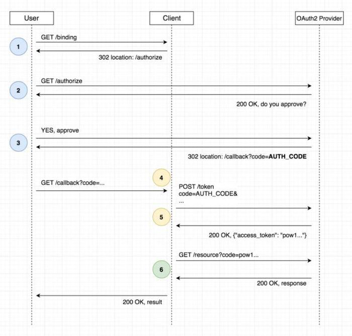
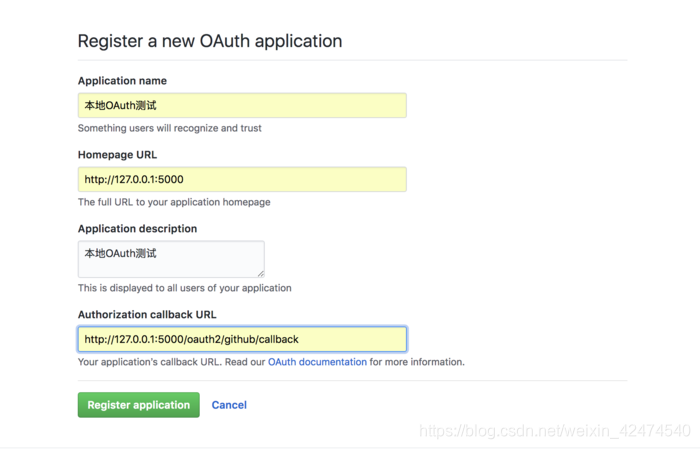
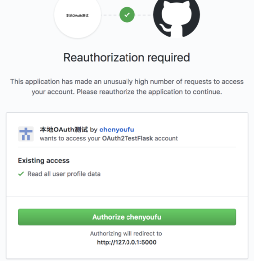

# Flask

## 启动一个代码

```
from flask import Flask

app = Flask(__name__)


@app.route('/', methods=['POST'])
def hello_world():
    return 'Hello World'


if __name__ == '__main__':
    app.run(host='0.0.0.0', port=8888, debug=True)
```

测试

```
curl -X POST  "http://localhost:8888/"
```


## BluePrint 

一个项目有很多模块，如用户模块、商品模块、账单模块等等。BluePrint可以实现**路由**分组（模块化）。

项目结构如下：

```
blue-example/
├── app.py
├── user_app.py
└── test_app.py
```

user_app.py代码如下

```
from flask import Blueprint

user_blue = Blueprint('user', __name__, url_prefix='/user')


@user_blue.route('/')
def register():
    return 'register'

```

test_app.py代码如下

```
from flask import Blueprint

test_blue = Blueprint('test', __name__, url_prefix='/test')


@test_blue.route('/')
def test():
    return 'test'

```

app.py代码如下

```
from flask import Flask

from test_app import test_blue
from user_app import user_blue

app = Flask(__name__)
app.register_blueprint(user_blue)
app.register_blueprint(test_blue)

if __name__ == '__main__':
    app.run(host='0.0.0.0', port=8888, debug=True)

```


## flask_login

提供的方法

```
# 类
UserMixin     用户类

#方法
login_user()  用户登入
logout_user() 登出功能

# 变量
current_user  获取当前用户

# 装饰器
@login_required 访问限制
```

代码如下

```
from flask import Flask
from flask_login import UserMixin, LoginManager, login_required, logout_user, login_user, current_user

app = Flask(__name__)

# 1、实例化登录管理对象：将LoginManager实例与Flask应用关联起来，以便可以使用它来管理用户的登录状态。
login_manager = LoginManager()
login_manager.init_app(app)


# 2、编写用户类
class User(UserMixin):
    pass


# 3、加载用户, login_required 需要查询用户信息
@login_manager.user_loader
def user_loader(user_id: str):
    return User()


# 4、登录
@app.route('/login', methods=['GET', 'POST'])
def login():
    login_user(User())


# 5、登出功能实现
@app.route('/logout')
@login_required  # 访问控制
def logout():
    logout_user()


@app.route('/', methods=['GET'])
@login_required
def hello_world():
    return 'Hello ' + str(current_user)


if __name__ == '__main__':
    app.run(host='0.0.0.0', port=8888, debug=True)

```


Flask-Login通过装饰器**@login_required**来检查访问视图函数的用户是否已登录，没有登录时会跳转到**login_manager.login_view = 'auth.login'**所注册的登录页。登录时即需调用login_user()函数，而在内部调用了由我们注册的回调函数。

Flask-Login就是通过装饰器，来注册回调函数，当没有sessionID时，通过装饰器指定的函数来读取用户到session中，达到在前端模板中调用当前登录用户current_user的目的，该装饰器就是：

**@login_manager.user_loader**


## flask_login鉴权

在进行login_required权鉴的时候，flask-login 有3种验证方式

 

1、login_manager.user_loader

> 其实就是session验证，小程序或者webapi不太实用

2、login_manager.request_loader

> 验证信息放入到request对象，request对象可以从header，body，values等等中获取，很灵活

3、login_manager.header_loader（这种方案可以忽略）

> 从header中获取验证，使用起来与session一致


所以，可以实现


## flask_session

flask默认提供了session, 但是存在以下问题:

　　① session数据存在客户端, 不安全

　　② 大小有限制

　　③ 增加了客户端的压力

flask_session只需要这么做：

```
from flask_session import Session
from flask import Flask

app = Flask(__name__)
app.config["SESSION_TYPE"] = "filesystem"  # 会话数据将存储在服务器的文件系统中。
app.config['SESSION_USE_SIGNER'] = True   # 是否强制加盐，混淆session
app.config['SECRET_KEY'] = 'tas2fd'  	# 如果加盐，那么必须设置的安全码，盐
app.config['SESSION_PERMANENT'] = False  # sessons是否长期有效，false，则关闭浏览器，session失效
app.config['PERMANENT_SESSION_LIFETIME'] = 3600   # session长期有效，则设定session生命周期，整数秒，默认大概不到3小时。
Session(app)  # 初始化Flask-Session扩展，它提供了对会话的支持。
```

或者用redis

```
app.config['SESSION_TYPE'] = 'redis'   #session存储格式为redis
app.config['SESSION_REDIS'] = Redis(    #redis的服务器参数
    host='192.168.1.3',                 #服务器地址
    port=6379)                           #服务器端口
```


## OAuth 2.0 (以github为例)



整个OAuth2 的流程分为三个阶段：

1. 网站和 Github 之间的协商
2. 用户和 Github 之间的协商
3. 网站和 Github 用户数据之间的协商

1、网站和 Github 之间的协商

如果我想获取用户的信息，Github 会要求我，先在它的平台上注册一个应用，在申请的时候标明需要获取用户信息的哪些权限，用多少就申请多少，并且在申请的时候填写你的网站域名，Github 只允许在这个域名中获取用户信息。

此时我的网站已经和 Github 之间达成了共识，Github 也给我发了两张门票，一张门票叫做 Client Id，另一张门票叫做 Client Secret。



其中最后一个callback URL表示用户授权之后github默认要跳转的url地址，在代码中需要添加一个路由来处理针对这个地址的请求。

这一步非常简单，github生成了两个钥匙，Client ID和Client Secret。现在我的网站就可以使用合法的使用github提供的OAuth登陆机制了。


2、用户和 Github 之间的协商

用户进入我的网站，点击 github 登录按钮的时候，我的网站会把上面拿到的 Client Id 交给用户，让他进入到 Github 的授权页面，Github 看到了用户手中的门票，就知道这是我的网站让他过来的，于是它就把我的网站想要获取的权限摆出来，并询问用户是否允许我获取这些权限。

如果用户觉得 OK，在授权页面点击了确认授权后，页面会跳转到我预先设定的 `redirect_uri` 并附带一个盖了章的门票 **code**。




3、从 Github 获取用户的信息

用我网站的Client ID和Client Secret，再加上用户的code，就可以拿到用户的信息。

```
import requests
res = requests.post(GITHUB_OAUTH.get("url"), data={
"client_id": GITHUB_OAUTH.get("client_id"),
"client_secret": GITHUB_OAUTH.get("secret_key"),
"code": request.args.get('code')
}, headers={"Accept": "application/json"})
res = res.json()
 

headers = {"Accept": "application/json",
'Authorization': f"token {res["access_token"]}"}
res = requests.get(
f"https://api.github.com/user?access_token={access_token}",
headers=headers)
user_info = res.json()
```


