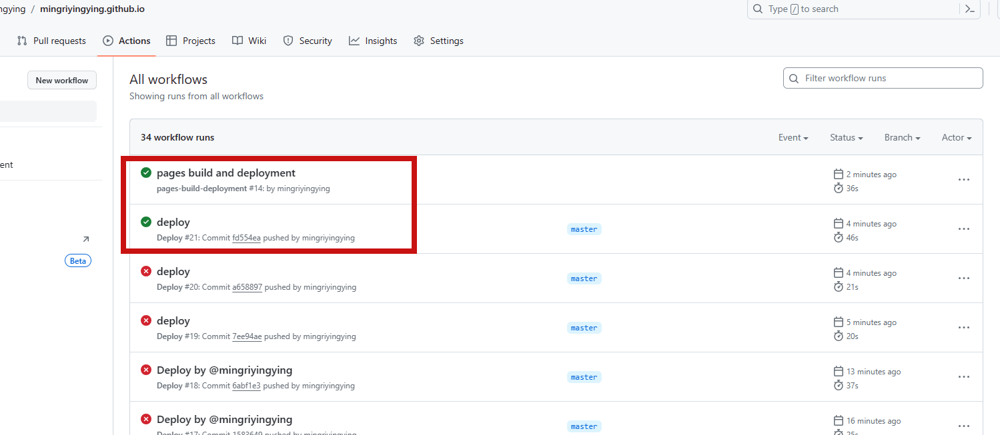

## 利用Github Actions自动部署

一般，我们开发完需要将**项目代码**提交至github的主分支，然后再将**打包代码**提交至另一个分支 或者 另一个仓库。

Github Actions则会自动构建发布：GitHub提供了服务器，我们把打包过程发至服务器中进行。

打包发布过程主要是：

```
1、构建：yarn build
2、上传dist文件夹至 另一个分支 或者 另一个仓库。（我们这里用 本仓库的另一个分支）
```

首先创建Github Actions的工作流文件worlflow，位置./.github/workflows/deploy.yml。

```
name: Deploy

on:
  push:
    branches:
      - master

jobs:
  deploy:
    runs-on: ubuntu-latest
    steps:
      - uses: actions/checkout@v3
      - uses: actions/setup-node@v3
        with:
          node-version: 16
          cache: yarn
      - run: yarn install --frozen-lockfile

      - name: Build
        run: yarn build

      - name: Deploy
        uses: peaceiris/actions-gh-pages@v3
        with:
          github_token: ${{ secrets.GITHUB_TOKEN }}
          publish_dir: docs/.vitepress/dist

```


修改github actions权限：项目仓库下的settings


上传代码。等部署成功后，就可以切换gh-page的分支。为什么会自动生成gh-page分支，因为`peaceiris/actions-gh-pages@v3`这个工作流自动帮你做了。


试了好几种deploy部署脚本，终于成功了。




不知道和这个有没有关系：在项目根目录下添加了.gitignore文件

```
node_modules
package-lock.json
docs/.vitepress/dist
```

