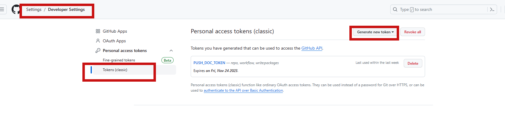
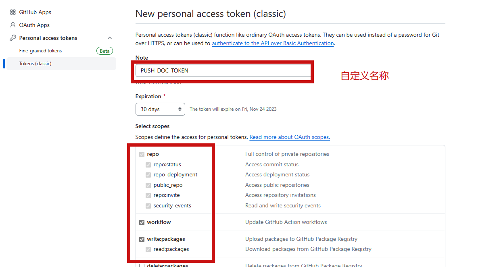
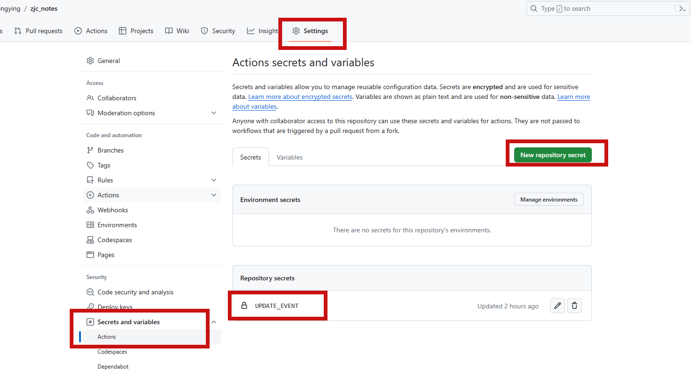

# 文档项目仓库分离

目的：项目开发完，代码不想动了。以后只编辑文档，隐藏项目代码。

分析：

1、A仓库存文档，B仓库Gihub pages仓库，也就是项目仓库。

2、A仓库更新，用github actions创建workflow，触发派发事件通知B仓库。

3、B仓库接收到该事件，拉取A仓库文档，然后自动部署。

# B仓库自动克隆A仓库

分析：`actions/checkout@v3`克隆代码时会将代码仓库克隆到工作空间（workspace）中，并设置一些环境变量以提供有关克隆操作的信息，其中工作空间就是`${{ github.workspace }}`。我们就可以在这里操作。

yml脚本：

```
name: Deploy

on:
  push:
    branches:
      - master

jobs:
  deploy:
    runs-on: ubuntu-latest
    steps:
      - name: Checkout Repository A
        uses: actions/checkout@v3

      - name: Clone Repository B
        run: |
          cd ${{ github.workspace }}
          git clone https://github.com/mingriyingying/zjc_notes.git temp-repo

      - name: Copy Repository B to Folder in Repository A
        run: |
          cd ${{ github.workspace }}
          rm -rf docs/articles/*
          mv temp-repo/articles/* docs/articles/

      - name: Setup Node.js (yarn)
        uses: actions/setup-node@v3
        with:
          node-version: 16
          cache: yarn
      
      - name: Yarn Install
        run: yarn install --frozen-lockfile

      - name: Yarn Build
        run: yarn build

      - name: Deploy to Branch gh-pages
        uses: peaceiris/actions-gh-pages@v3
        with:
          github_token: ${{ secrets.GITHUB_TOKEN }}
          publish_dir: docs/.vitepress/dist

```


# A仓库发送触发事件

分析：

使用 GitHub 的仓库派发事件（repository_dispatch）。这允许你手动或通过仓库 A 的 Actions workflow 向B仓库发送自定义事件，以触发B的 workflow 的运行。

你需要确保在 GitHub Actions workflow 中提供了正确的身份验证凭证，以便访问仓库 B。这通常包括 SSH 密钥或 个人访问令牌 Personal Access Token（PAT），并将其存储在仓库 A 的 Secrets 中。

流程：

```
1、github中创建PAT (SSH也可以)
2、A仓库存储PAT
3、B仓库定义触发事件
4、A仓库定义发送触发事件
```


在setting -> developer settings 中创建PAT




自定义一个名字




存储在A仓库的中，自定义名字




B仓库的工作流中加入监听事件：

```
name: Deploy

on:
  push:
    branches:
      - master
  repository_dispatch:
    types: [update-event]

jobs:
...
```

A仓库的工作流开启事件：

```
name: Trigger Update Event

on:
  push:
    branches:
      - master

jobs:
  trigger-webhook:
    runs-on: ubuntu-latest
    steps:
      - name: Trigger Repository B Workflow
        run: |
          curl -X POST https://api.github.com/repos/mingriyingying/mingriyingying.github.io/dispatches \
          -H "Authorization: token ${{ secrets.UPDATE_EVENT }}" \
          -H "Accept: application/vnd.github.everest-preview+json" \
          -d '{"event_type": "update-event"}'
```

