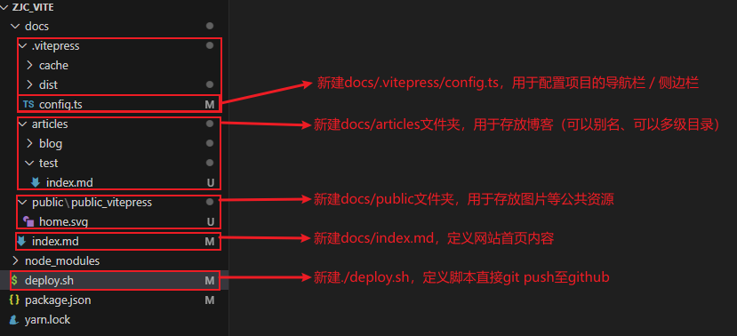
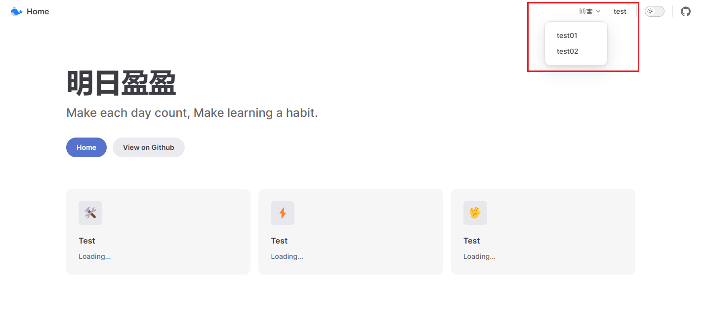
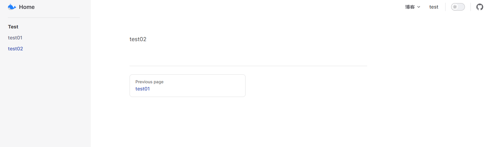
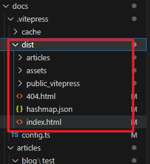
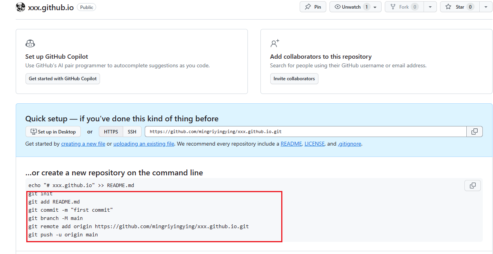
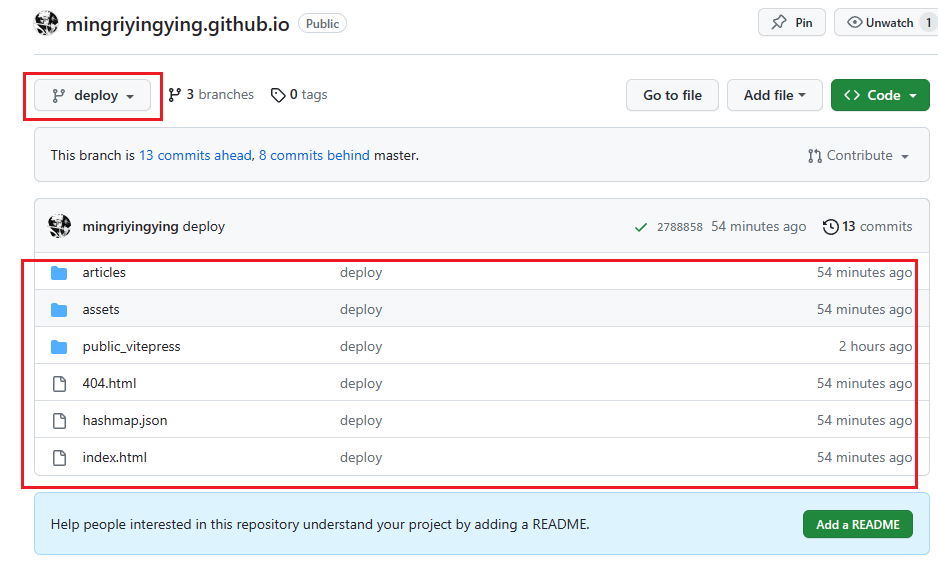

# 一、项目搭建

## 环境&项目初始化

安装node.js，略

安装git，略

创建项目

```
# 创建文件夹
mkdir zjc_vite & cd zjc_vite

# 全局安装yarn
npm install -g yarn

# 初始化项目（一直回车）
yarn init

# 安装vitepress
yarn add --dev vitepress
```

项目结构如下，**请自行创建没有的目录/文件**。

```
docs 
	./vitepress
		config.ts 	// 定义导航栏、侧边栏
	public		// 图片等公共资源
	articels	// 博客
	index.md	// 定义网站首页
package.json
```




## 配置./package.json

package.json是整个项目的配置，如项目启动、项目打包、项目部署等。

```
"scripts": {
    "dev": "vitepress dev docs",
    "build": "vitepress build docs",
    "serve": "vitepress serve docs"
}
```

后面可以一边开发，一边查看效果

```
yarn dev
```


## 自定义网站首页./docs/index.md

可以直接套用，以后再详细研究。

```
---
layout: home

title: 明日盈盈
titleTemplate: Make each day count, Make learning a habit.

hero:
  name: 
  text: 明日盈盈
  tagline: Make each day count, Make learning a habit.
  actions:
    - theme: brand
      text: Home
      link: /
    - theme: alt
      text: View on Github
      link: https://github.com/mingriyingying

features:
  - icon: 🛠️
    title: Test
    details: Loading...
  - icon: ⚡️
    title: Test
    details: Loading...
  - icon: 🖖
    title: Test
    details: Loading...
---
```

运行测试，查看效果

```
yarn dev
```


## 创建博客./docs/articles

> 我这里加了一层articles，不加这一层目录也可以。


创建几个markdown文件：

```
articles
	blog
		index.md
		test01.md
		test02.md
	test
		index.md
```


## 自定义导航栏./docs/.vitepress/config.ts

定义logo和home

```
export default {
    themeConfig: {
        logo: "/home.svg",  // 导航栏最左侧logo
        siteTitle: "Home", // 导航栏最左侧title
    }
}
```


定义菜单

```
export default {
    themeConfig: {
        logo: "/home.svg",  // 导航栏最左侧logo
        siteTitle: "Home", // 导航栏最左侧title
        nav: [
            // 一级菜单
            {
                text: "博客",
                // 二级菜单
                items: [
                    { text: 'test01', link: '/articles/blog/test/' },
                    { text: 'test02', link: '/articles/blog/test02' },
                ]
            },
            // 一级菜单
            { text: "test", link: "/articles/test/" }
        ]
    }
}
```




定义侧边栏

```
export default {
        // 侧边栏：指定菜单及对应的侧边栏
        sidebar: {
            "/articles/blog/test": [
                {
                    text: "Test",
                    items: [
                        { text: "test01", link: "/articles/blog/test/test01" },
                        { text: "test02", link: "/articles/blog/test/test02" },
                    ],
                },
            ],

        },
    }
}
```




完整配置如下：

```
export default {
    title: "明日盈盈",
    description: '一只程序猿', //mate标签description，多用于搜索引擎抓取摘要
    base: "/", // / 或者 /xxx/
    head: [
        ['link', { rel: 'icon', href: '/home.svg' }], // 网站icon
    ],
    themeConfig: {
        logo: "/home.svg",  // 导航栏最左侧logo
        siteTitle: "Home", // 导航栏最左侧title
        nav: [
            // 一级菜单
            {
                text: "博客",
                // 二级菜单
                items: [
                    { text: 'test01', link: '/articles/blog/test/' },
                    { text: 'test02', link: '/articles/blog/test02' },
                ]
            },
            // 一级菜单
            { text: "test", link: "/articles/test/" }
        ],
        // 导航栏右侧：社交链接
        socialLinks: [
            { icon: "github", link: "https://github.com/mingriyingying" },
        ],
        // 侧边栏：指定菜单及对应的侧边栏
        sidebar: {
            "/articles/blog/test": [
                {
                    text: "Test",
                    items: [
                        { text: "test01", link: "/articles/blog/test/test01" },
                        { text: "test02", link: "/articles/blog/test/test02" },
                    ],
                },
            ],

        },
    }
}

```


# 二、部署到github

## 项目打包

上面项目记得打包（打包后的文件是 docs/.vitepress/dist）

```
yarn build
```




## github创建仓库

先在Github创建一个名字叫username.github.io的仓库


## 上传dist至github

进入本地dist文件夹，按照github首页教程，将dist中的内容push到github




我这里上传到的是deploy分支，默认是master分支，教程上是main分支。




## 设置Github Pages

设置github的setting


最后访问 https://mingriyingying.github.io/


# 三、进阶配置

## 自动生成菜单

目的：能够根据 `docs` 目录自动地生成菜单和侧边栏，无需再手动去维护.

分析：在执行 `yarn dev` 之后，vitepress 会先运行 `.vitepress/config.js` 脚本，在这里自定义一个方法实现此功能。

注意：

1. 每个目录至少要有一个 `index.md` 文件，你可以在 `index.md` 做一些总览和介绍
2. 如果新建了新文件夹，需要重新执行一遍，目录配置才能生效

原理：自定义两个方法

```
// 导航栏
function generateNavConfig2(articlesPath) {

}
// 侧边栏
function generateSidebarConfig2(articlesPath) {

}

const navConfig = generateNavConfig2("");
const sidebarConfig = generateSidebarConfig2("");


export default {
    themeConfig: {
        nav: navConfig,
        sidebar: sidebarConfig,
    }
}

```


看代码，根据自己项目调整。

```
// Node.js 提供的文件系统模块（fs）和路径模块（path）
const fs = require("fs");
const path = require("path");

function generateNavConfig2(articlesPath) {
    const navConfigList = [];
    const firstLevelList = fs.readdirSync(articlesPath);

    // nav: [
    //     // 一级菜单
    //     {
    //         text: "博客",
    //         // 二级菜单
    //         items: [
    //             { text: 'vitepress', link: '/articles/blog/vitepress/' },
    //             { text: '算法', link: '/articles/blog/算法/' },
    //         ]
    //     },
    //     // 一级菜单
    //     { text: "test", link: "/articles/test/" }
    // ],

    firstLevelList.forEach((firstLevelName) => {
        const secondLevelList = fs.readdirSync(`${articlesPath}/${firstLevelName}`);
        // 文件or文件夹
        let isFirstMenu = false;
        for (secondLevelName of secondLevelList) {
            if (fs.lstatSync(path.join(articlesPath, firstLevelName, secondLevelName)).isFile()) {
                isFirstMenu = true;
                break;
            }
        }
        if (isFirstMenu) {
            navConfigList.push({ text: firstLevelName, link: `/articles/${firstLevelName}/` })
        } else {
            let tmpNav = { text: firstLevelName, items: [] }
            secondLevelList.forEach((secondLevelName) => {
                tmpNav["items"].push({ text: secondLevelName, link: `/articles/${firstLevelName}/${secondLevelName}/` })
            })
            navConfigList.push(tmpNav)
        }
    })
    return navConfigList
}

function generateSidebarConfig2(articlesPath) {
    const sidebarConfig = {};
    const firstLevelList = fs.readdirSync(articlesPath);

    // sidebar: {
    //     "/articles/blog/vitepress": [
    //         {
    //             text: "vitepress",
    //             items: [
    //                 { text: "test01", link: "/articles/blog/vitepress/01VitePress+Github搭建个人博客" },
    //                 { text: "test02", link: "/articles/blog/vitepress/02新环境如何配置" },
    //             ],
    //         },
    //     ],

    // },

    // 如果只有index文件，就没有侧边栏
    firstLevelList.forEach((firstLevelName) => {
        const secondLevelList = fs.readdirSync(`${articlesPath}/${firstLevelName}`);
        // 文件or文件夹
        let isFirstMenu = false;
        for (secondLevelName of secondLevelList) {
            curPath = fs.lstatSync(path.join(articlesPath, firstLevelName, secondLevelName))
            if (curPath.isFile()) {
                isFirstMenu = true;
                break;
            }
        }
        // 如果是一级菜单
        if (isFirstMenu) {
            let isNeedSide = false
            for (filename of secondLevelList) {
                curPath = fs.lstatSync(path.join(articlesPath, firstLevelName, filename))
                if (curPath.isFile() && filename != "index.md") {
                    isNeedSide = true;
                    break;
                }
            }
            if (isNeedSide) {
                let tmpSide = { text: firstLevelName, items: [] }
                secondLevelList.forEach((filename) => {
                    if (filename !== "images" && filename !== "index.md") {
                        tmpSide["items"].push({ text: filename, link: `/articles/${firstLevelName}/${filename}` })
                    }
                })
                sidebarConfig[`/articles/${firstLevelName}`] = [tmpSide]
            }
        } else {
            secondLevelList.forEach((secondLevelName) => {
                const fileList = fs.readdirSync(`${articlesPath}/${firstLevelName}/${secondLevelName}`);
                let isNeedSide = false
                for (filename of fileList) {
                    curPath = fs.lstatSync(path.join(articlesPath, firstLevelName, secondLevelName, filename))
                    if (curPath.isFile() && filename != "index.md") {
                        isNeedSide = true;
                        break;
                    }
                }
                if (isNeedSide) {
                    let tmpSide = { text: secondLevelName, items: [] }
                    fileList.forEach((filename) => {
                        if (filename !== "images" && filename !== "index.md") {
                            tmpSide["items"].push({ text: filename, link: `/articles/${firstLevelName}/${secondLevelName}/${filename}` })
                        }
                    })
                    sidebarConfig[`/articles/${firstLevelName}/${secondLevelName}`] = [tmpSide]
                }
            })
        }
    })

    return sidebarConfig
}

const docsPath = path.dirname(__dirname); // __dirname是当前文件所属目录的绝对路径
const articlesPath = path.join(docsPath, 'articles');
const navConfig = generateNavConfig2(articlesPath);
const sidebarConfig = generateSidebarConfig2(articlesPath);


export default {
    title: "明日盈盈",
    description: '一只程序猿', //mate标签description，多用于搜索引擎抓取摘要
    base: "/", // / 或者 /xxx/
    head: [
        ['link', { rel: 'icon', href: '/img/home.svg' }], // 网站icon
    ],
    themeConfig: {
        logo: "/img/home.svg",  // 导航栏最左侧logo
        siteTitle: "Home", // 导航栏最左侧title
        nav: navConfig,
        // 导航栏右侧：社交链接
        socialLinks: [
            { icon: "github", link: "https://github.com/mingriyingying" },
        ],
        // 侧边栏：指定菜单及对应的侧边栏
        sidebar: sidebarConfig,
    }
}
```


## 支持Latex数学公式

参考：https://blog.csdn.net/delete_you/article/details/130815350

目的：支持Latex数学公式

分析：由于目前vitepress最新版依旧采用markdown-it作为md渲染库，默认并不支持latex语法，所以我们需要将其替换为另一个渲染库才可以。

这里使用最新的 `markdown-it-mathjax3` 作为渲染库。

先安装。

```
npm install markdown-it-mathjax3 -D
或者
yarn add markdown-it-mathjax3 -D
```

打开文件夹 `.vitepress/config.js` 添加如下代码即可

```
import mathjax3 from "markdown-it-mathjax3";

const customElements = [
	"math",
	"maction",
	"maligngroup",
	"malignmark",
	"menclose",
	"merror",
	"mfenced",
	"mfrac",
	"mi",
	"mlongdiv",
	"mmultiscripts",
	"mn",
	"mo",
	"mover",
	"mpadded",
	"mphantom",
	"mroot",
	"mrow",
	"ms",
	"mscarries",
	"mscarry",
	"mscarries",
	"msgroup",
	"mstack",
	"mlongdiv",
	"msline",
	"mstack",
	"mspace",
	"msqrt",
	"msrow",
	"mstack",
	"mstack",
	"mstyle",
	"msub",
	"msup",
	"msubsup",
	"mtable",
	"mtd",
	"mtext",
	"mtr",
	"munder",
	"munderover",
	"semantics",
	"math",
	"mi",
	"mn",
	"mo",
	"ms",
	"mspace",
	"mtext",
	"menclose",
	"merror",
	"mfenced",
	"mfrac",
	"mpadded",
	"mphantom",
	"mroot",
	"mrow",
	"msqrt",
	"mstyle",
	"mmultiscripts",
	"mover",
	"mprescripts",
	"msub",
	"msubsup",
	"msup",
	"munder",
	"munderover",
	"none",
	"maligngroup",
	"malignmark",
	"mtable",
	"mtd",
	"mtr",
	"mlongdiv",
	"mscarries",
	"mscarry",
	"msgroup",
	"msline",
	"msrow",
	"mstack",
	"maction",
	"semantics",
	"annotation",
	"annotation-xml",
	"mjx-container",
	"mjx-assistive-mml",
];

export default {
	markdown: {
		config: (md) => {
			md.use(mathjax3);
		},
	},
	vue: {
		template: {
			compilerOptions: {
				isCustomElement: (tag) => customElements.includes(tag),
			},
		},
	},
};
```

latex测试

> F = \sum_{n=-\infty}^{\infty}\left|\mathscr{F}\left[f(x)\right]\right|^{2}\Delta x

$$F = \sum_{n=-\infty}^{\infty}\left|\mathscr{F}\left[f(x)\right]\right|^{2}\Delta x$$


## 自定义首页(组件)

参考：https://juejin.cn/post/7134586612406714375#heading-5

目的：首页太丑，想要自己修改或者自定义页面。

分析：vitepress也是支持直接在md中写vue的，所以可以通过vue组件的形式，完全自己自定义一套样式。

安装vue

```css
yarn add -D vue
```

新建一个组件.vitepress/components/home.vue

```
<script setup>
const list = [1, 2, 3, 4, 5, 6, 7, 8, 9]
</script>
<template>
  <div class="home-wrapper">
    <div v-for="item in list" :key="item" class="home-item">{{item}}</div>
  </div>
</template>
<style>
.home-wrapper {
  text-align: center;
}
.home-item {
  padding: 4px 8px;
  display: inline-block;
  box-shadow: 0 1px 8px 0 rgba(0, 0, 0, 0.1);
}
</style>
```

然后修改index.md

```
---
layout: home
这部分内容可以保持不变
---

<script setup>
import home from './.vitepress/components/home.vue'
</script>

<home />
```


## 自定义模板(文档页面布局)

略。


# 四、高级部署

## 一键上传至仓库

在项目根目录下创建./deploy.sh脚本。deploy.sh作用是将项目上传至github等代码仓库。（注意，我这里是上传至deploy分支）

```
#!/usr/bin/env sh

# 确保脚本抛出遇到的错误
set -e

# 生成静态文件

yarn build

# 进入生成的文件夹
cd docs/.vitepress/dist

git init
git add -A
git commit -m 'deploy'

# git push -f git@github.com:你的git名/你的git项目名.git master:你的git分支
git push -f origin deploy

cd -
```

在package.json中添加命令


执行命令，完成自动上传至github

```
yarn deploy
```


## 利用Github Actions自动部署

一般，我们开发完需要将**项目代码**提交至github的主分支，然后再将**打包代码**提交至另一个分支 或者 另一个仓库。

Github Actions则会自动构建发布：GitHub提供了服务器，我们把打包过程发至服务器中进行。

打包发布过程主要是：

```
1、构建：yarn build
2、上传dist文件夹至 另一个分支 或者 另一个仓库。（我们这里用 本仓库的另一个分支）
```

首先创建Github Actions的工作流文件worlflow，位置./.github/workflows/deploy.yml。

```
name: Deploy

on:
  push:
    branches:
      - master

jobs:
  deploy:
    runs-on: ubuntu-latest
    steps:
      - uses: actions/checkout@v3
      - uses: actions/setup-node@v3
        with:
          node-version: 16
          cache: yarn
      - run: yarn install --frozen-lockfile

      - name: Build
        run: yarn build

      - name: Deploy
        uses: peaceiris/actions-gh-pages@v3
        with:
          github_token: ${{ secrets.GITHUB_TOKEN }}
          publish_dir: docs/.vitepress/dist

```


修改github actions权限：项目仓库下的settings


上传代码。等部署成功后，就可以切换gh-page的分支。为什么会自动生成gh-page分支，因为`peaceiris/actions-gh-pages@v3`这个工作流自动帮你做了。


试了好几种deploy部署脚本，终于成功了。


不知道和这个有没有关系：在项目根目录下添加了.gitignore文件

```
node_modules
package-lock.json
docs/.vitepress/dist
```


## 文档项目仓库分离

目的：项目开发完，代码不想动了。以后只编辑文档，隐藏项目代码。

分析：

1、A仓库存文档，B仓库Gihub pages仓库（项目仓库+部署仓库）。

2、A仓库更新，用github actions创建workflow，触发派发事件通知B仓库。

3、B仓库接收到该事件，拉取A仓库文档，然后自动部署。

总结，两个仓部分别解决一下两个问题：

1、B仓库自动克隆A仓库的文件，并完成部署。

2、A仓库更新时，发送触发事件给B仓库。


**解决1：B仓库自动克隆A仓库？**

直接看最终的yml脚本：

```
name: Deploy

on:
  push:
    branches:
      - master

jobs:
  deploy:
    runs-on: ubuntu-latest
    steps:
      - name: Checkout Repository A
        uses: actions/checkout@v3

      - name: Clone Repository B
        run: |
          cd ${{ github.workspace }}
          git clone https://github.com/mingriyingying/zjc_notes.git temp-repo

      - name: Copy Repository B to Folder in Repository A
        run: |
          cd ${{ github.workspace }}
          rm -rf docs/articles/*
          mv temp-repo/articles/* docs/articles/

      - name: Setup Node.js (yarn)
        uses: actions/setup-node@v3
        with:
          node-version: 16
          cache: yarn
      
      - name: Yarn Install
        run: yarn install --frozen-lockfile

      - name: Yarn Build
        run: yarn build

      - name: Deploy to Branch gh-pages
        uses: peaceiris/actions-gh-pages@v3
        with:
          github_token: ${{ secrets.GITHUB_TOKEN }}
          publish_dir: docs/.vitepress/dist

```


**解决2：A仓库发送触发事件。**

分析：

使用 GitHub 的仓库派发事件（repository_dispatch）。这允许你手动或通过仓库 A 的 Actions workflow 向B仓库发送自定义事件，以触发B的 workflow 的运行。

你需要确保在 GitHub Actions workflow 中提供了正确的身份验证凭证，以便访问仓库 B。这通常包括 SSH 密钥或 个人访问令牌 Personal Access Token（PAT），并将其存储在仓库 A 的 Secrets 中。

流程：

```
1、在github中创建PAT (SSH也可以)
2、在A仓库中存储PAT
3、在A仓库中定义发送触发事件
4、在B仓库中加入触发事件
```


创建PAT：在setting -> developer settings 中创建PAT


自定义一个名字


在A仓库中存储刚才的PAT，自定义名字


在A仓库的工作流定义触发事件，自定义事件名字为`update-event`。

```
name: Trigger Update Event

on:
  push:
    branches:
      - master

jobs:
  trigger-webhook:
    runs-on: ubuntu-latest
    steps:
      - name: Trigger Repository B Workflow
        run: |
          curl -X POST https://api.github.com/repos/mingriyingying/mingriyingying.github.io/dispatches \
          -H "Authorization: token ${{ secrets.UPDATE_EVENT }}" \
          -H "Accept: application/vnd.github.everest-preview+json" \
          -d '{"event_type": "update-event"}'
```


在B仓库的工作流中加入监听事件。

```
name: Deploy

on:
  push:
    branches:
      - master
  repository_dispatch:
    types: [update-event]

jobs:
...
```


# 新电脑环境配置

安装node，略。

安装git，略。

克隆项目

```
git clone https://github.com/mingriyingying/mingriyingying.github.io.git
```

安装依赖

```
npm install -g yarn	# 安装yarn
yarn install	# 安装package.json里所有包，并将包及它的所有依赖项保存进yarn.lock
```

开发

```
yarn dev # 接着开发
```

部署

```
yarn deploy
```


