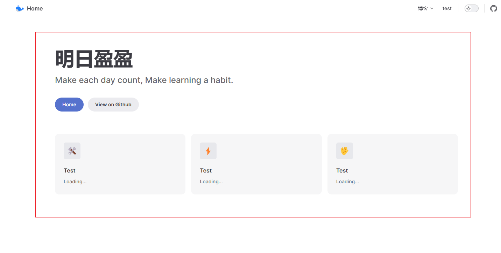
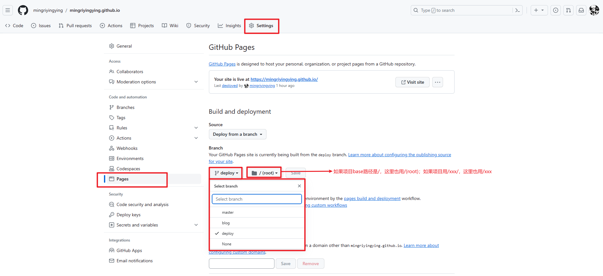
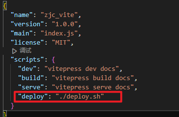

# 项目搭建

## 环境&项目初始化

### 安装node.js

安装git

创建项目

```
# 创建文件夹
mkdir zjc_vite & cd zjc_vite

# 全局安装yarn
npm install -g yarn

# 初始化项目（一直回车）
yarn init

# 安装vitepress
yarn add --dev vitepress
```

项目结构如下，**请自行创建没有的目录/文件**。

```
docs 
	./vitepress
		config.ts 	// 定义导航栏、侧边栏
	public		// 图片等公共资源
	articels	// 博客
	index.md	// 定义网站首页
package.json
```


## 配置./package.json

package.json是整个项目的配置，如项目启动、项目打包、项目部署等。

```
"scripts": {
    "dev": "vitepress dev docs",
    "build": "vitepress build docs",
    "serve": "vitepress serve docs"
}
```

运行测试，查看效果

```
yarn dev
```


## 自定义网站首页./docs/index.md

可以直接套用，以后再详细研究。

```
---
layout: home

title: 明日盈盈
titleTemplate: Make each day count, Make learning a habit.

hero:
  name: 
  text: 明日盈盈
  tagline: Make each day count, Make learning a habit.
  actions:
    - theme: brand
      text: Home
      link: /
    - theme: alt
      text: View on Github
      link: https://github.com/mingriyingying

features:
  - icon: 🛠️
    title: Test
    details: Loading...
  - icon: ⚡️
    title: Test
    details: Loading...
  - icon: 🖖
    title: Test
    details: Loading...
---
```

运行测试，查看效果

```
yarn dev
```




## 创建博客./docs/articles

创建几个markdown文件：

```
articles
	blog
		index.md
		test01.md
		test02.md
	test
		index.md
```


## 自定义导航./docs/.vitepress/config.ts

定义logo和home

```
export default {
    themeConfig: {
        logo: "/home.svg",  // 导航栏最左侧logo
        siteTitle: "Home", // 导航栏最左侧title
    }
}
```


定义菜单

```
export default {
    themeConfig: {
        logo: "/home.svg",  // 导航栏最左侧logo
        siteTitle: "Home", // 导航栏最左侧title
        nav: [
            // 一级菜单
            {
                text: "博客",
                // 二级菜单
                items: [
                    { text: 'test01', link: '/articles/blog/test/' },
                    { text: 'test02', link: '/articles/blog/test02' },
                ]
            },
            // 一级菜单
            { text: "test", link: "/articles/test/" }
        ]
    }
}
```


定义侧边栏

```
export default {
        // 侧边栏：指定菜单及对应的侧边栏
        sidebar: {
            "/articles/blog/test": [
                {
                    text: "Test",
                    items: [
                        { text: "test01", link: "/articles/blog/test/test01" },
                        { text: "test02", link: "/articles/blog/test/test02" },
                    ],
                },
            ],

        },
    }
}
```


完整配置如下：

```
export default {
    title: "明日盈盈",
    description: '一只程序猿', //mate标签description，多用于搜索引擎抓取摘要
    base: "/", // / 或者 /xxx/
    head: [
        ['link', { rel: 'icon', href: '/home.svg' }], // 网站icon
    ],
    themeConfig: {
        logo: "/home.svg",  // 导航栏最左侧logo
        siteTitle: "Home", // 导航栏最左侧title
        nav: [
            // 一级菜单
            {
                text: "博客",
                // 二级菜单
                items: [
                    { text: 'test01', link: '/articles/blog/test/' },
                    { text: 'test02', link: '/articles/blog/test02' },
                ]
            },
            // 一级菜单
            { text: "test", link: "/articles/test/" }
        ],
        // 导航栏右侧：社交链接
        socialLinks: [
            { icon: "github", link: "https://github.com/mingriyingying" },
        ],
        // 侧边栏：指定菜单及对应的侧边栏
        sidebar: {
            "/articles/blog/test": [
                {
                    text: "Test",
                    items: [
                        { text: "test01", link: "/articles/blog/test/test01" },
                        { text: "test02", link: "/articles/blog/test/test02" },
                    ],
                },
            ],

        },
    }
}

```


# 部署到github

## 项目打包

上面项目记得打包（打包后的文件是 docs/.vitepress/dist）

```
yarn build
```


## github创建仓库

创建一个名字叫username.github.io的仓库


## 上传dist至github

进入本地dist文件夹，按照github首页教程，将dist中的内容push到github


我这里上传到的是deploy分支，默认是main/master分支


## 设置Github Pages

设置github的setting



最后访问 https://mingriyingying.github.io/


# 项目进阶配置

## 1、一键部署

在项目根目录下创建./deploy.sh脚本。deploy.sh作用是将项目上传至github等代码仓库。（注意，我这里是上传至deploy分支）

```
#!/usr/bin/env sh

# 确保脚本抛出遇到的错误
set -e

# 生成静态文件

yarn build

# 进入生成的文件夹
cd docs/.vitepress/dist

git init
git add -A
git commit -m 'deploy'

# git push -f git@github.com:你的git名/你的git项目名.git master:你的git分支
git push -f origin deploy

cd -
```

在package.json中添加命令



执行命令，完成自动上传至github

```
yarn deploy
```


## 2、自动生成菜单

参考：https://juejin.cn/post/7214805603449339963

目的：能够根据 `docs` 目录自动地生成 `sidebar` 的配置，无需再手动去维护.

分析：在执行 `yarn dev` 之后，vitepress 会先运行 `.vitepress/config.js` 脚本，在这里自定义一个方法实现此功能。

注意：

1. 每个目录至少要有一个 `index.md` 文件，你可以在 `index.md` 做一些总览和介绍
2. 如果新建了新文件夹，需要重新执行一遍，目录配置才能生效

看代码，根据自己项目调整。

```
// Node.js 提供的文件系统模块（fs）和路径模块（path）
const fs = require("fs");
const path = require("path");

function generateNavConfig2(articlesPath) {
    const navConfigList = [];
    const firstLevelList = fs.readdirSync(articlesPath);

    // nav: [
    //     // 一级菜单
    //     {
    //         text: "博客",
    //         // 二级菜单
    //         items: [
    //             { text: 'vitepress', link: '/articles/blog/vitepress/' },
    //             { text: '算法', link: '/articles/blog/算法/' },
    //         ]
    //     },
    //     // 一级菜单
    //     { text: "test", link: "/articles/test/" }
    // ],

    firstLevelList.forEach((firstLevelName) => {
        const secondLevelList = fs.readdirSync(`${articlesPath}/${firstLevelName}`);
        // 文件or文件夹
        let isFirstMenu = false;
        for (secondLevelName of secondLevelList) {
            if (fs.lstatSync(path.join(articlesPath, firstLevelName, secondLevelName)).isFile()) {
                isFirstMenu = true;
                break;
            }
        }
        if (isFirstMenu) {
            navConfigList.push({ text: firstLevelName, link: `/articles/${firstLevelName}/` })
        } else {
            let tmpNav = { text: firstLevelName, items: [] }
            secondLevelList.forEach((secondLevelName) => {
                tmpNav["items"].push({ text: secondLevelName, link: `/articles/${firstLevelName}/${secondLevelName}/` })
            })
            navConfigList.push(tmpNav)
        }
    })
    return navConfigList
}

function generateSidebarConfig2(articlesPath) {
    const sidebarConfig = {};
    const firstLevelList = fs.readdirSync(articlesPath);

    // sidebar: {
    //     "/articles/blog/vitepress": [
    //         {
    //             text: "vitepress",
    //             items: [
    //                 { text: "test01", link: "/articles/blog/vitepress/01VitePress+Github搭建个人博客" },
    //                 { text: "test02", link: "/articles/blog/vitepress/02新环境如何配置" },
    //             ],
    //         },
    //     ],

    // },

    // 如果只有index文件，就没有侧边栏
    firstLevelList.forEach((firstLevelName) => {
        const secondLevelList = fs.readdirSync(`${articlesPath}/${firstLevelName}`);
        // 文件or文件夹
        let isFirstMenu = false;
        for (secondLevelName of secondLevelList) {
            curPath = fs.lstatSync(path.join(articlesPath, firstLevelName, secondLevelName))
            if (curPath.isFile()) {
                isFirstMenu = true;
                break;
            }
        }
        // 如果是一级菜单
        if (isFirstMenu) {
            let isNeedSide = false
            for (filename of secondLevelList) {
                curPath = fs.lstatSync(path.join(articlesPath, firstLevelName, filename))
                if (curPath.isFile() && filename != "index.md") {
                    isNeedSide = true;
                    break;
                }
            }
            if (isNeedSide) {
                let tmpSide = { text: firstLevelName, items: [] }
                secondLevelList.forEach((filename) => {
                    if (filename !== "images" && filename !== "index.md") {
                        tmpSide["items"].push({ text: filename, link: `/articles/${firstLevelName}/${filename}` })
                    }
                })
                sidebarConfig[`/articles/${firstLevelName}`] = [tmpSide]
            }
        } else {
            secondLevelList.forEach((secondLevelName) => {
                const fileList = fs.readdirSync(`${articlesPath}/${firstLevelName}/${secondLevelName}`);
                let isNeedSide = false
                for (filename of fileList) {
                    curPath = fs.lstatSync(path.join(articlesPath, firstLevelName, secondLevelName, filename))
                    if (curPath.isFile() && filename != "index.md") {
                        isNeedSide = true;
                        break;
                    }
                }
                if (isNeedSide) {
                    let tmpSide = { text: secondLevelName, items: [] }
                    fileList.forEach((filename) => {
                        if (filename !== "images" && filename !== "index.md") {
                            tmpSide["items"].push({ text: filename, link: `/articles/${firstLevelName}/${secondLevelName}/${filename}` })
                        }
                    })
                    sidebarConfig[`/articles/${firstLevelName}/${secondLevelName}`] = [tmpSide]
                }
            })
        }
    })

    return sidebarConfig
}

const docsPath = path.dirname(__dirname); // __dirname是当前文件所属目录的绝对路径
const articlesPath = path.join(docsPath, 'articles');
const navConfig = generateNavConfig2(articlesPath);
const sidebarConfig = generateSidebarConfig2(articlesPath);


export default {
    title: "明日盈盈",
    description: '一只程序猿', //mate标签description，多用于搜索引擎抓取摘要
    base: "/", // / 或者 /xxx/
    head: [
        ['link', { rel: 'icon', href: '/img/home.svg' }], // 网站icon
    ],
    themeConfig: {
        logo: "/img/home.svg",  // 导航栏最左侧logo
        siteTitle: "Home", // 导航栏最左侧title
        nav: navConfig,
        // 导航栏右侧：社交链接
        socialLinks: [
            { icon: "github", link: "https://github.com/mingriyingying" },
        ],
        // 侧边栏：指定菜单及对应的侧边栏
        sidebar: sidebarConfig,
    }
}

```

## 3、利用Github Actions自动部署

参考：https://juejin.cn/post/7245980207315861562#heading-9

参考2：https://cloud.tencent.com/developer/article/2339135

按照上面流程，我们开发完需要将**项目代码**提交至github的主分支，然后再将**打包代码**提交至deploy分支。

Github Actions则会自动构建发布：GitHub提供了服务器，我们把打包过程发至服务器中进行。


首先创建配置文件，位置./.github/workflows/deploy.yml。

```
name: Deploy

on:
  push:
    branches:
      - master

jobs:
  deploy:
    runs-on: ubuntu-latest
    steps:
      - uses: actions/checkout@v3
      - uses: actions/setup-node@v3
        with:
          node-version: 16
          cache: yarn
      - run: yarn install --frozen-lockfile

      - name: Build
        run: yarn build

      - name: Deploy
        uses: peaceiris/actions-gh-pages@v3
        with:
          github_token: ${{ secrets.GITHUB_TOKEN }}
          publish_dir: docs/.vitepress/dist

```


修改github actions权限：项目仓库下的settings


上传代码。等部署成功后，就可以切换page的分支。


试了好几种deploy部署脚本，终于成功了。


不知道和这个有没有关系：在项目根目录下添加了.gitignore文件

```
node_modules
package-lock.json
docs/.vitepress/dist
```

