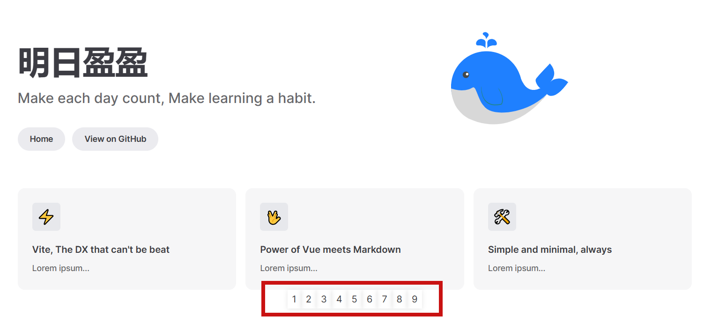

# 自定义首页(组件)

参考：https://juejin.cn/post/7134586612406714375#heading-5

目的：首页太丑，想要自己修改或者自定义页面。

分析：vitepress也是支持直接在md中写vue的，所以可以通过vue组件的形式，完全自己自定义一套样式。

安装vue

```css
yarn add -D vue
```

新建一个组件.vitepress/components/home.vue

```
<script setup>
const list = [1, 2, 3, 4, 5, 6, 7, 8, 9]
</script>
<template>
  <div class="home-wrapper">
    <div v-for="item in list" :key="item" class="home-item">{{item}}</div>
  </div>
</template>
<style>
.home-wrapper {
  text-align: center;
}
.home-item {
  padding: 4px 8px;
  display: inline-block;
  box-shadow: 0 1px 8px 0 rgba(0, 0, 0, 0.1);
}
</style>
```

然后修改index.md

```
---
layout: home
这部分内容可以保持不变
---

<script setup>
import home from './.vitepress/components/home.vue'
</script>

<home />
```



# 自定义模板(文档页面布局)

略。

