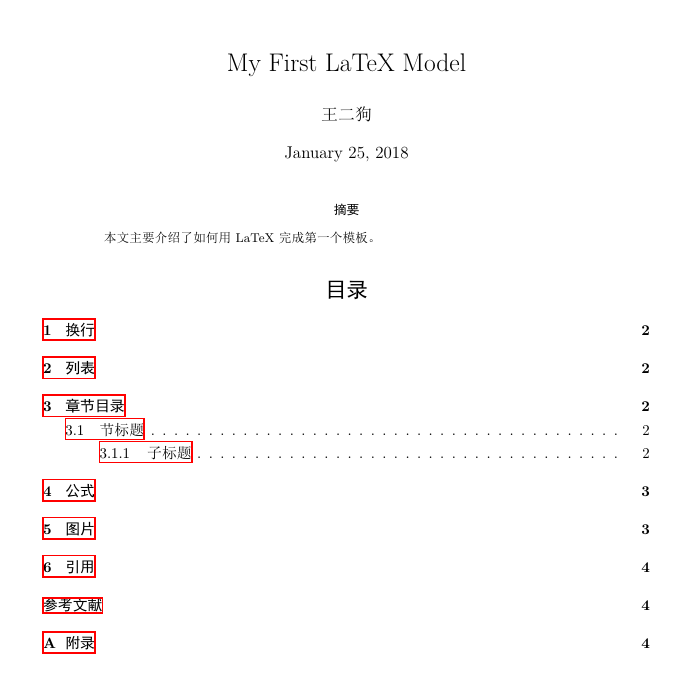

# 文献检索

## 一、文献分类

按出版形式：

* 图书、学术专著
* 期刊、连续出版物
* 会议文献
* 学位论文
* 专利文献
* 科技报告
* 标准文献

按文献加工深度：

* 一次文献：专著、期刊论文、科技报告、学位论文等
* 二次文献：目录、索引、文摘
* 三次文献：综述、学科年度总结、百科全书

## 二、文献信息组织

分类法：

* 中图法
* 杜威十进分类法
* 美国《国会图书馆分类法》
* 国际专利分类法

主题法：

* 主题词（作者关键词）
* 人工受控词汇（增补关键词）

其他索引，等等

## 三、检索工具

1. 全文数据库（存储的是一次文献，可以下载全文）
    * 中文数据库：CNKI、维普、万方、超星数字图书等
    * 外文数据库：ACM、IEEE、Springer Link等
2. 二次文献数据库（检索工具，存储的是索引，不可以直接下载（其实也可以吧））
    综合类：WOS系列、Scopus数据库
    工程类：Ei Village
    化学化工类：SciFinder Scholar
    物理、电气电子、计算机、控制类：INSPEC (WOS平台)
    数学类：MathSciNet 
    专利类：Derwent Innovations Index(DII)（WOS平台）
    学位论文类：PQDT 
3. 建议首选文献索引型数据库检索，看文摘筛选文献，再下载全文

## 四、文献检索技术

**1、 逻辑算符**

* AND或*
* OR或+
* NOT或-
* 如：A AND B OR C NOT D

**2、 截词符**

* *表示0个或多个字符
* ?表示一个字符

**3、 实例：查找“计算机动画电影”方面的资料**

中文检索式：（计算机 OR 电脑）AND（动画 OR 卡通）AND 电影
英文检索式：computer* AND cartoon* AND (movie* OR picture*)

## 五、文献管理工具

我最开始用Mendeley，但是发现同步功能很垃圾，发现Zotero还可以，以后可以尝试。

# LaTex

## 一、LaTex是什么？

>  建议参考：https://www.jianshu.com/p/1d99b3c883a6


**Tex引擎**：Tex是一个排版系统，真正的编辑器是Tex引擎，Tex引擎有：

1. Knuth Tex：高德纳的原版Tex， 现在已经不用。
2. e-Tex：标准Tex，后续Tex编辑器都是基于e-Tex开发的。
3. pdfTex：西文世界最常用编辑器。
4. XeTex：支持Unicode编码，支持中文。

**基于Tex引擎的格式**：Tex是一个宏语言，当你制作了一些特别基础的宏，那么你可以将其发布为一个格式。基于Tex引擎的格式有：

1. plain Tex：这是Knuth搞出来的格式，最为基础。
2. LaTex：这是兰伯特搞出来的格式，最为广泛。

**Tex发行版**：是集引擎、格式于一体，面向用户的。有：

1. windows：TexLive发行版+TexStudio编辑器（有人推荐的）
2. mac：macTex发行版。

题外话：

TexLive发行版自带TeXworks编辑器，这个编辑器轻量级、方便，亲自用过很简单。


## 二、安装TeX Live

使用中科大镜像网站下载：https://mirrors.ustc.edu.cn/CTAN/systems/texlive/Images/

1. * Windows下点install-tl-windows.bat
     * Linux/macOS，执行./install-tl --gui

2. 点击Advanced进行更多的安装设置 ()

    

3. 点击安装等待


## 三、第一行代码

### 模板如下

```
\documentclass[UTF8]{ctexart} %中文版article排版
\usepackage{amsmath} %公式环境和数学命令
\usepackage{amssymb} %数学符号和生成命令
\usepackage{geometry} %版面尺寸
\usepackage{graphicx} %插图
\usepackage{hyperref} %让目录有链接


\begin{document}
\title{My First LaTeX Model}
\author{王二狗}
\date{January 25, 2018}
\maketitle %使上面三个title生效，maketitle必须放在document里面


\begin{abstract} %摘要
本文主要介绍了如何用LaTeX完成第一个模板。
\end{abstract}


\tableofcontents %自动生成目录

\newpage
\setlength{\parindent}{0pt} %去除所有首行缩进
\section{换行}
\begin{tabular}{|c|c|}
\hline
\textbackslash par&空行，或者开始新的段落（默认有首行缩进）\\
\hline
\textbackslash \textbackslash &强制换行，不会有缩进\\
\hline
\textbackslash newline&强制换行，不会有缩进\\
\hline
\end{tabular}


\section{列表}
列表有三种：无序列表、有序列表和描述列表。
\begin{itemize}
\item 无序列表
\item 无序列表
\end{itemize}

\begin{enumerate}
\item 有序列表
\item 有序列表
\end{enumerate}

\begin{description}
\item[name] 描述列表
\item[age] 描述列表
\end{description}


\section{章节目录}
\subsection{节标题}这一小段我们介绍这些内容。
\subsubsection{子标题}这一小段我们介绍这些内容。
\paragraph{段落}这一小段我们介绍这些内容。
\subparagraph{小段}这一小段我们介绍这些内容。


\section{公式}
\label{sec:gongshi} %章节标签
数学公式有两种：行内公式和行间公式。\newline
1.行内公式\newline
From $a+b>c$, we have...\newline
2.行间公式\newline
Since
\begin{equation}\label{eq:gougu} %开始单行公式环境equation，并添加了书签gougu
AB^2=BC^2+AC^2.
\end{equation}
we have...


\section{图片}
本节只是插入一张图片 %保证目录下有图片
\begin{figure}[!ht]\centering %添加图片环境的配置
\includegraphics[scale=0.5]{images/test.png}
\caption{我的第一个图片\label{fig:img01}}
\end{figure}


\section{引用}
1.引用文献\\
两边之和大于第三边\cite{1}。\\%引用文献
两边之差小于第三边\cite{2}。\\%引用文献
2.引用公式\\
满足式 \eqref{eq:gougu} 的整数称为\emph{勾股数}。\\%引用公式标签, \emph表示强调
3.引用章节\\
第 \ref{sec:gongshi} 节介绍了公式的使用。\\
4.引用图片\\
图\ref{fig:img01}是一个可爱的头像。%引用图片


\begin{thebibliography}{99} %参考文献，99表示最大标签号
\bibitem{1}失野健太郎.几何的有名定理.上海科学技术出版社，1986. 
\bibitem{2}曲安金.商高、赵爽与刘辉关于勾股定理的证明.数学传播,20(3),1998.
\bibitem{3}克莱因.古今数学思想.上海科学技术出版社，2002.
\end{thebibliography}
\addcontentsline{toc}{section}{参考文献} %用来添加文献的标准方式


\begin{appendix} %附录
\section{附录}
本文参考的网站\\
https://www.cnblogs.com/jingwhale/p/4250296.html \\
https://blog.csdn.net/sotlion/article/details/79591724\\
\end{appendix}


\end{document}
```
### 最终效果如下



