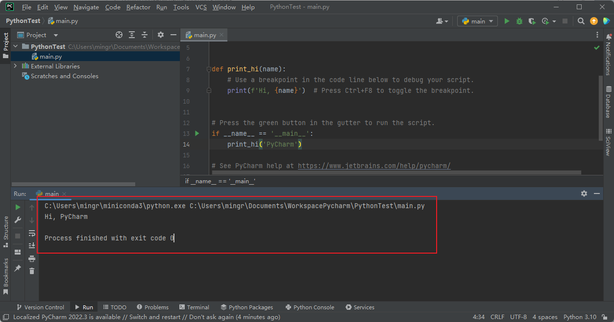
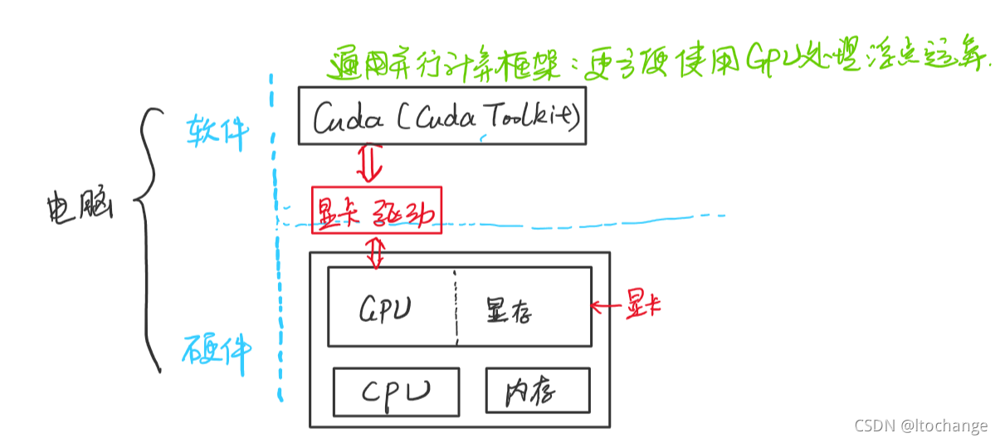
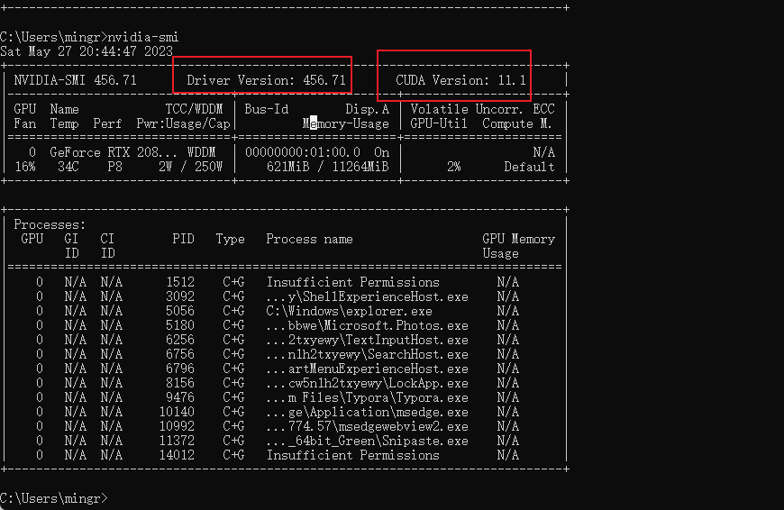
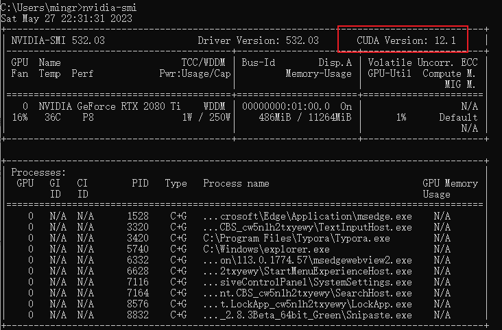
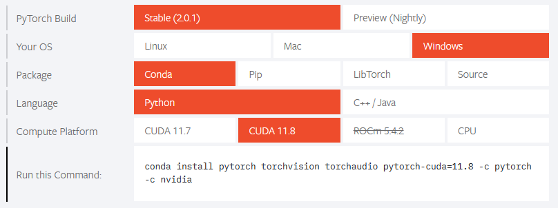
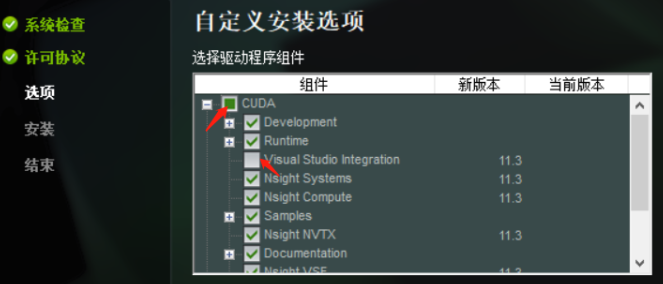
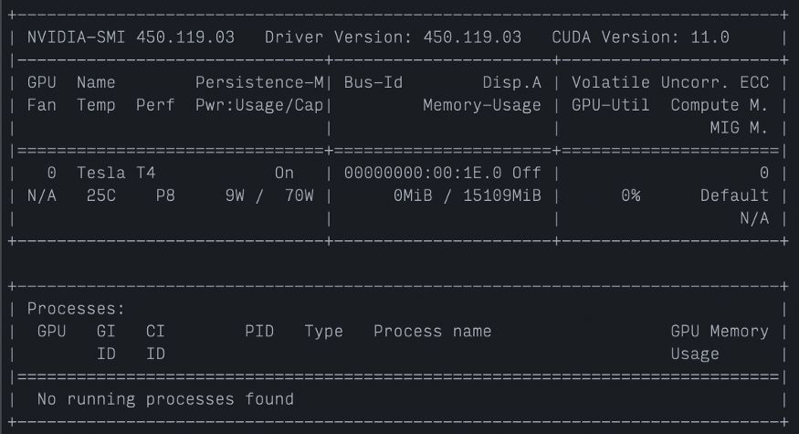

# Conda安装

## win10安装

1、从官网下载python版本对应的miniconda；

2、一直Next；不用配置环境变量；修改安装路径，因为后面创建的虚拟环境是放在安装目录；

3、安装后，打开Anaconda Prompt即可使用；

4、配置镜像（国内下载太慢，还容易卡住）

Windows 用户无法直接创建名为 `.condarc` 的文件，可先生成该文件之后再修改。生成文件位置在`C:\Users\username`下

```bash
conda config --set show_channel_urls yes
```

修改文件内容如下

```undefined
略，我的conda自动清华源
```

配置完成可运行 `conda clean -i` 清除索引缓存。


## Linux安装

1、从官网下载`Miniconda3-py310_23.3.1-0-Linux-x86_64.sh`

2、进入下载路径，执行安装`bash Miniconda3-py310_23.3.1-0-Linux-x86_64.sh`

3、按提示，一直输入`yes`或回车

4、进入用户home下`/home/xxx/`， 刷新环境变量`source ～/.bashrc`

5、conda默认激活了base环境，但是我们用不到，需要设置：

```
conda deactivate
conda config --set auto_activate_base false
```

6、我的下载速度还可以，就没有更改镜像

7、卸载：`rm -rf /home/xxx/miniconda3`

## Linux下多用户共享

1、配置命令路径

```bash
vim /etc/profile
# 在末尾添加 
export PATH="$PATH:/home/xxx/anaconda/bin" 
source /etc/profile 		 # 刷新，此外～/.bashrc中的路径配置可以删了
```

2、创建用户

```bash
#创建用户 -m创建home目录 -g可以指定用户组
useradd -m test 
useradd -m -g anaconda test
# 设置密码
passwd test
```

3、创建anaconda组

```bash
groupadd anaconda  						# 创建anaconda组
chgrp -R anaconda /home/xxx/anaconda 	# 组内共享 anaconda安装目录
chmod 770 -R /home/xxx/anaconda 		# 修改目录操作权限
usermod -G anaconda username	 		# 添加用户进组
```


# Conda更换源

如果下载慢，再来更换！

恢复默认

```
conda config --remove-key channels
```

源最终存在`.condarc` 的文件中，需要生成该文件之后再修改，生成文件位置在`C:\Users\username`下。命令

```
conda config --set show_channel_urls yes
```

但是一般建议直接修改源文件，可以用以下命令：

换清华源

```
conda config --add channels https://mirrors.tuna.tsinghua.edu.cn/anaconda/pkgs/free/
conda config --add channels http://mirrors.tuna.tsinghua.edu.cn/anaconda/pkgs/main/
conda config --add channels http://mirrors.tuna.tsinghua.edu.cn/anaconda/cloud/fastai/
conda config --set show_channel_urls yes
```

配置完成可运行 `conda clean -i` 清除索引缓存。

查看源

```
conda config --show channels
```


# Conda命令

## 命令

管理版本

```
# 查看conda版本
conda --version
python --version
# 更新conda
conda update conda
```

管理虚拟环境

```
# 查看已有环境
conda env list
# 创建虚拟环境 （在安装目录下的/envs下）
conda create -n xxx python=x.x
# 激活虚拟环境
activate xxx
# 退出虚拟环境
deactivate xxx
# 删除虚拟环境
conda remove -n xxx --all
# 复制虚拟环境
conda create --name new_env_name --clone old_env_name 
```

管理包

```
# 安装包
conda install numpy==x.x.x
pip install numpy==x.x.x
# 删除包
conda remove numpy
pip remove numpy
# 查看包
conda list
pip list
# 安装到指定环境中
conda install --name env_name package_name
```

## 用conda？用pip？

**先说结论**：

* 能用conda用conda，不行再用pip
* pip用前查看pip路径：`pip show pip`或`pip -V`
* 一定要解决全局pip问题（看下文）


**两者区别**：

环境：win10 + miniconda3 (python3.10)

```
1. 虚拟环境下使用conda install：安装的库会放在\miniconda\pkgs目录下。虚拟环境\miniconda\envs\py37\Lib\site-packages这里应该只是个链接，而不是重复下载的。这样即可以隔离环境，也可以节省空间。

2. 虚拟环境下使用pip install:
2.1 如果使用系统全局的python，安装库会放在\miniconda\Lib\site-packages
2.2 如果使用虚拟环境的python，安装库会放在\miniconda\envs\py36\Lib\site-packages

3. 如果判断pip命令用的哪个环境的？
pip -V 或者 pip show pip
> D:\Program\miniconda\Lib\site-packages 
不是虚拟环境路径，说明用的是系统的pip
```


## 解决全局pip！

即使在虚拟环境下，也是用全局pip，这是不对的。

判断当前pip是哪个pip？

```
pip show pip 
pip -V
```

方式一：临时解决——用python命令（我最开始python不管用，重启后解决）

```
conda activate env_name
python -m pip install xxx
```

方式二：该虚拟环境下永久解决——更新pip

```
conda activate env_name
python -m pip install --upgrade pip
pip -V
```

# PyCharm安装

1、安装，略

2、打开一个文件/项目

3、直接运行，发现pycharm找到了conda的base的环境

4、还可以配置虚拟环境 Settings -> Python Interpreter




**如何在PyCharm中显示conda虚拟环境？**

Add Python Interpreter -> Add Local Python Interpreter -> Conda Environment -> Conda executable 选择 anaconda/Scripts/conda.exe即可。


**如何在PyCharm中的Terminal中打开虚拟环境？**

Settings -> Tools -> Terminal -> Shell Path 选择cmd即可。


# PyTroch安装

## 什么是CUDA

**统一计算设备架构**(Compute Unified Device Architecture,CUDA)，由 NVIDIA 推出的并行计算平台和编程模型。 它通过利用图形处理单元 (GPU) 的强大功能来显着提高计算性能。

Nvidia安装的cuda是一个完整的cuda库，包含cuda toolkit和相应的驱动。主要包含三部分：CUDA toolkit、CUDA driver和NVIDIA GPU driver。windows电脑安装会自动安装GPU驱动，所以只需要安装CUDA toolkit就可以保证CUDA相关的程序运行。

个人理解：

* NVIDIA驱动版本 决定 CUDA Toolkit版本
* CUDA Toolkit版本 影响 PyTorch版本




## 更新驱动

win+r输入`nvidia-smi`查看驱动对应的CUDA版本：

* 驱动是456.71
* CUDA版本是11.1  （但是这个并不是）




直接下载驱动[官方驱动 | NVIDIA](https://www.nvidia.cn/Download/index.aspx?lang=cn)

或者，下载NVIDIA GeForce Experience来快速升级驱动。


更新驱动，再次查看，发现支持CUDA 12.1了！！




## 安装PyTorch

开始安装pytorch，去官网下载，找以前的版本，最新的没下载下来。




复制命令，去conda下载。

* conda下载不下来，用pip安装好了
* 如果pip用的是虚拟环境的，conda list也能把下载的文件展示出来。

```
conda activate py310
conda install pytorch==2.0.0 torchvision==0.15.0 torchaudio==2.0.0 pytorch-cuda=11.7 -c pytorch -c nvidia

pip -V  # 查看用的是哪个pip
pip install torch==2.0.0+cu117 torchvision==0.15.1+cu117 torchaudio==2.0.1 --index-url https://download.pytorch.org/whl/cu117
```

验证

```
conda activate py310
python
import torch
torch.cuda.is_available()
```


# CUDA思考

## PyTorch为什么不用安装CUDA

官网安装pytorch的两个命令：

```
# conda
conda install pytorch torchvision torchaudio pytorch-cuda=11.8 -c pytorch -c nvidia

# pip
pip3 install torch torchvision torchaudio --index-url https://download.pytorch.org/whl/cu118
```

如果是conda安装，指定了`pytorch-cuda=11.8`，程序用的是自己的CUDA，而不会去用我们电脑安装的。

如果是pip安装，指定了`--index-url https://download.pytorch.org/whl/cu118`，也下载了CUDA，所以也不会去用我们电脑安装的。

注意：这里的CUDA只给pytorch用！！（待验证）

## CUDA的两个版本

CUDA有两个主要的API，`runtime API` 和 `driver API`。两者都有相应的版本：

1. 用于支持driver API的必要文件（如`libcuda.so`）是由GPU driver installer安装的。`nvidia-smi` 就属于这一类API
2. 用于支持runtime API的必要文件（如`libcudart.so`以及`nvcc`）是由CUDA Toolkit installer安装的


所以，两个cuda版本不一样，是因为不是同一个程序安装的：

* windows默认安装了显卡驱动，win+r输入`nvidia-smi`查看驱动对应的CUDA版本，是`driver API`版本;
* 假如我们安装了CUDA Tookit，进入bin目录输入`nvcc -V`查看的CUDA版本，是`runtime API`版本；


版本不一致的解释：

* 由于显卡驱动是向后兼容的，因此一般显卡驱动的版本都要高于或等于当前CUDA Toolkit 所对应的最低版本。
* 所以，安装PyTorch时，CUDA版本低没关系。


## 安装CUDA

虽然用不到了，但是讲下安装过程。

从[developer.nvidia.com/cuda-downloads](https://developer.nvidia.com/cuda-downloads)，下载CUDA Toolkit 12.1，有点大3个G！！

安装过程中，选择自定义安装


这里有一个组件，不需要，可以取消勾选



然后一直安装就可以了。


# 监控

## 什么是利用率？

过去的一个采样周期内GPU 内核执行时间的百分比，就称作GPU的利用率。

如果这个值很低，则意味着您的 GPU 并没有全速的工作，可能是受到 CPU或者IO 操作的瓶颈，如果你使用的按小时付费的云服务器，那么就是在浪费时间和金钱！

## 使用终端命令监控

打开cmd命令窗口，输入

```text
nvidia-smi
```



以下是我们在这里收集的一些信息：

- GPU：Tesla T4
- 设备温度：设备当前运行温度为 25 摄氏度
- 功耗：GPU 目前运行功率9W，官方设定的额定最大功率消耗 70W 。
- 显存：0MiB / 15109MiB 上限
- GPU利用率：0%。 同样，NVIDIA 将利用率定义如下： 过去采样周期中一个或多个内核在 GPU 上执行的时间百分比。

如果你负责硬件相关的工作，温度和功率是跟踪的可能是你关注的主要问题，这样您就可以平衡尝试最大化计算和维护设备安全。

如果你是硬件使用者（就像一般我们使用云服务器一样），最关心的应该是内存使用和GPU利用率。

使用 nvidia-smi 进行监控的其他一些技巧：

* Linux: 调用 `watch -n 1 nvidia-smi` 可以每一秒进行自动的刷新
* window：调用`nvidia-smi dmon`，自动刷新

## 使用nvitop

安装

```
pip install nvitop
```

界面美观、实时刷新

