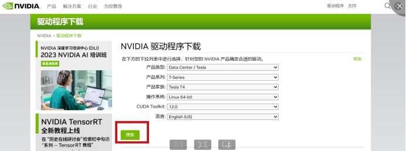
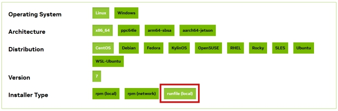
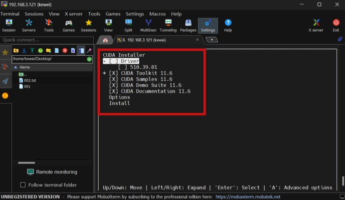
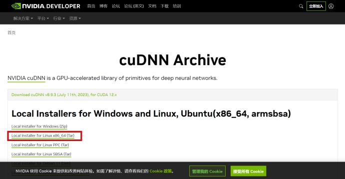

# 环境

环境

```
服务器：华为2288H V5
架构：x86
系统：OpenEuler 20.03 LTS
显卡：NVIDIA Tesla T4
```

不安装驱动，也可以查看显卡是否插好

```
lspci | grep -i nvidia
```

驱动、CUDA、cuDNN版本

```
驱动：向下兼容，所以驱动要保持最新
CUDA：先从PyTorch官网看下，支持哪些CUDA版本，目前是11.7 11.8，实际测试高版本CUDA也可以用
cuDNN：小于等于CUDA版本就好
```

安装依赖包：

* 安装Nvidia驱动所需要的依赖包为kernel-devel、gcc、dkms。
* 验证CUDA，编译并运行验证Sample代码所需要的依赖包为gcc-c++。

```
yum install kernel-devel kernel-headers gcc dkms gcc-c++
```

**问题：** NVIDIA Tesla T4温度太高>80度，导致服务器不断重启。

解决1：换高功率电源，没有解决。

解决2：按DEL进入BIOS，设置风扇转速最大"Enforce Fan Speed"，已解决。


# 安装驱动

## 禁用nouveau

Nouveau是由第三方为NVIDIA显卡开发的一个开源3D驱动，也没能得到NVIDIA的认可与支持，所以对于显卡的调用来说，是不如现在官方提供的驱动来的效果好的。

查看系统自带的驱动：如果没有则直接跳过这一步。
```
lsmod | grep nouveau
```

禁用自带的显卡驱动（其他系统路径可能不一样）

```
vi /etc/modprobe.d/blacklist-nouveau.conf
#文件最后添加以下内容
blacklist nouveau
options nouveau modeset=0

# nvidia不要加入黑名单（如果文件中有）
# blacklist nvidiafb
```

重建

```
mv /boot/initramfs-$(uname -r).img /boot/initramfs-$(uname -r).img.bak
dracut /boot/initramfs-$(uname -r).img $(uname -r)
```

重启

```
reboot
```

检查是否关闭
```
lsmod | grep nouveau
```

## 下载

https://www.nvidia.cn/Download/index.aspx?lang=cn



## 安装

安装
```
./NVIDIA-Linux-x86_64-515.57.run --kernel-source-path=/usr/src/kernels/5.10.0-60.41.0.70.oe2203.x86_64/ -k $(uname -r) --no-x-check
```

安装过程选项
```
Would you like to register the kernel module sources with DKMS?选yes(服务器选yes，本地选no)
Install NVIDIA's 32-bit compatibility libraries?选no
```

**报错：**

```
gzip: stdin: invalid compressed data--format violated Extraction failed. Ensure there is enough space in /tmp and that the installation package is not corrupt Signal caught, cleaning up
```

解决方法1：内存不够用（不管用）
```
Mkdir /home/tmp2
export TMPDIR=/home/tmp2
Sh ./NVIDIA-Linux-x86_64-515.57.run ...
```

解决方法2：文件传输过程中损坏，重新下载驱动，安装成功！

最后，检测显卡成功
```
nvidia-smi
```

**报错：**

```
WARNING: You do not appear to have an NVIDIA GPU supported by the 430.34 NVIDIA ...
```

加上：--add-this-kernel 参数

**报错：**

```
unable to find the kernel source tree for the currently running kernel......... 
```

加上：--kernel-source-path=/usr/src/kernels/内核号(2+Tab键  自动出现)

**报错：**

```
unable to load the kernel module 'nvidia.ko' .........
```

执行：./NVIDIA-XXXX.run --kernel-source-path=/usr/src/kernels/内核号 -k $(uname -r)

**仍然报错：** 实际系统内核和安装的kernel-devel与kernel-headers不一致导致

```
ERROR: Unable to load the kernel module 'nvidia.ko'.  This happens most frequently when this kernel module was built against the wrong or improperly configured kernel sources, with a version of gcc that differs from the one used to build the target kernel, or if another driver, such as nouveau, is present and prevents the NVIDIA kernel module from obtaining ownership of the NVIDIA GPU(s), or no NVIDIA GPU installed in this system is supported by this NVIDIA Linux graphics driver release.
```

执行`yum install -y "kernel-devel-uname-r == $(uname -r)"`

此时出现两个内核，选择和$(uname -r)一样的内核即可安装成功。

**报错：**

```
 Failed to run `/usr/sbin/dkms build -m nvidia -v 515.105.01 -k 4.19.90-2106.3.0.0095.oe1.x86_64`: Error! echo
         Your kernel headers for kernel 4.19.90-2106.3.0.0095.oe1.x86_64 cannot be found at
         /lib/modules/4.19.90-2106.3.0.0095.oe1.x86_64/build or /lib/modules/4.19.90-2106.3.0.0095.oe1.x86_64/source.
```

查内核版本

```
rpm -qa | grep kernel
```

发现 kernel 低于 kernel-headers kernel-devel版本不一致

然后yum install kernel 重启后解决。


# 安装CUDA

## 下载

https://developer.nvidia.com/cuda-toolkit-archive




## 安装

安装

```
sh cuda_11.2.0_460.27.04_linux.run
```

安装时选项，不用安装驱动



添加环境变量
```
vim ~/.bashrc
vim /etc/profile 都可以
export PATH=/usr/local/cuda-11.2/bin:$PATH
export LD_LIBRARY_PATH=$LD_LIBRARY_PATH:/usr/local/cuda-11.2/lib64
```

刷新环境变量
```
source ~/.bashrc
```

 检测成功

```
nvcc -V
```


# 安装cuDNN

## 下载

https://developer.nvidia.cn/rdp/cudnn-archive



## 安装

解压复制即可

```
cp include/cudnn*.h /usr/local/cuda-11.2/include/ 
cp lib/libcudnn* /usr/local/cuda-11.2/lib64/ 
chmod a+r /usr/local/cuda-11.2/include/cudnn*.h 
chmod a+r /usr/local/cuda-11.2/lib64/libcudnn*
```

检查是否安装成功，略，可以去官网看：

https://docs.nvidia.com/deeplearning/cudnn/install-guide/index.html#verify

```
$ cp -r /usr/src/cudnn_samples_v8/ $HOME
$ cd  $HOME/cudnn_samples_v8/mnistCUDNN
$ make clean && make
$ ./mnistCUDNN
Test passed!
```


# 安装Anaconda

## 下载

下载：https://www.anaconda.com/download

## 安装

安装：一直yes，安装过程中也可以设置安装路径

```
source ~/.bashrc
conda deactivate
conda config --set auto_activate_base false
```

# 安装PyTorch

## 离线包下载

pytorch 离线.whl包官方下载地址：https://download.pytorch.org/whl/torch_stable.html


## 安装

```
pip install torch-1.2.0+cu92-cp36-cp36m-win_amd64.whl
```

# 测试

```
import torch
import time
from torch import autograd

#GPU加速
print(torch.__version__)
print(torch.cuda.is_available())

a=torch.randn(10000,1000)
b=torch.randn(1000,10000)
print(a)
print(b)
t0=time.time()
c=torch.matmul(a,b)
t1=time.time()

print(a.device,t1-t0,c.norm(2))

device=torch.device('cuda')
print(device)
a=a.to(device)
b=b.to(device)

t0=time.time()
c=torch.matmul(a,b)
t2=time.time()
print(a.device,t2-t0,c.norm(2))


t0=time.time()
c=torch.matmul(a,b)
t2=time.time()

print(a.device,t2-t0,c.norm(2))
```

