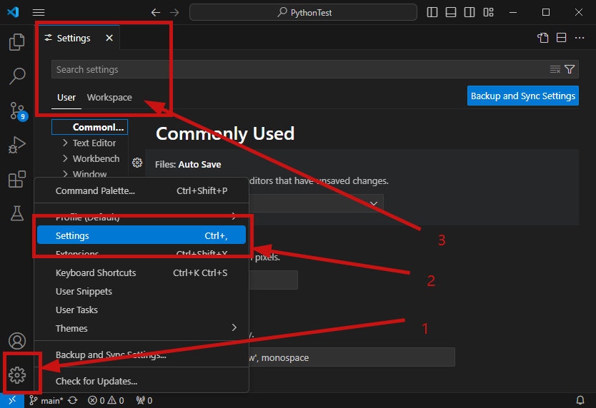

# 下载和安装

[Download Visual Studio Code - Mac, Linux, Windows](https://code.visualstudio.com/download)

下载System版本，一直Next安装即可。


有两个版本：user installer和system installer。

* User Installer会安装到C:\Users\UserName\AppData\Local\Programs\Microsoft VS Code

* System Installer会安装到C:\Program Files\Microsoft VS Code

* 前者只用于特定用户，后者不限制。

User版本权限不足，无法在系统分区创建安装目录，一般选System版本即可。


# 设置

## 打开设置




如上图所示，VS Code提供两种不同范围的设置：

- **用户**设置：全局生效。
- **工作区**设置：只针对当前项目生效。工作区设置会覆盖用户设置。适用于团队协作场景。工作区的设置文件是保存在当前项目根目录的`.vscode/settings.json`中，可以被提交到Git仓库，方便共享给项目组的其他成员。

当修改了默认设置时，setting.json文件会立刻同步修改：


## 自定义配置

```
{
    // 字体大小
    "editor.fontSize": 16,
    // 失去焦点时，自动保存
    "files.autoSave": "onFocusChange",
    // 当前行代码高亮显示
    "workbench.colorCustomizations": {
        "editor.lineHighlightBackground":"#00000090",
        "editor.lineHighlightBorder":"#ffffff30"
    },
    // 打开文件夹时，开启一个新的窗口
    "window.openFoldersInNewWindow": "on",
    // 打开文件时，开启一个新的窗口
    "window.openFilesInNewWindow": "on",
    // 选中文本中搜索
    "editor.find.autoFindInSelection": "always",
    // 代码格式化
    "[python]": {
        "editor.defaultFormatter": "ms-python.black-formatter"
    },
}
```


# 插件

## 代码格式化

使用alt+shift+f格式化代码，提示"vscode there is no formatter for python"，


安装python格式化插件，如Black Formatter

然后配置，重启VS Code


# 控制面板

这里是VS Code的控制面板，能做很多事情。

如，

Cmd + Shift + O打开命令面板快速访问符号，此时第一个字符是@

Cmd + Shift + P打开命令面板，此时第一个字符是>


到底有多少种呢？可以输入?查看


# 同步

登录Github或这Microsoft账号即可同步。


# 常用快捷键

**工作区快捷键**

| 快捷键   | 作用             |
| -------- | ---------------- |
| Ctrl + \ | 拆分为多个编辑器 |

**编辑操作**

| 快捷键          | 作用                                 |
| --------------- | ------------------------------------ |
| Ctrl + Enter    | 在当前行的下方新增一行，然后跳至该行 |
| Alt + ↑         | 将代码向上移动                       |
| Alt + Shift + ↑ | 将代码向上复制一行                   |
| Ctrl + /        | 添加单行注释                         |


