# 下载和安装

[Download Visual Studio Code - Mac, Linux, Windows](https://code.visualstudio.com/download)

下载System版本，一直Next安装即可。

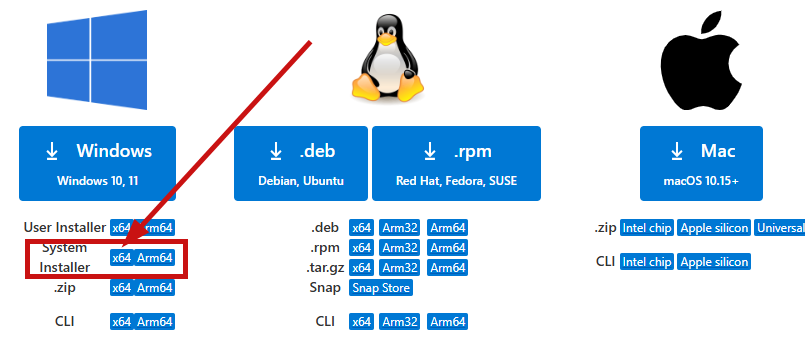

有两个版本：user installer和system installer。

* User Installer会安装到C:\Users\UserName\AppData\Local\Programs\Microsoft VS Code
* System Installer会安装到C:\Program Files\Microsoft VS Code
* 前者只用于特定用户，后者不限制。

User版本权限不足，无法在系统分区创建安装目录，一般选System版本即可。

# 设置

## 打开设置

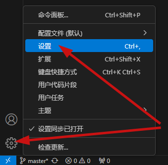

如上图所示，VS Code提供两种不同范围的设置：

- **用户**设置：全局生效。
- **工作区**设置：只针对当前项目生效。工作区设置会覆盖用户设置。适用于团队协作场景。工作区的设置文件是保存在当前项目根目录的 `.vscode/settings.json`中，可以被提交到Git仓库，方便共享给项目组的其他成员。

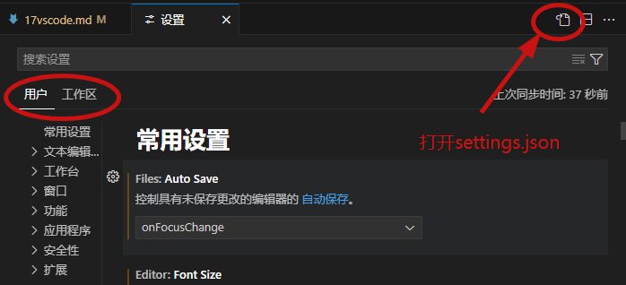

当修改了默认设置时，setting.json文件会立刻同步修改：

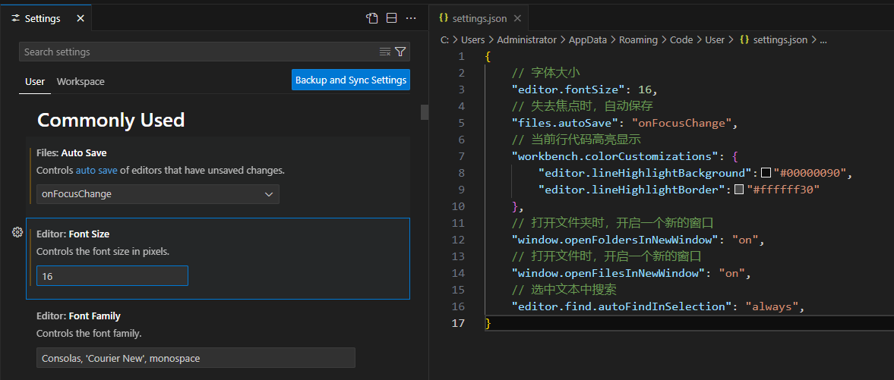

## 自定义配置

```
{
    // 字体大小
    "editor.fontSize": 16,
    // 失去焦点时，自动保存
    "files.autoSave": "onFocusChange",
    // 当前行代码高亮显示
    "workbench.colorCustomizations": {
        "editor.lineHighlightBackground":"#00000090",
        "editor.lineHighlightBorder":"#ffffff30"
    },
    // 打开文件夹时，开启一个新的窗口
    "window.openFoldersInNewWindow": "on",
    // 打开文件时，开启一个新的窗口
    "window.openFilesInNewWindow": "on",
    // 选中文本中搜索
    "editor.find.autoFindInSelection": "always",
    // 代码格式化
    "[python]": {
        "editor.defaultFormatter": "ms-python.black-formatter"
    },
}
```

# 插件

## Python代码格式化

使用alt+shift+f格式化代码，提示"vscode there is no formatter for python"，

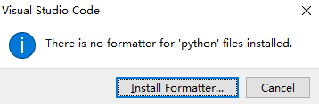

安装python格式化插件，如Black Formatter

然后配置，重启VS Code

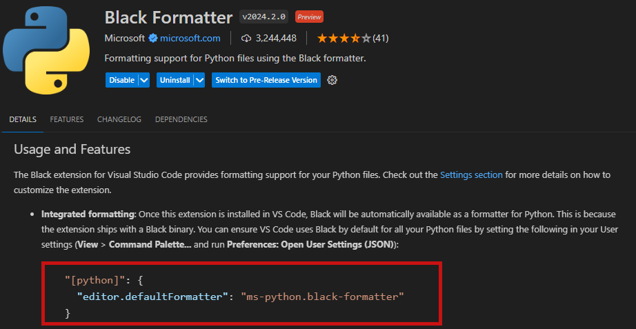

其它必备python插件

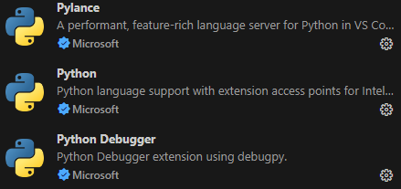

## Markdown编辑器

**第一个markdown插件**


Markdown All in One可以一边编辑、一边预览

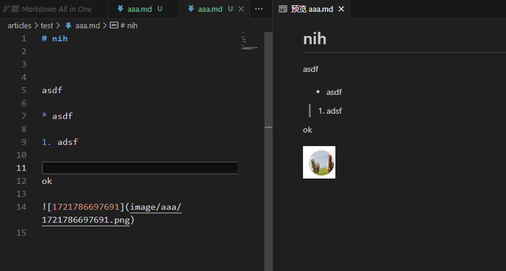

Markdown All in One可以设置粘贴图片位置 [如何设置VS Code 中 Markdown粘贴图片的位置 - 宵伯特 - 博客园 (cnblogs.com)](https://www.cnblogs.com/xbotter/p/17528063.html)

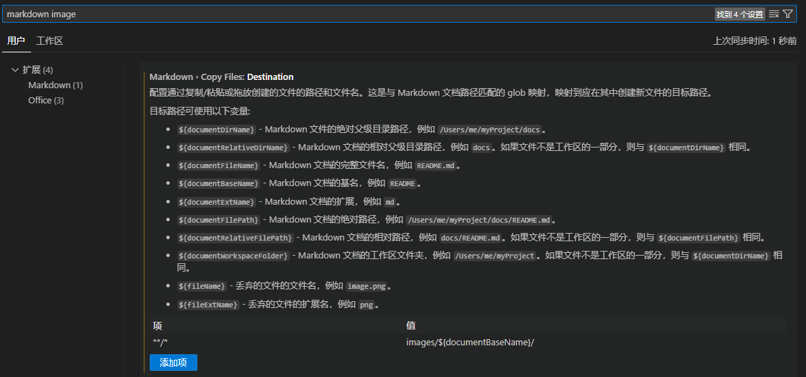

**第二个markdown插件**

支持很多文件预览（docx,pdf,xlsx,md,epub,http等）

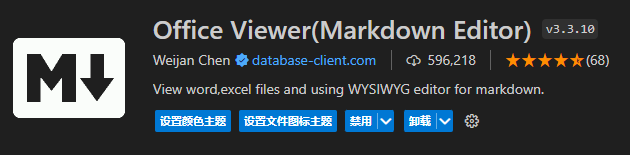

Office Viewer可以同时预览+编辑。[使用VSCode编辑MarkDown文件（vditor 所见及所得） - springsnow - 博客园 (cnblogs.com)](https://www.cnblogs.com/springsnow/p/16256915.html)

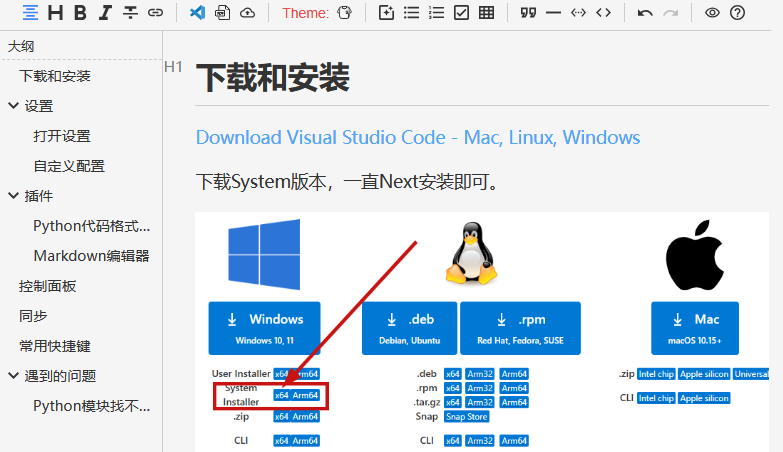

Office Viewer设置粘贴图片路径：

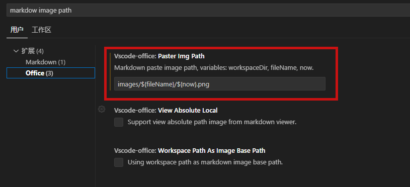

# 控制面板

这里是VS Code的控制面板，能做很多事情。

如，

Cmd + Shift + O打开命令面板快速访问符号，此时第一个字符是@

Cmd + Shift + P打开命令面板，此时第一个字符是>

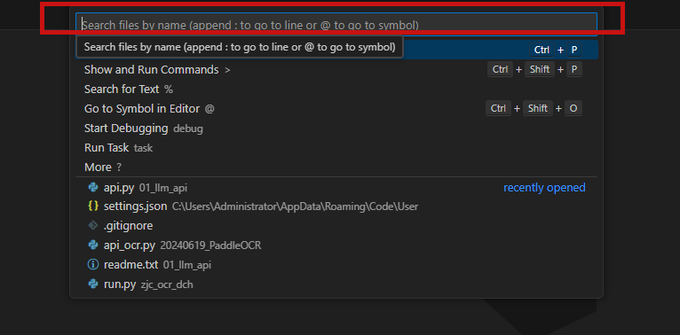

到底有多少种呢？可以输入?查看

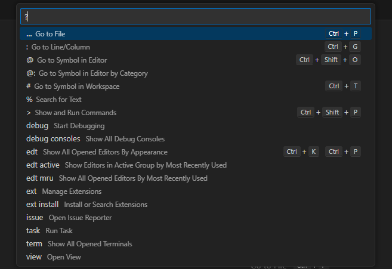

# 同步

登录Github或这Microsoft账号即可同步。

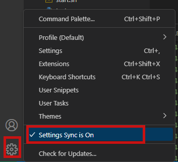

# 禅模式：Ctrl+K+V

VScode提供了一个禅模式，就如同坐禅一般，会将所有的菜单栏和状态栏等窗口全部隐藏掉，为开发者提供一个沉浸式的开发体验。

模式的打开和关闭

```
开启：CTRL + K + Z
退出：同开启快捷键，也可以按两次ESC键退出
```

在开启禅模式之后，几乎所有功能都需要使用快捷键来操作，这里写一些必备的。

```
文件列表：CTRL + SHIFT + E
全局搜索：CTRL + SHIFT + F 
debug： CTRL + SHIFT + D
关闭文件：CTRL + W
```

# 遇到的问题

## Python模块找不到

我的项目结构是这样的

```
my_project/
├── controllers/
│   ├── __init__.py   
│   └── deal_file.py   
└── tests/
    ├── __init__.py  
    └── test_deal_file.py 
```

运行test_deal_file.py会出现报错信息：

```
ModuleNotFoundError: No module named 'controllers'
```

原因：

在模块间导入时，VSCode不像PyCharm那样自动识别并设置项目内的模块和包路径。如果在使用VSCode时遇到“No module named”的错误，很可能是因为没有正确设置PYTHONPATH。

**解决方法1：将当前项目路径添加到系统运行路径**

```
import sys
import os
sys.path.append(os.getcwd())
```

**解决方法2：在settings.json中设置项目路径**

```
"terminal.integrated.env.windows": {
    "PYTHONPATH": "${workspaceFolder}"
},
"terminal.integrated.env.linux": {
    "PYTHONPATH": "${workspaceFolder}"
},
"terminal.integrated.env.osx": {
    "PYTHONPATH": "${workspaceFolder}"
}
```

## Python路径错误

项目结果

```
my_project/
├── controllers/
│   ├── __init__.py
|   |—— test.json
│   └── test.py 
```

有代码

```
with open('test.json', 'r', encoding='utf-8') as f:
    json_data = json.load(f)
```

运行报错

```
FileNotFoundError: [Errno 2] No such file or directory: 'test.json'
```

在settings.json中解决

```
"python.terminal.executeInFileDir": true,
```

但是在debugger中又报同样的错误。

原因：路径不对。

如何配置？

**launch.json文件是VS Code中的一个配置文件，用于定义调试过程中所需的调试器和运行环境。在使用VS Code调试Python模块时，我们需要在launch.json文件中进行配置，以指定我们要调试的Python模块和相关的环境参数。**

**通常情况下，这个文件位于项目根目录的 `.vscode`文件夹中。如果没有这个文件，可以手动创建一个。**

```
{
    "version": "0.2.0",
    "configurations": [
        {
            // 配置名称，将会在启动配置的下拉菜单中显示
            "name": "Python Debuger",
            "type": "debugpy",
            "request": "launch",
            "cwd": "${fileDirname}",
            "program": "${file}",
            "console": "integratedTerminal"
        }
    ]
}
```

在进行Debugger正常。
