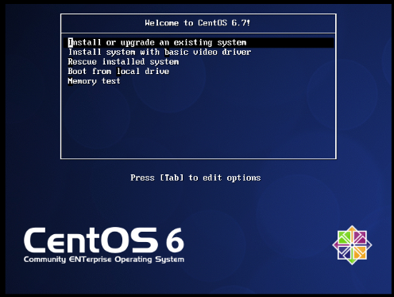
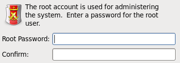
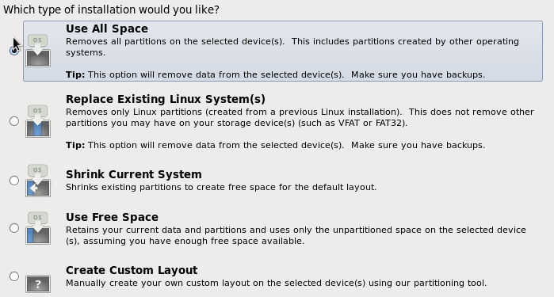
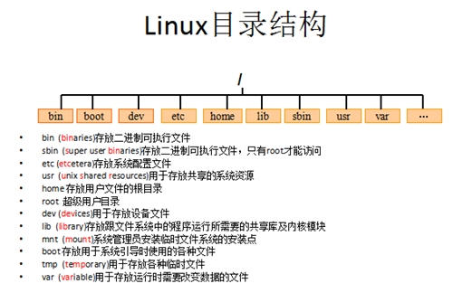

# 1  VMware

## 1.1  安装

略

## 1.2  使用技巧

VMware使用：

* VMware一般使用“挂起”，而不用重启，可以快速恢复现场。

系统坏了怎么办？两个办法：

1. 把虚拟机删除，把虚拟机文件都删了，重新安装；
2. VMware提供快照功能，当创建快照后，目录中会出现Snapshot的文件，相当于备份，可以从这里恢复。

## 1.3  安装虚拟机

> 我自己先新建一个CentOS文件夹，然后新建虚拟机时，将ISO文件、虚拟机文件、虚拟硬盘文件都放在了一起。

新建虚拟机CentOS过程注意事项：（根据提示，大部分都是默认）

1. 从Ubuntu官网下载桌面版Ubuntu的ISO文件
2. 安装VMware（非免费，需要注册码）
3. 新建虚拟机，选择Ubuntu 64位，一直默认，注意两个地方不能默认：
    * 虚拟机文件地址
    * 虚拟硬盘存放为一个文件Ubuntu.vmdk，和虚拟机文件放在一起。
4. 新建的虚拟机--设置--CD/DVD--使用ISO镜像文件--选择镜像文件。
5. 开启虚拟机，安装Ubuntu（基本默认，可以设置语言为中文）
6. 重启，完成。

新建虚拟机CentOS过程注意事项：（根据提示，大部分都是默认）

1. 注意虚拟机安装位置，注意选择ISO映像地址。
2. 需要安装为多个磁盘文件（应该是默认）
3. 设NAT网络连接方式，自动联网

然后启动CentOS，第一次需要先安装：

1. 选择第一个Enter进入

    

2. skip检测

    

3. 一般都是默认（语言、主机名、时区）

    

4. root密码：最少6位，123456

    

5. 安装Use all space, 然后，write changes to disk.

    

6. 默认安装Desktop，等着就可以了。

7. 随后Reboot, 进入引导界面，默认，然后到Create User，创建一个用户。这样就可以登录了。

8. 可以选择Other，使用root登录。

    

9. 三种联网方式，自己去百度吧。


# 2  远程连接

我们使用SecureCRT绿色版：

1. 先打开虚拟机，连接网络，输入命令`ifconfig`查看ip

2. 双击CRT启动，输入主机、用户名，然后输入密码就连上了。

    


# 3  文件系统

用普通用户登录，打开文件管理器，里面有：主目录、桌面、视频、音乐等。这些目录其实是在`/home/zjc`下面，只是为了快速打开文件而已。

> 普通用户只能在自己目录下面操作 /home/xxx/，对其他目录没有修改权限。

```
/home：所有用户目录
/home/xxx：xxx用户目录
/root：超级用户root，他的路径和其他用户不一样
/bin
/tmp
/usr
/opt
~: 代表家。如果是root，则表示/root；如果是普通用户，则表示/home/xxx
```




# 4  基础

## 1.1  文件系统

普通用户登录，打开文件管理器，里面有：主目录、桌面、视频、音乐等。这些目录其实是在`/home/zjc`下面，只是为了快速打开文件而已。

> 普通用户只能在自己目录下面操作 /home/xxx/，对其他目录没有修改权限。

```
/home：所有用户目录
/home/xxx：xxx用户目录
/root：超级用户root，他的路径和其他用户不一样
/bin
/tmp
/usr
/opt
~: 代表家。如果是root，则表示/root；如果是普通用户，则表示/home/xxx
```


## 1.2  基本命令

常用

```
查看文件：ls
查看详细信息：ls -l
查看隐藏文件：ls -a
查看当前目录：pwd
切换目录：cd xxx

创建空文件：touch a.txt
设置文件的修改时间：touch -d "2017-05-04 15:44" test.txt（黑客修改文件后，再把文件的修改时间改掉）
创建目录：mkdir test
创建多层目录：mkdir -p test/abc

删除文件或目录：rm -rf test   r表示recursive f表示force
复制文件或目录：cp -r test test2 r表示recursive
移动文件或目录：mv test test3  (也可以当做重命名来用)

cat -n xxx  用于显示文件的内容 n显示行号
more xxx 空格下一页，回车显示下一行，q退出
less xxx 和more类似，但是可以通过PgUp、PgDn键来控制。
head -n 20 xxx 查看前20行
tail -10 xxx 显示文件后10行
tail -f xxx 动态查看

修改文件中的字符：cat test.txt | tr [a-z] [A-Z]  (全部换成大写)
统计文件中的行数、字数、字节数：wc test.txt
查看文件元信息：stat test.txt
按列提取文件中的字符：cut -d: -f1,2,3 /etc/passwd (d定义分隔符，f指定列)

reboot   重启
poweroff 关机
man man  帮助文档
init 0关机
init 5图形化界面
init 6重启
```


归档tar，即tape archive档案打包（和压缩有区别）

```
归档：tar -cvf test.tar fil1
也可以归档多个：tar -cvf test.tar fil1 file2 file3
 c表示create创建档案包
 v表示verbose显示运行过程
 f表示file指定文件名

解档：tar -xvf test.tar
解档到指定目录：tar -xvf test.tar -C test02

上面的没有压缩，体积较大，因此：
压缩：tar -zcvf test.tar.gz test
解压：tar -zxvf test.tar.gz -C test02
```


查找字符串grep

```
cat /etc/passwd   如果passwd中的用户后面有字符串/sbin/nologin表示不允许登录系统
grep -n /sbin/nologin /etc/passwd  在文件中查找该字符串,n表示行号
grep -v /sbin/nologin /etc/passwd  v表示反选
grep -c /sbin/nologin /etc/passwd c表示统计行数
grep -i /sbin/nologin /etc/passwd i表示忽略大小写
```


查找文件find

```
find / -name "ins*" 查找文件名称是以ins开头的文件
find / -user test -ls 查找用户test的文件
find / -user test -type d -ls 查找用户test的目录
```


用户管理，需要以管理员root身份执行

```
su 回车输入密码，登录到root
cat /etc/passwd  查看用户列表
useradd tom   默认在/home下添加用户目录
passwd tom   修改密码
userdel tom   删除用户
rm -rf /home/tom 删除用户目录
userdel -rf tom  强制删除用户，并删除其目录

id tom    查看tom的uid、gid、groups
groupadd ronny  创建用户组
usermod -G ronny tom修改用户组（现在有两个组）
passwd -l tom  锁住用户，不能登录
passwd -u tom  解锁，可以登录
```


文件权限

```
权限分为三部分：自己|同组|别人，例如：
    rwx rwx rwx 表示所有人可读、可写、可执行
    rwx r-- --- 表示自己可读可写可执行，同组人可读
权限也可以数字表示，即rwx分别用421表示：
 7 7 7 表示所有人可读、可写、可执行
 7 4 0 表示自己可读可写可执行，同组人可读

使用ls -l查看文件权限，一般出现以下几种：
    drwxr-xr-x ... Pictures   d表示文件夹
    lrwxrwxrwx ... test02->test  l表示软链接
    -rw-rw-r-- ... readme.txt  -表示文档

修改文件权限chmod，即change file mode

    chmod o+w readme.txt o表示其他人，+w表示可写
    chmod o-w readme.txt 表示减去w权限
    chmod a+r readme.txt 表示所有人可读
    chmod u+w readme.txt 表示自己可写
    chmod g+w readme.txt 表示本组可写
    chmod +w readme.txt  表示本组可写（省略形式）
    chmod 777 readme.txt 表示所有人有所有权限（数字）
```


重定向输出：

* `>` 重定向输出，覆盖原有内容；
* `>>` 重定向输出，追加；

```
cat /etc/passwd > a.txt   将输出定向到a.txt中
cat /etc/passwd >> a.txt  输出并且追加
ifconfig > ifconfig.txt   将输出定向到ifconfig.txt中
cat /etc/passwd 1> a.txt  将标准输出重定向到a.txt中，1可以忽略
cat /etc/poowdd 2> a.txt  将标准错误重定向到a.txt中，因为文件不存在 命令错误
cat /etc/passwd &> a.txt  将标准输出或错误重定向到a.txt中
```


管道：将一个命令的输出用作另一个命令的输入  

```
ls --help | more    分页查询帮助信息
ps –ef | grep java  查询名称中包含java的进程
ifconfig | more  分页查询帮助信息
```


进程

```
ps –ef  查看所有进程
ps –ef | grep ssh 查找某一进程
kill 2868  杀掉2868编号的进程
kill -9 2868  强制杀死进程
kill -15 2868 正常关闭进程
```


转义字符

```
反斜杠（\）：使反斜杠后面的一个变量变为单纯的字符串。
单引号（''）：转义其中所有的变量为单纯的字符串。
双引号（""）：保留其中的变量属性，不进行转义处理。
反引号（``）：把其中的命令执行后返回结果。

echo `pwd` 输出执行命令的结果
PRICE=5  定义变量
echo '$PRICE'   输出当前字符串
echo "$PRICE" 输出变量值
echo "\$$PRICE" 输出$5
```


网络命令

```
hostname 查看主机名
ifconfig 查看ip
ifconfig eth0 192.168.12.22 修改ip地址
如果想要永久生效，修改/etc/sysconfig/network-scripts/ifcfg-eth0文件

/etc/hosts文件用于在通过主机名进行访问时做ip地址解析之用

网络服务管理
    service network status 查看指定服务的状态
    service network stop 停止指定服务
    service network start 启动指定服务
    service network restart 重启指定服务
    service --status–all 查看系统中所有后台服务
    netstat –nltp 查看系统中网络进程的端口监听情况
    
防火墙设置
防火墙根据配置文件/etc/sysconfig/iptables来控制本机的”出”、”入”网络访问行为。
    service iptables status 查看防火墙状态
    service iptables stop 关闭防火墙
    service iptables start 启动防火墙
    chkconfig  iptables off 禁止防火墙自启
```


## 1.3  Vim

vim有命令模式、编辑模式、末行模式(:)。

* vim命令模式进入编辑模式可以通过按键：`i、a、o `
* 末行模式就是在命令模式输入冒号，用于保存文件、退出、查找修改字符串等
* 切换到命令模式按Esc键，命令模式就是用快捷键编辑文本

在命令模式的主要命令还有：

```
移动hjkl
复制nyy 粘贴p 剪切ndd 删除x 选择v移动<>
撤销上一步u
```

末行模式命令：

```
:q! 强制退出
:wq 保存并退出
:set nu  显示行号
:set nonu 不显示行号
:命令     执行该命令
:整数     跳转到该行
:/xxx  搜索字符串，nN下一个上一个
:?xxx  从下往上搜索字符串
:s/one/two 将当前行的第一个one替换成two
:s/one/two/g将当前行的所有one替换成two
:%s/one/two 将全文的one替换成two
```


## 1.4  Linux脚本

Linux下常见三种脚本程序：

1. Shell脚本：xx.sh
2. Perl脚本：xx.pl
3. Python脚本：xx.py，建议学这个，简单且比Shell更强大

> Shell可以交互式（命令），也可以批处理（脚本）。主流Linux都是使用bash解释命令，是shell解释器的增强版。

**Shell脚本**

第一步：编写脚本hello.sh

> 注释：第一行说明解释器地址；第二行输出命令

 ```shell
#!/bin/sh
echo "hello world!"
 ```

第二步：添加执行权限

```
chmod +x hello.sh
```

 第三步：执行，必须加上路径

> 或者使用命令`/bin/sh hello.sh`，因为系统会交给sh解释器

```
./hello.sh
```

**Python脚本**

过程和Shell一样，hello.py代码如下

```
#!/bin/python3
print("hello python")
```

>Python怎么用，脚本就怎么写


## 1.5  环境变量

**1. 变量**

linux有两种变量：

1. 永久的：需要修改配置文件，将变量设为永久。
2. 临时的：使用export命令声明即可，变量在关闭终端时失效

设置临时的变量：如`export VarTest="hello world"`

使用刚才的变量：如`echo $VarTest`

**2. 用户环境变量**

用户环境变量定义在`~/.profile`中，下面在这里添加永久的环境变量：

1. 打开文件，在最后面添加`JAVA_HOME=/opt/jdk1.8`
2. 注销，重新登录
3. 打开终端，输出环境变量`echo $JAVA_HOME`（练习完删除）

**3. 系统环境变量**

系统环境变量定义在`/etc/profile`中，对所有用户有效。

由于profile文件内定义了执行profile.d文件夹，在该文件夹下面可以自定义脚本。因此：

1. 切换到root：`su root`

2. 进入到目录：`cd /etc/profile.d/`

3. 创建自己的脚本，并声明系统环境变量：`vim myprofile.sh`

    ```
    #!/bin/sh
    export TOMCAT=/opt/tomcat
    ```

4. 注销，重新登录生效（练习完删除）

**4. PATH环境变量**

PATH环境变量决定了shell将到哪些目录中寻找命令和程序；多个目录用冒号分隔。如何在PATH中添加路径呢？如下：

1. 切换到root：`su root`

2. 进入到目录：`cd /etc/profile.d/`

3. 在目录下`/xxx/xx`创建自己的脚本，添加路径：`vim myprofile.sh`

    ```
    #!/bin/sh
    export TOMCAT=/opt/tomcat
    export PATH=$PATH:/xxx/xx
    ```

4. 注销，重新登录生效（练习完删除）


## 1.6  软件安装方式

CentOS7上的软件安装方式有五种：源码、rpm、yum、dnf、二进制发布包。

**1. 源码安装**

> 最原始方式，需要运维人员自行编译代码，并解决许多的软件依赖关系。

安装步骤：

1. 一般是先解压到`/usr/src`下面 ：
    * 命令：`tar -zxvf filename.tar.gz`
    * 解压后，有个`INSTALL`文件，该文件为纯文本文件，详细讲述了该软件包的安装方法。对于多数需要编译的软件，其安装的方法大体相同。执行解压缩后产生的一个名为configure的可执行脚本程序。它是用于检查系统是否有编译时所需的库，以及库的版本是否满足编译的需要等安装所需要的系统信息。为随后的编译工作做准备。
2. 设置安装目录、安装模块等选项。
    * 命令为：`./configure --prefix=/usr/local/xxx`
    * --prefix（prefix后面不能留空格）用于指定安装路径，默认安装路径是/usr/local/下的几个文件夹里面，所以一般还是人为指定安装路径比较好。
    * 如果检查过程中，发现有错误，configure将给予提示，并停止检查。你可以跟据提示对系统进行配置。再重新执行该程序。
    * 检查通过后，此时，可以开始进行编译了。
3. 编译的过程视软件的规模和计算机的性能的不同，所耗费的时间也不同。
    * 编译命令：`make`
    * 此时生成可执行的二进制文件MakeFile，可以开始安装
4. 安装：复制二进制文件到系统，配置应用环境
    * 安装命令：`make install`
5. 安装完毕后，应清除编译过程中产生的临时文件和配置过程中产生的文件。
    * 进入其解压目录`/usr/src/xxx/`下，清楚上一次的编译：`make clean`
    * 如果要卸载，把文件夹`/usr/local/xxx`删除就可以


**2. RPM**

> 软件已经按照redbat的包管理工具规范RPM进行打包，需要获取相应软件的RPM发布包（后缀是.rpm）；但是，自动不会安装依赖包。

常用命令：

1. 升级软件：`rpm -Uvh filename.rpm`
2. 卸载安装：`rpm -e filename.rpm`
3. 查询软件包的详细信息：`rpm -qpi filename.rpm`
4. 查询某个文件是属于哪个rpm包：`rpm -qf filename.rpm`
5. rpm -qa：查询所有已安装软件的rpm包信息，列出包的版本
6. rpm -q httpd：查看httpd是否安装
7. rpm -qi httpd：列出httpd软件的详细信息
8. rpm -qc httpd：查看httpd的配置文件目录
9. rpm -ql httpd：查看httpd所包含的文件
10. whereis httpd：查看httpd的安装路径和可执行文件路径
11. which vim：搜索指令在系统中的路径

安装步骤：

1. 下载安装文件filename.rpm，拷贝到`/usr/src`
2. 安装软件（将软件安装到缺省的目录下，并将软件的安装信息注册到rpm的数据库中。）
    * 安装命令：`rpm -ivh filename.rpm`

例如安装gcc：（因为gcc有很多依赖包，所以按顺序逐个安装）

```
rpm -ivh cpp-4.1.2-42.el5.i386.rpm  
rpm -ivh kernel-headers-2.6.18-92.el5.i386.rpm   
rpm -ivh glibc-headers-2.5-24.i386.rpm  
rpm -ivh glibc-devel-2.5-24.i386.rpm  
rpm -ivh libgomp-4.1.2-42.el5.i386.rpm  
rpm -ivh gcc-4.1.2-42.el5.i386.rpm  
```


**3. Yum**

> yum是一个软件包管理器，安装简单，基于RPM包管理，能够从指定的服务器自动下载RPM包并且安装，可以自动处理依赖性关系，并且一次安装所有依赖的软件包，无须繁琐地一次次下载、安装。但是，安装位置不受控制。

yum中的所有软件包由集中的yum软件仓库提供，所以还需要配置yum源（看下一节）

常见命令：

* `yum repolist all`     列出所有仓库
* `yum list all`              列出仓库中所有软件包
* `yum list installed`  列出已经安装的软件包
* `yum list 软件包名称`    列出可以安装的软件包
* `yum info 软件包名称`    查看软件包信息
* `yum install 软件包名称`     安装软件包
* `yum reinstall 软件包名称` 重新安装软件包
* `yum update 软件包名称`       升级软件包
* `yum remove 软件包名称`       移除软件包
* `yum clean all`           清除所有仓库缓存
* `yum check-update`     检查可更新的软件包
* `yum grouplist`                            查看系统中已经安装的软件包组
* `yum groupinstall 软件包组`      安装指定的软件包组
* `yum groupremove 软件包组`        移除指定的软件包组
* `yum groupinfo 软件包组`            查询指定的软件包组信息


**4. 二进制发布包**

> 软件已经针对具体平台编译打包发布，只要解压，修改配置即可；但是各平台不兼容；

有些软件，官方提供了压缩包，解压之后即可直接运行其中的二进制文件，比如很多Java写的软件。这类软件没有给源代码，而是给了可以在当前平台下直接执行的二进制文件。大多数非开源的商业软件都采取这种办法。比如sublime_text、pycharm、mendeley、TauP、sac等，直接解压，然后将解压后的文件夹复制到`/opt`目录下，然后将该软件的bin目录加入到PATH中即可。

Linux下的习惯是，商业软件或第三方软件都安装到`/opt`目录下，这也是大多数商业软件包的默认安装路径，尽量遵循该习惯。

比如，安装Tomcat：

1. 从官网下载一个tar.gz版本（注意要支持jdk的版本）
2. 解压：`tar -zxvf apache-tomcat-8.5.54.tar.gz`
3. 重命名：`mv apache-tomcat-8.5.54 tomcat8`
4. 运行：`tomcat8/bin/startup.sh` （tomcat是一个后台程序，看不见它，但是在运行）
5. 停止：`tomcat8/bin/shutdown.sh`

**5. dnf安装**

>  CentOS7/8可以使用，重新开发的，比yum更好一点吧

**6. 第三方包管理器**

> 不同的发行版使用不同的软件包管理器，CentOS使用yum，Ubuntu使用apt-get。近些年又出现了一些与发行版无关的第三方包管理器，比如Linuxbrew、Gentoo Prefix、pkgsrc。

**7. 自成系统的软件**

有一类软件，其拥有众多模块或包，为了管理这众多的模块，就需要拥有一个自己的模块/包管理器。这其中以TeX、Perl和Python为代表。对于这一类软件，其众多的模块是最大的优势，也是最值得利用的资源，因而我通常会选择手动安装它们，原因如下：

- 系统的源中不可能包含该软件的所有模块；
- 系统的源中该软件的模块的更新要远远滞后于最新版本；

因而，对于这类软件，一般单独安装，并用各自的包管理器管理模块：

- TeXLive：通过TeXLive iso镜像文件安装，使用其自带的tlmgr管理包
- Perl：通过plenv安装最新版本的Perl，使用plenv自带的cpanm安装模块
- Python：通过pyenv安装最新版本的Python，使用Python自带的pip安装模块


## 1.7  软件源

> yum中的所有软件包由集中的yum软件仓库提供，所以还需要配置yum库（yum源）。

源按照类型可以分为官方源和第三方源，按照位置可以分为本地源和网络源。

本地yum源是指yum仓库在本地，一般是本地系统光盘或镜像文件。

所谓网络yum源是指yum仓库在远程（不在本地），需要联网才能安装。

- 国内较知名的网络源（aliyun源，163源，sohu源，知名大学开源镜像等）
- 国外较知名的网络源（centos源、redhat源、红帽扩展epel源等）
- 特定软件相关的网络源（Nginx、MySQL、Zabbix等）

**官方源**

CentOS自带的四个官方源中，默认打开的有base、updates、extras，这三个源中包含了约9000个软件包，是最稳定、也是最值得信赖的源。因而若一个软件包在官方源内，则应通过官方源安装。

**第三方源**

官方源虽然包含了很多软件包，但无法满足日常需求。幸好有第三方源，可以作为官方源的补充。

在使用第三方源的过程中，最怕遇到这两个问题：

1. 第三方源和官方源中有相同的包，导致官方源的包被第三方源替代；
2. 多个第三方源中存在同一个软件包，且版本不一致，存在冲突；

这两个问题经常是致命的，出现各种预料不到的后果，因而选择第三方源要遵循如下原则：

1. 只选择可靠的第三方源，要确保第三方源不会替换官方源中的包；
2. 使用尽量少的第三方源，以保证第三方源之间不会冲突；

就CentOS而言，根据以上的原则，使用如下第三方源：

1. 大型第三方源，已确认不会替换官方源的包，且相互之间无冲突
    1. EPEL：包含6500多个软件，科研必备，是Fedora社区打造的一个高质量软件源，提供了比CentOS-Base更多的软件。
    2. ELRepo：包含几十个各种硬件的驱动程序
2. 有些小型第三方源，仅包含了几个软件，确认与官方源和EPEL源不会冲突，也可以添加
    1. Google Chrome：包含了Google Chrome，不会与官方源和EPEL源冲突；
    2. Adobe：仅包含flash插件，已确认不会冲突；
    3. dropbox：仅包含dropbox一个软件，已确认不会冲突；

**配置源**

yum的配置文件是`/etc/yum.conf`，里面规定了安装软件时的选项。

yum源文件在`/etc/yum.repos.d/`目录下，包括CentOS-Base.repo, CentOS-Media.repo等

* CentOS-Base.repo是网络源，也就是CentOS官网自身的源
* CentOS-Media.repo是本地源，本地源默认使用网络源。

镜像源：因为自带的源CentOS-Base.repo或者epel.repo是国外的，下载慢，可以使用阿里、网易、清华镜像。

更换源：

1. 备份/etc/yum.repos.d/CentOS-Base.repo

    ```
    sudo mv /etc/yum.repos.d/CentOS-Base.repo /etc/yum.repos.d/CentOS-Base.repo.back
    ```

2. 安装一个文件下载工具wget

    ```
    yum install -y wget
    ```

3. 更换各个大厂的源阿里、网易、中科大。（选择其中一个就行）

    ```
    cd /etc/yum.repos.d/
    sudo wget -O CentOS-Base.repo http://mirrors.aliyun.com/repo/Centos-7.repo
    sudo wget -O CentOS-Base.repo http://mirrors.163.com/.help/CentOS7-Base-163.repo
    sudo wget -O CentOS-Base.repo https://lug.ustc.edu.cn/wiki/_export/code/mirrors/help/centos?codeblock=3
    ```

4. 清楚元数据，更新元数据缓存

    ```
    sudo yum clean all
    sudo yum makecache
    ```


## 1.8  安装常用软件

 ### 1.7.1  JDK

CentOS自带JDK，我们可以先卸载：

1. 查看版本`java -version`
2. 查看当前安装的jdk的信息`rpm -qa | grep java`，发现三个，全卸载；
3. 卸载`rpm -e --nodeps java-1.6.0.35-xxxxxx`

软件一般安装到`/usr/local`

1. `mkdir /usr/local/jdk`

2. 解压`tar -xvf jdk-xxx -C ./jdk`

3. 配置环境变量，先进入目录`cd /etc/profile.d`

4. 打开/创建自己的环境`vim myprofile.sh`

    ```
    #!/bin/sh
    export JAVA_HOME=/usr/local/jdk/jdk1.1.0_71
    export CLASSPATH=.:$JAVA_HOME/lib.tools.jar
    export PATH=$JAVA_HOME/bin:$PATH
    ```

5. 使更改的配置立即生效`source /etc/profile.d/myprofile.sh`

### 1.7.2  Tomcat

二进制源码方式，直接解压运行：

1. 从官网下载一个tar.gz版本（注意要支持jdk的版本）
2. 解压：`tar -zxvf apache-tomcat-8.5.54.tar.gz`
3. 重命名：`mv apache-tomcat-8.5.54 tomcat8`
4. 运行：`tomcat8/bin/startup.sh` （tomcat是一个后台程序，看不见它，但是在运行）
5. 停止：`tomcat8/bin/shutdown.sh`

# 5 vim教程

## 设置

缩进设置

```
autoindent 跟随上一行缩进方式
smartindent 类似C语言的智能缩进方式
cindent  C语言的缩进方式
tabstop  一个tab键 显示 多少个空格
softtabstop 一个tab键 等于 多少个空格 （显示优先级大于tabstop）
expandtab 显示tab键为空格，否则为\t 
shiftwidth 缩进格数（和tab无关）

# 一般情况下设置如下（智能缩进；tab显示4个空格；tab实际等于4个空格；显示tab为空格；缩进4个空格）
vim ~/.vimrc
set smartindent
set tabstop=4
set softtabstop=4
set expandtab
set shiftwidth=4
```


## 常用指令

插入模式

```
i 光标前
I 行首
a 光标后
A 行尾
o 下面新建一空行
O 上面新建一空行
Esc 退出插入模式
```

移动光标

```
hjkl 上下左右
ctrl+e 移动页面
ctrl+f 下一页
ctrl+b  上一页
w  跳转到下一个字首
e  跳转到下一个字尾
b  跳转到上一个字首
^  跳转至行首
$  跳转至行尾
gg  跳转至文首
G  跳转至文尾
5gg/5G 跳转至5行处
shift + >> 向右缩进
```

复制删除

```
dd   删除当前行
dw  删除光标开始位置的字
5dd  删除5行
x  删除一个字符
d^  删除光标前
d$  删除光标后
yy  复制当前行
P  粘贴到当前行后面
u  撤销（向前恢复一步）
ctrl+R 撤销（向后恢复一步）
```

进入可视模式，并复制

```
v   进入可视模式
shift + v 进入行可视模式（每次选中一行）
hjkl  通过hjkl移动并选中内容
y   复制
>   向右缩进
d   删除内容
```

查找

```
/hello  从光标位置向后搜索
?hello  从光标位置向前搜索
n   下一个
N   上一个
```

替换

```
:%s/abc/123  将所有行的第一个abc替换成123
:%s/abc/123/g 将所有行的abc替换成123
```

## 常用命令

```
:set nu  显示行号
:set nonu 取消行号
:nohl 取消高亮

:a>  第a行向右缩进
:a>b 从第a行开始的b行 向右缩进
:a,b> 第a行至第b行 向右缩进
```


