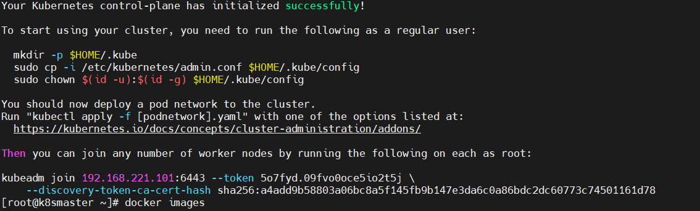
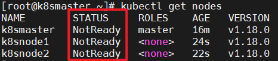

# 使用kubeadm快速部署集群

kubeadm是官方社区推出的一个用于快速部署kubernetes集群的工具。

这个工具能通过两条指令完成一个kubernetes集群的部署：

```
# 创建一个 Master 节点
$ kubeadm init

# 将一个 Node 节点加入到当前集群中
$ kubeadm join <Master节点的IP和端口 >
```

## 1. 安装要求

在开始之前，部署Kubernetes集群机器需要满足以下几个条件：

- 一台或多台机器，操作系统 CentOS7.x-86_x64
- 硬件配置：2GB或更多RAM，2个CPU或更多CPU，硬盘30GB或更多
- 可以访问外网，需要拉取镜像，如果服务器不能上网，需要提前下载镜像并导入节点
- 禁止swap分区

## 2. 准备环境

| 角色       | IP              |
| ---------- | --------------- |
| k8s-master | 192.168.221.101 |
| k8s-node1  | 192.168.221.102 |
| k8s-node2  | 192.168.221.103 |

```
# 关闭防火墙
systemctl stop firewalld
# k8smaster
systemctl disable firewalld
# 查看防火墙状态
systemctl status firewalld


# 关闭selinux
# 临时
setenforce 0 
# 永久 (修改文件SELINUX=disabled)
sed -i 's/enforcing/disabled/' /etc/selinux/config


# 关闭swap
# 查看swap状态
free -g
# 临时
swapoff -a
# 永久 (将/dev/mapper/centos-swap行注释掉)
sed -ri 's/.*swap.*/#&/' /etc/fstab

# 根据规划设置主机名
hostnamectl set-hostname k8smaster
hostnamectl set-hostname k8snode1
hostnamectl set-hostname k8snode2
# 查看hostname
hostname

# 在master添加hosts
cat >> /etc/hosts << EOF
192.168.221.101 k8smaster
192.168.221.102 k8snode1
192.168.221.103 k8snode2
EOF

# 将桥接的IPv4流量传递到iptables的链
cat > /etc/sysctl.d/k8s.conf << EOF
net.bridge.bridge-nf-call-ip6tables = 1
net.bridge.bridge-nf-call-iptables = 1
EOF
# 生效
sysctl --system

# 时间同步
yum install ntpdate -y
ntpdate time.windows.com

```

## 3.1 安装Docker

```
# 1、安装yum-utils，是为了使用yum-config-manager命令
yum install yum-utils
# 2、通过 yum-config-manager 设置镜像仓库地址阿里云 
yum-config-manager --add-repo https://mirrors.aliyun.com/docker-ce/linux/centos/docker-ce.repo

# 3、安装
# docker-ce : docker 引擎，社区版
# docker-ce-cli : docker 引擎的命令行界面，社区版
# containerd.io : 守护进程 containerd。 它在 docker 包上独立工作，并且是 docker 包所必需的。
# docker-compose-plugin： docker编排插件，后面用
yum install -y docker-ce docker-ce-cli containerd.io docker-compose-plugin

# 4、查看docker版本，验证是否验证成功
docker -v
# 如果失败，看是否关闭了防火墙
# 关闭
systemctl stop firewalld
# 禁止开机启动防火墙
systemctl disable firewalld

# 5、根据需要，设置开机自动启动
systemctl enable docker
# 6、启动 关闭 重启docker
systemctl start docker
systemctl stop docker
systemctl restart docker

# 7、配置镜像加速，因为国内从docker hub官方仓库下载较慢
* 镜像从Docker Hub下载。
* 国内从Docker Hub获取镜像时会遇到困难，所以必须配置加速器。
* 阿里镜像加速器、免费、参考官方：https://cr.console.aliyun.com/cn-hangzhou/instances/mirrors
```


这是我个人的加速器：（提示Docker客户端要大于1.10.0）

```
sudo mkdir -p /etc/docker
sudo tee /etc/docker/daemon.json <<-'EOF'
{
  "registry-mirrors": ["https://371h9tpb.mirror.aliyuncs.com"]
}
EOF
sudo systemctl daemon-reload
sudo systemctl restart docker
```


## 3.2 安装k8s

添加阿里云YUM软件源

```
cat > /etc/yum.repos.d/kubernetes.repo << EOF
[kubernetes]
name=Kubernetes
baseurl=https://mirrors.aliyun.com/kubernetes/yum/repos/kubernetes-el7-x86_64
enabled=1
gpgcheck=0
repo_gpgcheck=0
gpgkey=https://mirrors.aliyun.com/kubernetes/yum/doc/yum-key.gpg https://mirrors.aliyun.com/kubernetes/yum/doc/rpm-package-key.gpg
EOF

```

由于版本更新频繁，这里指定版本号部署：

```
yum install -y kubelet-1.18.0 kubeadm-1.18.0 kubectl-1.18.0
# 设置开机启动
systemctl enable kubelet

```

我安装提示：No package ... availabel

```
# 先执行下面命令。再添加阿里源，再安装成功了。
sudo yum install epel-release
```


## 4.1 部署Kubernetes Master

在192.168.31.61（Master）执行。把命令复制到记事本，去掉斜杠。

```
# 参数说明
# 第一行：本机IP
# 第二行：镜像源
# 第三行：版本
# 第四行、第五行：自己连接设置的IP，只要不冲突就行

kubeadm init \
  --apiserver-advertise-address=192.168.44.146 \
  --image-repository registry.aliyuncs.com/google_containers \
  --kubernetes-version v1.18.0 \
  --service-cidr=10.96.0.0/12 \
  --pod-network-cidr=10.244.0.0/16

```

上面命令会下载master节点需要的工具的docker镜像。

```
# 查看镜像
docker images
```


但是在下载过程中，由于默认拉取镜像地址k8s.gcr.io国内无法访问，会给你提示，你需要按提示完成接下来的步骤



根据提示做：

```bash
# 第一个提示
# 为了启动你的集群，你需要运行下面命令
mkdir -p $HOME/.kube
sudo cp -i /etc/kubernetes/admin.conf $HOME/.kube/config
sudo chown $(id -u):$(id -g) $HOME/.kube/config

# 第二个提示（这里不用做，需要在node节点做）
# 你可以运行下面命令，将working节点加入集群
kubeadm join 192.168.221.101:6443 --token j5rgxs.fuxcb1igbulnnrfd     --discovery-token-ca-cert-hash sha256:a4add9b58803a06bc8a5f145fb9b147e3da6c0a86bdc2dc60773c74501161d78

# 查看k8s集群节点
kubectl get nodes
```


## 4.2 加入Kubernetes Node

在Node执行。

向集群添加新节点，执行master节点输出的kubeadm join命令：

```

kubeadm join 192.168.221.101:6443 --token j5rgxs.fuxcb1igbulnnrfd     --discovery-token-ca-cert-hash sha256:a4add9b58803a06bc8a5f145fb9b147e3da6c0a86bdc2dc60773c74501161d78

```

默认token有效期为24小时，当过期之后，该token就不可用了。这时就需要重新创建token，操作如下：

```
# 1. 主节点创建token
kubeadm token create --print-join-command

# 2. 节点
kubeadm reset
# 修改ip (如果下面输出是0就需要修改)
cat /proc/sys/net/ipv4/ip_forward
sysctl -w net.ipv4.ip_forward=1
# 重新加入
kubeadm join 192.168.221.101:6443 --token j5rgxs.fuxcb1igbulnnrfd     --discovery-token-ca-cert-hash sha256:a4add9b58803a06bc8a5f145fb9b147e3da6c0a86bdc2dc60773c74501161d78
```


## 5. 部署CNI网络插件

查看节点信息

```
kubectl get nodes
```





其中STATUS不太正确，需要部署CNI网络插件：

* cni是`容器网络接口`,作用是`实现容器跨主机网络通信`。主要有：flannel简单易用；calico复杂灵活；等。

```
# 在mater执行（因为是国外的，基本下载不了）
# 下载flannel插件的yml
# wget https://raw.githubusercontent.com/coreos/flannel/master/Documentation/kube-flannel.yml
# 修改kube-flannel.yml中的镜像仓库地址为国内源
# sed -i 's/quay.io/quay-mirror.qiniu.com/g' kube-flannel.yml

# 看附录文件，直接copy进去
vim kube-flannel.yml

# 安装网络插件
kubectl apply -f kube-flannel.yml

# 查看k8s集群节点信息
kubectl get nodes
```

## 6. 测试kubernetes集群

在Kubernetes集群中创建一个pod，验证是否正常运行：

```
# 安装nginx镜像
# 创建一个deployment类型的资源,它的名字就叫nginx,镜像就是nginx
kubectl create deployment nginx --image=nginx
# 暴露80端口
kubectl expose deployment nginx --port=80 --type=NodePort
# 查看对外端口（第二个端口）
kubectl get pod,svc
# 浏览器访问 http://NodeIP:Port  
```

# 附录

## kube-flannel.yml

```
---
---
apiVersion: policy/v1beta1
kind: PodSecurityPolicy
metadata:
  name: psp.flannel.unprivileged
  annotations:
    seccomp.security.alpha.kubernetes.io/allowedProfileNames: docker/default
    seccomp.security.alpha.kubernetes.io/defaultProfileName: docker/default
    apparmor.security.beta.kubernetes.io/allowedProfileNames: runtime/default
    apparmor.security.beta.kubernetes.io/defaultProfileName: runtime/default
spec:
  privileged: false
  volumes:
  - configMap
  - secret
  - emptyDir
  - hostPath
  allowedHostPaths:
  - pathPrefix: "/etc/cni/net.d"
  - pathPrefix: "/etc/kube-flannel"
  - pathPrefix: "/run/flannel"
  readOnlyRootFilesystem: false
  # Users and groups
  runAsUser:
    rule: RunAsAny
  supplementalGroups:
    rule: RunAsAny
  fsGroup:
    rule: RunAsAny
  # Privilege Escalation
  allowPrivilegeEscalation: false
  defaultAllowPrivilegeEscalation: false
  # Capabilities
  allowedCapabilities: ['NET_ADMIN', 'NET_RAW']
  defaultAddCapabilities: []
  requiredDropCapabilities: []
  # Host namespaces
  hostPID: false
  hostIPC: false
  hostNetwork: true
  hostPorts:
  - min: 0
    max: 65535
  # SELinux
  seLinux:
    # SELinux is unused in CaaSP
    rule: 'RunAsAny'
---
kind: ClusterRole
apiVersion: rbac.authorization.k8s.io/v1
metadata:
  name: flannel
rules:
- apiGroups: ['extensions']
  resources: ['podsecuritypolicies']
  verbs: ['use']
  resourceNames: ['psp.flannel.unprivileged']
- apiGroups:
  - ""
  resources:
  - pods
  verbs:
  - get
- apiGroups:
  - ""
  resources:
  - nodes
  verbs:
  - list
  - watch
- apiGroups:
  - ""
  resources:
  - nodes/status
  verbs:
  - patch
---
kind: ClusterRoleBinding
apiVersion: rbac.authorization.k8s.io/v1
metadata:
  name: flannel
roleRef:
  apiGroup: rbac.authorization.k8s.io
  kind: ClusterRole
  name: flannel
subjects:
- kind: ServiceAccount
  name: flannel
  namespace: kube-system
---
apiVersion: v1
kind: ServiceAccount
metadata:
  name: flannel
  namespace: kube-system
---
kind: ConfigMap
apiVersion: v1
metadata:
  name: kube-flannel-cfg
  namespace: kube-system
  labels:
    tier: node
    app: flannel
data:
  cni-conf.json: |
    {
      "name": "cbr0",
      "cniVersion": "0.3.1",
      "plugins": [
        {
          "type": "flannel",
          "delegate": {
            "hairpinMode": true,
            "isDefaultGateway": true
          }
        },
        {
          "type": "portmap",
          "capabilities": {
            "portMappings": true
          }
        }
      ]
    }
  net-conf.json: |
    {
      "Network": "10.244.0.0/16",
      "Backend": {
        "Type": "vxlan"
      }
    }
---
apiVersion: apps/v1
kind: DaemonSet
metadata:
  name: kube-flannel-ds
  namespace: kube-system
  labels:
    tier: node
    app: flannel
spec:
  selector:
    matchLabels:
      app: flannel
  template:
    metadata:
      labels:
        tier: node
        app: flannel
    spec:
      affinity:
        nodeAffinity:
          requiredDuringSchedulingIgnoredDuringExecution:
            nodeSelectorTerms:
            - matchExpressions:
              - key: kubernetes.io/os
                operator: In
                values:
                - linux
      hostNetwork: true
      priorityClassName: system-node-critical
      tolerations:
      - operator: Exists
        effect: NoSchedule
      serviceAccountName: flannel
      initContainers:
      - name: install-cni-plugin
        image: rancher/mirrored-flannelcni-flannel-cni-plugin:v1.0.0
        command:
        - cp
        args:
        - -f
        - /flannel
        - /opt/cni/bin/flannel
        volumeMounts:
        - name: cni-plugin
          mountPath: /opt/cni/bin
      - name: install-cni
        image: quay.io/coreos/flannel:v0.15.1
        command:
        - cp
        args:
        - -f
        - /etc/kube-flannel/cni-conf.json
        - /etc/cni/net.d/10-flannel.conflist
        volumeMounts:
        - name: cni
          mountPath: /etc/cni/net.d
        - name: flannel-cfg
          mountPath: /etc/kube-flannel/
      containers:
      - name: kube-flannel
        image: quay.io/coreos/flannel:v0.15.1
        command:
        - /opt/bin/flanneld
        args:
        - --ip-masq
        - --kube-subnet-mgr
        resources:
          requests:
            cpu: "100m"
            memory: "50Mi"
          limits:
            cpu: "100m"
            memory: "50Mi"
        securityContext:
          privileged: false
          capabilities:
            add: ["NET_ADMIN", "NET_RAW"]
        env:
        - name: POD_NAME
          valueFrom:
            fieldRef:
              fieldPath: metadata.name
        - name: POD_NAMESPACE
          valueFrom:
            fieldRef:
              fieldPath: metadata.namespace
        volumeMounts:
        - name: run
          mountPath: /run/flannel
        - name: flannel-cfg
          mountPath: /etc/kube-flannel/
      volumes:
      - name: run
        hostPath:
          path: /run/flannel
      - name: cni-plugin
        hostPath:
          path: /opt/cni/bin
      - name: cni
        hostPath:
          path: /etc/cni/net.d
      - name: flannel-cfg
        configMap:
          name: kube-flannel-cfg

```


