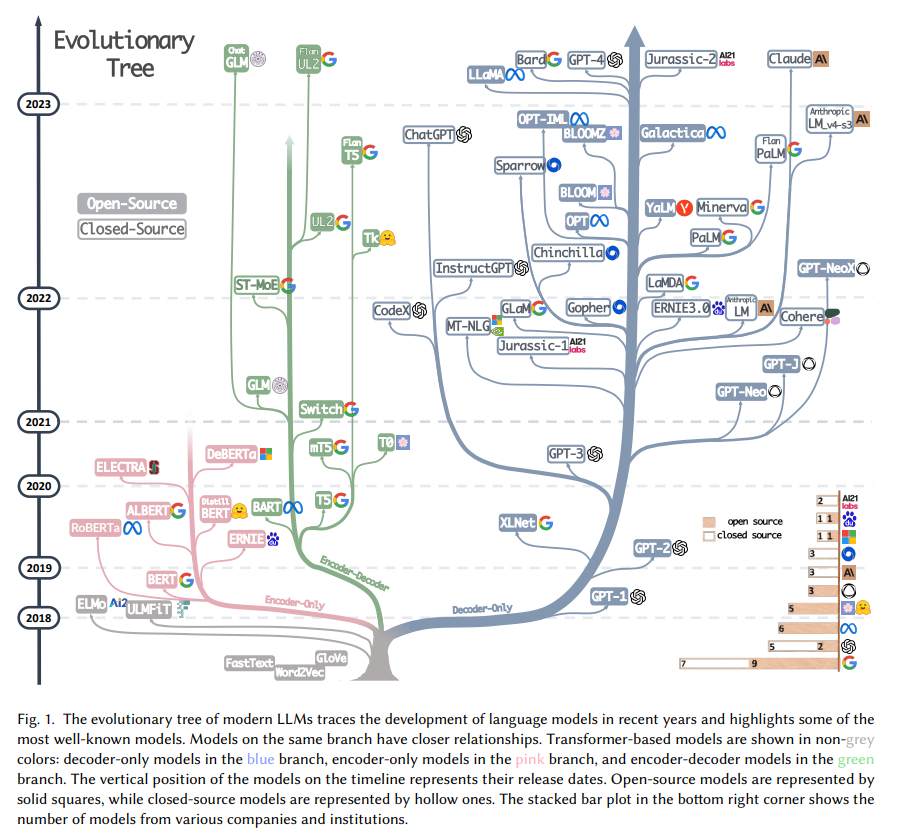
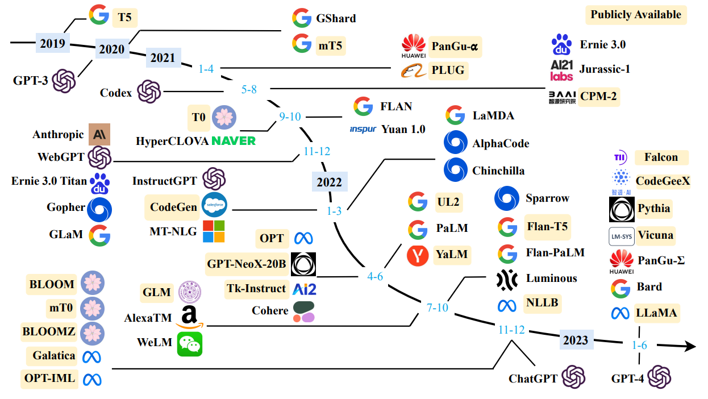

# 综述

##  文字版

```
2017.06 Google发布Transformaer；DeepMind提出RLHF方法
2018.06 OpenAI发布基于Transformer Decoder的GPT-1，1.1亿参数
2018.10 Google发布基于Transformer Encoder的BERT，最大3.5亿参数
2019.02 OpenAI发布GPT-2，15亿参数
2019.10 Google发布基于Encoder-Decoder的T5,兼容BERT和GPT的下游任务
2020.05 OpenAI发布GPT-3，1750亿参数
2021.10 Google发布FLAN，转向Decoder-only,提出Instruction Tuning
2021.11 DeepMind发布Gopher, 2800亿参数，加入LLM大战
2022.01 Google发布LaMDA，1380亿参数
2022.03 OpenAI发布InstructGPT，用到Instruction Tuning和RLHF
2022.04 Google发布PaLM，5400亿参数
2022.09 Tsinghua发布GLM-130B，开源
2022.09 DeepMind发布Sparrow，加入RHLF和Retrival
2022.12 OpenAI发布ChatGPT
2023.02 Google发布Bard
2023.02 Meta发布LLaMA， 开源
```


## 树形图

综述：Harnessing the Power of LLMs in Practice: A Survey on ChatGPT and Beyond

这篇论文就这张图重要




## 时间图

综述：A Survey of large language models





## 文章

张俊林的LLM技术精要： 

[通向AGI之路：大型语言模型（LLM）技术精要 - 知乎 (zhihu.com)]：

https://zhuanlan.zhihu.com/p/597586623

笔记：把一些重要知识点都写出来，比综述性的论文要牛！必读！

# Transformer

## 注意力机制

什么是注意力机制：https://blog.csdn.net/Tink1995/article/details/105012972

笔记：

1、基于RNN的Encoder-Decoder结构，缺点：预测长序列效果不好；

2、将Encoder-Decoder引入注意力机制Attention：

* 优点：Decoder可以并行训练；注意力机制效果好。

* 缺点：Encoder不能并行训练；Encoder处理长序列效果不好。


## Transformer

Transformer的结构的详细讲解：https://zhuanlan.zhihu.com/p/338817680

Transformer论文翻译解读：https://blog.csdn.net/nocml/article/details/103082600

现有问题：RNN不能并行训练

论文创新：

1、Transformer提出的出发点：RNN结果不能并行训练。


# 大模型

## BERT

论文解读：https://www.cnblogs.com/anai/p/11645953.html

笔记：

1、BERT是Transformer的Encoder部分

2、BERT是一个双向的预训练语言模型，采用Masked（掩码/完形填空）和NSP（判断两个句子的时序）方式训练模型。

3、提出“预训练+微调”，这里微调指全量参数微调。


## GPT-1

论文解读：https://aigonna.com/2020/12/03/NLP Paper 12.1 GPT-1 论文笔记/

现有问题：

1、如何在没有标注的数据集上进行预训练；

2、如何做微调；

3、如何在每个子任务上表示其输入。

论文笔记：

1、GPT是Transformer的Decoder部分（且去掉了Decoder的第二个Multi-Head）

2、无监督的预训练和监督的微调组合成半监督学习


## GPT-2

论文解读：

现有问题：

1、当前系统是狭隘的专家而不是称职的全才（下游需要微调）

论文笔记：

1、模型参数15亿

2、zero-shot，零样本学习，即不用下游微调，直接用预训练模型在多个任务上表现很好。


## GPT-3

论文解读：https://zhuanlan.zhihu.com/p/200978538

现有问题：

1、和GPT2一样，探索不需要微调的大模型

2、如果不微调，可以使用情景学习In-Context Learning：即few-shot的能力

论文笔记：

1、模型参数1750亿

2、评估用了三种方法：

* zero-shot：一个样本都不提供
* one-shot：提供一个样本
* few-shot：提供大概10-100个样本

3、大模型更适合In-Context Learning


## XLNet

论文解读：https://zhuanlan.zhihu.com/p/71916499

论文：谷歌

现有问题：

BERT是自编码模型，GPT是自回归模型，如何将两者结合起来？

论文笔记：

1、Permutation Language Model：将训练的token打乱(Permutation)，然后掩码进行预测

2、使用了Transformer-XL作为元模型


## UniLM2.0

论文解读：https://zhuanlan.zhihu.com/p/122999153 

论文：微软

现有问题：

BERT更适用于NLG（自然语言生成），GPT更适用于NLU（自然语言理解），如何将两者结合起来？

论文笔记：

1、将NLG和NLU结合起来了。


## T5

论文解读：https://zhuanlan.zhihu.com/p/88438851

时间：2019

现有问题：

这时候已经有了GPT2，都在想着做大模型

论文笔记：

1、模型最大的11B

2、基础架构就是Tranformer，为什么呢，因为作者对比了Encoder，Decoder，Encoder-Decoder，发现Encoder-Decoder效果最好。


## FLAN

论文解读：https://zhuanlan.zhihu.com/p/580468546


## WebGPT


## InstructGPT

论文解读：https://zhuanlan.zhihu.com/p/590311003

论文笔记：

1、指示学习（Instruct Learning）和提示学习（Prompt Learning）

2、RLHF（人类反馈的强化学习）


## OPT 

## PaLM

## Flan-T5

## BLOOM 

## ChatGPT


# 大模型2023

## BART

论文笔记：https://blog.csdn.net/sinat_41506268/article/details/131189683

1、BART使用了Encoder-Decoder结构

2、类似于BEAR的放大版


## LlaMA


## Vicuna


## TULU

论文笔记：https://mp.weixin.qq.com/s/9nrHh_JKSBbuILeVxCkmlA


# 其他

杨丽坤的世界模型

Self-Supervised Learning from Images with a Joint-Embedding Predictive Architecture


解锁世界模型

https://mp.weixin.qq.com/s/wEN6lj1bMJxvnAWACV9BCw


指令调优模型评测

INSTRUCTEVAL: Towards Holistic Evaluation of Instruction-Tuned Large Language Models


Meta的开源的文本音乐生成模型

Simple and Controllable Music Generation 


旋转位置编码

https://mp.weixin.qq.com/s/e8bLx43NNSIKuyomVq2SZA