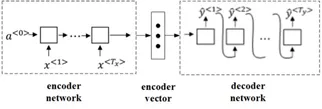
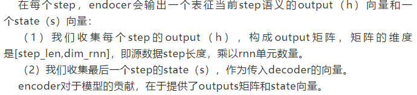
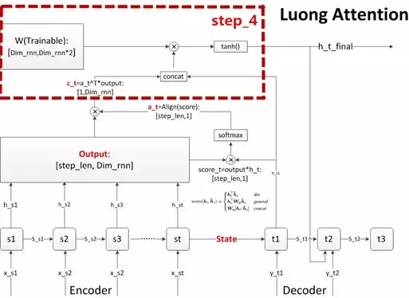

### seq2seq

 为了让decoder能够更好地提取源序列的信息，Bahdanau在2014年提出了注意力机制Attention Mechanism，Luong在2015年对Bahdanau Attention进行了改进。这是两个最经典的注意力机制模型。两个Attention模型的本质思路是一样的，下文均以Luong Attention模型作为范例。 

 Bahdanau D ,Cho K , Bengio Y . Neural Machine Translation by Jointly Learning to Align andTranslate[J]. Computer Science, 2014. 

 Luong M T ,Pham H , Manning C D . Effective Approaches to Attention-based Neural MachineTranslation[J]. Computer Science, 2015. 

### attention mechanism

### Attention五部曲

### 3.1 执行encoder

计算输出h矩阵，和传入decoder的最后一个状态s向量。

### 3.2 计算对齐系数a

对齐系数即相关系数，计算decoder每个输出和h矩阵之间的相关性。

h[step_len, dim_rnn]乘以decoder当前step的输出，再经过softmax归一化，即可得到当前的score.

### 3.3 计算上下文语义向量c

步骤2中得到的score，即对齐系数a作为权重，再乘以encoder的output矩阵，得到decoder当前step的上下文语义向量c。

### 3.4 更新decoder状态/输出

 BahdanauAttention 更新的是s 。

 Luong Attention 更新的是h（图）。

### 3.5 计算输出预测词

 做一个语义向量到目标词表的映射（如果attention用于分类模型，那就是做一个到各个分类的映射），然后再进行softmax就可以了 。

### 其他

局部对齐：本文介绍的是Global Attention，还有Local Attention，只用部分step计算对齐系数

1.  Monotonicalignment (local-m)：简单粗暴的，直接按源序列和目标序列的step绝对值对齐。 
2.  Predictivealignment (local-p)：通过模型，学习计算出截断step的对齐中心。 
3.  Luong的论文里有提及，LocalAttention的效果优于Global Attention。 

其他改进：

1.  用于生成对齐向量a的分值score的计算方式。 
2.  h和s的更新公式 。
3.  基本RNN的结构，包括替换门控单元、更改RNN层数、单向改双向等。 