参考 https://baijiahao.baidu.com/s?id=1622064575970777188&wfr=spider&for=pc

论文《Attention is All You Need》https://arxiv.org/abs/1706.03762

# 宏观模型

论文中是6个编码器和6个解码器

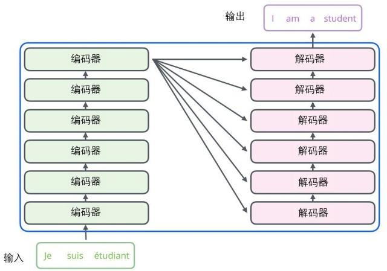

**第一步：** 获取输入句子的每一个单词的表示向量 **X** = 词嵌入+位置嵌入

词嵌入：是一个矩阵：词表大小 x 嵌入维度。输入one-hot编码  或者 词表中的index，通过矩阵计算，得到词嵌入向量。

**第二步：** 将得到的单词表示向量矩阵 (如上图所示，每一行是一个单词的表示 **x**) 传入 Encoder 中，经过 6 个 Encoder block 后可以得到句子所有单词的编码信息矩阵 **C**，如下图。单词向量矩阵用Xnd 表示， n 是句子中单词个数，d 是表示向量的维度 (论文中 d=512)。每一个 Encoder block 输出的矩阵维度与输入完全一致。

**第三步**：将 Encoder 输出的编码信息矩阵 **C**传递到 Decoder 中，Decoder 依次会根据当前翻译过的单词 1~ i 翻译下一个单词 i+1，如下图所示。在使用的过程中，翻译到单词 i+1 的时候需要通过 **Mask (掩盖)** 操作遮盖住 i+1 之后的单词。

# 输入

输入向量 **X** = 词嵌入+位置嵌入

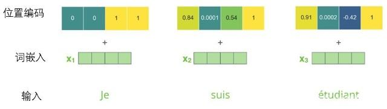

## 词Embedding

单词Embedding：单词的 Embedding 有很多种方式可以获取，例如可以采用 Word2Vec、Glove 等算法预训练得到，也可以在 Transformer 中训练得到。

端到端训练：当我们输入原始文本后，Text 经过 Tokenizer 处理得到 Input_ids，Input_ids 再经过 Embedding 层就获得原始的词向量了。

## 位置Embedding

> 如何实现位置编码？一种做法就是分配一个0到1之间的数值给每个时间步，其中，0表示第一个词，1表示最后一个词。这种方法虽然简单，但会带来很多问题。其中一个就是你无法知道在一个特定区间范围内到底存在多少个单词。换句话说，不同句子之间的时间步差值没有任何的意义。

因此，一种好的位置编码方案需要满足以下几条要求：

- 它能为每个时间步输出一个独一无二的编码；
- 不同长度的句子之间，任何两个时间步之间的距离应该保持一致；
- 模型应该能毫不费力地泛化到更长的句子。它的值应该是有界的；
- 它必须是确定性的。

RNN最大的优点就是在时间序列上对数据的抽象，所以文章中作者提出Positional Encoding的方法，将encoding后的数据与embedding数据求和。这是相对位置编码： 

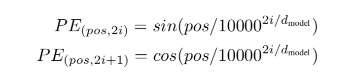

其中pos表示当前字在输入句子中的位置。dmodel表示最终变成的维度。i表示向量的第i个标量。

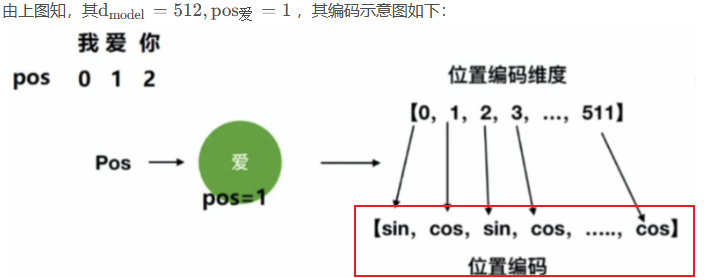

在GPT3中给出的公司如下：

其中t是token在句子中的位置。i是位置向量的第i个维度。

第t个token的位置编码如下：

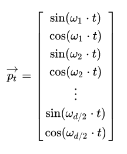

所以位置编码是通过不同的w来表示的。w是频率。

经过推导，第pos+k个字的编码是：

所以，位置pos的编码和pos+k的编码是线性关系。其中u和v计算只与k有关。

> 参考1：[面经：什么是Transformer位置编码？ - 知乎 (zhihu.com)](https://zhuanlan.zhihu.com/p/398457641)

> 参考2: 这里奇数和偶数位置的编码方法使用了正弦 sin 和余弦 cos 的不同的函数。这里奇数位置和偶数位置的区别在于他们所应用的正弦和余弦函数的角频率，通过调整角频率，可以使得奇数和偶数位置的编码方式有所不同。通过调整角频率，可以使得奇数和偶数位置编码的值在编码空间呈现不同的变化模式。这样的设计旨在为相邻位置提供不同的位置编码，以增加模型对序列中位置信息的敏感度。原文链接：https://blog.csdn.net/BIT_666/article/details/132161203

# Self-Attention（自注意力机制）

## 总览

红色圈中的部分为 **Multi-Head Attention**，是由多个 **Self-Attention**组成的，可以看到 Encoder block 包含一个 Multi-Head Attention，而 Decoder block 包含两个 Multi-Head Attention (其中有一个用到 Masked)。Multi-Head Attention 上方还包括一个 Add & Norm 层，Add 表示残差连接 (Residual Connection) 用于防止网络退化，Norm 表示 Layer Normalization，用于对每一层的激活值进行归一化。

## 详解Multi-Head Attention

对于每个单词，我们创造一个查询向量、一个键向量和一个值向量。词向量是512维度，而这三个是64。

比如有一个句子有两个单词，我们计算Thinking的自注意力向量。

第一步，计算着三个向量矩阵。（权重矩阵需要学习）

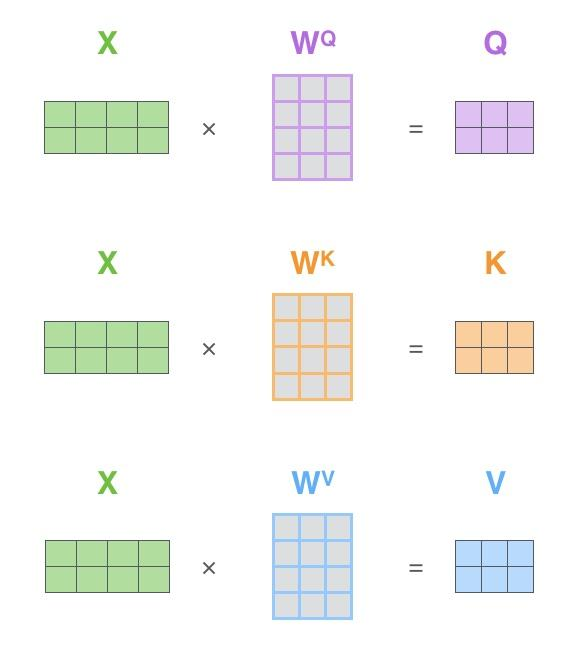

第二步，计算每个单词得分，q1和每各k1相乘。
第三步，将分数除以8(8是论文中使用的键向量的维数64的平方根，这会让梯度更稳定。这里也可以使用其它值，8只是默认值)
第四步，通过softmax传递结果。softmax的作用是使所有单词的分数归一化，得到的分数都是正值且和为1。这个softmax分数决定了每个单词对编码当下位置（“Thinking”）的贡献。
第五步，将每个值向量乘以softmax分数。这里的直觉是希望关注语义上相关的单词，并弱化不相关的单词(例如，让它们乘以0.001这样的小数)。
第六步，加权值向量求和，即得到自注意力层在该位置的输出。

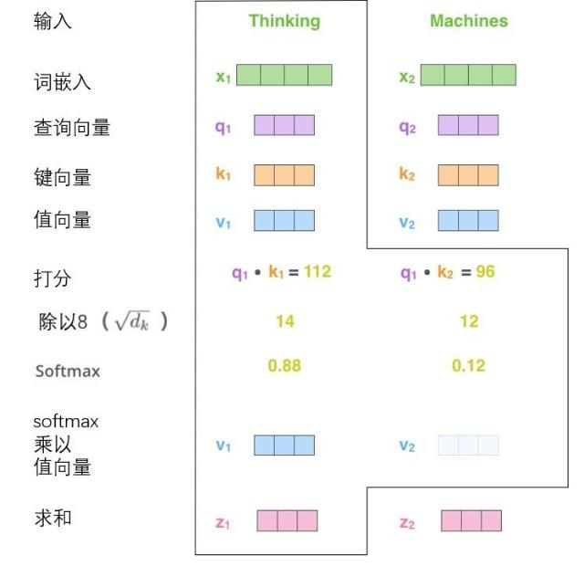

最后，由于我们处理的是矩阵，我们可以将步骤2到步骤6合并为一个公式来计算自注意力层的输出。

通过增加一种叫做“多头”注意力（“multi-headed” attention）的机制，论文进一步完善了自注意力层，并在两方面提高了注意力层的性能：

1. 它扩展了模型专注于不同位置的能力。
2. 它给出了注意力层的多个“表示子空间”（representation subspaces）。

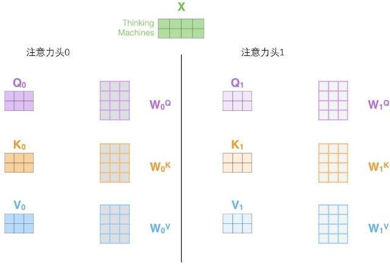

论文中使用了8个头，输出如何表示呢？把这八个头拼接在一起，通过一个权重矩阵，减低输出维度（512维）。

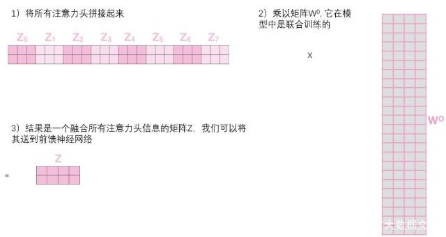

实际上，自注意力层和前馈之间还有一层。残差与归一化

# 编码器

### Scaled dot-product attention

注意力计算公式：

 dk是QKV维度，当 dk 太大时，点积计算得到的内积会太大，这样会导致softmax的结果非0即1，因此引入了根号来对内积进行缩放。

### Multi-Head Attention

多头公式：

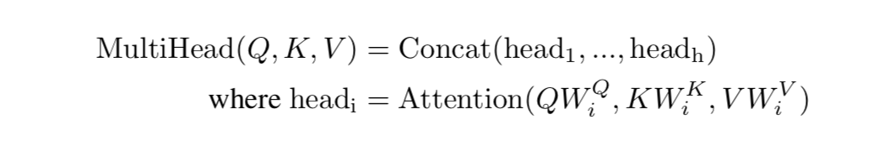

 其实认真来看Multi-Head Attention的机制有点类似与卷积中的多个卷积核，在卷积网络中，我们认为不同的卷积核会捕获不同的局部信息，在这里也是一样，我们认为Multi-Head Attention主要有两个作用： 

1）增加了模型捕获不同位置信息的能力，如果你直接用映射前的Q, K, V计算，只能得到一个固定的权重概率分布，而这个概率分布会重点关注一个位置或个几个位置的信息，但是基于Multi-Head Attention的话，可以和更多的位置上的词关联起来。

2）因为在进行映射时不共享权值，因此映射后的子空间是不同的，认为不同的子空间涵盖的信息是不一样的，这样最后拼接的向量涵盖的信息会更广。

### Add & Norm

从图中可以看到 Feed Forward 和 Multi-Head Attention 都会输出到 ADD & Norm 层，这里结构与 RNN 的残差网络类似，将原始输入与上一步的输出相加。结果相加后通过 Norm 层就行归一化加速收敛。

其中X，代表上一步的输出。

### Feed forward

Feed Forward 层采用两层全连接，第一层为 Relu 第二层不使用激活函数。

# 解码器

## 总览

Decoder block 结构与 Encoder block 相似，但是存在一些区别：

- 包含两个 Multi-Head Attention 层。
- 第一个 Multi-Head Attention 层采用了 Masked 操作。
- 第二个 Multi-Head Attention 层的**K, V**矩阵使用 Encoder 的**编码信息矩阵C**进行计算，而**Q**使用上一个 Decoder block 的输出计算。
- 最后有一个 Softmax 层计算下一个翻译单词的概率。
- 解码阶段的每个步骤都会输出一个输出序列的元素，每个步骤的输出在下一个时间步被提供给底端解码器，直到到达一个特殊的终止符号。

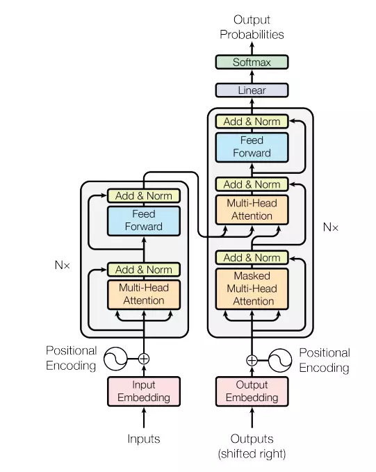

通过一个全连层和softmax层，输出预测单词。

最后式损失函数：one-hot编码和输出之间的误差，反向传播更新模型参数。

在训练阶段，可以使用交叉熵损失函数来比较模型输出的概率分布与实际的下一个词的标签，并通过反向传播更新模型参数。而在生成阶段，可以根据概率分布进行采样，以生成连贯的文本。

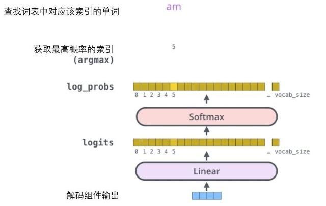

## 详解Masked操作

Decoder block 的第一个 Multi-Head Attention 采用了 Masked 操作，因为在翻译的过程中是顺序翻译的，即翻译完第 i 个单词，才可以翻译第 i+1 个单词。通过 Masked 操作可以防止第 i 个单词知道 i+1 个单词之后的信息。下面以 "我有一只猫" 翻译成 "I have a cat" 为例，了解一下 Masked 操作。

Decoder 的Masked操作还可以并行化训练，即将正确的单词序列 (`<Begin>` I have a cat) 和对应输出 (I have a cat `<end>`) 传递到 Decoder。那么在预测第 i 个输出时，就要将第 i+1 之后的单词掩盖住。

注意力计算公式

在softmax之前，QKV维度相同[seq_len, hid_len]，QK^T的维度为[seq_len, seq_len]

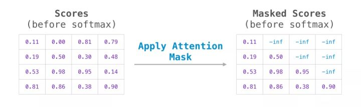

此分数表的含义如下：

- 当模型处理数据集中的第一个示例（第一行）时，这里只包含了一个单词（「robot」），所以 100% 的注意力都在该单词上。
- 当模型处理数据集中的第二个示例（第二行）时，这里包含了（「robot must」），当它处理单词「must」时，48% 的注意力会在「robot」上，而另外 52% 的注意力会在「must」上。
- 以此类推

