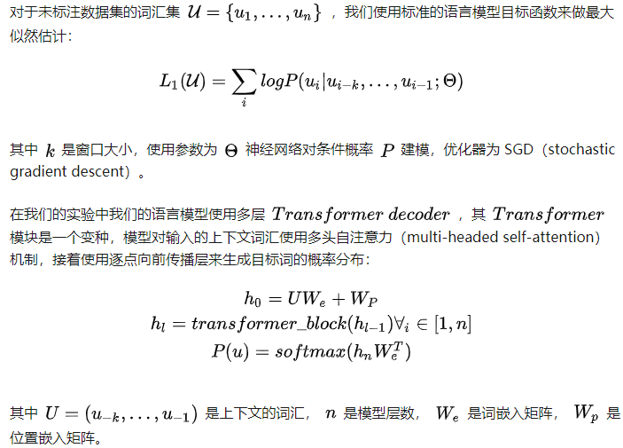
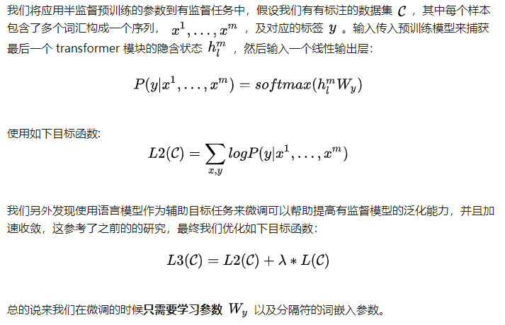

2018年OpenAI 《Improving Language Understanding by Generative Pre-Training》 

### 1. 前言

 本文中，我们为自然语言理解任务提出了一种新的半监督方式，包含半监督预训练和有监督微调。我们的目标是学到一种通用的表示，然后在不同任务上微调。  我们的应用方式包含两步，第一步在语言模型上使用无标注的数据预训练，然后在目标任务上直接使用预训练模型的参数作为初始化参数，再加上合适的目标函数。 

模型结构使用Transformer的Decoder结构。

### 2. 相关介绍

### 3. 架构

 我们的训练流程包含两个阶段，即半监督预训练和有监督微调。 

### 3.1 半监督预训练

### 3.2 有监督微调

### 3.3 特殊任务的输入变换

 对于有些任务，像文本分类，我们能够直接用上文的模型进行微调。另外的任务，问答系统，需要构造输入的句子对，或者三个文本。由于我们的预训练模型需要连续的文本序列，我们需要改变这种多句文本的输入。 

 

### 4. 结论

通过预训练是不同的长文本连续的数据集，模型能够有能力去处理长而广的依赖关系，这个是解决问答系统、语义相似度、文本分类中的关键点。 