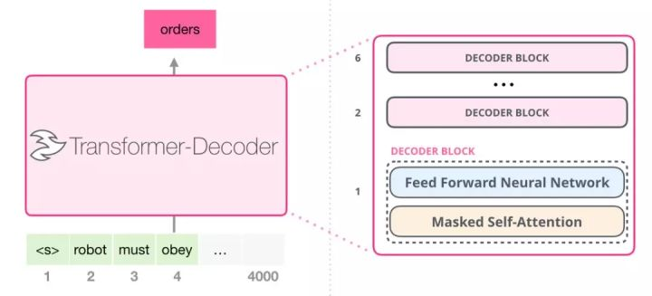

 《Language Models are Unsupervised Multitask Learners》 

 自回归(auto-regression)机制：上一步的输出，作为这一步的输入。

 GPT， TransformerXL，XLNet 本质上都是自回归模型。

GPT有不同的规模

GPT的每个Decoder只有两层

GPT词汇表大小为50257，输入之前，先经过嵌入矩阵（嵌入矩阵也是模型训练的一部分）

不止有嵌入矩阵，还有位置编码。内容大小1024，表示生成长度最大为1024。

模型的输出：输出向量x嵌入矩阵 = 概率 

我们简单地选取得分最高的单词作为输出结果（即 top-k = 1）。但其实如果模型考虑其他候选单词的话，效果通常会更好。通常一个折中的方法是，将 top-k 设为 40，这样模型会考虑注意力得分排名前 40 位的单词。 

