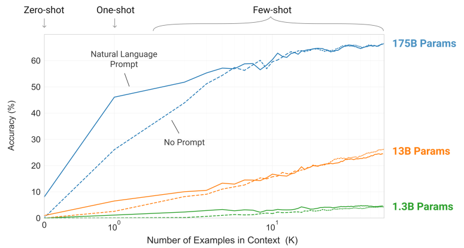
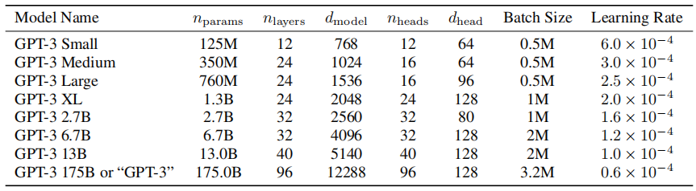

论文：Language Models are few Shot Learners

机构：OpenAI

时间：2020.05.28

arxiv：[[2005.14165\] Language Models are Few-Shot Learners (arxiv.org)](https://arxiv.org/abs/2005.14165)

GitHub: [GitHub - openai/gpt-3: GPT-3: Language Models are Few-Shot Learners](https://github.com/openai/gpt-3)

# Abastract

通过对大量文本进行预训练，然后对特定任务进行微调，最近的工作证明了在许多NLP任务和基准方面的巨大收获。尽管在结构上通常与任务无关，但是此方法仍然需要特定于任务的微调数据集，该数据集包含成千上万个示例。相比之下，人类通常只能通过几个示例或简单的指令来执行新的语言任务——当前的NLP系统在很大程度上仍难以做到这一点。在这里，我们证明了扩展语言模型可以极大地提高与任务无关的性能，很少出现问题，有时甚至可以通过现有的最新微调方法达到竞争力。具体来说，我们训练了GPT-3（一种具有1750亿个参数的自回归语言模型，比以前的任何非稀疏语言模型多10倍），并在少量测试中测试了其性能。对于所有任务，应用GPT-3无需进行任何梯度更新或微调，而仅通过与模型的文本交互指定任务和少量演示即可。 GPT-3在许多NLP数据集上均具有出色的性能，包括翻译，问题解答和完形填空任务，以及一些需要即时推理或领域适应的任务。

# Introduction

目前预训练模型的主要局限性在于，尽管体系结构与任务无关，但仍需要特定于任务的数据集和特定于任务的微调：要在所需任务上实现出色的性能，通常需要对数据集进行微调特定于该任务的数千到数十万个示例。出于以下几个原因，我们希望消除此限制。

1、很难收集大型的有监督的训练数据集，尤其是当必须为每个新任务重复执行该过程时。

2、这会给预训练模型带来问题，在该模型中，模型被设计得很大，可以在预训练期间吸收信息，但随后会在非常狭窄的任务分布上进行微调。

3、人类不需要大型的监督数据集即可通过简短的自然语言指令学习大多数语言任务。

解决这些问题的一种潜在途径是元学习，在语言模型这意味着，该模型在训练时会开发出广泛的技能和模式识别能力，然后在推理时使用这些能力快速适应或识别所需的能力任务。最近的工作尝试通过所谓的“In-Context Learning”来完成此任务，使用预先训练的语言模型的文本输入作为任务说明的形式：该模型以自然语言指令的集合来说明该任务，然后仅通过预测下一步文本来完成该任务的更多实例。尽管它已显示出一些初步的进步，但此方法仍取得了远不及微调的结果。

近年来，transformer语言模型的容量已从1亿个参数增至170亿个参数。每次增加都带来了文本合成或下游NLP任务的改进，并且有证据表明，与许多下游任务密切相关的log loss遵循随着规模而改善的平稳趋势。由于上下文学习涉及吸收模型参数内的许多技能和任务，因此上下文学习能力可能在规模上显示出类似的优势。

在本文中，我们通过训练1750亿个参数自回归语言模型（称为GPT-3）并测量其在上下文中的学习能力来检验该假设。具体来说，我们评估了超过十二个NLP数据集的GPT-3，以及旨在测试快速适应不太可能直接包含在训练集中的任务的几个新颖任务。对于每项任务，我们在3种情况下评估GPT-3：（a）few-shot learning或上下文学习，其中允许尽可能多的例子适合模型的上下文窗口（通常为10到100），（b）one-shot learning，其中我们只允许一个例子；（c）zero-shot learning，其中不允许例子，并且仅向模型提供自然语言的说明。GPT-3原则上也可以在传统的微调环境中进行评估，但我们将其留待以后的工作。

下图说明了我们研究的内容，并显示了对简单任务的few-shot learning的结果，该简单任务要求模型从单词中删除多余的符号。通过添加自然语言任务描述以及模型上下文中的示例数K，可以提高模型性能。Few-shot learning性能也随着模型的大小而大大改善。尽管在这种情况下的结果特别引人注目，但对于我们研究的大多数任务，模型大小和上下文中示例数量的总体趋势仍然成立。我们强调，这些“学习”曲线涉及非梯度更新或微调，只是增加了作为条件的演示次数。

我们还对“数据污染”进行了系统的研究——在Common Crawl等数据集上训练高容量模型时是一个日益严重的问题，这可能包括来自测试数据集的内容，因为这些内容经常存在于网络上。在本文中，我们开发了系统的工具来测量数据污染和量化其扭曲效应。虽然我们发现数据污染对GPT-3在大多数数据集上的性能影响最小，但我们确实确定了一些数据集，我们要么不报告这些数据集的结果，要么我们用星号注意它们，这取决于严重程度。

除此之外，我们还训练了一系列较小的模型（从1.25亿个参数到130亿个参数），以便比较它们在zero、one和few-shot设置下与GPT-3的性能。总的来说，对于大多数任务，我们发现在所有三种设置下，模型容量都相对平滑；一个值得注意的模式是，zero、one和few-shot性能之间的差距往往随着模型容量的增加而增长，这可能表明较大的模型是更熟练的元学习者。

最后，鉴于GPT-3所显示的广泛能力，我们讨论了对偏见、公平和更广泛的社会影响的关注，并试图对GPT-3在这方面的特征进行初步分析。

# 2 Approach

我们的基本的训练前方法，包括模型、数据和训练，类似于[RWC+19]中描述的过程，它相对直接地扩展了模型的大小、数据集的大小和多样性，以及训练的长度。我们对 in-context learning 的使用也类似于[RWC+19]，但在这项工作中，我们系统地探索了在情境中学习的不同设置。

* Fine-tuing (FT)
* Few-Shot (FS)
* One-Shot (1S)
* Zero-Shot (0s)

## Model and Architectures

我们使用与GPT-2 [RWC+19]相同的模型和架构，包括其中描述的修改初始化、预归一化和可逆标记化，除了我们在变压器层中使用交替密集和局部带状稀疏注意模式，类似于稀疏变压器[CGRS19]。为了研究ML性能对模型大小的依赖性，我们训练了8种不同大小的模型，从1.25亿参数到1750亿参数，范围超过3个数量级，最后一个是我们称为GPT-3的模型。先前的工作[KMH+20]表明，有了足够的训练数据，验证损失的缩放应该近似为作为大小的平滑函数幂律；许多不同大小的训练模型允许我们在验证损失和下游语言任务中测试这个假设。

表2.1显示了我们的8个模型的大小和架构。这里nparams的总数可训练的参数，总层，dmodel是每个瓶颈层的单位数量（我们总是有前馈层四倍瓶颈层的大小，dff = 4∗dmodel），和dhead是每个注意头的维度。所有模型都使用nctx = 2048令牌的上下文窗口。论文沿着深度和宽度维度跨GPU划分模型，以最小化节点之间的数据传输。每个模型的精确架构参数是根据GPU模型布局中的计算效率和负载均衡来选择的。之前的工作【KMH+20】表明，在合理的大范围内，验证损失对这些参数不太敏感。

表2.1：nhead x dhead = 12  x 64 = 768 = dmodel

## Training Dataset

语言模型的数据集迅速扩展，最终形成了由近万亿个单词组成的Common Crawl数据集（RSR+19）。这个数据集的大小足以训练论文最大的模型，而无需在同一序列上更新两次。然而，论文发现，Common Crawl的未过滤或轻度过滤版本往往比更精确的数据集具有更低的质量。因此，论文采取了3个步骤来提高数据集的平均质量：

1. 根据与一系列高质量参考语料库的相似性下载并过滤了CommonCrawl版本
2. 在文档级别、数据集内部和数据集之间执行了模糊重复数据删除，为了防止冗余并保持我们所提供的验证集的完整性，作为过度拟合的准确度量
3. 论文还将已知的高质量参考语料库添加到训练组合中，以增强CommonCrawl并增加其多样性。

附录A中描述了前两点（Common Crawl的处理）的详细信息。对于第三点，论文添加了几个精心策划的高质量数据集，包括一个扩展版本的WebText数据集【RWC+19】，该数据集是通过在较长一段时间内删除链接收集的，首先在【KMH+20】、两个基于互联网的图书语料库（Books1和Books2）和英文维基百科中描述的。

表2.2：训练数据集

表2.2显示了论文在训练中使用的数据集的最终组合。CommonCrawl数据是从2016年至2019年的每月CommonCrawl的41个碎片下载的，在过滤前由45TB的压缩明文组成，在过滤后由**570GB**组成，大致相当于4000亿字节对编码的tokens。请注意，在训练期间，数据集的采样并不与其大小成比例，而是认为质量较高的数据集的采样频率更高，例如CommonCrawl和Books2数据集在训练期间的采样次数少于一次，而其他数据集的采样次数为2-3次。这基本上可以接受少量的过度拟合，以换取更高质量的训练数据。

语言模型在广泛的互联网数据上进行预训练，特别是有能力记忆大量内容的大型模型的一个主要方法论问题是，在训练前无意中看到测试或开发集可能会污染下游任务。为了减少这种污染，我们搜索并试图删除与本文中研究的所有基准测试的开发和测试集的任何重叠。不幸的是，过滤中的一个错误导致我们忽略了一些重叠，并且由于训练的成本，重新训练模型是不可行的。在第4节中，我们描述了剩余重叠的影响，在未来的工作中，我们将更积极地消除数据污染。

## Training Process

正如在[KMH+20，MKAT18]中所发现的那样，更大的模型通常可以使用更大的批处理大小，但需要更小的学习率。我们在训练过程中测量梯度噪声尺度，并使用它来指导我们对批量大小的选择[MKAT18]。表2.1显示了我们使用的参数设置。为了在不耗尽内存的情况下训练较大的模型，我们使用了每个矩阵中的模型并行性和跨网络层中的模型并行性的混合物。所有型号都是在微软提供的部分高带宽集群上的V100GPU上进行训练的。培训过程和超参数设置的详细信息见附录B。

## Evalution

对于few-shot学习，论文通过从该任务的训练集中随机抽取K个示例作为条件来评估评测集中的每个示例，根据任务的不同，由1或2条换行分隔。对于LAMBADA和Storycloze，没有可用的监督训练集，因此从开发集中提取条件化示例，并在测试集上进行评估。对于Winograd（原始版本，而非SuperGLUE版本），只有一个数据集，因此直接从中绘制条件化示例。

K可以是从0到模型上下文窗口所允许的最大值的任何值，对于所有模型都是nctx = 2048，通常适合10到100个示例。更大的K值通常但不总是更好，所以当一个单独的开发和测试集可用时，我们在开发集上使用一些K值进行实验，然后在测试集上运行最佳值。对于某些任务（参见附录G），除了（或对于K = 0）演示之外，我们还使用了自然语言提示符。

对于涉及二元分类的任务，论文给选项提供语义上更有意义的名称（例如“True”或“False”，而不是0或1），然后将任务视为多项选择；我们有时也会制定类似于[RSR+19]所做的任务的框架（参见附录G）以了解详细信息。

在自由形式完成的任务中，论文使用与[RSR+19]参数相同的beam search：beam width为4，长度惩罚为α=0.6。论文使用F1相似性评分、BLEU或精确匹配对模型进行评分，具体取决于手头数据集的标准。

对于每种模型尺寸和学习设置（zero-shot、one-shot和few-shot），当测试集公开时，将报告最终结果。当测试集是私有的时，论文的模型通常太大，无法安装在测试服务器上，因此论文在开发集上报告结果。论文确实在少量数据集（SuperGLUE、TriviaQA、PiQa）上提交给测试服务器，在那里可以进行提交工作，论文只提交200B的few-shot结果，并报告其他所有的开发集结果。

# 3 Results

在图3.1中，论文显示了第2节中描述的8个模型的训练曲线。对于该图，论文还包括6个额外的超小型模型，参数少至100000个。正如[KMH+20]中所观察到的，在有效利用训练计算时，语言模型性能遵循幂律。在将这一趋势再延长两个数量级后，论文只观察到略微偏离幂律（如果有的话）。有人可能会担心，交叉熵损失的这些改进仅仅来自于对训练语料库虚假细节的建模。然而，将在下面的章节中看到，交叉熵损失的改善会在广泛的自然语言任务中带来一致的性能提升。

下面，论文在广泛的数据集上评估了第2节中描述的8个模型（1750亿参数参数GPT-3和7个较小的模型）。论文将数据集分为9类，代表大致相似的任务。

全是评估，略。

# 4 测量和防止记忆基准

由于论文的训练数据集来自互联网，因此论文的模型可能是在一些基准测试集上训练的。在没有既定最佳实践的情况下，从互联网规模的数据集中准确检测测试污染是一个新的研究领域。虽然在不调查污染的情况下训练大型模型是常见的做法，但鉴于训练前数据集的规模不断扩大，论文认为这个问题正变得越来越重要。

论文最初试图通过主动搜索并试图消除我们的训练数据与本文研究的所有基准的开发和测试集之间的任何重叠来解决污染问题。不幸的是，一个bug只导致从训练数据中部分删除所有检测到的重叠。由于训练成本，对模型进行再训练是不可行的。为了解决这个问题，论文详细研究了剩余检测到的重叠如何影响结果。

对于每个基准测试，论文都会生成一个“干净”的版本，删除所有可能泄漏的示例，粗略定义为与预训练集中的任何内容重叠13克的示例（或当其短于13克时与整个示例重叠）。论文的目标是非常保守地标记可能存在污染的任何内容，以便生成一个干净的子集，该子集具有很高的可信度，没有污染。具体程序详见附录C。

然后，论文在这些干净的基准上评估GPT-3，并与原始分数进行比较。如果干净子集上的得分与整个数据集上的得分相似，这表明污染即使存在，也不会对报告的结果产生显著影响。如果干净子集的得分较低，这表明污染可能会扩大结果。图4.2总结了结果。虽然潜在污染通常很高（四分之一的基准得分超过50%），但在大多数情况下，性能变化很小，而且论文看不到任何证据表明污染水平和性能差异是相关的。**论文得出结论，要么保守方法大大高估了污染，要么污染对性能几乎没有影响。**

总的来说，论文已经尽了最大努力来衡量和记录数据污染的影响，并根据严重程度来注意或彻底消除有问题的结果。无论是在设计基准还是在训练模型时，要解决这一重要而微妙的问题，还有许多工作要做。有关论文分析的更详细解释，请参阅附录C。

# 5 局限性

GPT-3和论文对它的分析有许多局限性。下面，论文将介绍其中一些，并为今后的工作提出建议。

1、在文本合成方面，尽管总体质量很高，但GPT-3样本有时仍在文档层面重复语义，在足够长的段落中开始失去连贯性，自相矛盾，偶尔包含不连贯的句子或段落。

2、GPT-3有几个结构和算法限制，这可以解释上述一些问题。我们还根据过去的文献推测，大型双向模型在微调时比GPT-3更强。

3、本文所述的一般方法的一个更根本的局限性是，它最终可能会（或可能已经）达到预训练目标的限制，即扩大任何类似LM的模型，无论是自回归模型还是双向模型。大型预训练的语言模型没有建立在其他经验领域的基础上，例如视频或真实世界的物理交互，因此缺乏大量关于世界的上下文[BHT+20]。由于所有这些原因，缩放纯自监督预测可能会达到极限，并且可能需要使用不同的方法进行增强。这方面有希望的未来方向可能包括从人类身上学习目标函数[ZSW+19a]，通过强化学习进行微调，或添加其他模式，如图像，以提供基础和更好的世界模型[CLY+19]。

4、语言模型普遍存在的另一个限制是预训练期间的样本效率低。虽然GPT-3朝着测试时间样本效率更接近人类（一次或零次）的方向迈出了一步，但它在训练前看到的文本仍然比人类一生中看到的文本多得多【Lin20】。提高训练前样本的效率是未来工作的一个重要方向，可能来自于在物理世界中提供额外信息的基础，也可能来自算法的改进。

5、GPT-3中与few-shot学习相关的一个限制，或至少是不确定性，是关于few-shot学习是否真的在推理时“从头开始”学习新任务，还是仅仅识别和识别它在训练期间学习的任务的模糊性。

6、无论目标函数或算法如何，与GPT-3规模的模型相关的一个限制是，它们既昂贵又不方便进行推理，这可能对当前形式的该规模模型的实际适用性提出挑战。解决这一问题的一个可能的未来方向是将大型模型提炼为可管理的大小，以用于特定任务。GPT-3等大型模型包含非常广泛的技能，其中大多数技能不需要用于特定任务，这表明原则上可以进行积极蒸馏。蒸馏在总体上得到了很好的探索【LHCG19a】，但尚未在千亿参数的规模上进行尝试；将其应用于这种规模的模型可能会带来新的挑战和机遇。

# 6 更广泛的影响

语言模型对社会有着广泛的有益应用，包括代码和写作自动完成、语法辅助、游戏叙事生成、改进搜索引擎响应和回答问题。但它们也有潜在的有害应用。与较小的模型相比，GPT-3提高了文本生成的质量和适应性，并增加了区分合成文本和人类书写文本的难度。因此，它有可能促进语言模型的有益和有害应用。

具体讨论，略。

# 7 相关工作

略。

# 8 结论

论文提出了一个1750亿参数的语言模型，该模型在zero-shot、one-shot和few-shot设置下的许多NLP任务和基准测试中显示出强大的性能，在某些情况下几乎与最先进的微调系统的性能相匹配，并且在动态定义的任务中生成高质量的样本和强大的定性性能。论文记录了在不使用微调的情况下性能扩展的大致可预测趋势。论文还讨论了这类模型的社会影响。尽管有许多局限性和弱点，这些结果表明，非常大的语言模型可能是开发适应性强的通用语言系统的一个重要因素。

