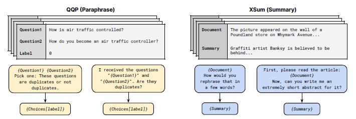

论文：Multitask Prompted Training Enables Zero-Shot Task Generalization

时间：2021.10.15

机构：Huagging Face

arxiv: [[2110.08207\] Multitask Prompted Training Enables Zero-Shot Task Generalization (arxiv.org)](https://arxiv.org/abs/2110.08207)

github: https://github.com/bigscience-workshop/t-zero

# Abstract

大模型在多种任务上学习提高了 [zero-shot](https://so.csdn.net/so/search?q=zero-shot&spm=1001.2101.3001.7020) 泛化能力，有人假设这是语言模型在隐式多任务学习的结果。

zero-shot 泛化能力能否通过显式多任务学习来直接引发呢？

为了大规模地测试这个问题，我们开发了一个系统，可以轻松地将任何自然语言任务映射为人类可读的提示形式。我们转换了大量的监督数据集，每个数据集都有多个具有不同措辞的提示。我们对预先训练的多任务混合模型进行微调。该模型在几个标准数据集上获得了很强的zero-shot性能，通常优于其大小高达16×的模型。此外，我们的方法在BIG-bench的任务子集上获得了强大的性能，优于其大小6×的模型。所有训练过的模型都可以在https://github.com/bigscience-workshop/t-zero上找到，所有的提示都可以在https://github.com/bigscience-workshop/promptsource.上找到

# 1. Introduction

目标：训练一个模型能够在留出任务上泛化性更好，且不需要很大的模型规模，同时对于 prompt 的措辞选择更鲁棒。

实验学习了两个问题：

1、多任务 prompted training 是否提升了在留出（ held-out）任务上的泛化性？

* 我们发现，多任务训练增强了在 zero-shot 任务上的泛化能力

2、在更大范范围的 prompts 上进行训练是否能够提升 prompt 措辞的鲁棒性？

* 我们发现，在每个数据集上进行更多 prompt 的训练始终提高在留出任务上性能的中位数，并减少变化性

# 2. Related Work

略

# 3. Measuring generalization to held-out tasks

我们首先假设NLP数据集的底层分区为任务。我们使用术语“任务”来指代由一组特定数据集测试的一般NLP能力。为了评估对新任务的zero-shot泛化，我们对任务的一个子集进行训练，并对保留的任务组进行评估。

注意到按任务分组是一种不完善的启发式方法，我们需要根据任务格式来组织任务分类，而不是基于文献中约定的必要技能。这些论文排除了那些非英语的或者它们需要特殊的领域知识（如生物医学）。在我们撰写本文时，这就产生了12个任务和62个数据集，并在我们的训练和评估混合物中公开贡献了提示（图2）。所有实验都使用了Hugging Face datasets library（Lhoest et al.，2021）。

本文提供了四个保留任务（绿色部分）：自然语言推理、共指消解、句子补全、词意消歧。
同时也在 BIG-bench中的部分数据集上评估。这是最近一个由社区驱动的基准测试，它创建了各种各样的困难任务集合，以测试大型语言模型的能力。

图2：黄色是微调的数据集，绿色是保留held-out的数据集，用于测试

# 4. A Unified Prompt Format

所有的数据集都以自然语言提示的形式给出了我们的模型，以实现zero-shot实验。为了方便编写大量的提示集合，我们开发了一种模板化语言和一个应用程序，可以方便地将不同的数据集转换为提示。每个数据示例都使用许多不同的提示模板进行实例化。

比如一个NLI数据，包含字段premise，Hypothesis，Label。

- 输入模板：If {Premise} is true, is it also true that {Hypothesis}?
- 目标模板：{Choices[label]}

我们收集了一个 prompt 集合，叫做`Public Pool of Prompts(P3)`，包含了对 177 个数据集的 2073 个prompt。实验中使用的 prompt 除BIG-bench外均来自P3, BIG-bench的 prompt 由其维护人员提供。

图3：两个示例。其中每个数据集都有多个模板。

# 5. Experimental setup

**Model**

在一个高层次上，我们对自然语言提示数据集的多任务训练混合物上的预训练模型进行了微调。我们的模型使用了一个编码器-解码器架构，并将输入文本输入到编码器和由解码器产生的目标文本。我们训练的所有模型都基于T5，这是一种基于转换器的编码器-解码器语言模型，在C4的1T标记上使用掩码语言建模风格的目标（Raffel et al.，2020）。由于T5的预训练目标是生成令牌，并且只生成已从输入文本中删除的令牌，因此它不同于提示数据集的自然文本生成格式。因此，我们使用Lester等人（2021）的*LM-adapted T5* （称为T5+LM），该模型是通过在标准语言建模目标上从C4的100B标记上额外训练T5而产生的。

**Training**

三个模型：

* T0是在第3节和表5中详细介绍的多任务混合物上进行训练的。
* T0+是相同的模型，具有相同的超参数，但添加了GPT-3的评估数据集的混合物上进行训练。
* T0++进一步将SuperGLUE（Wang et al.，2019a）添加到训练混合物（RTE和CB除外）中，这使得NLI和 BIG-bench成为唯一保留的任务。

上述T0变体都是从T5+LM的11B参数版本初始化的。为了研究缩放的影响，并帮助资源较少的研究人员，我们还训练了T0（3B），它具有与T0相同的训练混合物，但从T5+LM的3B参数版本中初始化（结果见附录F）。

我们通过选择在训练数据集的验证分割上得分最高的检查点来执行检查点选择。这仍然满足真正的zero-shot（Perez et al.，2021）设置，因为我们没有从任何保留的任务中使用任何示例来选择最佳检查点。

因为数据集大小区别很大，因此我们将超过 500000样本的数据集看为只有 500000/num_template 样本。num_template 是为数据集创建的模板数目。我们将出入和输出序列分别截断至 1024 和 256 token，使用 packing 来结合多个训练样本到一个序列中来达到最大序列长度。batch size：1024 sequences，optimizer：Adafactor，learning rate：1e-3，dropout rate：0.1

**Evaluation**

我们在4个保留的传统NLP任务中评估了11个数据集的zero-shot泛化：自然语言推理、共引用、词义消歧和句子完成，以及来自 BIG-bench的14个新任务。除非另有说明，否则我们将报告验证分割的性能。所有报告的数据集都使用准确性作为其衡量指标。

任务涉及选择正确的完成从几个选项（例如多项选择题回答），我们遵循布朗et al.（2020）和使用等级分类来评估我们的模型：我们计算每个目标选项的概率调整模型和选择最高的对数似然的预测。为简单起见，我们不对目标选项的对数可能性应用长度归一化。

我们不通过比较不同提示在验证分割上的性能来执行提示选择；Perez等人（2021）强调了这种策略如何从评估分割中泄漏信息，这使得评估不是“真正的”zero-shot。对于给定的数据集，我们报告了该数据集的所有提示的中位数性能及其四分位数范围（Q3 - Q1），以衡量模型对提示措辞的鲁棒性。

# 6. Results

## 6.1 Generalization

我们的第一个研究问题是，多任务提示训练是否能提高人们对脱离任务的泛化能力。

1、该方法在所有数据集上都显著地超过了我们的基线，证明了多任务提示训练比仅使用相同模型和提示的语言建模训练的好处。

2、在大多数情况下，我们的模型的性能随着训练数据集数量的增加而提高（T0++好于T0+, T0+好于T0）

## 6.2 Prompt Robustness

我们的第二个研究问题是，在更大范围的 prompts 上进行训练是否能够提升对 prompts 措辞的鲁棒性。

做了两个消融实验

- 针对每个数据集中 prompts 的平均数量（p）
- 训练时使用的数据集的数量（d）

**Effect of More Prompts per Dataset**

p=0，对应 T5+LM，没有任何 prompts。

p=1，每个数据集随机选一个原始任务的 prompt。

p=5.7，所有数据集都使用所有的原始任务prompts。

T0（p=8.03），在一些没有映射为数据集原始任务的 prompts 上训练。

1、p = 1到p = 5.7 证明：针对每个数据集的更多提示进行训练，可以使留出任务的泛化更好、更健壮。

2、T0包含了所有 prompts（包括哪些不对应于数据集原始任务的），进一步提升了效果，显示了在不是原始任务的 prompts 上训练也有收益。

**Effect of Prompts from More Datasets**

令 p=所有可以获得的 prompts，增加 d，分别从39 to 49 to 55 (T0, T0+, T0++, respectively）。

结果表明：增加d似乎并不能始终使模型对提示的措辞更加稳健。

**Comparing T0 and GPT-3’s robustness**：结果表明，T0 比 GPT-3 对 prompt 格式更鲁棒。

# 7. Discussion

FLAN：预训练模型是LaMDA-PT，是decoder-only 语言模型。微调时每个都对应一个单独的留出任务（我们关注于训练一个对应多个留出任务的模型，以能够分析模型在多种任务上泛化的能力）。

与 FLAN 相比，T0 的性能有更好的也有更差的，T0++基本都比得上或者更好。但是，这俩模型比 FLAN 小了十多倍（137B vs 11B）。

T0 和 FLAN 在 Winogrande 和 HellaSwag 上的性能都不如 GPT-3。Wei et al(2021) 猜测对于可以表示成补充一个不完整句子的任务（比如：共指消解），将任务指令添加到提示中“很大程度上是多余的。

Wei et al(2021) 做了一个消融实验，模型大小与 T0（11B）类似（8B），发现在多任务 prompted 训练后，在留出任务上的性能下降，而我们发现多任务 prompted 训练至少在3B参数下提高了模型的性能。我们确定了两个模型之间的关键差异，可以解释这种差异：

* 我们使用了 encoder-decoder 模型，在作为标准的语言模型训练之前，进行了不同目标的训练（masked 语言建模），然后在多任务混合上 fine-tune。这种预训练策略是更有效的。
* 我们的 prompt 在长度和创造性方面在质量上更加多样化，我们假设这种多样性可能会产生具体的影响。比如，这可以解释为什么Wei等人(2021)提出的消融结果，其中增加 prompt 的数量对性能的影响可以忽略不计，而我们观察到增加更多 prompt 时的改善。

## 8. Conclusion

我们证明了多任务提示训练可以在语言模型中实现强大的 zero-shot 泛化能力。这种方法为无监督语言模型预训练提供了一个有效的可替代方法，常使我们的 T0 模型优于数倍于其自身大小的模型。我们还进行了消融研究，展示了包括许多不同 prompt 的重要性，以及在每个任务中增加数据集数量的影响。
