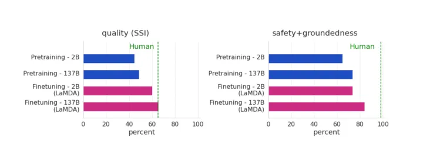

论文：LaMDA: Language Models for Dialog Applications

时间：2022.01.20

机构：谷歌

arxiv：[[2201.08239\] LaMDA: Language Models for Dialog Applications (arxiv.org)](https://arxiv.org/abs/2201.08239)

# Abstract

LaMDA是一个专门用于对话的基于变换的神经语言模型家族，其参数高达137B，并在1.56T的公共对话数据和网络文本单词上进行预训练。虽然单独的模型缩放可以提高质量，但它在安全性和事实基础上的改进较少。论文证明，通过标注数据进行微调，并使模型能够咨询外部知识来源，可以显著改善安全性和事实基础这两个关键挑战。第一个挑战是安全，即确保模型的响应符合一系列人类价值观，例如防止有害的建议和不公平的偏见。论文使用基于一组说明性人类价值观的指标来量化安全性，发现使用LaMDA分类器过滤候选响应，该分类器使用**少量众包标注数据进行微调**，为提高模型安全性提供了一种很有前途的方法。第二个挑战，即事实基础，涉及使模型能够咨询外部知识来源，如信息检索系统、语言翻译器和计算器。论文使用基础性度量来量化事实性，发现论文的方法使模型能够生成基于已知来源的响应，而不是听起来合理的响应。最后，探讨了**LaMDA在教育和内容推荐领域**的使用，并分析了它们的有用性和角色一致性。

# 1 Introduction

语言模型预训练是NLP中一种越来越有前途的研究方法（Ryan Kiros等人，2015.Alec Radford等人，2018.Kevin Clark等人，2020）。由于预训练使用未标记的文本，因此可以将其与缩放模型和数据集大小相结合，以实现更好的性能或新功能（Jared Kapla等人，2020）。例如，GPT-3（Tom B. Brown, Benjamin Mann等人，2020）是一个在未标记文本的大型语料库上训练的175B参数模型，由于缩放，它在few-shot learning方面表现出了令人印象深刻的能力。

受这些成功的启发，论文训练了LaMDA，这是一个**为对话设计的基于Transformer的神经语言模型家族**。这些模型的大小从2B到137B不等，它们是在来自公共对话数据和其他公共网络文档的1.56T单词的数据集上预训练的（第3节）。LaMDA使用单个模型来执行多个任务：它生成潜在的响应，然后对其进行安全过滤，基于外部知识源，并重新排序以找到最高质量的响应。

在三个关键指标上研究了使用LaMDA进行模型扩展的好处：质量、安全性和合理性（第4节）。观察到：（a）模型缩放单独提高了质量，但其在安全性和基础性方面的改进远远落后于人类的表现，（b）缩放和微调相结合在所有指标上都显著改善了LaMDA，尽管模型的安全性和基础性方面的表现仍低于人类的水平，与测量的众包工作者水平的质量差距可以缩小（图1中标记为“人类”）。

最后，论文探讨了**LaMDA**在**教育和内容推荐领域**的使用，以调查其潜力和不足。与GPT-3（Tom B. Brown等，2020）中提示的概念类似，论文在特定于应用程序的对话中对LaMDA进行几次预处理，以使LaMDA适应目标应用程序。论文进行了实验，以比较仅预训练和经过特定应用预处理的微调LaMDA模型的特定应用的帮助性（即有用和正确的响应）和**角色一致性**（即代理话语与代理角色匹配）。论文发现，这两种类型的模型都可以很好地适应其预期的应用程序角色，但**经过微调的LaMDA模型更有帮助**。

# 2 Related work

# 3 LaMDA pre-training

LaMDA被预训练以**预测文本语料库**中的**下一个标记**。与之前仅在对话数据上训练的对话模型不同（Daniel Adiwardana等人，2020，Stephen Roller等人，2020），论文在从公共对话数据和其他公共web文档创建的数据集上预训练了LaMDA。因此，在进行微调之前，可以将LaMDA用作通用语言模型。

预训练数据集由2.97B个文档、1.12B个对话和13.39B个对话话语组成，共1.56T个单词。超过90%的预训练数据集是英语。论文使用PensionePiece库（Taku Kudo等人，2018）将数据集标记为**2.81T字节对编码（BPE）**标记（Rico Sennrich等人，2015），词汇表为32K标记。相比之下，Meena（Daniel Adiwardana等人，2020）的训练集中的单词总数为40B个单词，这几乎小了40倍。

最大的**LaMDA模型具有137B个非嵌入参数**，比Meena（Daniel Adiwardana等人，2020）多约50倍。论文使用仅解码器的Transformer（Ashish Vaswani等人，2017）语言模型作为LaMDA的模型架构。**Transformer有64层，d\*model\*=8192，d\*ff\*=65536，h=128，d\*k\*=d\*v\*=128**，如T5（Colin Raffel等人，2020）所述的相对注意，以及如（Raffel等人，2020）所述的门控GELU激活。

论文在1024个TPU-v3芯片上预训练了LaMDA，总共约57.7天，每批256K个tokens。论文使用Lingovo框架（Jonathan Shen等人，2019）进行训练，并通过2D分片算法实现了123 TFLOPS/sec，FLOPS利用率为56.5%，如GSPMD（Yuanzhong Xu等人，2021）所述。论文还训练了较小的2B参数和8B参数模型，以测量模型缩放对论文的度量的影响。

# 4 Metrics

评估一般的生成模型，特别是开放式对话模型，是很困难的。在本节中，我们将描述用于评估的指标。

# 5 LaMDA fine-tuning and evaluation data

# 6 LaMDA fine-tuning

# 7 Results on foundation metrics

# 8 Domain grounding

# 11 Conclusion