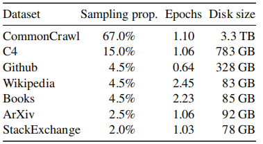

论文：LLaMA: Open and Efficient Foundation Language Models

时间：2023.02.27

机构：Meta

arxiv: [[2302.13971\] LLaMA: Open and Efficient Foundation Language Models (arxiv.org)](https://arxiv.org/abs/2302.13971)

# **Abstract**

我们介绍了LLaMA，这是一个从7B到65B参数的基础语言模型的集合。我们在数万亿Token上训练我们的模型，并表明，仅使用公开的数据集来训练最先进的模型是可能的，而不求助于专有和不可访问的数据集。特别是，LLaMA-13B在大多数基准测试上优于GPT-3（175B），而且LLaMA- 65B与Chinchilla-70B and PaLM-540B具有竞争力。我们向研究界发布了我们所有的模型。

# **1 Introduction**

经过大量文本语料库训练的大型语言模型（llm）已经显示出它们通过文本指令或一些例子执行新任务的能力（Brown et al.，2020）。当将模型缩放到足够的大小时，这些few-shot特性首次出现（Kaplan等人，2020年），导致了一系列专注于进一步缩放这些模型的工作（Chowdhery等人，2022年；Rae等人，2021年）。这些努力是基于这样的假设，即更多的参数将导致更好的性能。然而，Hoffmann等人（2022年）最近的工作表明，对于给定的计算预算，最佳性能不是由最大的模型实现的，而是由基于更多数据训练的更小的模型实现的

Hoffmann等人（2022年）的缩放定律的目标是确定如何为特定的训练计算预算最佳地缩放数据集和模型规模。然而，这个目标忽略了推理预算，而在大规模服务语言模型时，推理预算变得至关重要。在这种情况下，给定目标性能水平，首选模型不是训练最快的，而是推理最快的。尽管训练大型模型以达到某一性能水平可能更便宜，但训练时间较长的小型模型最终在推理方面会更便宜。例如，尽管Hoffmann等人（2022）建议在200B标记上训练10B模型，但我们发现，即使在1T标记之后，7B模型的性能仍在继续提高。

这项工作的重点是训练一系列的语言模型，通过训练比通常使用的更多的标记，在各种推理预算下实现尽可能好的性能。所得到的模型，称为LLaMA，范围从7B到65B参数，与现有的最佳llm相比，具有竞争性的性能。例如，LLaMA-13B在大多数基准测试上都优于GPT-3，尽管它要小10个×。我们相信，这种模式将有助于普及llm的访问和研究，因为它可以在一个单一的GPU上运行。在规模的高端，我们的65b参数模型也与最好的大型语言模型如Chinchilla or PaLM-540B。

与Chinchilla、PaLM或GPT-3不同，我们只使用公开的数据，使我们的工作与开源兼容，而大多数现有的模型依赖的数据要么不是公开的，要么是无证的数据（例如。“书籍-2tb”或“社交媒体对话”）。也有一些例外，特别是OPT（Zhang等，2022）、GPT-NeoX（Black等，2022）、布鲁姆（Scao等，2022）和GLM（Zeng等，2022），但没有一个例外与 PaLM-62B or Chinchilla竞争。

在本文的其余部分中，我们将概述我们对Transformer架构所做的修改（Vaswani et al.，2017），以及我们的训练方法。然后，我们报告了我们的模型的性能，并在一组标准基准测试上与其他llm进行了比较。最后，我们利用负责任的人工智能社区的一些最新基准，揭示了我们的模型中编码的一些偏差和毒性。

# **2 Approach**

我们的训练方法与之前工作中描述的方法相似（Brown等人，2020年；乔德里等人，2022年），并受到Chinchilla尺度定律的启发（霍夫mann等人，2022年）。我们使用标准优化器在大量文本数据上训练大型transformers。

## 2.1 预训练数据

我们的训练数据集是多个源的混合物，如表1所示，它们涵盖了一组不同的域。在大多数情况下，我们重用了已用于训练其他llm的数据源，但限制了只使用公开可用且与开源兼容的数据。这就导致了以下数据和它们在训练集中所代表的百分比的混合：

**英语CommonCrawl[67%]。**论文使用CCNet pipline 预处理了2017年至2020年的五个CommonCrawl 转储（Wenzek et al.，2020）。该过程在行级别消除重复数据，使用fastText线性分类器执行语言识别以删除非英语页面，并使用ngram语言模型过滤低质量内容。此外，训练了一个线性模型来对维基百科中用作参考文献的页面进行分类。随机抽样的页面，以及未被分类为参考文献的丢弃页面。

**C4 [15%]。**在探索性实验中，观察到使用不同的预处理CommonCrawl数据集可以提高性能。因此，将公开可用的C4数据集（Raffel et al.，2020）包含在数据中。C4的预处理还包括**重复数据消除**和**语言识别**步骤：与CCNet的主要区别在于质量过滤，它主要依赖于启发式方法，如标点符号的存在或网页中的单词和句子的数量。

**Github [4.5%]。**论文使用Google BigQuery上提供的公共GitHub数据集。只保留了在Apache、BSD和MIT许可证下分发的项目。此外，使用基于行长度或字母数字字符比例的启发式方法过滤低质量文件，并使用正则表达式删除样板文件，如标头。最后，在文件级别对生成的数据集进行重复数据消除，并进行精确匹配。

**维基百科[4.5%]。**添加了2022年6月至8月期间的维基百科转储，涵盖20种语言，使用拉丁语或西里尔文：bg、ca、cs、da、de、en、es、fr、hr、hu、it、nl、pl、pt、ro、ru、sl、sr、sv、uk。论文处理数据以删除超链接、注释和其他格式样板。

**Gutenberg 和 Books3 [4.5%]。**论文在训练数据集中包括两个图书语料库：Gutenberg项目，其中包含公共领域的图书，以及ThePile的Books3部分（Gao et al.，2020），这是一个用于训练大型语言模型的公开数据集。论文在书本本级别执行重复数据消除，删除内容重叠超过90%的书本。

**ArXiv【2.5%】。**我们处理arXiv Latex文件，将科学数据添加到数据集中。继Lewkowycz等人（2022）之后，删除了第一节之前的所有内容以及参考书目。还删除了.tex文件中的注释，并内联扩展了用户编写的定义和宏，以提高论文之间的一致性。

**Stack Exchange [2%]。**包括Stack Exchange，这是一个高质量问答网站，涵盖了从计算机科学到化学的一系列不同领域。保留了28个最大网站的数据，删除了文本中的HTML标签，并按分数（从高到低）对答案进行了排序。

**Tokenizer。**使用字节对编码（BPE）算法（Sennrich et al.，2015）对数据进行标记，使用PensionePiece（Kudo和Richardson，2018）的实现。值得注意的是，论文将所有数字拆分为单个数字，并回退到字节以分解未知的UTF-8字符。

总体而言，整个训练数据集在标记化后包含大约1.4T的tokens。对于大多数训练数据，每个token在训练期间只使用一次，但维基百科和图书领域除外，论文在这两个领域执行了大约两个epochs。

## 2.2 架构

继最近对大型语言模型的研究之后，论文网络基于Transformer架构（Vaswani et al.，2017）。论文利用了随后提出的各种改进，并在不同的模型中使用，如**PaLM**。以下是与原始建筑的主要区别，以及论文在那里找到了这一变化的灵感：

* **预归一化[GPT3]。**为了提高训练稳定性，对每个Transformer子层的输入进行归一化，而不是对输出进行归一化。使用了Zhang和Sennrich（2019）引入的**RMSNorm**规范化函数。

* **SwiGLU激活功能[PaLM]。**用Shazeer（2020）引入的**SwiGLU激活函数**取代了**ReLU非线性**，以提高性能。论文使用 2/3 4d的尺寸，而不是PaLM中的4d。

* **旋转嵌入[GPTNeo]。**删除了绝对位置嵌入，而是在网络的每一层添加了Su等人（2021）引入的**旋转位置嵌入（RoPE）**。

## 2.3 优化器

论文的模型使用**AdamW优化器**（Loshchilov和Hutter，2017）进行训练，具有以下超参数：**β1=0.9，β2=0.95**。使用**余弦学习率**计划，使得最终学习率等于最大学习率的10%。论文使用0.1的权重衰减和1.0的梯度剪裁。使用2000个预热步骤，并随着模型的大小而改变学习率和批次大小（详见表2）。

## 2.4 高效实现

论文进行了一些优化，以提高模型的训练速度。首先，使用**causal多头注意力**的有效实现来减少内存使用和运行时间。此实现在xformers库中提供，受到Rabe和Staats（2021）的启发，并使用了Dao等人（2022年）提供的向后方法。这是通过不存储注意力权重和不计算由于语言模型任务的因果性质而被掩盖的key/query分数来实现的。

为了进一步提高训练效率，减少了在带有检查点的后向传球过程中重新计算的激活次数。更准确地说，保存了计算成本高昂的激活，例如线性层的输出。这是通过手动实现Transformer层的向后功能来实现的，而不是依赖PyTorch autograd。如Korthikanti等人所述，为了充分受益于这种优化，需要通过使用模型和序列并行性来减少模型的内存使用。（2022）。此外，论文还尽可能多地重叠激活的计算和GPU之间通过网络的通信（由于all_reduce操作）。

当训练65B参数模型时，在2048 A100 GPU和80GB RAM上处理大约**380个tokens/秒/GPU**。这意味着，在包含1.4T tokens的数据集上进行训练大约需要21天。

# 3 主要结果

根据之前的工作（Brown等人，2020），论文考虑了zero-shot和few-shot任务，并报告了总共20个基准的结果：

**Zero-shot。**论文提供了任务的文本描述和一个测试示例。该模型要么使用开放式生成提供答案，要么对提出的答案进行排名。

**Few-shot。**提供了一些任务示例（介于1和64之间）和一个测试示例。该模型将该文本作为输入，并生成答案或对不同的选项进行排序。

将LLaMA与其他基础模型进行了比较，即非公开可用的语言模型**GPT-3**（Brown等人，2020）、**Gopher**（Rae等人，2021）、**Chinchilla**（Hoffmann等人，2022）和**PaLM**（Chowdhery等人，2022。在第4节中，还简要比较了LLaMA与OPT-IML（Iyer et al.，2022）和Flan-PaLM（Chung et al.，2021）等指令调优模型。

具体结果，略。

# 4 指令微调

在本节中，展示了对指令数据的短暂微调可以快速改进MMLU。尽管LLaMA-65B的非微调版本已经能够遵循基本指令，但论文观察到，非常少量的微调可以提高MMLU的性能，并进一步提高模型遵循指令的能力。由于这不是本文的重点，论文只进行了一个实验，遵循与Chung等人相同的协议。（2022）来训练指令模型LLaMA-I。

在表10中，报告了MMLU上的指令模型LLaMA-I的结果，并与现有的中等规模的指令微调模型进行了比较，即OPT-IML（Iyer et al.，2022）和Flan-PaLM系列（Chung et al.，2021）。所有报告的数字都来自相应的论文。尽管这里使用的指令微调方法很简单，但**论文在MMLU上达到了68.9**%。LLaMA-I（65B）在MMLU上的性能优于现有的中等大小的指令微调模型，但仍远未达到最先进的水平，即**MMLU上GPT代码-davinci-002的77.4**（数字取自Iyer等人（2022））。MMLU在57个任务上的性能细节可以在附录的表16中找到。

# 5 偏见、毒性和错误信息

大型语言模型已被证明可以再现和放大训练数据中存在的偏见（Sheng等人，2019；Kurita等人，2019），并生成有毒或攻击性内容（Gehman等人，2020）。由于论文的训练数据集包含很大一部分来自Web的数据，论文认为确定论文的模型生成此类内容的潜力至关重要。为了了解LLaMA-65B的潜在危害，论文在不同的基准上进行了评估，这些基准衡量了有毒成分的产生和刻板印象的检测。虽然我们选择了语言模型社区使用的一些标准基准来表明这些模型的一些问题，但这些评估不足以充分理解与这些模型相关的风险。

# 6 碳足迹