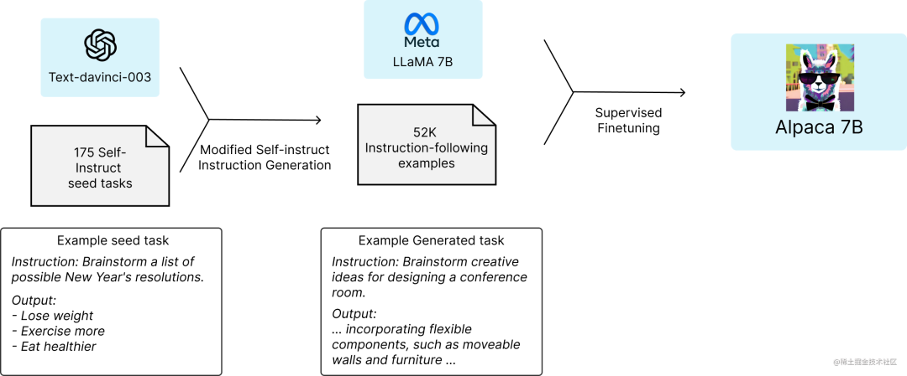

时间：20230511

概述：

近日，Meta开源了他们的LLaMA系列模型，包含了参数量为7B/13B/33B/65B的不同模型，然而，原模型的效果较差（如生成的结果文不对题、以及无法自然地结束生成等）。因此，斯坦福的 Alpaca 模型基于 LLaMA-7B 和指令微调，仅使用约 5 万条训练数据，就能达到类似 GPT-3.5 的效果。


引言：

对于斯坦福的团队来说，想要在预算内训练一个高质量的指令遵循模型，就必须面临2个重要的挑战：要有一个强大的预训练语言模型，以及一个高质量的指令遵循数据。

恰恰，提供给学术研究人员使用的LLaMA模型搞定了第一个问题。

对于第二个挑战，「Self-Instruct: Aligning Language Model with Self Generated Instructions」论文给了很好的启发，即使用现有的强语言模型来自动生成指令数据。


方法：

该项目提供了廉价的对LLaMA模型进行微调的方法，大体思路如下：

1、首先，利用OpenAI提供的GPT模型API生成质量较高的指令数据（仅52k），例如：

```
{
    "instruction": "Rewrite the following sentence in the third person",
    "input": "I am anxious",
    "output": "She is anxious."
}, {
    "instruction": "What are the three primary colors?",
    "input": "",
    "output": "The three primary colors are red, blue, and yellow."
}
```

2、然后，基于这些指令数据使用HuggingFace Transformers框架精调LLaMA-7B模型。




代码及实践操作，请参考

https://mp.weixin.qq.com/s/I4h3WXGwqEPVKbgy-BmpoA

