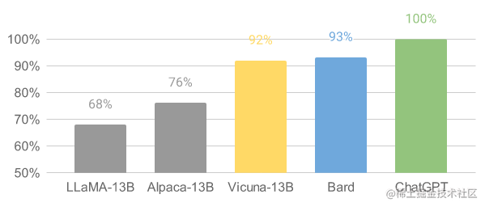
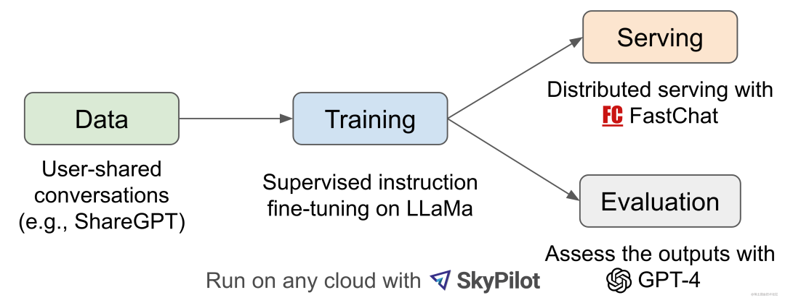

时间：20230512

## Vicuna简介

继斯坦福羊驼（Stanford Alpaca）之后，UC伯克利、CMU、斯坦福等机构的学者，联手发布了最新开源大模型骆马（Vicuna），包含7B和13B参数。其中，13B参数模型，训练成本仅需300美元，达到了ChatGPT的90%以上的能力，初步评估总结如图所示：

### Vicuna工作流程

Vicuna具体的工作流程如下图所示，首先，研究人员从 ShareGPT.com（一个供用户分享 ChatGPT 对话内容的网站）收集了约 7 万个对话，并增强了 Alpaca 提供的训练脚本，以更好地处理多轮对话和长序列。训练是在一天内通过 **8 卡 A100 GPU 配合 PyTOrch FSDP** 进行的full fine-tune。为了提供演示服务，Vicuna研究人员建立了一个轻量级的分布式服务系统，创建了八个问题类别（如：角色扮演、编码/数学任务等）的 80 个不同问题，利用 GPT-4 来判断模型输出，借此对模型质量做初步评估。为了比较两个不同的模型，Vicuna研究人员将每个模型的输出组合成每个问题的单个提示。然后将提示发送到 GPT-4，GPT-4 评估哪个模型提供更好的响应。

LLaMA、Alpaca、Vicuna和ChatGPT的详细对比如下所示：

| 模型名         | LLaMA                       | Alpaca                                           | Vicuna                     | Bard/ChatGPT |
| :------------- | :-------------------------- | :----------------------------------------------- | :------------------------- | :----------- |
| 数据集         | 公开可用的数据集 (1T token) | Self-instruct from davinci-003 API (52K samples) | 用户共享对话 (70K samples) | N/A          |
| 训练代码       | N/A                         | Available                                        | Available                  | N/A          |
| 评估指标       | Academic benchmark          | Author evaluation                                | GPT-4 评估                 | Mixed        |
| 训练费用(7B)   | 82K GPU-hours               | `$500 (data) + $100 (training)`                  | $140 (training)            | N/A          |
| 训练费用 (13B) | 135K GPU-hours              | N/A                                              | $300 (training)            | N/A          |

### Vicuna 局限性

研究人员指出，与其他大语言模型类似，Vicuna也存在着一定的局限性。

比如，Vicuna在涉及编程、推理、数学以及事实准确性的任务上表现不佳。

此外，它也没有经过充分优化以保证安全性或减轻潜在的毒性或偏见。

为解决安全方面的问题，研究人员在实例中采用了OpenAI的审查API来过滤掉不适当的用户输入。

原文：

https://mp.weixin.qq.com/s/qQ6cB3u7_lQI_AqqC-i6ng