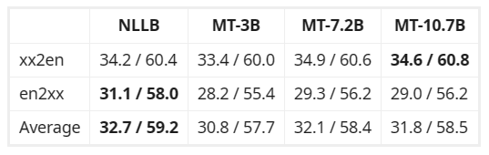

论文：MADLAD-400: A Multilingual And Document-Level Large Audited Dataset

时间：2023.9.9

机构：google

abstract

Google DeepMind与Google Research的研究人员推出了一个全新的多语言数据集——MADLAD-400！这个数据集汇集了来自全球互联网的419种语言的大量文本数据，其规模和语言覆盖范围在公开可用的多语言数据集中应该是最大的。研究人员从Common Crawl这个庞大的网页爬虫项目中提取了大量数据，并进行了人工审核，删除了许多噪音，使数据集的质量得到了显著提升。

它的数据量非常庞大，包含了5万亿个tokens！这为训练大规模多语言模型提供了所需的海量数据。模型所训练的数据量越大，其效果就越好，这个数据集满足了对大规模数据的需求。

此外，数据集是按文档划分的，而不是简单的句子级别，这更符合语言的自然分布。研究人员还经过手动审核，对存在问题的语言数据进行了过滤，以确保数据集的整体质量。

为了验证这个数据集的质量，Google还据此训练了一个翻译模型，称为MT模型。它包含不同规模的模型：

| 模型规模          | 层次数 | 参数数量 |
| ----------------- | ------ | -------- |
| MT-3B             | 32     | 30亿     |
| MT-7.2B           | 48     | 72亿     |
| MT-7.2B-Finetuned | 48     | 72亿     |
| MT-10.7B          | 32     | 107亿    |

Table 4: Evaluation scores on WMT (depicted as `<bleu>` / `<chrf>`) for the MT models compared against NLLB-54B.

Table 5: Evaluation scores on Flores-200 (depicted as `<bleu>` / `<chrf>`) for the MT models compared against NLLB-54B. All metrics are computed with the sacrebleu reference implementation.

