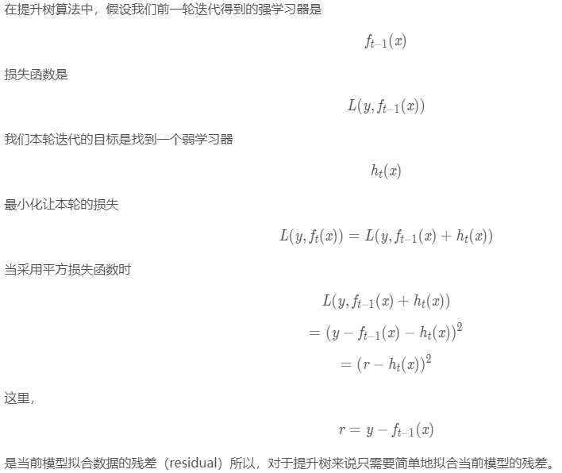
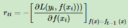
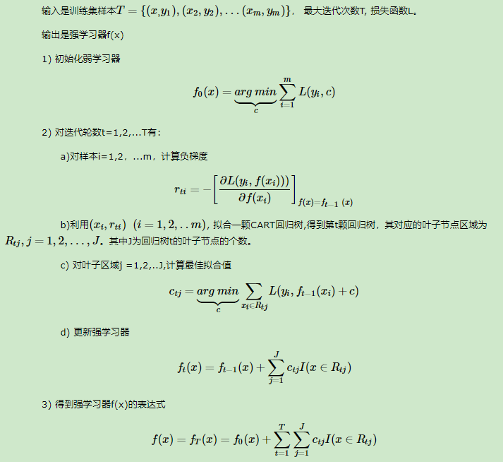
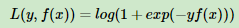
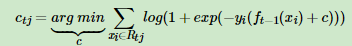
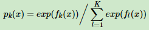
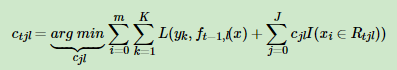
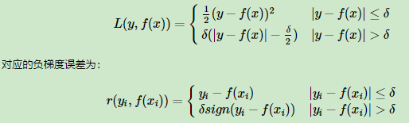
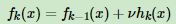

Gradient Boosting Regression Tree梯度提升树

Adaboost用前一轮弱学习器的误差率来更新样本权重

GBDT要找到一个决策树，让样本的损失尽量变得更小，限制只使用CART回归树。

GBDT无论分类和回归，都采用回归树，分类问题最终将拟合值转化为概率来进行分类。

# 提升树

梯度提升树是提升树的一种改进。所以先讲一下提升树。


上面残差是什么？




# GBDT

当损失函数是平方损失和指数损失函数时，梯度提升树每一步优化是很简单的，但是对于一般损失函数而言，往往每一步优化起来不那么容易，针对这一问题，Friedman提出了梯度提升树算法，这是利用最速下降的近似方法，**其关键是利用损失函数的负梯度作为提升树算法中的残差的近似值。**

第t轮第i个样本的损失为负梯度：




通过损失函数的负梯度来拟合，这是一种通用的方法。


# GBDT回归

为什么没有加上分类算法一起？那是因为分类算法的输出是不连续的类别值，需要一些处理才能使用负梯度。




# GBDT分类

样本输出是离散的，怎么办？一是使用指数损失函数，此时GBDT退化为Adaboost算法；另一种是使用类似于逻辑回归的对数似然损失函数的方法。也就是说，我们用的是类别的预测概率值和真实概率值的差来拟合损失。

### 1. 二元分类

类似于对数似然损失函数：



此时，y为{-1, +1}，负梯度误差为：


对于生成的决策树，我们的每个叶子结点的最佳负梯度拟合值为：



由于上式比较难优化，一般使用近似值代替：


除了负梯度计算和叶子节点的最佳负梯度拟合的线性搜索，二元GBDT分类和GBDT回归算法过程相同。

### 2. 多元分类

假设类别为K，此时对数似然损失函数为：


其中，第k类的概率为：



结合上面两式，我们可以计算出第t轮的第i个样本对应类别l的负梯度误差为：


观察上式可以看出，其实这里的误差就是样本i对应类别ll的真实概率和t−1轮预测概率的差值。

对于生成的决策树，我们各个叶子节点的最佳负梯度拟合值为：



由于上式比较难优化，我们一般使用近似值代替：


除了负梯度计算和叶子节点的最佳负梯度拟合的线性搜索，多元GBDT分类和二元GBDT分类以及GBDT回归算法过程相同。


# GBDT常用损失函数

分类：

1. 指数损失函数，见Adaboost
2. 对数损失函数，分为二元分类，和多元分类

回归：

1. 均方差
2. 绝对损失
3. Huber损失，它是均方差和绝对损失的折衷产物，对于远离中心的异常点，采用绝对损失，而中心附近的点采用均方差。这个界限一般用分位数点度量。



4. 分位数损失，它对应的是分位数回归的损失函数，它的表达式为：


对于Huber损失和分位数损失，主要用于健壮回归，也就是减少异常点对损失函数的影响。


# GBDT正则化

三种。

第一种，和AdaBoost一样，加一个步长v。

第二种，无放回采样，增加样本拟合偏差，减少方差，防止过拟合。

第三种，对CART回归树进行剪枝。


# 优缺点

优点：

1. 可以灵活处理各种类型的数据，包括连续值和离散值。
2. 在相对少的调参时间情况下，预测的准确率也可以比较高。
3. 使用一些健壮的损失函数，对异常值的鲁棒性非常强。比如 Huber损失函数和Quantile损失函数。

缺点：

1. 难以并行训练数据。


# 代码

库：sklearn.ensemble

方法：GradientBoostingClassifier and GradientBoostingRegressor

框架参数：

1. n_estimators：默认100
2. learning_rate：每个弱学习器的权重衰减系数v，默认1
3. subsample：子采样比例(0,1]，默认1，不使用子采样。这里子采样是不放回抽样
4. loss：损失函数。
    * 分类默认对数似然"deviance"，还有指数损失"exponential",Adaboost算法；
    * 回归默认均方差"ls"，还有绝对损失"lad"，Huber损失"huber"，分位数损失"quantile"。如果噪音点较多，用"huber"。而如果我们需要对训练集进行分段预测的时候，则采用“quantile”。
5. alpha：只有回归模型有，当使用"huber"和"quantile"损失函数时，需要指定分位数的值，默认0.9，如果噪音点较多，可以适当降低这个分位数的值。


学习器参数：

1. max_feautres：默认"None"考虑所有，还有"sqrt"和"auto"一样，"log"，如果是浮点数，代表百分比。
2. max_depth：默认3
3. min_samples_split：节点划分最小样本数，默认2
4. min_samples_leaf：叶子节点最少样本数，默认1
5. max_leaf_nodes：最大叶子节点数，默认不限制
6. min_weight_fraction_leaf：叶子结点最小的样本权重和，默认不考虑。如果分类样本分布有偏差，再注意。
7. min_impurity_split：划分节点最小不纯度，默认就好1e-7。


代码，分类

```python
import pandas as pd
import numpy as np
from sklearn.ensemble import GradientBoostingClassifier
from sklearn import metrics
from sklearn.model_selection import GridSearchCV
from sklearn.model_selection import cross_val_predict
import matplotlib.pyplot as plt

# data
train = pd.read_csv('train_modified.csv')
target = 'Disbursed'
IDcol = 'ID'
x_columns = [x for x in train.columns if x not in [target, IDcol]]
X = train[x_columns]
y = train[target]

# 网格
# grid = GridSearchCV(estimator=GradientBoostingClassifier(n_estimators=60,
#                                                          learning_rate=0.1,
#                                                          max_depth=7,
#                                                          min_samples_split=1200,
#                                                          min_samples_leaf=60,
#                                                         max_features=9,
#                                                         subsample=0.7,
#                                                         random_state=10),
#                    param_grid={
# #                        'n_estimators': range(20, 81, 10),
                       
# #                        'max_depth': range(3, 14, 2),
# #                        'min_samples_split': range(100, 801, 200),
                       
# #                        'min_samples_split': range(800, 1900, 200),
# #                        'min_samples_leaf': range(60, 101, 10),
                       
# #                        'max_features': range(7, 20, 2),
                       
#                          'subsample': [0.6,0.7,0.75,0.8,0.85,0.9],
#                    },
#                    scoring='roc_auc',
#                    cv=5)
# grid.fit(X, y)
# print(grid.best_params_, grid.best_score_)

# model
# 缩小步长10倍，增大迭代次数10倍，增加模型泛化能力
clf = GradientBoostingClassifier(learning_rate=0.05,
                                n_estimators=600,
                                max_depth=7,
                                min_samples_leaf=60,
                                min_samples_split=1200,
                                max_features=9,
                                subsample=0.7,
                                random_state=10)
clf.fit(X, y)
y_pred = clf.predict(X)
y_predprob = clf.predict_proba(X)[:, 1]
print(metrics.accuracy_score(y.values, y_pred))
print(metrics.roc_auc_score(y, y_predprob))
```

