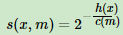

# 1. 原理

> bagging是并联，各个学习器独立，并且有放回采样。个体学习器一般采用神经网络或者决策树。

袋外数据：

每个样本被采样概率为1/m，不被采样概率为1-1/m。如果m次采样都没有被采集的概率为$(1 - \frac{1}{m} )^m$，当m趋于无穷大，约等于0.368。也就是说，bagging每轮随机采样，训练集中大学有36.8%的数据没有被采集到。这些数据被称为袋外数据（Out of Bag，简称OOB），因此，可以用来检测模型的泛化能力。


# 2. 随机森林

特点：

1. Random Forest使用了CART决策树作为弱学习器；
2. 决策树每个节点会选择最优的特征，但是RF会随机选择一部分特征，从这一部分特征里面选择最优的特征，增加了模型泛化性能


随机森林的推广：

### 2.1 extra trees

和随机森林区别：

1. 不采样，每次使用原始训练集；
2. 在选定划分特征后，会随机选择一个特征值来划分。

特点：

1. 生成决策树的规模一般不会大于RF；
2. 方差减小，偏差增大；
3. 泛化性能比RF更好。


### 2.2 Isolation Forest

检测异常点

1. 采样个数要少
2. 随机选择特征，随机选择特征值
3. 深度要小

对于样本点x，计算在每颗决策树上该样本的叶子节点的深度ht(x)，计算出平均深度h(x)。此时用一下公式计算x的异常概率：



其中，m是样本个数，c(m)是表达式为：


s(x,m)的取值在[0,1]，越接近1，异常概率越大。


# 3. 随机森林优缺点

优点：

1. 训练可以高度并行化
2. 特征维度很高时，仍然能高效的训练模型
3. 采用了随机采样，训练模型方差小，泛化能力强
4. 对部分特征缺失不敏感

缺点：

1. 在某些噪音比较大的样本集上，RF模型容易陷入过拟合。
2. 取值划分比较多的特征容易对RF的决策产生更大的影响，从而影响拟合的模型的效果。


# 调参

库：ensemble

方法：RandomForestClassifier 和 RandomForestRegression


bagging一般参数：

* n_estimators：若学习器个数，默认100
* oob_socre：是否采用袋外数据来评估模型好坏，默认False，建议True
* criterioin：划分特征的标准，分类默认gini，回归默认mse(均方差)

RF决策树参数：

* max_features：划分时考虑的最大特征数，默认auto和sqrt相似，还有"log2"。

* max_depth：最大深度，默认不限制，如果样本多，常取10-100

* min_samples_split：划分节点所需最小样本数，默认2

* min_samples_leaf：叶子结点最少样本数，默认1

* max_leaf_nodes：最大叶子节点数，默认“None"，防止过拟合，特征多的话可以选择

* min_weight_fraction_leaf：叶子节点最小的样本权重和，默认不考虑，当类别偏差大时再设置。

* 

  

代码：

数据集（直接下载）：

http://files.cnblogs.com/files/pinard/train_modified.zip

```
import pandas as pd
import numpy as np
import matplotlib.pyplot as plt
from sklearn.ensemble import RandomForestClassifier
from sklearn.model_selection import GridSearchCV
from sklearn.model_selection import cross_val_predict
from sklearn import metrics

# 数据
train = pd.read_csv('train_modified.csv')
target='Disbursed' # Disbursed的值就是二元分类的输出
IDcol = 'ID'
train['Disbursed'].value_counts() 
x_columns = [x for x in train.columns if x not in [target, IDcol]]
X = train[x_columns]
y = train['Disbursed']

# 网格搜索
# grid = GridSearchCV(estimator=RandomForestClassifier(n_estimators=60, 
#                                                      max_depth = 13,
#                                                      min_samples_split=120, 
#                                                      min_samples_leaf=20,
#                                                      random_state=10),
#                    param_grid={
# #                        'n_estimators': range(10, 71, 10),
                       
# #                        'max_depth': range(3, 14, 2),  
# #                        'min_samples_split': range(50, 201, 20),
                       
# #                        'min_samples_split': range(80, 150, 20),
# #                        'min_samples_leaf': range(10, 60, 10),
                       
#                        'max_features': range(3, 11, 2)
#                    },
#                    scoring='roc_auc', cv=4)
# grid.fit(X, y)
# print(grid.best_params_, grid.best_score_)

# 模型
rf = RandomForestClassifier(oob_score=True, 
                            n_estimators=60, 
                            max_depth=13, 
                            min_samples_split=120, 
                            min_samples_leaf=20,
                            max_features=7,
                            random_state=10)
rf.fit(X, y)
print(rf.oob_score_)
predict = rf.predict_proba(X)[:, 1]
print(metrics.roc_auc_score(y, predict))
```


