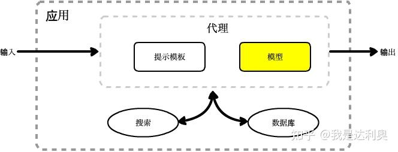

# 参考

入门代码示例，这篇文章非常好：

[LangChain快速入门级示例(chatglm+text2vec建立本地知识库) - 知乎 (zhihu.com)]

https://zhuanlan.zhihu.com/p/630200571


一些列教程：概念+代码理解

[从零开始学LangChain（1）：介绍和入门 - 知乎 (zhihu.com)]

https://zhuanlan.zhihu.com/p/627600539


LangChain和知识图谱、数据库的结合：

https://blog.csdn.net/v_JULY_v/article/details/131552592


# LangChain是什么？

LangChain创建于2022年10月，是围绕LLMs（大语言模型）建立的一个框架，LLMs使用机器学习算法和海量数据来分析和理解自然语言，GPT3.5、GPT4是LLMs最先进的代表，国内百度的文心一言、阿里的通义千问也属于LLMs。LangChain自身并不开发LLMs，它的核心理念是为各种LLMs实现通用的接口，把LLMs相关的组件“链接”在一起，简化LLMs应用的开发难度，方便开发者快速地开发复杂的LLMs应用。LangChain目前有两个语言的实现：python和nodejs。

接下来我们从两个方面全面的了解LangChain，一是LangChain组件的基础概念，二是LangChain常见的使用场景。

一个LangChain应用是通过很多个组件实现的，LangChain主要支持6种组件：

- Models：模型，各种类型的模型和模型集成，比如GPT-4
- Prompts：提示，包括提示管理、提示优化和提示序列化
- Memory：记忆，用来保存和模型交互时的上下文状态
- Indexes：索引，用来结构化文档，以便和模型交互
- Chains：链，一系列对各种组件的调用
- Agents：代理，决定模型采取哪些行动，执行并且观察流程，直到完成为止

使用场景：

- 个人助手
- 基于文档的问答系统
- 聊天机器人
- Tabular数据查询
- API交互
- 信息提取
- 文档总结

安装

```
pip install langchain
```


# 组件

## 1 模型Models

LangChain支持的模型可以分为三类，它们的使用场景不同，输入和输出不同，开发者需要根据项目需要选择相应的类型。

### LLMs

langchain支持许多LLMs，如OpenAI

```
from langchain.llms import OpenAI
llm = OpenAI(model_name="text-davinci-003", n=2, temperature=0.3)
llm("你好")
```

但是，我们一般用本地LLM，如ChatGLM2-6B

```
from transformers import AutoTokenizer, AutoModel
class chatGLM():
    def __init__(self, model_name) -> None:
        self.tokenizer = AutoTokenizer.from_pretrained(model_name, trust_remote_code=True)
        self.model = AutoModel.from_pretrained(model_name, trust_remote_code=True).half().cuda().eval()

    def __call__(self, prompt) -> Any:
        response, _ = self.model.chat(self.tokenizer , prompt) # 这里演示未使用流式接口. stream_chat()
        return response

llm =  chatGLM(model_name="THUDM/chatglm-6b")
response = llm("你好")
```

### 聊天模型

聊天模型基于LLMs，不同的是LLMs的输入输出是字符串，而聊天模型的输入输出是聊天消息。

聊天消息包含下面几种类型，使用时需要按照约定传入合适的值：

- **AIMessage**：用来保存LLM的响应，以便在下次请求时把这些信息传回给LLM。
- **HumanMessage**：发送给LLMs的提示信息，比如“请写一个快速排序方法”
- **SystemMessage**：设置LLM模型的行为方式和目标。你可以在这里给出具体的指示，比如“作为一个代码专家”，或者“返回json格式”。
- **ChatMessage**：可以接收任意形式的值，但是在大多数时间，我们应该使用上面的三种类型

```
from langchain.chat_models import ChatOpenAI
from langchain.schema import AIMessage, HumanMessage, SystemMessage
messages = [
        SystemMessage(content="返回json object，不要说明和解释信息"),
        HumanMessage(content="告诉我model Y汽车的尺寸参数")
]
chat = ChatOpenAI(temperature=0)
chat(messages)
```

### 文本嵌入模型（Text Embedding Model）

文本嵌入模型可以为文本创建向量映射，这样就能在向量空间里去考虑文本，执行诸如语义搜索之类的操作，比如说寻找相似的文本片段。

```
from langchain.embeddings import OpenAIEmbeddings
embeddings = OpenAIEmbeddings()
query_result = embeddings.embed_query("你好")
doc_result = embeddings.embed_documents(["你好"])
# [-0.009422866627573967, 0.004315766040235758, 0.00238...]
```

在这段代码中我们使用了`embed_query`和`embed_documents`两个方法，它们最大的不同是embed_query接收一个字符串作为输入，而embed_documents可以接收一组字符串，一些模型自身划分了这两个方法，LangChain也保留了下来。

## 2 提示Prompts

提示模板：

```
from langchain import PromptTemplate
template = "我的邻居姓{lastname}，他生了个儿子，给他儿子起个名字"
prompt = PromptTemplate(input_variables=["lastname"], template=template)
prompt_text = prompt.format(lastname="王")
print(prompt_text)
# # 我的邻居姓王，他生了个儿子，给他儿子起个名字
```

Few-Shot prompt：

```
from langchain import PromptTemplate, FewShotPromptTemplate

example_template = """
单词: {word}
反义词: {antonym}\\n
"""

example_prompt = PromptTemplate(input_variables=["word", "antonym"], template=example_template)

examples = [
    {"word": "开心", "antonym": "难过"},
    {"word": "高", "antonym": "矮"},
]

few_shot_prompt = FewShotPromptTemplate(
    example_prompt=example_prompt,
    examples=examples,
    prefix="给出每个单词的反义词",
    suffix="单词: {input}\\n反义词:",
    input_variables=["input"],
    example_separator="\\n",
)

prompt_text = few_shot_prompt.format(input="粗")
print(prompt_text)

# 给出每个单词的反义词
# 单词: 开心
# 反义词: 难过

# 单词: 高
# 反义词: 矮

# 单词: 粗
# 反义词:
```

## 3 链Chains

Chains就是将Models和其他组件组合起来。

```
from langchain import PromptTemplate
from langchain.llms import OpenAI
from langchain.chains import LLMChain

template = "我的邻居姓{lastname}，他生了个儿子，给他儿子起个名字"

prompt = PromptTemplate(
    input_variables=["lastname"],
    template=template,
)
llm = OpenAI(temperature=0.9)

chain = LLMChain(llm=llm, prompt=prompt)

# 执行链
print(chain.run("王"))

# # 可以叫王子，也可以叫小王或者小王子等等。
```

如果我们想把第一个模型的输出，作为第二个模型的输入，可以使用LangChain的`SimpleSequentialChain` 

```
from langchain import PromptTemplate
from langchain.llms import OpenAI
from langchain.chains import LLMChain, SimpleSequentialChain

template = "我的邻居姓{lastname}，他生了个儿子，给他儿子起个名字"

prompt = PromptTemplate(
    input_variables=["lastname"],
    template=template,
)
llm = OpenAI(temperature=0.9)

chain = LLMChain(llm = llm, 
                  prompt = prompt)
# 创建第二条链
second_prompt = PromptTemplate(
    input_variables=["child_name"],
    template="邻居的儿子名字叫{child_name}，给他起一个小名",
)

chain_two = LLMChain(llm=llm, prompt=second_prompt)

# 链接两条链 
overall_chain = SimpleSequentialChain(chains=[chain, chain_two], verbose=True)

# 执行链，只需要传入第一个参数
catchphrase = overall_chain.run("王")
```

Chatglm对象不符合LLMChain类llm对象要求，模仿一下

```text
class DemoChain():
    def __init__(self, llm, prompt) -> None:
        self.llm = llm
        self.prompt = prompt

    def run(self, query) -> Any:
        prompt = self.prompt.format(concept=query)
        print("query=%s  ->prompt=%s"%(query, prompt))
        response = self.llm(prompt) 
        return response
    
chain = DemoChain(llm=llm, prompt=promptTem)
print(chain.run(query="天道酬勤"))
```


## 4 代理Agents

尽管大语言模型非常强大，它们也有一些局限性，它们不能回答实时信息，它们没有上下文的概念，导致无法保存状态，它们处理数学逻辑问题仍然非常初级，我们只能借助于第三方的工具来完成这些需求，比如使用搜索引擎或者数据库，LangChain中代理的作用就是根据用户需求，来去访问这些工具。

我们先明确几个概念：

1、代理

* 负责控制整段代码的逻辑和执行，代理暴露了一个接口，用来接收用户输入，并返回AgentAction或AgentFinish。
* AgentAction决定使用哪个工具
* AgentFinish意味着代理的工作完成了，返回给用户结果

2、工具

* 第三方服务的集成，比如谷歌、bing等等，后面有详细列表

3、工具包

* 一些集成好了代理包，比如`create_csv_agent` 可以使用模型解读csv文件

4、代理执行器

* 负责迭代运行代理的循环，直到满足停止的标准。

明确了这些概念，我们看个使用代理的例子，假如我们在北京，想让大语言模型告诉我们明天穿什么衣服，由于大语言模型不知道明天的天气，我们借助于`serpapi` 来查询天气，并传递给模型，代码如下：（使用serpapi需要申请token和设置环境变量，略）

```python3
from langchain.agents import load_tools
from langchain.agents import initialize_agent
from langchain.agents import AgentType
from langchain.llms import OpenAI

llm = OpenAI(temperature=0)
tools = load_tools(["serpapi"], llm=llm)
agent = initialize_agent(tools, llm, agent=AgentType.ZERO_SHOT_REACT_DESCRIPTION, verbose=True)

agent.run("明天在北京穿什么衣服合适?")
```

## 5 记忆Memory

大语言模型是无状态的，它并不保存上次交互的内容，chatGPT能够和人正常对话，因为它做了一层包装，把历史记录传回给了模型。

为了解决这个问题，LangChain提供了记忆组件。记忆有两种类型：短期和长期记忆。短期记忆一般指单一会话时传递数据，长期记忆则是处理多个会话时获取和更新信息。

短期记忆用`ChatMessageHistory` ：

```text
from langchain.memory import ChatMessageHistory

history = ChatMessageHistory()
history.add_user_message("在吗？")
history.add_ai_message("有什么事?")

print(history.messages)
```

长期记忆使用`messages_to_dict` 方法：

```text
from langchain.memory import ChatMessageHistory
from langchain.schema import messages_from_dict, messages_to_dict

history = ChatMessageHistory()
history.add_user_message("hi!")
history.add_ai_message("whats up?")
dicts = messages_to_dict(history.messages)
print(dicts)
# # [{'type': 'human', 'data': {'content': 'hi!', 'additional_kwargs': {}}},
# # {'type': 'ai', 'data': {'content': 'whats up?', 'additional_kwargs': {}}}]
# 读取历史消息
new_messages = messages_from_dict(dicts)
print(new_messages)
# # [HumanMessage(content='hi!', additional_kwargs={}),
# # AIMessage(content='whats up?', additional_kwargs={})]
```


## 6 索引Indexes	

索引组件为LangChain提供了文档处理的能力，包括文档加载、检索等等，这里的文档是广义的文档，不仅仅是txt、epub、pdf等文本类的内容，还包括email、区块链、telegram、Notion甚至是视频内容。

索引组件主要有以下四种类型：

- 文档加载器
- 文本分割器
- VectorStores
- 检索器

### 文档加载器

文档加载器主要基于`Unstructured` 包，`Unstructured` 是一个python包，可以把各种类型的文件转换成文本。文档加载器使用起来很简单，只需要引入相应的loader工具：

```text
from langchain.document_loaders import TextLoader
loader = TextLoader('../state_of_the_union.txt', encoding='utf8')
documents = loader.load()
```

### 文本分割器

由于模型对输入的字符长度有限制，我们在碰到很长的文本时，需要把文本分割成多个小的文本片段。

文本分割最简单的方式是按照字符长度进行分割，但是这会带来很多问题，比如说如果文本是一段代码，一个函数被分割到两段之后就成了没有意义的字符，所以整体的原则是把语义相关的文本片段放在一起。

LangChain中最基本的文本分割器是`CharacterTextSplitter` ，它按照指定的分隔符（默认“\n\n”）进行分割，并且考虑文本片段的最大长度。我们看个例子：

```text
from langchain.text_splitter import CharacterTextSplitter

# 初始字符串
state_of_the_union = "..."

text_splitter = CharacterTextSplitter(        
    separator = "\\n\\n",
    chunk_size = 1000,
    chunk_overlap  = 200,
    length_function = len,
)

texts = text_splitter.create_documents([state_of_the_union])
```

### 向量存储库

VectorStores是一种特殊类型的数据库，它的作用是存储由嵌入创建的向量，提供相似查询等功能。

`DeepLake` 和`Chroma` 都属于VectorStores，VectorStores的作用就是保存和检索向量，它们之间的区别也很明显，`DeepLake` 使用云服务器保存数据，而`Chroma` 则是完全的本地服务。

`Chroma` 开源、轻量、性能良好，使用起来也很简单，只需使用pip安装chromadb即可。

我们使用其中一个`Chroma` 组件作为例子。

```
from langchain.embeddings.openai import OpenAIEmbeddings
from langchain.text_splitter import CharacterTextSplitter
from langchain.vectorstores import Chroma

# pku.txt内容：<https://www.pku.edu.cn/about.html>
with open('./pku.txt') as f:
    state_of_the_union = f.read()
text_splitter = CharacterTextSplitter(chunk_size=100, chunk_overlap=0)
texts = text_splitter.split_text(state_of_the_union)

embeddings = OpenAIEmbeddings()

docsearch = Chroma.from_texts(texts, embeddings)

query = "1937年北京大学发生了什么？"
docs = docsearch.similarity_search(query)
print(docs)
```

### 检索器

检索器是一种便于模型查询的存储数据的方式，LangChain约定检索器组件至少有一个方法`get_relevant_texts`，这个方法接收查询字符串，返回一组文档。

```text
from langchain.document_loaders import TextLoader
from langchain.text_splitter import CharacterTextSplitter
from langchain.vectorstores import FAISS
from langchain.embeddings import OpenAIEmbeddings

loader = TextLoader('../../../state_of_the_union.txt')
documents = loader.load()
text_splitter = CharacterTextSplitter(chunk_size=1000, chunk_overlap=0)
texts = text_splitter.split_documents(documents)
embeddings = OpenAIEmbeddings()

db = FAISS.from_documents(texts, embeddings)
retriever = db.as_retriever()
docs = retriever.get_relevant_documents("what did he say about ketanji brown jackson")
```

## 7 代理和链的区别

代理组件和链组件的作用类似，它们都是用来调度业务流程，确定采取哪些行动以及按照何种顺序。不同的是链的执行流程是确定的，而代理则依赖于大语言模型来决定流程走向，比如我们之前写的询问北京明天应该穿什么衣服的例子。代理控制的行动，可以是任何支持输入输出的工具，比如搜索引擎、数据库，也可以是一个模型、一个链，甚至是另外一个代理。

我们通过数据流向看它们的区别：

 简单应用：


链应用：


代理应用：




# 十分钟做一个产品客服

## 流程图

在这个过程中，LangChain应用接收两个**输入**，一个是自定义知识库，一个是用户输入。自定义知识库经过**分割**、**嵌入**之后存储到向量存储库，向量存储库支持语义检索，根据用户输入从长文档里**检索**出文本片段，提示模板将文本片段和用户输入合并成**提示**，传递给大语言模型，大语言模型**推理**出结果，经过**解析**后，**输出**最终结果。


用到的所有组件如下：

| 组件                         | 类型     | 子类型       |
| ---------------------------- | -------- | ------------ |
| TextLoader                   | 索引组件 | 文本加载器   |
| CharacterTextSplitter        | 索引组件 | 文本分割器   |
| ConversationalRetrievalChain | 链组件   | 对话链       |
| ChatOpenAI                   | 模型组件 | LLM          |
| OpenAIEmbeddings             | 模型组件 | 文本嵌入模型 |
| Chroma                       | 索引组件 | 向量存储库   |

## 安装环境

```text
!pip install langchain
!pip install openai
!pip install chromadb
!pip install tiktoken
```

代码，略。

